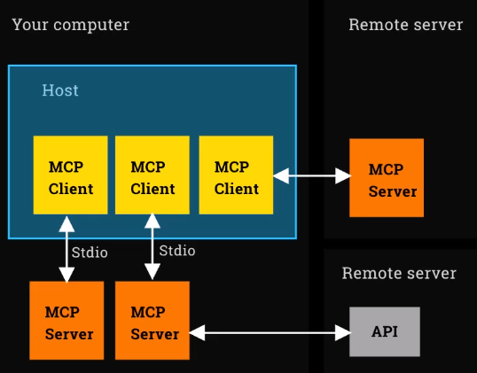

# Model Context Protocol (MCP)

## What it's not
    - A framework for build agents
    - A fundamental change to how agents work
    - A way to code agents

## What it is
     - A protocol - a standard
     - A simple way to integrate things that an agent needs, integrate tools, resources, prompts
     - A USB-C port for AI applicatios

## Reasons not to be excited
    - It's just a standard, it's not tools themselves
    - It's not actually the tools
    - You can already make any function into a Tool

## Reasons to be excited
    - Makes it frictionless to integrate
    - It's taking off! Exploding ecosystem. Many people are adopting it.
    - HTML was just a standard too.

## MCP Core Concepts
- **Host** is an LLM app like Claude or our Agent architecture.
    - The host represents the place where the application software is running.
- **MCP Client** lives inside Host and connects 1:1 to MCP server
- **MCP Server** provides tools, context and prompts
- **Prompts**, is, in essence, the instruction or question you give to the language model. It is the fundamental way you communicate with the AI to get it to perform a task.
    - When to use Prompts:
        - **Text generation tasks:** when you need the model to write, summarize, translate, or create creative content.
            - Example: "Summarize the following article into three key points."
        - **Answers to questions:** To get information or explanations on a topic.
            - Example: "How does photosynthesis work?"
    - **Simple reasoning tasks:** When the task does not require external information or complex steps and can be solved directly with the model's knowledge.
- **Tools**, are the way you allow the language model to interact with external systems. Think of them as functions or APIs that the model can “call” to get real-time information, interact with your software or perform actions in the real world.
    - When to use Tools:
        - **Access to real-time information:** when the model needs data that is not in its knowledge base (which has a cutoff date).
            - Example: To answer “What is the current weather in Bogota?”, the model does not know the answer, but it can use a get_weather(city) tool that you provide, which queries a weather API.
        - **Interact with your own APIs or databases:** To connect the model to your internal systems.
            - Example: an e-commerce chatbot could use a check_inventory(product_id) tool to check the availability of a product in your database.
        - **Perform actions:** When you need the model to execute an action in another system.
            - Example: a send_email(recipient, subject, body) tool would allow the model to send an email based on the conversation with the user.
    - Workflow with Tools:
        - You define the tools: In your code, you describe the available tools (name, description, parameters).
        - The user makes a request: The user asks the model for something.
        - The model decides to use a tool: If the model determines that it needs a tool to fulfill the request, instead of a text response, it returns a request to execute that tool with the necessary parameters.
        - You execute the tool: Your code receives the request, executes the corresponding function and gets a result.
        - You send the result back to the model: You send the result of the tool back to the model.
        - The model generates the final response: The model uses the tool's output to formulate a final response in natural language for the user.
- **Resources** refer to the background information and knowledge that you provide to the model so that it can perform a task in an informed manner. Unlike tools (which are interactive), resources are static data that are delivered to the model, usually within the prompt.
    - This technique is a fundamental part of what is known as Retrieval-Augmented Generation (RAG).
    - When to use Resources:

        - Consult private documents or knowledge bases: when the answer to a question is found in your internal documentation, user manuals, company policies, etc.
            - Example: For a tech support chatbot that must answer questions about a specific product, you would provide the relevant sections of that product's manual as a resource.
            - Documents or data that the model can read, such as manuals, knowledge bases, instructions or technical documents.
            - When the model needs to query static or extensive information without calling APIs.
            - Ideal for FAQs, technical documentation, policies, catalogs, contracts, etc.
        - Increase accuracy and reduce hallucinations: To base the model's answers on a verified data set and prevent it from making up information.
            - Example: A paralegal who must draft a clause in a contract. You would provide her with examples of similar clauses and relevant laws as resources to make her wording accurate.
        - Personalize responses with user data: So that the model takes into account a user's history or profile.
            - Example: A travel planning wizard could receive the user's past travel history as a resource to make more personalized recommendations.
    - Workflow with Resources (RAG):
        - User asks a question.
        - Retrieval System (Retrieval): Your application first searches your database (vector or text) for the documents or “resources” most relevant to the user's question.
        - Prompt Construction: You build a prompt that includes both the user's original question and the retrieved resources.
        - Model Generation: The language model uses these resources to generate an informed and contextualized response.

Summary:
| | **Prompt** | **Tool** | **Resource (via RAG)** |
| :--- | :--- | :--- | :--- |
| **Objective** | To give a direct instruction to the model. | To allow the model to interact with external systems. | To provide specific, background knowledge to inform the response. |
| **When to use**| For self-contained tasks involving text, simple reasoning, or creativity. | When real-time information, actions, or data from your APIs are needed. | When the answer lies within private documents or knowledge bases. |
| **Nature** | Static (a single instruction). | Interactive and dynamic (a call and response). | Static but contextual (information provided within the prompt). |
| **Example** | "Write a poem about programming." | "Look up the stock price for Google." (Uses a `get_stock_price` tool) | "According to our policy manual, what is the process for requesting vacation?" |

## Architecture
MCP Servers most often run on your box (Download open-source MCP Servers, run them locally)

  
   

### Two "Transport" mechanisms
1. Stdio spawns a process and comunicate via standard input/output (only for local you can't use stdio for remote ones)
2. Server Side Events (SSE) uses HTTPS connection with streaming (for remote or local)

## Business Logic in an Anthropic MCP Server: Where and How to Implement It Securely

When developing a server under Anthropic's Model Context Protocol (MCP), one of the most critical architectural decisions is where to place the business logic. Based on best practices for security and software design, is: **you should not place your core, proprietary business logic directly within the MCP server itself, especially if it can be distributed or downloaded by users.**

Instead, the MCP server should act as a thin interface layer or "connector." The business logic should reside in a separate, secure backend service.

---

### Recommended Architecture: The Gateway or Proxy Pattern

The best practice is to design the MCP server as a **gateway or proxy**. In this model, responsibilities are divided as follows:

* **MCP Server:** Its primary role is to handle communication with the Anthropic client (like Claude). It is responsible for:
    * Implementing the MCP protocol.
    * Exposing the "tools" the model can invoke, with their descriptions and input/output schemas.
    * Authenticating and authorizing requests coming from the model.
    * Translating tool invocations into calls to your backend service.

* **Business Logic Service (Backend):** This is an internal, non-publicly exposed service where the "brain" of your application resides. It is responsible for:
    * Executing complex and proprietary algorithms.
    * Interacting with databases and other internal systems.
    * Handling business logic that is sensitive or constitutes your intellectual property.

**Request Flow:**

1.  The user interacts with an AI application (the "host").
2.  The AI model (MCP client) decides to use one of the tools exposed by your MCP server.
3.  The MCP client sends a tool invocation request to your MCP server.
4.  Your MCP server validates the request and, if correct, makes a call (e.g., a REST API or gRPC call) to your internal backend service.
5.  The backend service executes the business logic and returns a result.
6.  Your MCP server receives the response from the backend, formats it as expected by the MCP protocol, and sends it back to the client.

---

### Analysis of the "Download" Risk

The concern about whether the logic could be viewed when someone "downloads the mcp" is valid and depends on the type of MCP server you are building:

#### 1. Remote MCP Server (Hosted by You)

If your MCP server is hosted on your own cloud infrastructure and users interact with it remotely, **an end-user cannot "download" the server's source code**. They can only interact with its public API. Even so, separating the business logic is still the best practice for reasons of:
* **Security:** It minimizes the attack surface. If the MCP server is compromised, your core business logic remains protected in a separate network environment.
* **Scalability:** You can scale the business logic service (which might require more resources) independently of the MCP server.
* **Maintenance:** You can update the business logic without having to redeploy or modify the MCP interface server.

#### 2. Local or Desktop MCP Server

For Anthropic's "Desktop Extensions," the MCP server runs locally on the user's machine. In this scenario, **if you place the business logic directly in this server, the compiled or interpreted code will be on the user's computer and can be reverse-engineered and analyzed.**

For this use case, it is **absolutely critical** that sensitive business logic is not on the local server. The local server should be a lightweight client that communicates securely with your remote backend where the real logic is executed.

---

### Key Advantages of Separating Business Logic

| Benefit                        | Description                                                                                                                              |
| :----------------------------- | :--------------------------------------------------------------------------------------------------------------------------------------- |
| **Intellectual Property Protection** | Your most valuable algorithms and business processes are never distributed to user devices, protecting them from copying or analysis.   |
| **Enhanced Security** | Core logic and data access are behind multiple layers of security in your backend, not on an edge server.                                   |
| **Centralization and Consistency** | All business logic is in one place, ensuring that all users and client versions use the same, up-to-date business rules.               |
| **Flexibility and Maintenance** | You can update, fix, or improve your business logic on the backend without requiring users to update their local MCP server software.       |
| **Sensitive Data Management** | API keys for other services, database credentials, and other secrets are managed securely in your backend, never exposed on the client side. |
