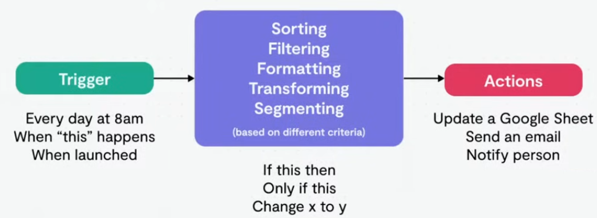

# Core Concepts
## Nodes
- A node is an individual step in your workflow: one that either (a) loads, (b) processes, or (c) sends data.
- Based on their function, n8n classifies nodes into four types:
    - App or Action Nodes add, remove, and edit data; request and send external data; and trigger events in other systems. Refer to the Action nodes library for a full list of these nodes.
    - Trigger Nodes start a workflow and supply the initial data. Refer to the Trigger nodes library for a list of trigger nodes.
    - Core Nodes can be trigger or app nodes. Whereas most nodes connect to a specific external service, core nodes provide functionality such as logic, scheduling, or generic API calls. Refer to the Core Nodes library for a full list of core nodes.
    - Cluster Nodes are node groups that work together to provide functionality in a workflow, primarily for AI workflows. Refer to Cluster nodes for more information.

## Trigger
A trigger is what starts an automation
- Manual
- Schedule
    - Every minute
    - Every day at 8 am
    - Once a month at 4pm
- Applications
    - Webhook
    - Property update
    - Form submission

## Filtering
Filtering is used to allow or block certain types of data from following a path based on certain conditions.

## Actions
Actions allow you to interact with applications.
- Dropbox
    - Upload file
    - Get file
    - Create folder
- Slack
    - Get user
    - Send message
    - Get message
- Google sheets
    - Update rows
    - Create sheet
    - Get spreadsheet
- Salesforce
    - Get conctact
    - Get company
    - Create lead

# Workflow

  
   

## Workflow best practices
1. Correctly mapping a process before automation will ensure you have visibility on the:
    - Understanding of the task
    - Tools that will be used
    - Feasibility of the automation
    - Estimation of work load
    - (Sometimes) need for human intervention