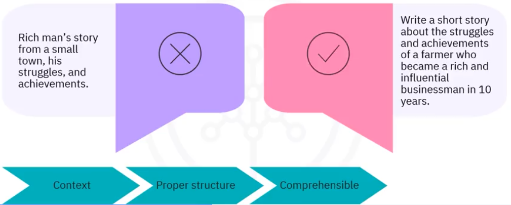
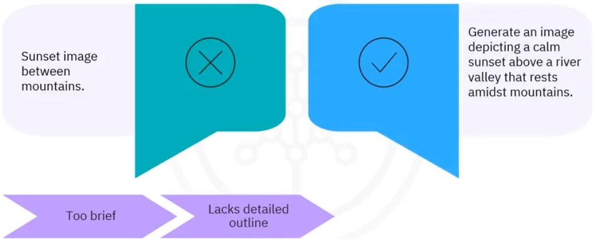
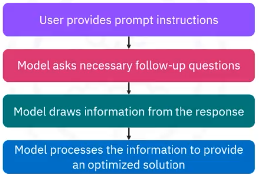

# What is a prompt?
- A prompt is any input you provide to a generative model to produce a desired output. 
- Prompts can also be a series of instructions that refine the output step by step to achieve the desired result. For example: 
    - write a short story about a scientist studying life on Mars.
    - What were some of the challenges he faced during his research?

With these examples, it is clear that prompts contain questions, contextual text, guiding patterns or examples,
and partial input for the model. 


## Correct and incorrect prompts
<p align="center">
  
  <br/>
  <i>Source: IBM</i>
</p>

<p align="center">
  
  <br/>
  <i>Source: IBM</i>
</p>

## Building blocks of a well-constructed prompt
1. Clarity
    - Includes using simple and concise language.
1. Instructions
    - Give distinct guidelines regarding the task.
    - Example: "Write an essay in 600 words analyzing the efects of global warming on marine life."
    - Task specification
        - Explicitly specifiy the objetive of the LLM
    - Bias mitigation
        - Provide explicit instructions to generate neutral responses
        - Example: "Write a 100-word paragraph on leadership traits without favoring any gender. Provide equal examples of traits from all genders"
    - Framing
        - Generate responses within the required boundaries
        - Example: "Provide a summary of 100 words of the article on climate change, focusing on its primary findings and recommendations"
    - Domain specific terminology
        - Use domain-specific terminology in specialized fields for accuracy and precision
2. Contextual guidance
    - Provides background and required details.
    - Example: "In recent decades, global warming has undergone significant shifts, leading to rising sea levels, increased storm intensity, and changing weather patterns. These changes have had a severe impact on marine life. Write an essay in 600 words analyzing the effects of global warming on marine life."
3. Input data (Precision)
    - Means being specific and providing examples.
    - Example: "You have been provided with a data set containing temperature records and measurements of sea levels in the Pacific Ocean. Write essay in 600 words, analyzing the effects of global warming on marine life in the Pacific Ocean."
4. Role-play/Persona Pattern
    - Role play can enhance responses by assuming a persona and offering relevant context.
    - Prompts written from the perspective of a specific character or persona can help the model generate responses aligned with that perspective.
    - Example: "Pretend you are an astronaut who has just landed on an uncharted alien planet. Write a log entry describing the strange flora and fauna you've encountered, like the color of the sky and the unfamiliar sounds echoing through the alien landscape. Express your feelings of excitement, curiosity,
and a hint of apprehension as you document this extraordinary journey."
4. Output indicator
    - Offers benchmarks for assessing attributes of the output.
    - Example: "The output generated should be an essay of 600 words. It will be evaluated based on the clarity of the analysis and the incorporation of relevant data or case studies."

## Techniques for using text prompts effectively
### Zero-shot prompting
- Zero-shot refers to the ability of a model to perform a task without having been explicitly trained on examples of that specific task. 
- Ask AI to perform a task directly
- No example given
- Without prior training
- Example about optimize code: Act like a Python expert. Optimizes this code to improve its performance:
    ```python
    def find_duplicates(numbers):
        duplicates = []
        for i in range(len(numbers)):
            for j in range(i+1, len(numbers)):
                if numbers[i] == numbers[j] and numbers[i] not in duplicates:
                    duplicates.append(numbers[i])
        return duplicates
    ```
    Provides the optimized version and explains the improvements.
- Example about new code in kotlin:
    ```
    Create a function in Kotlin that validates if an email is valid using regex. 
    The function must:
    - Accept a String as a parameter
    - Return Boolean
    - Include KDoc documentation
    - Handle edge cases like null or empty string
    ```

### One-shot prompting
One-shot prompting involves showing the model one example that is similar to the target task for guidance.
### User feedback loop
- Users provide feedback on text prompts and iteratively refine them until the desired state is achieved.
### One-shot prompting
- Provide a clear example of the desired format
### Few-shot prompting
- Few-shot learning works the same as one-shot, but the number of examples given is higher, typically around a hundred. The performance of the model increases linearly with the number of examples.
- Few-shot prompting is sometimes seen as a small fine-tuning of the model on a collection of new or special data.
- Provide 2-3 examples
- Examples don't need to be correct
- Focus on consistent formatting
- Example: Generate unit tests following these patterns
    ```python
    Example #1:
    Function: `def add(a, b): return a + b`
    Test:
    def test_add():
        assert add(2, 3) == 5
        assert add(-1, 1) == 0
        assert add(0, 0) == 0

    Example #2:
    Function: `def is_even(n): return n % 2 == 0`
    Test:
    def test_is_even():
        assert is_even(4) == True
        assert is_even(3) == False
        assert is_even(0) == True
    ```

    Now generate tests for this function:
    ```python
    def calculate_discount(price, discount_percent):
        if discount_percent < 0 or discount_percent > 100:
            raise ValueError("Discount must be between 0 and 100")
        return price * (1 - discount_percent / 100)
    ```
### Chain-of-Thought Approach (CoT)
Chain-of-Thought prompting is a technique that improves the performance of language models by explicitly prompting the model to generate a step-by-step explanation or reasoning process before arriving at a final answer. This method helps the model to break down the problem and not skip any intermediate tasks to avoid reasoning failures.

### How Does Chain-of-Thought Prompting Work?

#### Explicit instructions
Giving explicit instructions means decomposing the problem in the user prompt itself. For example, using sentences like “First, we need to consider…” to prompt the model to detail its thought process.

- Example 1:
```
Which is a faster way to get home?
Option 1: Take an 10 minutes bus, then an 40 minute bus, and finally a 10 minute train.
Option 2: Take a 90 minutes train, then a 45 minute bike ride, and finally a 10 minute bus.
Option 1 will take 10+40+10 = 60 minutes.
Option 2 will take 90+45+10=145 minutes.
Since Option 1 takes 60 minutes and Option 2 takes 145 minutes, Option 1 is faster.

Which is a faster way to get to work?
Option 1: Take a 1000 minute bus, then a half hour train, and finally a 10 minute bike ride.
Option 2: Take an 800 minute bus, then an hour train, and finally a 30 minute bike ride.
```

- Example 2:
```
Imagine you’re building a system that helps users plan outdoor activities based on weather conditions. You might ask the model: “If the surf today is 4 to 6 feet and it’s getting 3 feet bigger tomorrow and 3 feet bigger the day after that, how big will the surf be on Wednesday?” With Chain of Thought prompting, the model breaks the problem into steps:

    Today’s surf: 4 to 6 feet.
    Tomorrow’s surf: 4+3 to 6+3 feet = 7 to 9 feet.
    Wednesday’s surf: 7+3 to 9+3 feet = 10 to 12 feet.

The model concludes: “On Wednesday, the surf will be 10 to 12 feet.”
```

#### Implicit instructions
Sometimes, there is no need to decompose the problem ourselves in the prompt. The University of Tokyo, together with Google Research, proposed a nice method to improve LLM responses that consisted of simply adding “Let’s think step by step" at the end of the original prompt.

This simple sentence prompts the model to reason out loud and go through all the required steps to carry out the task.

#### Demonstrative examples
Providing a series of demonstrative examples is known as one-shot and few-shot prompting, depending on the number of examples provided.
- One-shot and few-shot prompting are not CoT. However, researchers have explored how few-shot learning can be combined with CoT prompting, known as “Few-shot CoT prompting.” In a few-shot CoT, the model is provided with a few examples of problems along with their step-by-step solutions to guide its reasoning process.

### Examples
- Example #1: Analyze this Python code step-by-step to identify performance issues:
    ```python
    def find_common_elements(list1, list2, list3):
        common = []
        for item1 in list1:
            for item2 in list2:
                for item3 in list3:
                    if item1 == item2 == item3:
                        if item1 not in common:
                            common.append(item1)
        return common

    # Used with lists of 1000+ items each
    ```
    Think step by step:
    1. what is the current time complexity?
    2. Which operations are most costly?
    3. How can each part be optimized?
    4. What would be the optimized implementation?
    5. What is the improvement in complexity?

    Provide your step-by-step analysis and then the optimized solution.

    Step 1 - Current time complexity:
    - Three nested loops: O(n * m * k) where n, m, k are the sizes of the lists.
    - With lists of 1000 items: 1,000,000,000,000 iterations
    - Verification `not in common`: O(p) where p is the size of common
    - Total complexity: O(n * m * k * p)

    Step 2 - Most expensive operations:
    - The three nested loops are the main bottleneck.
    - `item1 not in common` is executed repeatedly (linear search)
    - Redundant comparisons are made

    Step 3 - Piecewise optimization:
    - Convert lists to sets for efficient intersection: O(1) lookup
    - Use set operations instead of nested loops
    - Eliminate manual duplicate checking

    Step 4 - Optimized implementation:
    ````python
    def find_common_elements_optimized(list1, list2, list3):
        set1, set2, set3 = set(list1), set(list2), set(list3)
        return list(set1.intersection(set2, set3))
    ````
    Step 5 - Improved complexity:
    - New complexity: O(n + m + k) to create sets + O(min(n,m,k)) for intersection.
    - Improvement: From O(n³) to O(n) approx.
    - For 1000 elements: From 1,000,000,000,000 to ~3,000 operations.

- Example #2: Step-by-step analysys:
    Design an algorithm in Python to solve this problem step by step:

    Problem: Implement a LRU (Least Recently Used) cache system that supports:
    - get(key): get value, move to front
    - put(key, value): insert/update, move to front, delete LRU if capacity exceeds

    Think step by step:
    1. What data structures do we need?
    2. How do we track the order of use?
    3. How do we make get() and put() in O(1)?
    4. How do we handle LRU deletion?
    5. What is the complete implementation?

    Maximum capacity: configurable
    All operations must be O(1)

    ```python
    # STEP-BY-STEP DESIGN:

    # Step 1 - Necessary data structures:
    # - Dict for O(1) access to values: {key: node}
    # - Doubly linked list for O(1) ordering: newest ↔ least recent

    # Step 2 - Trace order of use:
    # - Most recent node at the front (after dummy_head)
    # - Least recent node at the end (before dummy_tail)
    # - Move nodes without changing the overall structure

    class Node:
        def __init__(self, key=0, value=0):
            self.key = key
            self.value = value
            self.prev = None
            self.next = None

    class LRUCache:
        def __init__(self, capacity: int):
            self.capacity = capacity
            self.cache = {}  # key -> node
            
            self.head = Node()  # dummy head
            self.tail = Node()  # dummy tail
            self.head.next = self.tail
            self.tail.prev = self.head
        
        def _add_to_head(self, node):
            node.prev = self.head
            node.next = self.head.next
            self.head.next.prev = node
            self.head.next = node
        
        def _remove_node(self, node):
            node.prev.next = node.next
            node.next.prev = node.prev
        
        def _move_to_head(self, node):
            self._remove_node(node)
            self._add_to_head(node)
        
        def _remove_tail(self):
            last_node = self.tail.prev
            self._remove_node(last_node)
            return last_node
        
        def get(self, key: int) -> int:
            if key in self.cache:
                node = self.cache[key]
                self._move_to_head(node)
                return node.value
            return -1
        
        def put(self, key: int, value: int) -> None:
            if key in self.cache:
                node = self.cache[key]
                node.value = value
                self._move_to_head(node)
            else:
                new_node = Node(key, value)
                
                if len(self.cache) >= self.capacity:
                    # Delete LRU (Least Recently Used)
                    tail_node = self._remove_tail()
                    del self.cache[tail_node.key]
                
                # Add new node
                self.cache[key] = new_node
                self._add_to_head(new_node)

    # Step-by-step verification:
    # 1. Dict: O(1) lookup
    # 2. Doubly linked list: O(1) insertion/deletion
    # 3. get(): hash lookup + move = O(1)
    # 4. put(): hash lookup + insert/remove = O(1)
    # 5. LRU elimination: remove tail = O(1)

    # Example:
    cache = LRUCache(2)
    cache.put(1, 1)  # cache: {1:1}
    cache.put(2, 2)  # cache: {1:1, 2:2}
    print(cache.get(1))    # 1, cache: {2:2, 1:1}
    cache.put(3, 3)  # delete key 2, cache: {1:1, 3:3}
    print(cache.get(2))    # -1 (not found)
    ```


### Limitations of CoT Prompting:
- Manual effort: Creating effective CoT prompts requires understanding the problem and designing the reasoning steps yourself. This can be time-consuming and complex for intricate tasks.
- CoT prompting is less effective with smaller models. 


## Tree-of-Thought (ToT)
ToT is an advanced prompt engineering technique that replicates the human problem-solving process by systematically exploring multiple reasoning paths.
Key Concept:
Unlike Chain-of-Thought (which follows a linear path), ToT creates a tree structure where:
- Each node represents a "thought" or intermediate step
- Branches are different possible approaches or solutions
- The model evaluates each path and discards the least promising ones
- It uses search algorithms (BFS/DFS) to find the best solution

Tree-of-thought prompting uses a similar approach that not only invites the AI to consider a step-by-step process and to think logically but also makes it consider intermediate thoughts, building upon them and exploring branches that may or may not lead somewhere. This exploration maximizes the use of LLM and its capabilities, leading to drastically more useful results.

### When to use Tree-of-Thought?
- Complex problems requiring strategic planning
- Multiple possible solutions where you need to explore alternatives
- Complex debugging with several potential approaches
- Software architecture where there are multiple design decisions
- Optimization algorithms with different strategies
- Solving mathematical or logical puzzles

### Examples:
- Create a program to automatically schedule university classes with the fewest conflicts. Consider various scheduling options and identify the optimal one.
- Given a complex algebra word problem with multiple steps, generate different ways to solve it and evaluate which is the most straightforward or elegant.
- Brainstorm multiple plot directions for a mystery novel where a detective must solve a high-profile case involving a missing artifact. Choose the most compelling narrative arc.
- You are given a limited budget and need to decide between three competing investment opportunities, each with different risks and potential returns. Walk through possible scenarios to determine the most optimal investment.
- Acting as a marketing expert, define a marketing plan for my online store, which sells shoes.
```
Imagine three different experts are answering this question.
All experts will write down 1 step of their thinking,
then share it with the group.
Then all experts will go on to the next step, and so on.
If any expert realizes they're wrong at any point then they leave.

Define a marketing plan for my online store, which sells shoes.
```
- You are a senior software architect specializing in microservices. Use Tree-of-Thoughts to design the optimal architecture for a new system.

PROBLEM:
Design a microservices architecture for an e-commerce platform that must handle 100,000 concurrent users, process 50,000 orders/day, and support multiple sales channels (web, mobile, partners).

REQUIREMENTS:
- High availability (99.9% uptime)
- Horizontal scalability
- Response time <500ms for searches
- Critical data consistency for inventory/payments
- Support for A/B testing
- Independent deployments per team
- Budget: $50K/month for infrastructure

TREE-OF-THOUGHTS ARCHITECTURE:

STEP 1 - EXPLORE ARCHITECTURAL PATTERNS (3 branches):

Branch A: "Event-Driven Architecture"
Services communicating via asynchronous events
- Event sourcing for audit trail
- CQRS to separate read/write operations
- Message queues (Kafka/RabbitMQ)
- Eventual consistency model

Branch B: "API Gateway + Domain Services"
Traditional architecture with a central gateway
- Synchronous REST APIs
- Circuit breakers and rate limiting
- Shared databases per domain
- Strong consistency where critical

Branch C: "Hybrid Mesh Architecture"
Combination of patterns according to the domain
- Event-driven for analytics/notifications
- Synchronous for core business operations
- Service mesh for communication
- Mixed consistency models

STEP 2 - SERVICE DECOMPOSITION:
For each architectural branch, define:
1. List of 8-12 specific microservices
2. Responsibilities of each service
3. Communication patterns between services
4. Data management strategy
5. Consistency model for each domain

STEP 3 - MULTI-CRITERIA EVALUATION:
Evaluate each branch on:

Technical Criteria (1-10):
- Scalability potential
- Performance under load
- Data consistency guarantees
- Fault tolerance & resilience
- Development complexity

Business Criteria (1-10):
- Time to market
- ​​Team autonomy capability
- Operational overhead
- Infrastructure cost fit
- A/B testing support

STEP 4 - TRADE-OFF ANALYSIS:
For each branch, identify:
- 3 biggest technical advantages
- 3 biggest risks/challenges
- Specific technologies required
- Team skills/expertise needed
- Estimated implementation timeline

STEP 5 - DETAILED ARCHITECTURE:
For the selected branch, specify:

Service Design:
- Exact service boundaries and APIs
- Database strategy per service
- Authentication/authorization approach
- Monitoring and observability stack

Infrastructure:
- Container orchestration (K8s/ECS)
- CI/CD pipeline design
- Environment strategy (dev/staging/prod)
- Disaster recovery approach

Migration Strategy:
- Phased rollout plan (Strangler fig pattern?)
- Data migration approach
- Risk mitigation during transition
- Success metrics and rollback criteria

STEP 6 - CROSS-CUTTING REFINEMENT:
Consider aspects that apply to all branches The architecture:
- Security architecture (OAuth, mTLS, etc.)
- Performance optimization strategies
- Cost optimization opportunities
- Observability and debugging approach
- Team organizational alignment

Develop each step methodically, justifying architectural decisions.

## Playoff Method
The Playoff Method is inspired by the structure of a sports tournament, where multiple candidates (in this case, prompt responses) compete against each other in a series of elimination rounds. By pairing responses and selecting the best option in each round, this method leads to the identification of the most effective prompt or response through systematic comparison.

### Example #1
Let's imagine we're launching a new eco-friendly cleaning product line called "PureEarth", which focuses on sustainability, offering biodegradable and non-toxic cleaning solutions. We generate four potential catchphrases for the ad campaign and apply the Playoff Method to identify the most compelling one.
Generated Catchphrases:

    "PureEarth: Eco-Friendly. Earth First."
    "PureEarth: Green Today, Greener Tomorrow."
    "PureEarth: Sustainability Starts Here."
    "PureEarth: Protecting Nature, One Step at a Time."

Round 1:
    "PureEarth: Eco-Friendly. Earth First." vs. "PureEarth: Green Today, Greener Tomorrow."
    Winner: "PureEarth: Green Today, Greener Tomorrow"
    Reasoning: The first catchphrase, "Eco-Friendly. Earth First," is impactful but feels somewhat generic. While it communicates the brand’s eco-conscious message, it lacks a sense of action or progression. In contrast, "Green Today, Greener Tomorrow" tells a more dynamic story, emphasizing continuous improvement. It presents sustainability as a journey, inviting customers to take action now for a better future. This is particularly effective for a brand that promotes long-term sustainability.

Round 2:
    "PureEarth: Sustainability Starts Here." vs. "PureEarth: Protecting Nature, One Step at a Time."
    Winner: "PureEarth: Protecting Nature, One Step at a Time."
    Reasoning: "Sustainability Starts Here" is positive but lacks depth and doesn't fully convey the consumer's role in the broader sustainability movement. On the other hand, "Protecting Nature, One Step at a Time" emphasizes personal responsibility and actionable steps. It resonates with consumers who want to make a difference but may feel overwhelmed by the scale of environmental challenges. The phrase reassures them that every small effort counts in the fight to protect nature.

Final Round:
    "PureEarth: Green Today, Greener Tomorrow" vs. "PureEarth: Protecting Nature, One Step at a Time."
    Winner: "PureEarth: Green Today, Greener Tomorrow"
    Reasoning: While "Protecting Nature, One Step at a Time" is powerful, "Green Today, Greener Tomorrow" encapsulates a hopeful, forward-thinking message. It suggests not only that sustainability is possible today, but that it's a journey toward continuous improvement. This aligns perfectly with the PureEarth brand, which is committed to creating long-term, sustainable impact. The catchphrase inspires action now, while emphasizing the promise of a better, greener future.

Final Selection: "PureEarth: Green Today, Greener Tomorrow"

### Example #2
Can you provide me with 5 different prompts, along with their responses, to generate a LinkedIn post celebrating NeoTech Solutions’ 100th enterprise software deployment? 

Include the following elements:
1. Thanking the team
2. Highlighting innovation
3. Keep it professional and concise (under 100 words).

```
here 5 different prompts
```

Following the playoff approach, run a pair wise comparison for the responses of each of the prompts for clarity of expression, coverage of the requirements stated and engagement that it inspires. Select the strongest response and explain the reasons for your choice.

## Interview pattern
The interview pattern approach to prompt engineering is a strategy that involves designing prompts by simulating a conversation or interacting with the model in the style of an interview.

<p align="center">
  
  <br/>
  <i>Source: IBM</i>
</p>

- Example: "You will act as a seasoned travel expert. Your objective is to engage in a comprehensive trip planning session with me.
Begin by asking a series of detailed questions, one at a time. To gather all the essential information required to craft the most tailored and
memorable travel itinerary based on my specific preferences, interests, and budget." 


# Text-to-Image Prompt Techniques
## Techniques
- Style modifiers are descriptors used to influence the artistic style or visual attributes of images produced by generative AI models. 
    - Your prompt can include information about miscellaneous art styles, historical art periods, photography techniques, types of art materials used,
and even traits of well-known brands or artists you want the model to emulate. 
    - All this information can help the generative model understand the desired appearance or style of the output image. 
- quality boosters are terms used in an image prompt to enhance the visual appeal and improve the overall fidelity and sharpness of the output. 
    - These are specific terms that can direct the generative AI model to perform steps like noise reduction, sharpening, color correction, and resolution enhancement.
    - You can use terms like high resolution, 2k, 4k, hyper-detailed, sharp focus, complimentary colors, and many others in your image prompts as quality boosters.
- repetition, This technique leverages the power of iterative sampling to enhance the diversity of images generated by the model.
    - Repetition involves emphasizing a particular visual element within an image to create a sense of familiarity for the model, allowing it to focus on a specific idea or concept you want to highlight.
    - This can be accomplished by repeating the same word or similar phrase within the image prompt.
    - Repetition helps reinforce the message conveyed through the image and increase the memorability of the model. 
- weighted terms  refer to the use of words or phrases that can have a powerful emotional or psychological impact.
    - For example, words such as free, limited time offer, and guaranteed, are often used in advertising to elicit a sense of urgency, security, and trust.
    - Similarly, words such as luxury, premium, and exclusive are used to create a sense of exclusivity and sophistication. 
- fix deformed generations. This technique is used to modify any deformities or anomalies that may impact the effectiveness of the image.
    - Deformities in an image can include conditions like distortion, particularly on human body parts like hands or feet, pixelation or other image quality issues that can detract from the visual appeal and clarity of the image.
    - This can be mitigated to some extent by using good negative prompts. 

