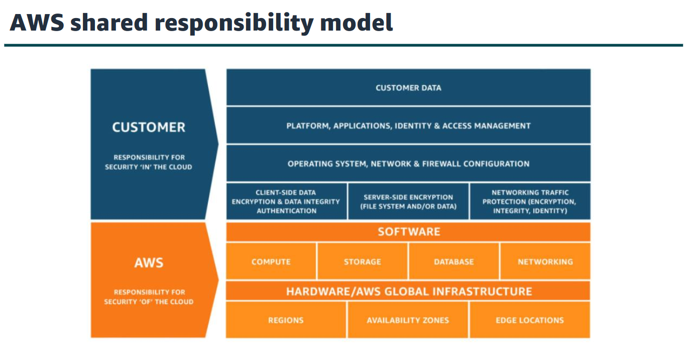
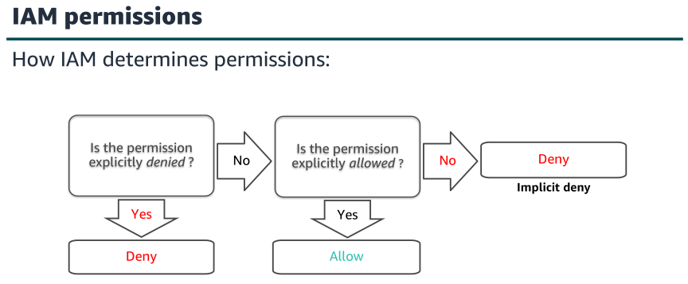
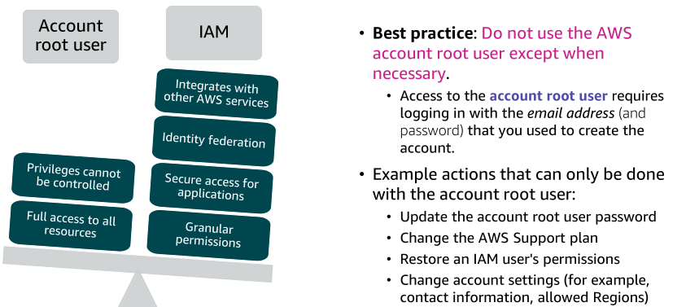
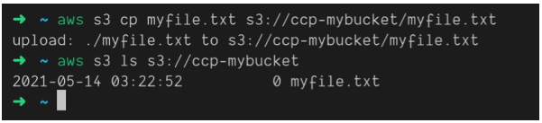

# Section 4: Cloud Security - IAM & AWS CLI

## AWS Shared responsability model

  
   

### Service characteristics and security responsability
#### Infrastructure as a service (IaaS)
- Customer more flexibility (configure network and storage)
- Customer responsible for managing more aspects of the security
- Customer configure access control

#### Platform as a service (PaaS)
- Customer can focus on managing code or data no more

#### Software as a service (SaaS)
- Licensed on a subscription model or pay as you go
- Services are typically accessed via web browser, mobile or API

## IAM (Identity and Access Management, Global Service): Users & Groups
- In AWS you apply the least privilege principle: don’t give more permissions than a user needs.
- Define fine-grained access rights
  - Who can access the resourse
  - Which resources can be accessed
  - How resources can be accessed
- Components
  - IAM User (person or application)
  - IAM Group (collection of IAM users)
  - IAM Policy (document that defines which resources can be accessed and the level of access to each resource)
  - IAM Role (mechanism to grant a set of permissions)

### Principle of least privilege
The principle of least privilege is an important concept in computer security. It promotes that 
you grant only the minimal user privileges needed to the user, based on the needs of
your users. 

### IAM Policies 
Define permissions for an action regardless of the method that you use to perform the operation.
inline: only attached to a user

  
   

  
   

### IAM – Password Policy
Strong passwords by default or custom

### IAM MFA (Multi Factor Authentication)
Password + security device.  
Devices: 
- Software devices (Google authenticator, Authy).
- Physical devices (YubiKey, Gemalto, SurePassId).

#### AWS CloudShell: Region Availability
https://docs.aws.amazon.com/cloudshell/latest/userguide/supported-aws-regions.html

### IAM Roles 
- Is an IAM identity that you can create in your account that has specific permissions to AWS Services. You can use roles to delegate access to users, applications, or services that don't normally have access to your AWS resources.
- You can use roles to delegate access to users, applications, or services that do not normally have
access to your AWS resources.

### IAM Security Tools
- IAM Credentials Report (account level) a report that list all your account’s users and the status of their various credentials.
- IAM Access Advisor (user-level):** shows the service permissions granted to a user and when those services were last accessed.

## How can users access AWS?
- To access AWS, there are three options:
  1. AWS Management Console (protected by password + MFA)
  2. AWS Command Line Interface (CLI): protected by access keys
  3. AWS Software Developer Kit (SDK): for code, protected by access keys.

- Access keys are generated through the AWS Console (users manage their own access keys - don't share your access keys)
  - Access key ID = username
  - Secret Access Key = password

  Example:
    - Access key ID: BOIATZI79MYFY1PWV9W
    - Secret key: QoIETtFgMfSPBzOtIgVb6dWVd23S4RNiJb8gDKqP

## AWS account root user access versus IAM access

  
   

### Securing a new AWS account: Account root user
1. Stop using the account root user as soon as possible.
  1.1 While you are logged in as the account root user, create an IAM user for yourself.
  1.2 Save the access keys if needed.
  1.3 Create an IAM group, give it full administrator permissions, and add the IAM user to the group.
  1.4 Disable and remove your account root user access keys, if they exist.
  1.5 Enable a password policy for users.
  1.6 Sign in with your new IAM user credentials.
  1.7 Store your account root user credentials in a secure place.
2. Enable multi-factor authentication (MFA)
  2.1 Require MFA for your account root user and for all IAM users.
3. Use AWS CloudTrail.
  3.1 CloudTrail tracks user activity on your account.
4. Enable a billing report, such as the AWS Cost and Usage Report.

### AWS CLI
- A tool that enables you to interact with AWS services using commands in your command-line-shell
- Direct access to the public APIs of AWS services.
- You can develop scripts to manage your resources
- It's open-source https://github.com/aws/cli

  
   

### AWS SDK
- AWS Software Development kit (AWS SDK)
- Language-specific APIs (set of libraries)
- Enables you to access and manage AWS services programmatically
- Embedded within your application
- Supports:
  - Javascript, Python, PHP, .NET, Ruby, Java, Go, Node.js, C++
  - Mobile SDKs (Android, iOS)
  - IoT Device SDKs (Embedded C, Arduino)

### AWS CloudShell
AWS CloudShell provides a browser-based shell for managing AWS resources without needing to provision development environments. With CloudShell, you can quickly run commands through a cloud-based shell instead of setting up a local development environment.

With CloudShell, you get a Linux-based shell accessible directly through your browser. This shell comes preconfigured with the AWS CLI, git, Python, and other common tools already installed so you can start using it immediately.

CloudShell is authenticated using your regular AWS credentials and permissions. So you can seamlessly manage resources and run AWS CLI commands without having to configure new credentials or profiles. It also provides access to your specific AWS account so that you can only interact with resources you have permissions for.

To make development easier, CloudShell allocates 500MB of storage space per AWS region. This storage persists only during your active session, providing temporary space for files, downloads, builds, etc. Anything stored here is deleted after your session terminates.

Sessions in CloudShell time out after periods of inactivity to free up resources. The limit is 20 minutes without any activity. This means you can’t use CloudShell for long-running processes, but it works well for short-term administrative tasks, ad hoc commands, and other interactive workflows.

#### Storing data in CloudShell
The temporary storage is allocated at /mnt/efs. This provides high-performance SSD-backed storage optimized for ephemeral workload data. Any files, downloads, builds, caches, etc that only need to exist during an active session can be stored here. When your CloudShell session is terminated, any data in /mnt/efs will be automatically deleted.

For data that needs to persist across sessions, CloudShell provides storage at /mnt/persistent. This slower hard disk drive storage persists independently of any single CloudShell session. Anything stored here will remain in place until explicitly deleted. This is useful for longer-term configuration files, repositories, credentials, scripts, etc that you want to reuse across multiple sessions.

## AWS Organizations
- AWS Organizations is an account management service that enables you to consolidate multiple
AWS accounts into an organization that you create and centrally manage. Here, the focus is on
the security features that AWS Organizations provides.
- Security features of AWS Organizations:
  - Group AWS accounts into organizational units (OUs) and attach different access policies to each OU.
  - Integration and support for IAM
  - Use service control policies (SCPs) to establish control over the AWS services and API actions that each AWS account can access

### Service Control Polices (SCPs)
- offer centralized control over accounts.
- SCPs are similar to IAM permissions policies
  - They use similar syntax.
  - SCPs do not grant permissions to the IAM users and IAM roles in your organization. No permissions are granted by an SCP. An SCP defines a permission guardrail, or sets limits, on the actions that the IAM users and IAM roles in your organization can perform.
  - https://docs.aws.amazon.com/organizations/latest/userguide/orgs_manage_policies_scps_examples_general.html

## AWS Key Management Service (AWS KMS)
- KMS is a service that enables you to create and manage encryption keys, and to control the use of encryption across a wide range of AWS services and your applications. 

## Amazon Cognito
- Amazon Cognito provides solutions to control access to AWS resources from your application.

## AWS Shield
- AWS Shield is a managed distributed denial of service (DDoS) protection service that safeguards
applications that run on AWS.
- AWS Shield helps protects your website from all types of DDoS attacks, including Infrastructure
layer attacks (like User Datagram Protocol—or UDP—floods), state exhaustion attacks (like TCP
SYN floods), and application-layer attacks (like HTTP GET or POST floods).
  - AWS Shield Standard is automatically enabled to all AWS customers at no additional cost.
  - AWS Shield Advanced is an optional paid service. AWS Shield Advanced provides additional
protections against more sophisticated and larger attacks for your applications that run on
Amazon EC2, Elastic Load Balancing, Amazon CloudFront, AWS Global Accelerator, and Amazon
Route 53. AWS Shield Advanced is available to all customers. However, to contact the DDoS
Response Team, customers need to have either Enterprise Support or Business Support from
AWS Support.

## AWS Config
- AWS Config is a service that enables you to assess, audit, and evaluate the configurations of your
AWS resources.
- AWS Config keeps an
inventory listing of all resources that exist in the account, and it then checks for configuration rule
compliance and resource compliance. Resources that are found to be noncompliant are flagged,
which alerts you to the configuration issues that should be addressed within the account.

## AWS Artifact
- AWS Artifact provides on-demand downloads of AWS security and compliance documents, such
as AWS ISO certifications, Payment Card Industry (PCI), and Service Organization Control (SOC)
reports.