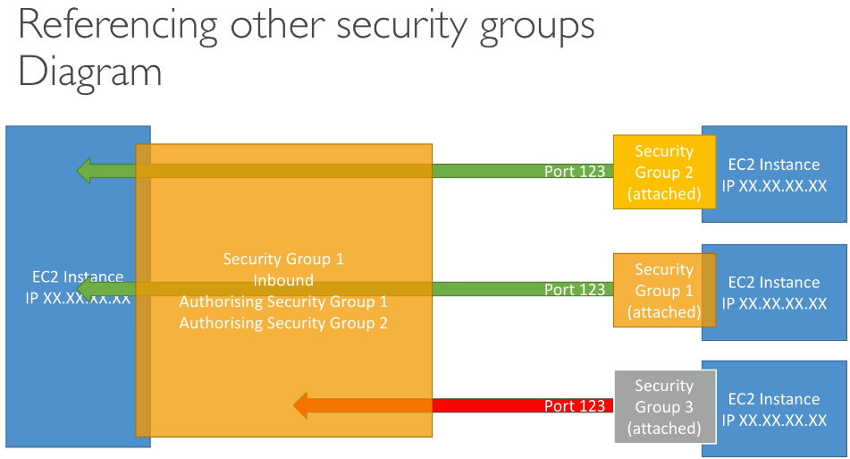

# Section 5: EC2 Fundamentals

### Billing and Cost Managment
**AWS Budgets:** Alert you when your budget thresholds are exceeded (or forecasted to exceed)

### EC2 (Elastic Compute Cloud)
- Renting Virtual Machines (EC2)
- Storing data on virtual drives (EBS)
- Distributing load across machines (ELB)
- Scaling the services using an auto-scaling group (ASG)

**EC2 User Data script:** Bootstrapping (automate boot tasks)  
key pair: 
- .pem (OpenSSH (Linux, Windows 10+, MAC)
- .ppk (Windows 7- for use with PuTTY)

### EC2 Instances Types
https://aws.amazon.com/ec2/instance-types/
- **General purpose (m):** such as web servers or code repositories
- **Compute Optimized(c):** compute-intensive tasks high performance processors
   (batch processing workloads, media transcoding, high performance web servers, high    
    performance computing (hpc), scientific modeling and machine learning, dedicated 
    gaming servers)
- **Memory Optimized (r):** process large data sets in memory
   (high performance, relational/non-relational databases, distributed web scale cache stores, 
     In-memory databases for BI, applications performing real-time unstructured data)
- **Storage Optimized (I, d, h):** required high, sequential read and write access to large data sets.
  (High frequency online transaction processing OLTP, Relational/NonSQL databases, Cache for in-memory databases (Redis), Data warehousing applications, Distributed File Systems)

to compare all instances types: https://instances.vantage.sh/

### Security Groups (firewall)
Control how traffic is allowed into or out ec2 instances (only contains  allows rules), can reference by ip or by security groups.
- They regulate: access to ports, protocols, authorised ip ranges.
- Can be attached to multiple instances
- All inbound traffic is blocked by default, and outbout traffic is authorised by default.
-  if you see a timeout when trying to establish any kind of connection, this is 100% cause of security group.

  
   

**EC2 Instance Roles:** Do not use credentials because someone can access machine ec2, use better roles.

### EC2 Instances Purchasing Options
- **On-Demand Instances:** short workload, pay by second, un-interrupted workload
- **Reserved:** (1 or 3 years) 72% discount compared to On-demand
    - Reserved instances: long workloads, regional or zone
	- Convertible reserved instances: long workload with flexible instances (change the instance type or family OS)
- **Savings Plans** (1 or 3 years): Not specific instance, is specific amount of usage in dollars. ($10/hour for 1 or 3 years)
- **Spot instances:** 90% discount, short workloads, can lose instances, no critical workloads.
- **Dedicated hosts:** book an entire physical server
    - On-demand
	- Reserved
    - Useful for software that have complicated licensing model
- **Dedicated instances:** no other customer will share your hardware
- **Capacity reservations:** reserve capacity in specific AZ for any duration