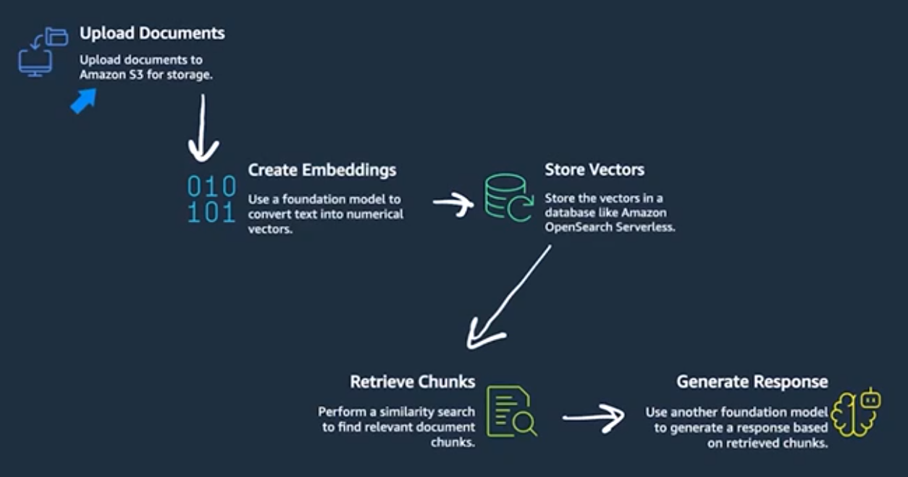

# RAG
It's a multi-step process, is really about combining data retrieval
and response generation.

  
   

Knowledge Bases uses a technique called Retrieval-Augmented Generation (RAG). Here's how it works:

    Document Processing 

        Upload your documents to Amazon S3

        The system creates embeddings (numerical representations of text) using models like Amazon Titan Text Embeddings

        Documents are chunked into manageable pieces

    Vector Storage

        Those embeddings get stored in a vector database (like Amazon OpenSearch Serverless)

        This enables semantic searching - finding content based on meaning, not just keywords

    Query Processing

        When someone asks a question:

            Their question gets converted to an embedding

            The system finds similar vectors in the database based on semantic search

            A foundation model generates a response using the retrieved content

            Responses include citations back to source documents