# Networking basics
- A network can be logically partitioned into subnets.

## IP addresses
- The IP address is 192.0.2.0. Each of the four dot (.)-separated numbers of the IP
address represents 8 bits in octal number format. That means each of the four numbers can be
anything from 0 to 255. The combined total of the four numbers for an IP address is 32 bits in
binary format.
- A 32-bit IP address is called an IPv4 address.
- IPv6 addresses, which are 128 bits, are also available.
- An IPv6 address is composed of eight groups of four letters and numbers that are separated by
colons (:)
- Each of the eight colon-separated groups of the IPv6 address represents 16 bits in hexadecimal
number format (Total 128 bits).

  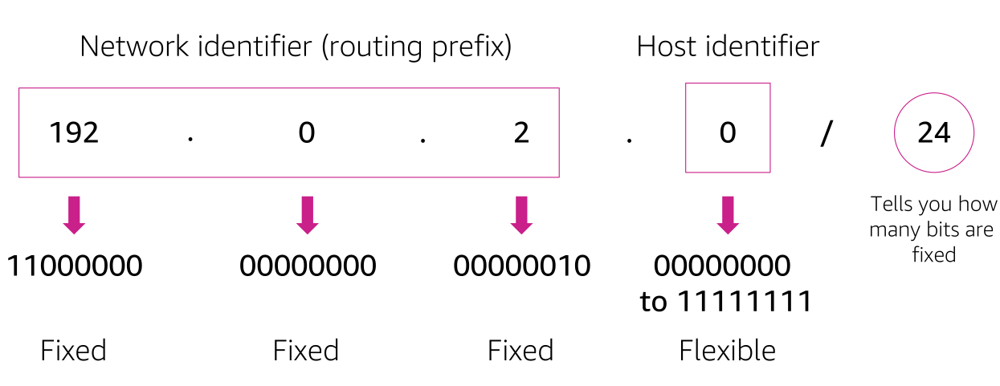
   

- the CIDR address is 192.0.2.0/24. The last number (24) tells you that the first 24
bits must be fixed. The last 8 bits are flexible, which means that 2 8 (or 256) IP addresses are
available for the network, which range from 192.0.2.0 to 192.0.2.255.
- If the CIDR was 192.0.2.0/16, the last number (16) tells you that the first 16 bits must be fixed.
The last 16 bits are flexible, which means that 216 (or 65,536) IP addresses are available for the
network, ranging from 192.0.0.0 to 192.0.255.255.
- There are two special cases:
    - Fixed IP addresses, in which every bit is fixed, represent a single IP address (for example,
192.0.2.0/32). This type of address is helpful when you want to set up a firewall rule and give
access to a specific host.
    - The internet, in which every bit is flexible, is represented as 0.0.0.0/0

  
   

- The Open Systems Interconnection (OSI) model is a conceptual model that is used to explain how
data travels over a network.
- It consists of seven layers and shows the common protocols and
addresses that are used to send data at each layer. 
- hubs and switches work at layer 2 (the data link layer). 
- Routers work at layer 3 (the network layer).

## VPC
- Amazon Virtual Private Cloud (Amazon VPC) is a service that lets you provision a logically isolated
section of the AWS Cloud (called a virtual private cloud, or VPC) where you can launch your AWS
resources.

  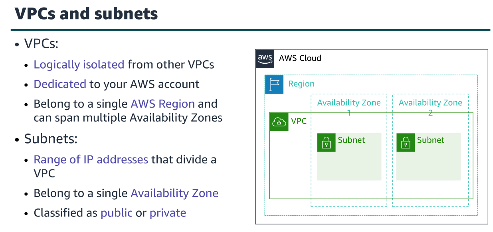
   

- When you create a VPC, you assign it to an IPv4 CIDR block (range of private IPv4
addresses).
- You cannot change the address range after you create the VPC.
- The largest IPv4 CIDR block size is /16.
- The smallest IPv4 CIDR block size is /28.
- IPv6 is also supported (with a different block size limit).
- CIDR blocks of subnets cannot overlap.

## Reserved IP addresses
When you create a subnet, it requires its own CIDR block. For each CIDR block that you specify, AWS reserves five IP addresses within that block, and these addresses are not available for use.

  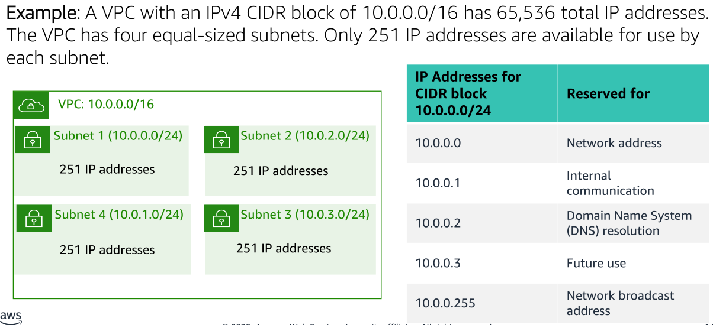
   

For example, suppose that you create a subnet with an IPv4 CIDR block of 10.0.0.0/24 (which has 256 total IP addresses). The subnet has 256 IP addresses, but only 251 are available because five are reserved.

## Public IP address types
1. Public IPv4 address
    - Automatically assigned through the auto-assign public IP address settings at the subnet level.
2. Elastic IP address
    - An Elastic IP address is a static and public IPv4 address that is designed for dynamic cloud computing. You can associate an Elastic IP address with any instance or network interface for any VPC in your account. With an Elastic IP address, you can mask the failure of an instance by rapidly remapping the address to another instance in your VPC.

## Elastic network interface
- An elastic network interface is a virtual network interface that you can:
    - Attach to an instance.
    - Detach from the instance, and attach to another instance to redirect network traffic.
- Each instance in your VPC has a default network interface that is assigned a private IPv4 address from the IPv4 address range of your VPC.

## Route tables and routes
- A route table contains a set of rules (called routes) that directs network traffic from your subnet.
- Each route specifies a destination and a target. 
    - The destination is the destination CIDR block where you want traffic from your subnet to go. 
    - The target is the target that the destination traffic is sent through. 
    - By default, every route table that you create contains a local route for communication in the VPC.
- Each subnet in your VPC must be associated with a route table. The main route table is the route
table is automatically assigned to your VPC.

# VPC Networking
## Internet gateway
- An internet gateway is a scalable, redundant, and highly available VPC component that allows
communication between instances in your VPC and the internet.
- Two purposes
    1. to provide a target in your VPC route tables for internet-routable traffic, 
    2. to perform network address translation for instances that were assigned public IPv4 addresses.
- To make a subnet public, you attach an internet gateway to your VPC and add a route to the route
table to send non-local traffic through the internet gateway to the internet (0.0.0.0/0).

  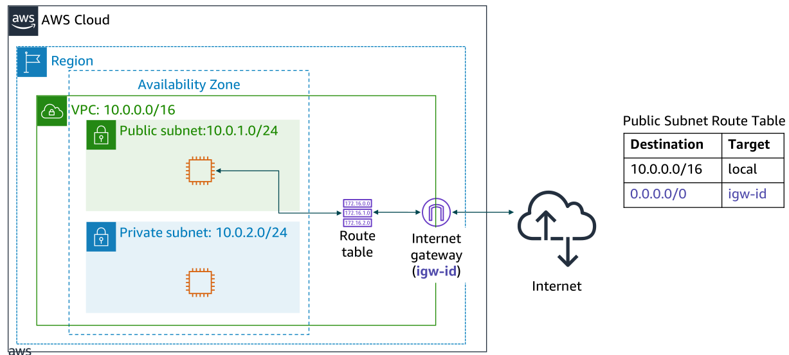
   

## Network address translation (NAT) gateway
- A network address translation (NAT) gateway enables instances in a private subnet to connect to
the internet or other AWS services, but prevents the internet from initiating a connection with
those instances.

  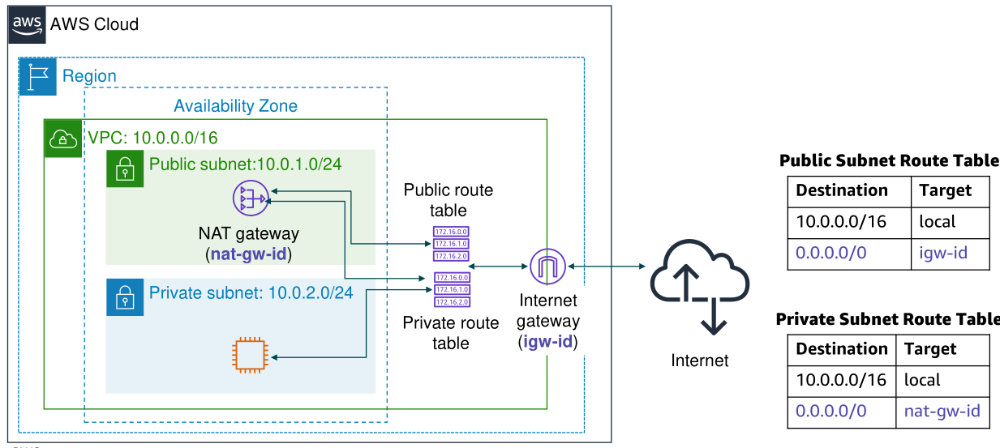
   

- To create a NAT gateway: 
    1. you must specify the public subnet in which the NAT gateway should reside.
    2. You must also specify an Elastic IP address to associate with the NAT gateway when you
create it. 
    3. After you create a NAT gateway, you must update the route table that is associated with
one or more of your private subnets to point internet-bound traffic to the NAT gateway. 
    4. Thus, instances in your private subnets can communicate with the internet.

## VPC Sharing
- VPC sharing enables customers to share subnets with other AWS accounts in the same
organization in AWS Organizations.
- In this model, the account that owns the VPC (owner) shares one or
more subnets with other accounts (participants) that belong to the same organization in AWS
Organizations. 
- After a subnet is shared, the participants can view, create, modify, and delete their
application resources in the subnets that are shared with them. 
- Participants cannot view, modify,
or delete resources that belong to other participants or the VPC owner.

## VPC Peering
- A VPC peering connection is a networking connection between two VPCs that enables you to
route traffic between them privately.

  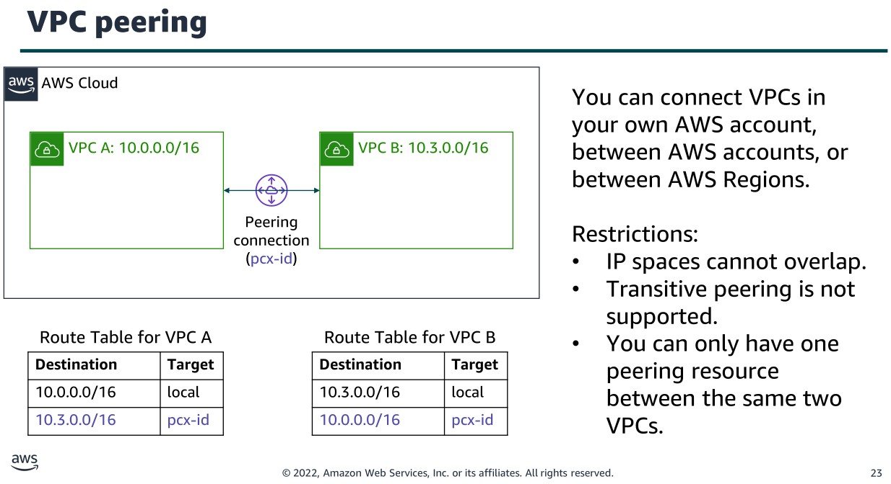
   

When you set up the peering connection, you create rules in your route table to allow the VPCs
to communicate with each other through the peering resource. For example, suppose that you
have two VPCs.

## AWS Site-to-Site VPN
By default, an instance that you launch within an Amazon VPC can't communicate with a local (AWS Cloud) network and a remote device — for example, this might be a site or an on-premises device. You can enable access to your remote devices from your VPC by creating an AWS Site-to-Site VPN (Site-to-Site VPN) connection, and configuring routing to pass traffic through the connection.

  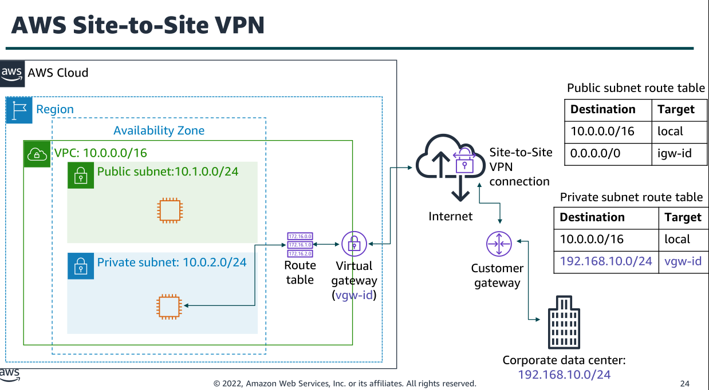
   

## AWS Direct Connect
One of the challenges of network communication is network performance. Performance can be
negatively affected if your data center is located far away from your AWS Region. For such
situations, AWS offers AWS Direct Connect, or DX. AWS Direct Connect enables you to establish a
dedicated, private network connection between your network and one of the DX locations. This
private connection can reduce your network costs, increase bandwidth throughput, and provide a
more consistent network experience than internet-based connections. DX uses open standard
802.1q virtual local area networks (VLANs).

  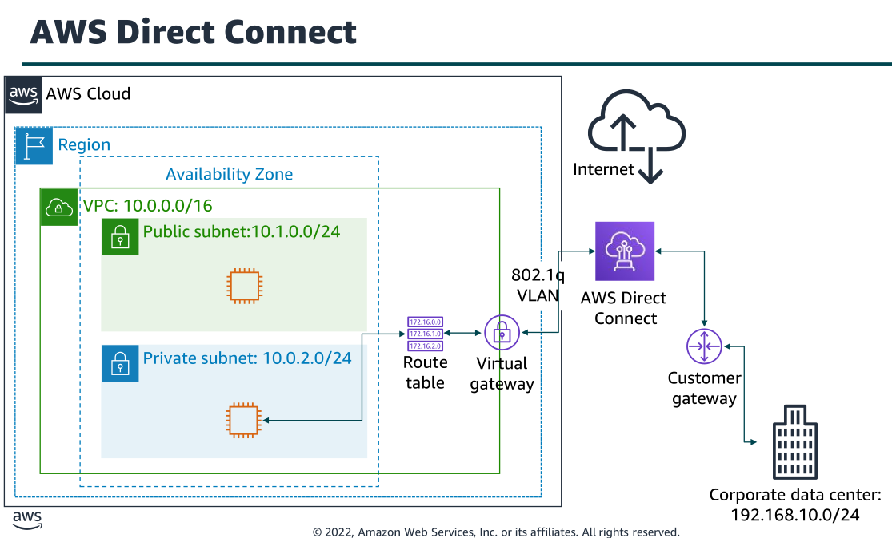
   

## VPC Endpoints
### Why are VPC Endpoints necessary?
By default, many AWS services like S3 or DynamoDB exist outside of your VPC on the public AWS network. If you have a database or a Docker container in a private subnet (without a public IP) and you want it to connect to S3, you would normally have two options:
- Assign a public IP to your instance (insecure).
- Use a NAT Gateway to access the internet (expensive).

A VPC Endpoint is a "private door" that allows your traffic to travel from your VPC to the AWS service without ever leaving the Amazon network. This improves security and reduces data transfer costs.

### Do you need a VPC Endpoint as soon as you create an account and a VPC?
It is not mandatory, but it is highly recommended.

When you create a VPC, services like S3 do not strictly require a VPC Endpoint to work, but the way you access them changes:
- Without a VPC Endpoint: Your requests to S3 travel through the public internet. If your code is running in a private instance, you will need a NAT Gateway.
- With a VPC Endpoint (Gateway Type for S3): The VPC knows that when you request something from S3, it should send it through an internal AWS route. S3 is one of two services (along with DynamoDB) that offers a "Gateway Endpoint," which is free of charge.

### What is a VPC Endpoint?
A VPC endpoint is a virtual device that enables you to privately connect your VPC to supported
AWS services and VPC endpoint services that are powered by AWS PrivateLink. Connection to
these services does not require an internet gateway, NAT device, VPN connection, or AWS Direct
Connect connection. Instances in your VPC do not require public IP addresses to communicate
with resources in the service. Traffic between your VPC and the other service does not leave the
Amazon network.

  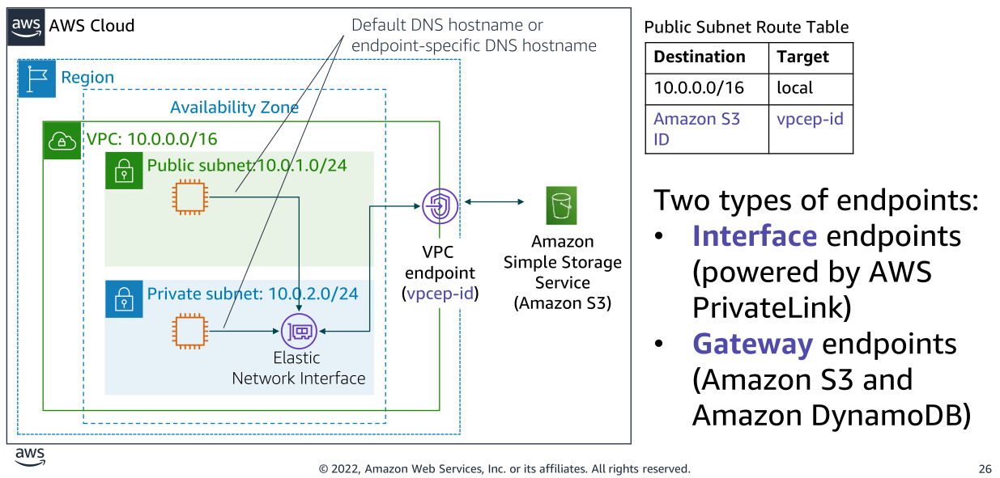
   

There are two types of VPC endpoints:
- **An interface VPC endpoint** (interface endpoint) enables you to connect to services that are
powered by AWS PrivateLink. These services include some AWS services, services that are
hosted by other AWS customers and AWS Partner Network (APN) Partners in their own VPCs
(referred to as endpoint services), and supported AWS Marketplace APN Partner services. The
owner of the service is the service provider, and you—as the principal who creates the
interface endpoint—are the service consumer. 
- **Gateway endpoints:** The use of gateway endpoints incurs no additional charge. Standard
charges for data transfer and resource usage apply.

## AWS Transit Gateway
You can configure your VPCs in several ways, and take advantage of numerous connectivity
options and gateways. These options and gateways include AWS Direct Connect (via DX
gateways), NAT gateways, internet gateways, VPC peering, etc. It is not uncommon to find AWS
customers with hundreds of VPCs distributed across AWS accounts and Regions to serve multiple
lines of business, teams, projects, and so forth. Things get more complex when customers start to
set up connectivity between their VPCs. All the connectivity options are strictly point-to-point, so
the number of VPC-to-VPC connections can grow quickly. As you grow the number of workloads
that run on AWS, you must be able to scale your networks across multiple accounts and VPCs to
keep up with the growth.

  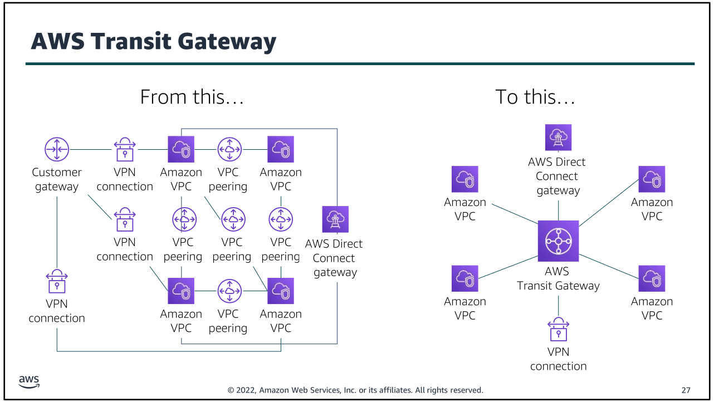
   

To solve this problem, you can use AWS Transit Gateway to simplify your networking model. With
AWS Transit Gateway, you only need to create and manage a single connection from the central
gateway into each VPC, on-premises data center, or remote office across your network. 

A transit gateway acts as a hub that controls how traffic is routed among all the connected networks,
which act like spokes. This hub-and-spoke model significantly simplifies management and
reduces operational costs because each network only needs to connect to the transit gateway
and not to every other network. 

Any new VPC is connected to the transit gateway, and is then
automatically available to every other network that is connected to the transit gateway. This ease
of connectivity makes it easier to scale your network as you grow.

## Summary:
There are several VPC networking options, which include:
- Internet gateway: Connects your VPC to the internet
- NAT gateway: Enables instances in a private subnet to connect to the internet
- VPC endpoint: Connects your VPC to supported AWS services
- VPC peering: Connects your VPC to other VPCs
- VPC sharing: Allows multiple AWS accounts to create their application resources into
shared, centrally-managed Amazon VPCs
- AWS Site-to-Site VPN: Connects your VPC to remote networks
- AWS Direct Connect: Connects your VPC to a remote network by using a dedicated
network connection
- AWS Transit Gateway: A hub-and-spoke connection alternative to VPC peering

# VPC Security
## Security Groups
A security group acts as a virtual firewall for your instance, and it controls inbound and outbound
traffic. Security groups act at the instance level, not the subnet level. Therefore, each instance in
a subnet in your VPC can be assigned to a different set of security groups.

  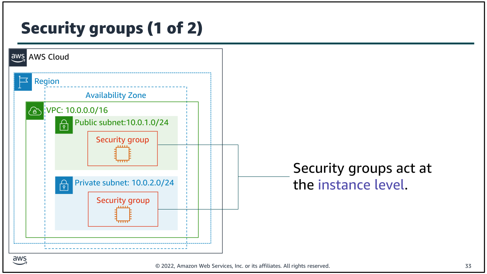
   

Security groups have rules that control the inbound and outbound traffic. When you create a
security group, it has no inbound rules. Therefore, no inbound traffic that originates from another
host to your instance is allowed until you add inbound rules to the security group. By default, a
security group includes an outbound rule that allows all outbound traffic. You can remove the
rule and add outbound rules that allow specific outbound traffic only. If your security group has
no outbound rules, no outbound traffic that originates from your instance is allowed.

  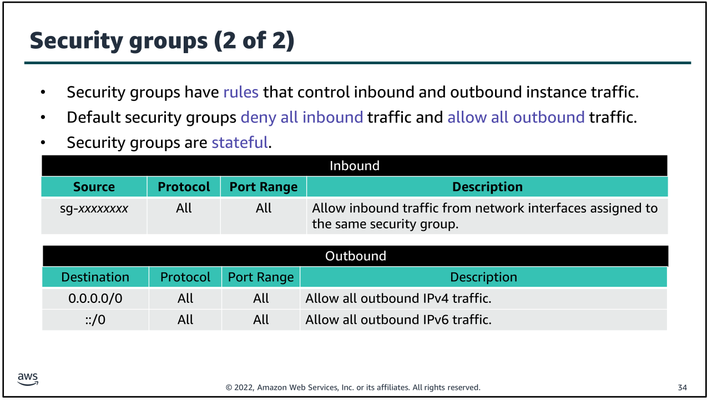
   

Examples:

  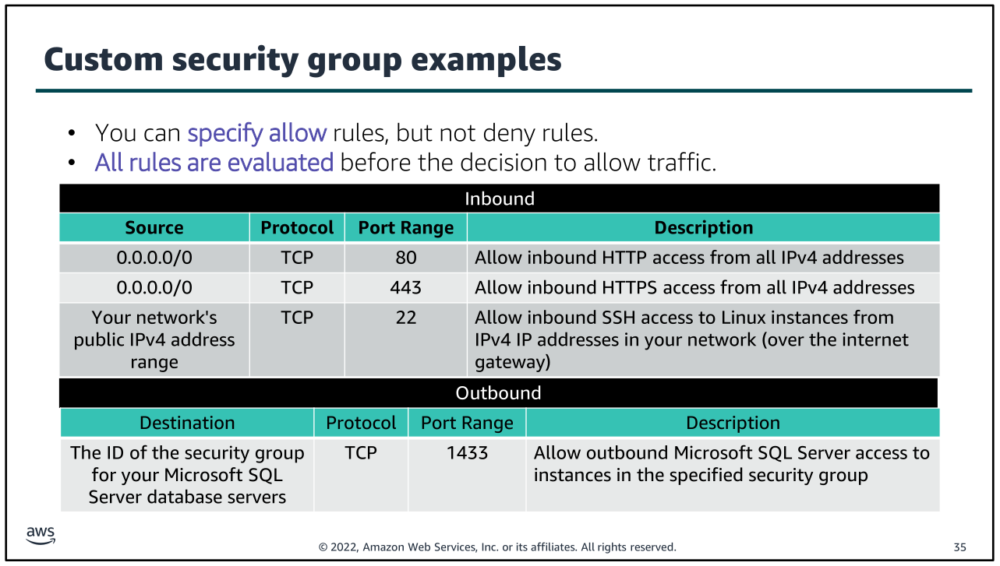
   

## Network access control list (network ACL)
A network access control list (network ACL) is an optional layer of security for your Amazon VPC. It
acts as a firewall for controlling traffic in and out of one or more subnets. To add another layer of
security to your VPC, you can set up network ACLs with rules that are similar to your security
groups.

  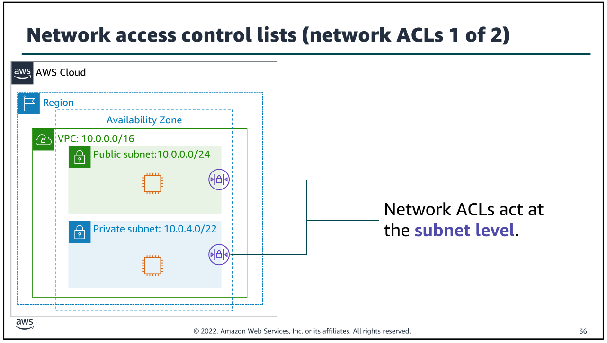
   

Each subnet in your VPC must be associated with a network ACL. If you don't explicitly associate a
subnet with a network ACL, the subnet is automatically associated with the default network ACL.
You can associate a network ACL with multiple subnets; however, a subnet can be associated with
only one network ACL at a time. When you associate a network ACL with a subnet, the previous
association is removed.

  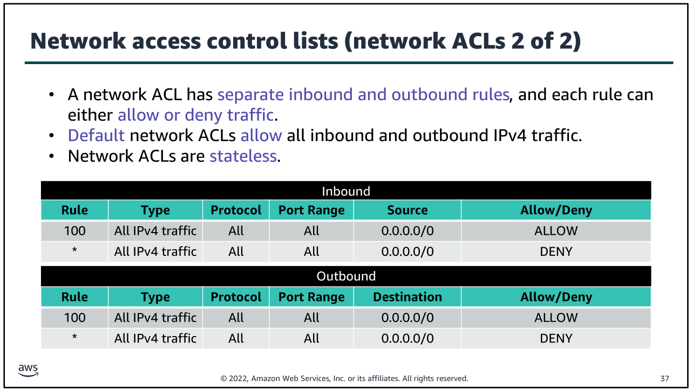
   

Network ACLs are stateless, which means that no information about a request is maintained after
a request is processed.

### Custom ACL

  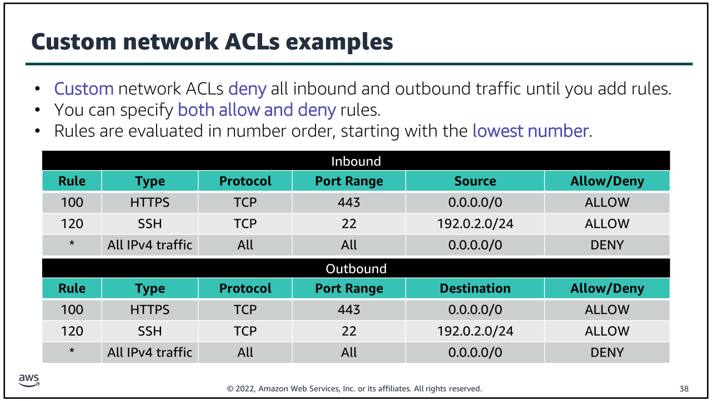
   

A network ACL contains a numbered list of rules that are evaluated in order, starting with the
lowest numbered rule. The purpose is to determine whether traffic is allowed in or out of any
subnet that is associated with the network ACL. The highest number that you can use for a rule is
32,766. AWS recommends that you create rules in increments (for example, increments of 10 or
100) so that you can insert new rules where you need them later.

### ACL vs Security Groups

  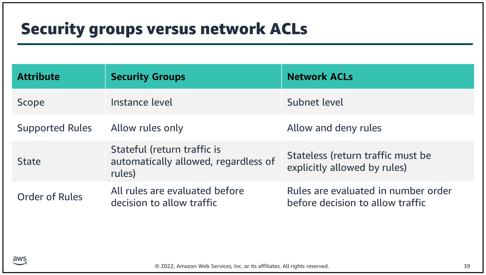
   

