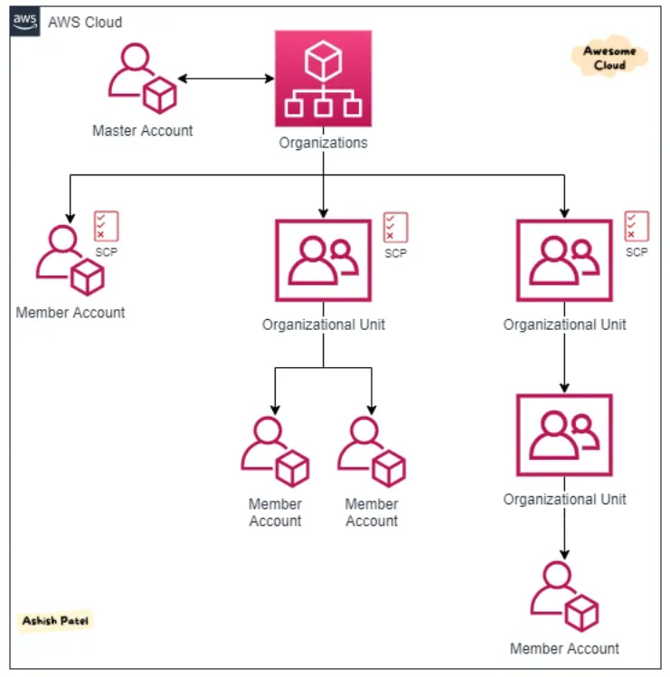

# Section 1: Pricing Model

## AWS Princing Model
    - AWS Free Tier
        - Experience with the AWS platform, products and services. Free for one yesar for new customers.
    - Pay for what you use
    Three fundamental drivers of cost with AWS
    - Compute (per hour/second)
    - Storage (per GB)
    - Data Transfer (per GB)
        - Outbound is charged
        - Inbound has no change (with some exceptions)
        - Data transfer between services in the same region is free
    - Pay less by using more

    - Total cost of Ownership (TCO)
        - Is the financial estimate to help identify direct and indirect cost of a system
        - To compare the costs of running an entire infrastrcutre environment or specific workload on-premises versus on AWS.

    - Services with no charge
        - Amazon VPC
        - Elastic Beanstalk
        - Auto Scaling
        - AWS CloudFormation
        - IAM

# AWS Organizations
- Free service
    - Consolidated billing
    - Centralized control and govern of all accounts and resources
    - Manage multiple AWS accounts under a unified umbrella. 
- Components:
    - Account Hierarchy:
        - Root Account: Controls everything (this is not used for daily operations)
        - Member Accounts: Separate AWS Accounts that can be used for varios departments, projects or teams.
    - Organizational Units (OUs): Groups of members accounts.
    - Service Control Policies (SCPs): Rules that can you apply at different levels of the hierarchy.
    - Cross-Account Access: Grant permissions across accounts without sharing sensitive credentials.

  
   

# Tools for Billing 
- AWS Billing Dashboard
    Lets you view the status of your month-to-date AWS expenses, and identify the services that account for the majority of your overall monthly bill.
- AWS Bugdets
    - Create notifications for when you go over your budget for the month
- AWS Cost and Usage Report
- AWS Cost Explorer
    Cost for the past three months 
- AWS Bills
    Lists the cost that you incurred over the past month for each AWS Service.

# AWS Support
    - Support plans
        - Basic
        - Developer
        - Business
        - Enterprise
    - AWS Trusted Advisor
        - Checks for opportunities to reduce monthly expenditures and increces productivity
            - What you are doing right and it tells you where you need to watch out and corrected