# Section 19: Serverless Overviews from a Solution Architect Perspective

Serveless is a new paradigm in which the developers don’t have to manage or provisioning servers anymore. Just deploy code (functions).
- AWS Lambda
- DynamoDB
- AWS Cognito
- AWS Api Gateway
- S3
- SNS & SQS
- Kinesis  Data Firehose
- Aurora Serveless
- Step Functions
- Fargate

**AWS  Lambda (was launched at re:invent 2014)**

## Firecracker
An new open source virtualization technology that makes use of KVM (runs in EC2 bare metal instances(physical servers  that are  not virtualized)). You can launch lightweight micro-virtual machines (microVMs) in non-virtualized environments in a fraction of a second, taking advantage of the security and workload isolation provided by traditional VMs and the resource efficiency that comes along with containers.

Firecracker boots a minimal kernel config without relying on an emulated bios and without a complete device model. The only devices are virtio net and virtio block, as well as a one-button keyboard (the reset pin helps when there’s no power management device). This minimal device model not only enables faster startup times.

Firecracker microVMs improve efficiency and utilization with a low memory overhead of < 5 MiB per microVMs. This means that you can pack thousands of microVMs onto a single machine. 

https://github.com/firecracker-microvm/firecracker/

## AWS Lambda lifecycle

  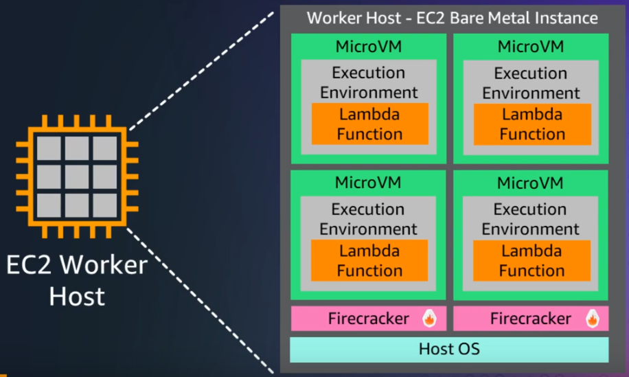
   

  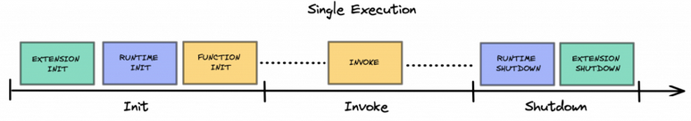
   

### Init
The goal of this phase is to prepare the environment for the Lambda to be invoked. The Lambda function will download the code, initialize the extensions along with the runtime environment, and load code in the environment.

### Extension Init
An extension is a means to integrate AWS Lambda with monitoring, governance, and security tools without coupling it to business logic. Extensions live in a different container that is initialized before the Runtime and Function init, and they are shutdown after the Shutdown Runtime.
https://www.youtube.com/watch?v=sAgUcJOwElU

### Runtime Init
The runtime is the combination of an operating system, programming language and a combination of software libraries required to invoke the Lambda function.

### Function Init
The Function Init phase is in charge of running static code in the runtime environment. This phase allows for the code to be initialized and readied to be called by the service.

### Invoke
In this section, we will refer to the concept of Warm and Cold Starts. After the Invoke phase, the Lambda environment is kept alive until the AWS Lambda service decides to kill it. When the service decides to kill it, the Shutdown Phase is triggered. A Lambda function that is waiting to be shut down is qualified as Warm.

### Cold Start
When the service request to invoke a Lambda and a new sandbox environment is spawned

  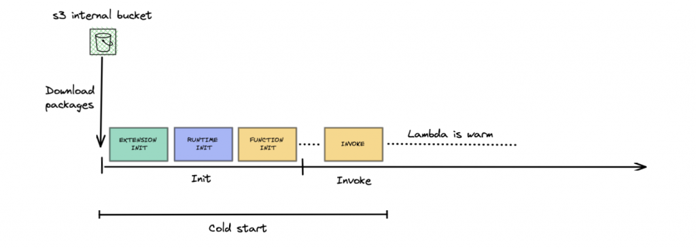
   

  
   

As seen in the diagram above, the second invocation does not go through the Init phase. This reduces the execution time and helps ensure that AWS only charges the user for the invocation time.

### Shutdown
Once the Lambda function is invoked and the Lambda Service decides to kill the environment, the Shutdown phase is triggered. The Lambda Service sends events to the Runtime and Extension processes to trigger the Shutdown Phase. If the Lambda service does not receive a response 2 seconds after the events are sent, it terminates the processes via a SIGKILL signal.

  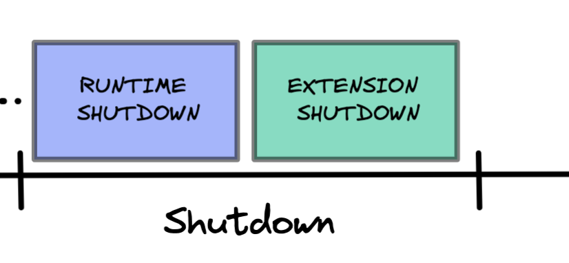
   

## AWS Lambda features
Virtual functions, limited by time (15min), Run on-demand, scaling is automated.

Pay per request and compute time.
Free tier: 1.000.000 lambda requests and 400.000 Gbseconds of compute time.
If you need more resources per functions (up to 10GB of RAM)

### Limits:
Execution:
- Memory allocation: 128MB – 10GB
- Maximum execution ttime: 900 seconds (15minutes)
- Environment variables: 4KB
- Disk capacity (in /tmp): 512MB to 10GB
- Concurrency executions: 1000 (can be incresed)

### Deployment:
-  compressed .zip: 50MB
- size of uncompressed deploymentt (code +  dependencies): 250 MB
- can use /tmp directory to load other files  at  startup
- Size environment variables:  4KB

### Lambda SnapStart
Improves your  lambda functions performance up to 10x at  no extra cost  for Java.
When you publish a new version:
- Lambda initializes your  functions
- Takes  a snapshot of memory and disk state of the initialized functions
- Snapshot is cached for low-latency access

  
   

## Customization at the Edge
- Many modern applications execute some form of the logic at the edge
- Edge function: 
  - A code that you write and attach to CloudFront distributions
  - Runs close to your users to minimize latency

### CloudFront provides two types: CloudFront Functions & Lambda@Edge
- To customize the CDN content
- Pay only for what you use
- Fully serverless

### Uses cases:
- Website securitty
- Dynamic web application
- Search engine optimization
- Real-time image transformation
- A/B Testing
- User authentication and authorization
- User prioritizattion
- User tracking and analytics

### CloudFront Functions: Lightweight functions 
written in JavaScript, used to change Viewer requests and responses.
- Viewer Request: After CloudFront receives a requests from a viewer.
- Viewer Response: Before CloudFront forwards the response to the viewer.

  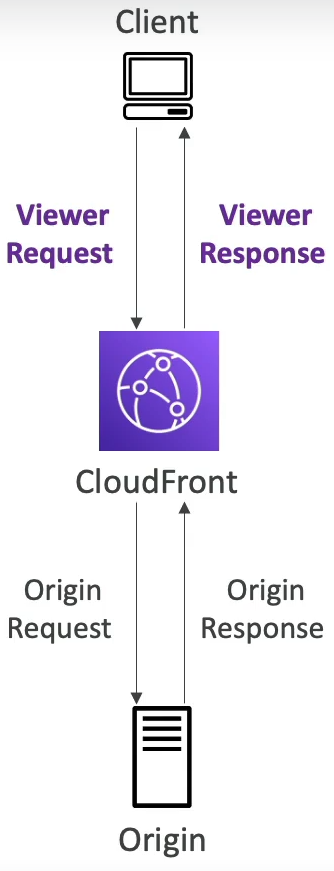
   

### Lambda@Edge: NodeJS or Python
Lambda@Edge is a feature of CloudFront that lets you run code closer to your users, which improves performance and reduces latency.
Used too, to change  CloudFront responses:
- Viewer Request: After CloudFront receives a requests from a viewer.
- Origin Request: Before CloudFront forwards the response to the origin.
- Origin Response : After CloudFront receives a requests from a origin.
- Viewer Response: Before CloudFront forwards the response to the viewer.

  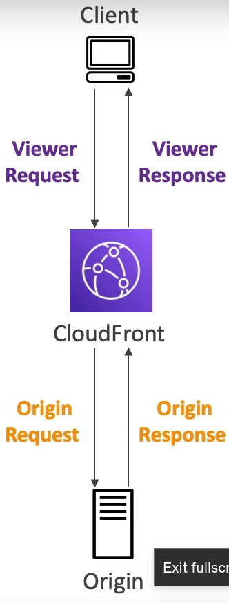
   

  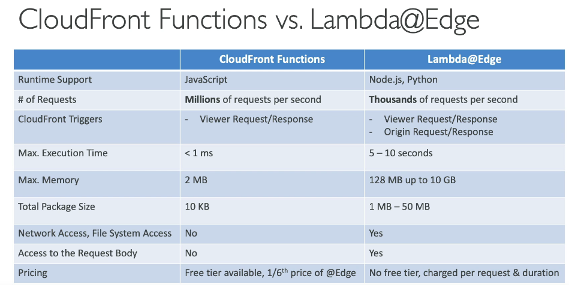
   

  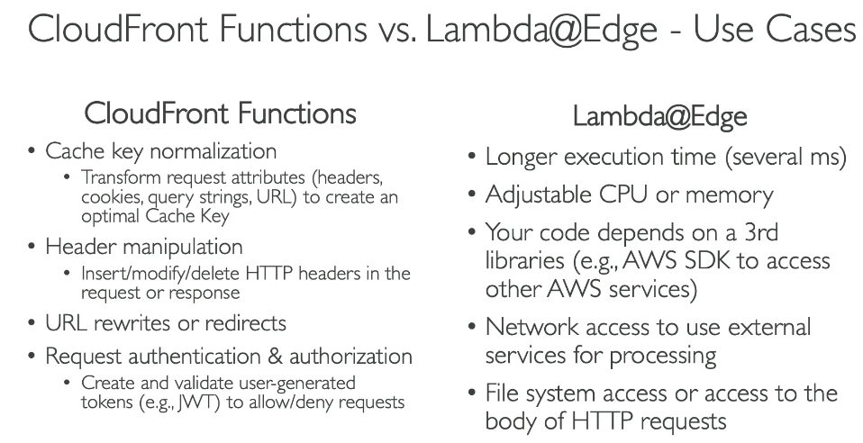
   

### Lambda by default
By default, your lambda functions is launched  outside your own VPC

  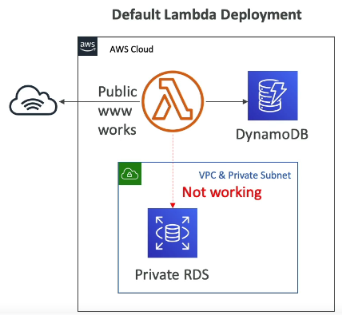
   

  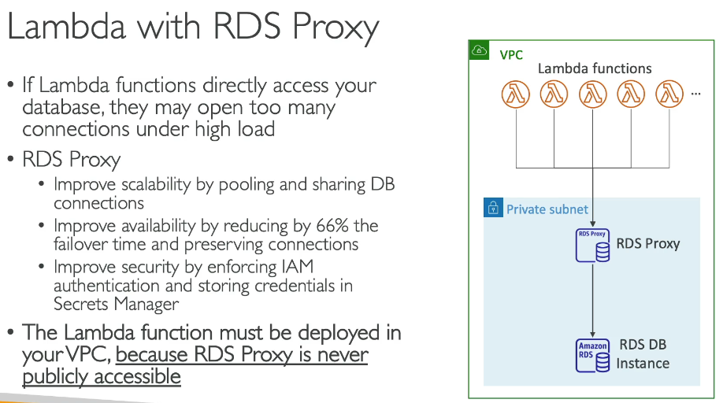
   

### Lambda performance best practices
https://medium.com/platform-engineer/aws-lambda-performance-best-practices-50968e5bb075

### Lambda zip vs containers
https://medium.com/@ryan.cormack/comparing-container-and-zip-lambdaliths-with-thin-functions-03b439239e72

### When use lambda with containers
https://kreuzwerker.de/en/post/should-you-use-lambda-containers

### Invoking lambda from RDS & Aurora
- Supported for RDS for PostgreSQL and Aurora MySQL
- Must allow outbound traffic to your lambda function.
- DB Instance must have the required permissions to invoke the lambda function.

  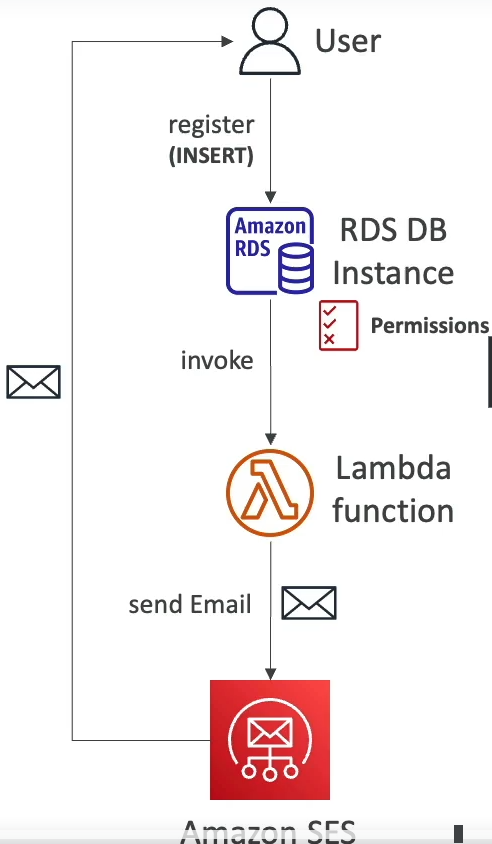
   

## Function handler
The Lambda function handler is the method in your function code that processes events. When your function is invoked, Lambda runs the handler method. Your function runs until the handler returns a response, exits, or times out.

### Returning a value
Optionally, a handler can return a value, which must be JSON serializable. Common return types include dict, list, str, int, float, and bool.

## Lambda Context
When Lambda runs your function, it passes a context object to the handler. This object provides methods and properties that provide information about the invocation, function, and execution environment.

## Log and monitor Python Lambda functions
AWS Lambda automatically monitors Lambda functions and sends log entries to Amazon CloudWatch. Your Lambda function comes with a CloudWatch Logs log group and a log stream for each instance of your function. The Lambda runtime environment sends details about each invocation and other output from your function's code to the log stream.

## Using the AWS SDK for Python (Boto3) in your handler
Often, you'll use Lambda functions to interact with other AWS services and resources. The simplest way to interface with these resources is to use the AWS SDK for Python (Boto3). All supported Lambda Python runtimes include a version of the SDK for Python. However, we strongly recommend that you include the SDK in your function's deployment package if your code needs to use it. Including the SDK in your deployment package gives you full control over your dependencies and reduces the risk of version misalignment issues with other libraries.

## Code best practices for python lambda functions
- Separate the Lambda handler from your core logic. This allows you to make a more unit-testable function. For example, in Python, this may look like: 

  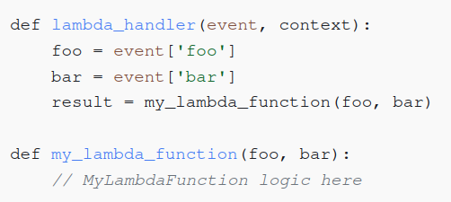
   

- **Control the dependencies in your function's deployment package.** The AWS Lambda execution environment contains a number of libraries. For the Node.js and Python runtimes, these include the AWS SDKs. To enable the latest set of features and security updates, Lambda will periodically update these libraries. These updates may introduce subtle changes to the behavior of your Lambda function. To have full control of the dependencies your function uses, package all of your dependencies with your deployment package.

- **Minimize the complexity of your dependencies.** Prefer simpler frameworks that load quickly on execution environment startup.

- **Minimize your deployment package size to its runtime necessities.** This will reduce the amount of time that it takes for your deployment package to be downloaded and unpacked ahead of invocation.

- **Take advantage of execution environment reuse to improve the performance of your function.** Initialize SDK clients and database connections outside of the function handler, and cache static assets locally in the /tmp directory. Subsequent invocations processed by the same instance of your function can reuse these resources. This saves cost by reducing function run time.

- **Use environment variables to pass operational parameters to your function.** For example, if you are writing to an Amazon S3 bucket, instead of hard-coding the bucket name you are writing to, configure the bucket name as an environment variable.

- **Avoid using recursive invocations in your Lambda function,** where the function invokes itself or initiates a process that may invoke the function again. This could lead to unintended volume of function invocations and escalated costs.

- **Do not use non-documented, non-public APIs in your Lambda function code.** For AWS Lambda managed runtimes, Lambda periodically applies security and functional updates to Lambda's internal APIs.

- **Write idempotent code.** Writing idempotent code for your functions ensures that duplicate events are handled the same way. Your code should properly validate events and gracefully handle duplicate events. 

## Amazon DynamoDB
- Fully managed, highly available with replications across multiples Azs
- NoSQL database
- Scales to massive workloads (distributed database)
- Millions of requests per second
- Integrated with IAM
- No maintenance or patching, always available
- Table class:
	- Standard
  - Infrequent access

  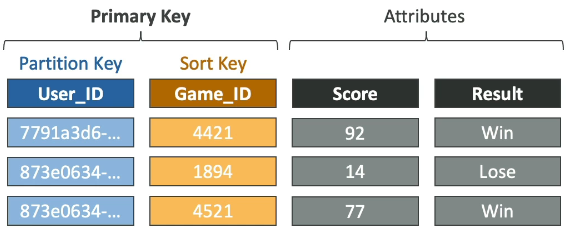
   

### Read/Writte Capacity modes 
Provisioned mode (default) (Load predictable)
- You specify the number of reads/writes per second
- You need to plan capacity beforehand
- Pay for provisioned **Read Capacity Units (RCU) & Write Capacity Units (WCU)**
- Possibility to add auto-scaling mode for RCU & WCU
- RCU and WCU are decoupled, so you can increase/decrease each value separately

### On-Demand Mode
- Read/writes  automatically scale up/down with your workloads
- No capacity planning needed
- Pay for what you use, more expensive
- Great for unpredictable workloads or sudden spikes

### DynamoDB Accelerator (DAX)
- Fully-managed, highly available, seamless in-memory cache for DynamoDB
- Help solve read congestion by caching
- Microseconds latency for cached data
- 5min TTL (Time To Live) for cache (default)
- It caches the most frequently used data, thus offloading the heavy reads on hot keys off your DynamoDB table, hence preventing the "ProvisionedThroughputExceededException" exception. 

  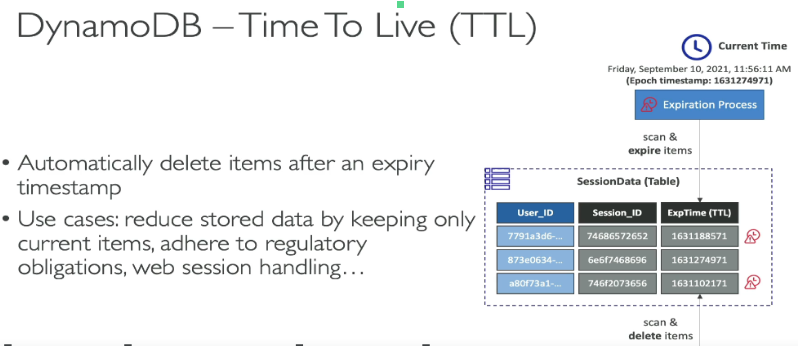
   

### DynamoDB – Stream processing
- Ordered streams of item-level modifications (create/update/delete) in a dynamodb table. It’s integrated  with aws lambda, so that you crate triggers that  automatically respond to events  in real-time.
- 24  hours retention
- Limited # of  consumers
- Process  using AWS Lambda Triggers or DynamoDB Stream Kinesis Adapter

  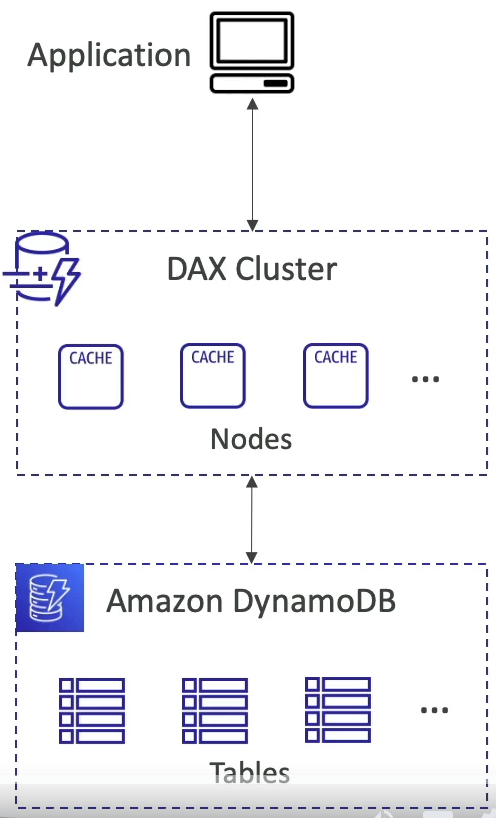
   

### DynamoDB Global tables
- Active-Active replications
- Apps can read and write to the table in any regional
- Must be enable DynamoDB Streams

  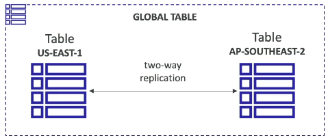
   

### DynamoDB – Backups for disaster recovery
- Continous backups using point-in-time recovery
- On-demands backups
	- Full backups for long-term retention
- Can be configured and managed in AWS Backup

### DynamoDB – Integration with S3

  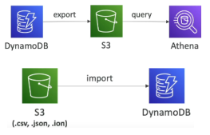
   

## API Gateway
Amazon API Gateway is a fully managed service that makes it easy for developers to publish, maintain, monitor, secure, and operate APIs at any scale. It's a pay-as-you-go service that takes care of all of the undifferentiated heavy lifting involved in securely and reliably running APIs at scale.

Read [here](https://microservices.io/patterns/apigateway.html) the API Gateway pattern definition. 

### AWS API Gateway functionalities:
- AWS Lambda + API Gateway: No infrastructure to manage
- Support for the WebSocket Protocol
- Handle API versioning (v1, v2, ...)
- Handle different environments (dev, test, prod, ...)
- Handle security (Authentication and Authorization)
- Create API Keys, handle request throttling
- Swagger / Open API import to quickly define APIs
- Transform and validate requests and responses
- Generate SDK and API specifications
- Cache API responses

  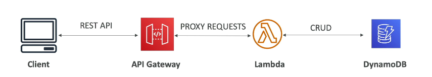
   

### API Gateway - Integrations High Level
- Lambda function
  - Invoke lambda function
  - Easy way to expose REST API backed by AWS Lambda
- HTTP
  - Expose HTTP endpoints
- AWS Service
  - Expose any AWS API through the API Gateway
    - Example: start an AWS Step Function workflow.

  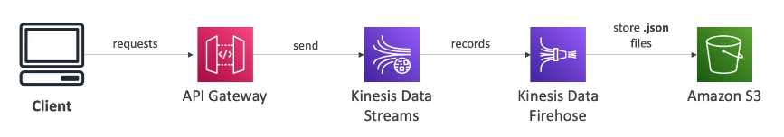
   

### API Gateway - Endpoint Types
- Edge-Optimized (default): For global clients
  - Requests are routed through the CloudFront Edge Locations (improves latency)
  - Which could help in cases where your clients are geographically distributed. 
  - The API Gateway still lives in only one region
- Regional
  - For clients within the same region
- Private
  - Can only be accessed from your VPC using an interface VPC endpoint (ENI)

### API Gateway - Security
- User Authentication through
  - IAM Roles (useful for internal applications)
  - Cognito (identity for external users - example mobile users)
  - Custom Authorizer (your own logic)
- Custom Domain Name HTTPS security through integration with AWS Certificate Manager (ACM)
  - If using Edge-Optimized endpoint, then the certificate must be in us-east-1
  - If using Regional endpoint, the certificate must be in the API Gateway region
