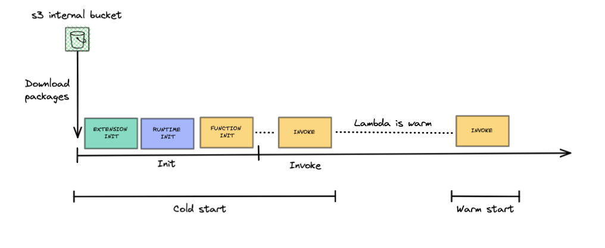
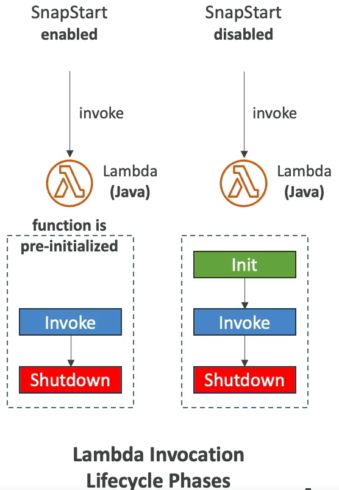

# Section 19: Serverless Overviews from a Solution Architect Perspective

Serveless is a new paradigm in which the developers don’t have to manage or provisioning servers anymore. Just deploy code (functions).
- AWS Lambda
- DynamoDB
- AWS Cognito
- AWS Api Gateway
- S3
- SNS & SQS
- Kinesis  Data Firehose
- Aurora Serveless
- Step Functions
- Fargate

**AWS  Lambda (was launched at re:invent 2014)**

## Firecracker
An new open source virtualization technology that makes use of KVM (runs in EC2 bare metal instances(physical servers  that are  not virtualized)). You can launch lightweight micro-virtual machines (microVMs) in non-virtualized environments in a fraction of a second, taking advantage of the security and workload isolation provided by traditional VMs and the resource efficiency that comes along with containers.

Firecracker boots a minimal kernel config without relying on an emulated bios and without a complete device model. The only devices are virtio net and virtio block, as well as a one-button keyboard (the reset pin helps when there’s no power management device). This minimal device model not only enables faster startup times.

Firecracker microVMs improve efficiency and utilization with a low memory overhead of < 5 MiB per microVMs. This means that you can pack thousands of microVMs onto a single machine. 

https://github.com/firecracker-microvm/firecracker/

## AWS Lambda lifecycle

  
   

  
   

### Init
The goal of this phase is to prepare the environment for the Lambda to be invoked. The Lambda function will download the code, initialize the extensions along with the runtime environment, and load code in the environment.

### Extension Init
An extension is a means to integrate AWS Lambda with monitoring, governance, and security tools without coupling it to business logic. Extensions live in a different container that is initialized before the Runtime and Function init, and they are shutdown after the Shutdown Runtime.
https://www.youtube.com/watch?v=sAgUcJOwElU

### Runtime Init
The runtime is the combination of an operating system, programming language and a combination of software libraries required to invoke the Lambda function.

### Function Init
The Function Init phase is in charge of running static code in the runtime environment. This phase allows for the code to be initialized and readied to be called by the service.

### Invoke
In this section, we will refer to the concept of Warm and Cold Starts. After the Invoke phase, the Lambda environment is kept alive until the AWS Lambda service decides to kill it. When the service decides to kill it, the Shutdown Phase is triggered. A Lambda function that is waiting to be shut down is qualified as Warm.

### Cold Start
When the service request to invoke a Lambda and a new sandbox environment is spawned

  
   

  
   

As seen in the diagram above, the second invocation does not go through the Init phase. This reduces the execution time and helps ensure that AWS only charges the user for the invocation time.

### Shutdown
Once the Lambda function is invoked and the Lambda Service decides to kill the environment, the Shutdown phase is triggered. The Lambda Service sends events to the Runtime and Extension processes to trigger the Shutdown Phase. If the Lambda service does not receive a response 2 seconds after the events are sent, it terminates the processes via a SIGKILL signal.

  
   

## AWS Lambda features
Virtual functions, limited by time (15min), Run on-demand, scaling is automated.

Pay per request and compute time.
Free tier: 1.000.000 lambda requests and 400.000 Gbseconds of compute time.
If you need more resources per functions (up to 10GB of RAM)

### Limits:
Execution:
- Memory allocation: 128MB – 10GB
- Maximum execution ttime: 900 seconds (15minutes)
- Environment variables: 4KB
- Disk capacity (in /tmp): 512MB to 10GB
- Concurrency executions: 1000 (can be incresed)

### Deployment:
-  compressed .zip: 50MB
- size of uncompressed deploymentt (code +  dependencies): 250 MB
- can use /tmp directory to load other files  at  startup
- Size environment variables:  4KB

### Lambda SnapStart
Improves your  lambda functions performance up to 10x at  no extra cost  for Java.
When you publish a new version:
- Lambda initializes your  functions
- Takes  a snapshot of memory and disk state of the initialized functions
- Snapshot is cached for low-latency access

  
   

## CloudFront Functions & Lambda@Edge
- To customize the CDN content
- To execute some form of logic at the edge.
- Runs  close to your users to minimize latency.

### Uses cases:
- Website securitty
- Dynamic web application
- Search engine optimization
- Real-time image transformation
- A/B Testing
- User authentication and authorization
- User prioritizattion
- User tracking and analytics

### CloudFront Functions: Lightweight functions 
written in JavaScript, used to change Viewer requests and  responses.
- Viewer Request: After CloudFront receives a requests from a viewer.
- Viewer Response: Before CloudFront forwards the response to the viewer.

