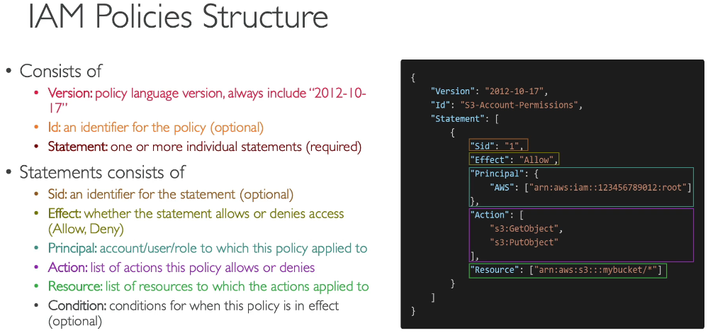

# Section 4: IAM & AWS CLI
**IAM (Identity and Access Management, Global Service):** Users & Groups
In AWS you apply the least privilege principle: don’t give more permissions than a user needs.

**IAM Policies** define permissions for an action regardless of the method that you use to perform the operation.
inline: only attached to a user

  
   

**IAM – Password Policy (Strong passwords by default or custom)**
**IAM MFA (Multi Factor Authentication)**
	password + security device
devices: 
	Software devices (Google authenticator, Authy)
	Physical devices (YubiKey, Gemalto, SurePassId)

**AWS CloudShell: Region Availability**
https://docs.aws.amazon.com/cloudshell/latest/userguide/supported-aws-regions.html

**IAM Roles:** is an IAM identity that you can create in your account that has specific permissions. to AWS Services. You can use roles to delegate access to users, applications, or services that don't normally have access to your AWS resources.

**IAM Security Tools**
**IAM Credentials Report (account level):** a report that list all your account’s users and the status of their various credentials.
**IAM Access Advisor (user-level):** shows the service permissions granted to a user and when those services were last accessed.