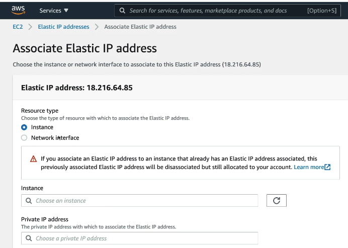
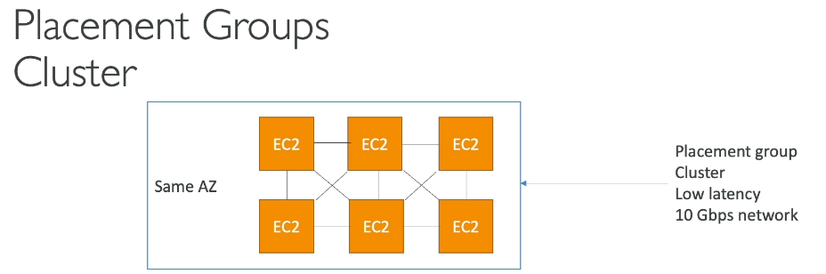
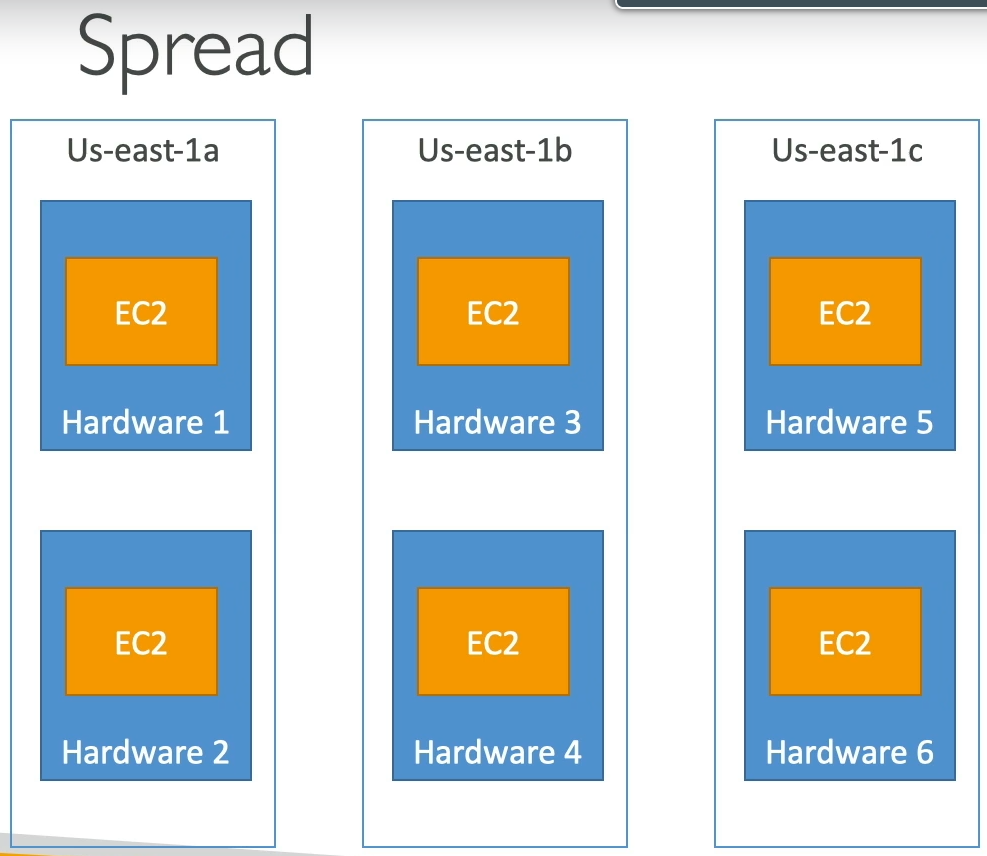
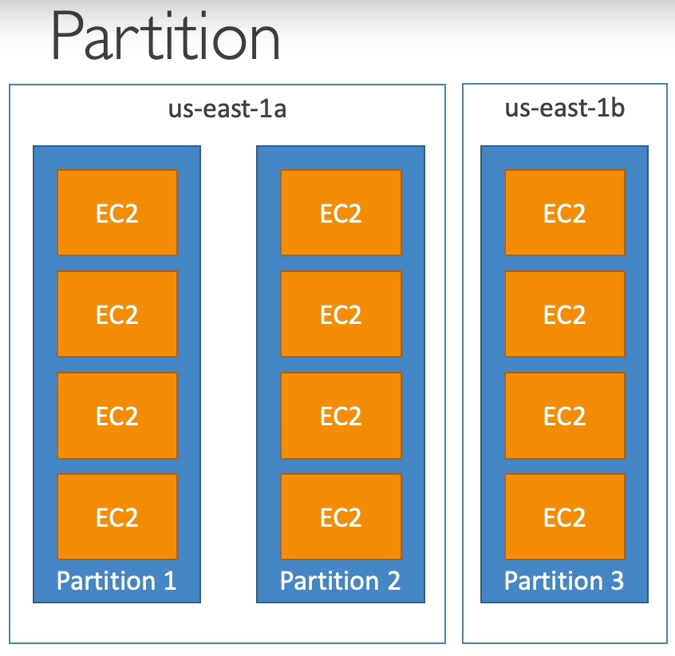
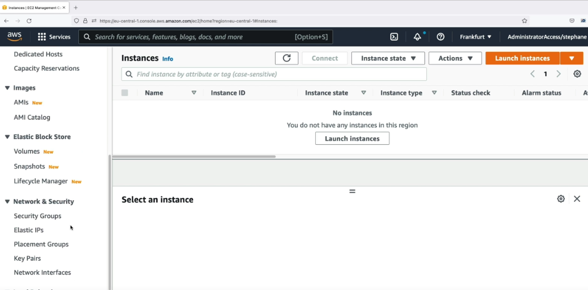
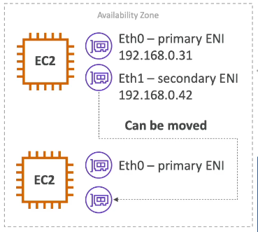
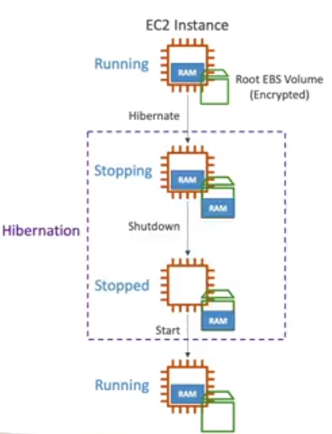

# Section 5: EC2 Solutions Architect Associate Level

### Private vs Public Ip (IPv4)
- IPv4 the most common format used online (3.7billon addresses)
- IPv6 is newer and solves problems for IoT

- Public IP: The machine can be identified on the internet
- Private IP: The machine can only be identified on a private networking

Machines connect to www using an internet gateway (a proxy)

**Elastic Ips:** mask the failure of an instance or software 
(remapping the ip to another instance), Only 5 elastic ips in your account. 
Try to avoid using Elastic IP, reflect poor architecture decisions.

  
   

To terminate an Elastic IP you must  first select the Elastic IP, then disassociate it and then release it.
 
### Placement Groups
Sometimes you want control over EC2 instances placement strategy, the strategy can be defined using placement groups.
When you create a placement group, you specify one  the following strategies for the group:
- **Cluster:** Packs instances close together inside an Availability Zone. This strategy enables workloads to achieve the low-latency network performance necessary for tightly-coupled node-to-node communication that is typical of high-performance computing (HPC) applications.
- **Spread:** Spread Placement Group places your EC2 instances on different physical hardware across different AZs..
- **Partition:** Spreads your instances across logical partitions such that groups of instances in one partition do not share the underlying hardware with groups of instances in different partitions. This strategy is typically used by large distributed and replicated workloads, such as Hadoop, Cassandra, and Kafka.

  
   

Cons: if the AZ fails, all instances fails at the same time.
Use case: Big Data needs to complete fast Applications that needs extremely low latency and high network throughput.

  
   

Pros: Availability zones reduce risk in simultaneous failure.
Cons: Limited to 7 instances per AZ.

Use case: Maximize high availability
Critical applications where each instance must  be isolated from failure from each other.

  
   

Up to 7 partitions per AZ
Multiples AZ in the same regional
Partition = Rack
A partition failure can affect many EC2 but won’t affect other partitions

Use cases: HDFS, HBase, Cassandra, Kafka

The placement group is created in the Network & Security option and then when creating the when the instance is created in Advance Details you assign the PG.

  
   

First create the placement group, and then in the creation of the EC2 associate it in advanced configuration.

**Elastic Network Interfaces (ENI)**
Logical component in a VPC that represents a virtual network card.

The ENI can have the following attributes:
- Primary  private IPV4
- One elastic IP (ipv4) per private IPv4
- One public IPv4
- One or more security groups
- A MAC address
      
You can create ENI independently and attach them on the fly on EC2 instances for failover.
Bound to a specific availability zone (AZ)
Note: 
You can create an ENI and associate it to an instance, and if you want to move it to another one in case the instance fails.

  
   

### EC2 Hibernate
- **Stop instance:** the data on disk (EBS)  is kept intact in the next start.
- **Terminate:** any EBS volumes (root) also setup-up to be destroyed is  lost
- **On start:**
    1. First start: The OS boots & the EC2 User Data script is run
    2. OS boots up
    3. Then your application starts, caches get warmed up
- **EC2 Hibernate:** The in-memory (RAM) state is preserved, the instance boot is much  faster (The OS is not stopped)
Instance RAM size must be less than 150GB
Not supported for bare metal instances

Availabe for: On-Demand, Reserved and Spot instances
An instance can Not be Hibernated more than 60  days
To enable EC2 Hibernate, the EC2 Instance Root Volume type must be an EBS volume and must be encrypted to ensure the protection of sensitive content.

  
   

