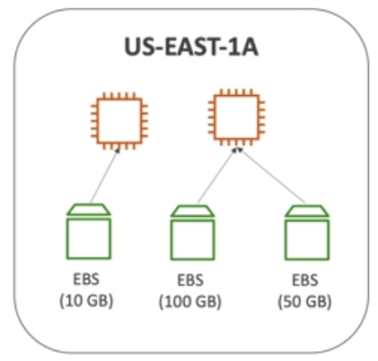
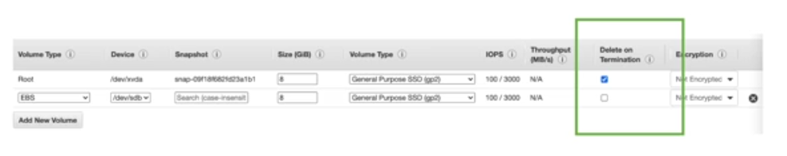
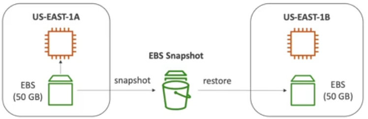

# Section 7: EC2  Instance Storage

What’s an EBS  Overview? Network USB  stick

An EBS (Elastic Block Store) Volume is a network drive you can attach  to your instances while they run
- They can only be mounted to one instance at a time  
- They are bound to a specific availability zone  
- Not a physical drive
- It can be detached from an EC2 instance and attached to  another one quickly
- To move a  volume  across availability zone, you first need to snapshot it

  
   

  
   

### EBS Snapshots
Make a backup (snapshot) of your EBS volume, not necessary to  detach volume but recommended.
Can copy snapshots across AZ or Region.

  
   

Features:
- EBS Snapshot Archive (75% cheaper, takes within 24 to 72 hours for restoring the archive)
- You can recover them after an accidental deletion with Recycle Bin senting  retention rules.
- Fast snapshot restore (FSR) ($$$)