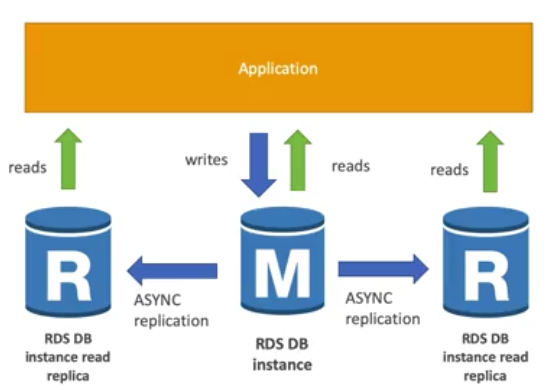
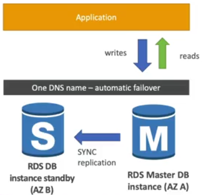
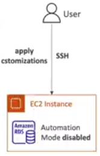
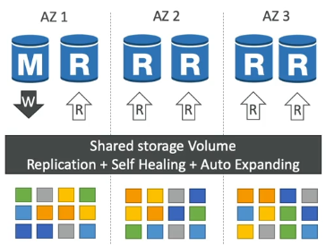
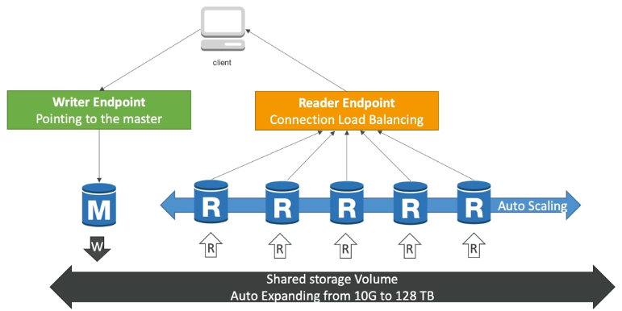
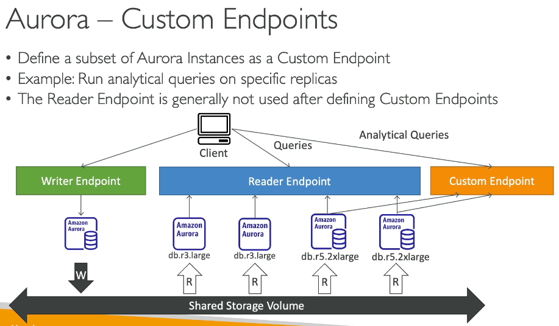
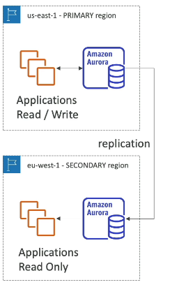
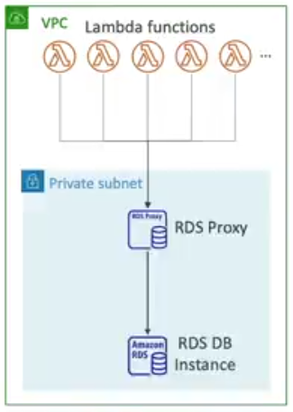

# Section 9: AWS Fundamentals: RDS + Aurora + ElasticCache

**Amazon RDS Overview**
- It’s a managed DB service managed by AWS (use SQL)
Postgresql
MySQL
MariaDB
Oracle
Microsoft SQL Server
IBM DB2
Aurora (AWS Propietary database)

- You can’t SSH into your instances
- When RDS detects you are running out  of free database storage, it scales automatically.
- You have to set Maximum Storage Threshold (maximum limit for DB storage)
- Useful for applications with unpredictable workloads

  
   

Up to 15 Read Replicas
Within AZ, Cross AZ or Cross Region
Replication is ASYNC so reads are eventually consistent
Applications must update the connection string to leverage read replicas

**Uses cases**
- Reporting Application (Read replicas are used  for SELECT, not  INSERT, UPDATE, DELETE)
- Read Replicas will help as your analytics application can now perform queries against it, and these queries won't impact the main production RDS database.
- Creatte a Read Replica in a different   region and enable Multi-AZ on the Read Replica for  disaster  recovery in case of a  regional outage

**Network Cost**
- In AWS there’s a network cost when data goes from one AZ to another.
- For RDS Read Replicas within the same region, you don’t pay that fee

**RDS Multi AZ (Disaster Recovery)**
The  read replicas be setup as Multi AZ for Disaster Recovery (DR)

  
   

**RDS – From sigle-AZ to multi-AZ**
Zero downtime operation.
Just click on “modify” for the database and enable multi-AZ
Read Replicas  uses Asynchronous replication and Multi-AZ uses  synchronous replication

**RDS Custom (Oracle and Microsoft SQL Server only)**
Access  to the underlying database and OS so you can:
- Configure settings
- Install patches
- Enable native features
- SSH access

  
   

**Amazon Aurora**
- Propietary technoloy from AWS (not open source)
- Postgresql and mysql are both supported as Aurora Db
- 5x performance improvement over MySQL on RDS
- 3x performance improvement over PostgreSQL on RDS
- Storage automatically grows in increments  of 10Gb, up to 128TB
- 15 replicas
- Failover in Aurora is instantaneos. It’s HA native.
- Aurora costs more than  RDS   (20% more),  but is more efficient.

**Aurora High Availability and Read Scaling**
- 6 copies of your data across 3 AZ
- Automated  failover for master in less than 30 seconds
- Master + up to 15 aurora  read  replicas serve reads
- Support for Cross Region Replication

  
   

**Aurora DB Cluster**

  
   

**Features of Aurora**
- Automatic fail-over
- Backup and Recovery 
- Isolation and Security
- Industry compliance
- Push-button scaling
- Automated patching with Zero Downtime
- Advanced Monitoring
- Routine Maintenance
- Backtrack: restore data at any point of time without using backups

**Aurora – Custom Endpoints**

  
   

**Aurora Serverless**
- Automated database instantiation and auto-scaling based on actual usage
- Good for infrequent, intermittent or unpredictable workloads
- Pay per second,  can  be more cost-effective

**Global Aurora**
- Aurora Cross Region Read Replicas
	Useful for disaster recovery
- Aurora Global Database (recommended)
	1 Primary Region (read/write)
	Up to 5 secondary (read-only) regions, replication lag is less than 1 second
    Up to 16 Read Replicas per secondary region
	Typical cross-region replication takes less than 1 second

  
   

**Aurora Machine Learning**
Enables you to add ML-based predictions to your applications via SQL
Amazon SageMaker and Amazon Comprehend (for sentiment analysis)
Uses cases: fraud detection, ads targeting, sentiment analysis, product recommendations

**RDS Backups**
- Automated backups
	Daily full backup of the databases
	Transaction logs are backed-up by RDS every 5 minutes
	Ability to restore to any point in time (from oldest backup to 5 minutes ago)
	1 to 35 days of retention, set 0 to disable backups
- Manual DB Snapshots
	Triggered by the user
	Retention of backup for a long as you want

**Aurora Backups**
- Automated backups
	1 to 35 days (cannot be disabled)
	point-in-time recovery in that timeframe
- Manual DB Snapshots
	Triggered by the user
	Retention of backup for a long as you want

**RDS & Aurora Restore options**
Backup or snapshot creates a new databases

**Restoring MySQL RDS (or MySQL Aurora) database from S3**
	Create a backup on your on-premises databases (for MySQL Aurora using Percona XtraBackup)
	Store it on Amazon S3
	Restore the backup file onto a new RDS instance running MySQL

**Aurora Database Cloning**
Create a new Aurora DB Cluster from an existing one
Uses copy-on-write protocol
	The new DB cluster uses the same data volume as the original DB cluster.
	When updates are made to the new  DB cluster data, then additional storage is allocated and data is copied  to be separated
Very  fast  and cost-effective

**RDS & Aurora Security**
At-rest encryption
Database master & replicas encryption using AWS KMS (must be defined  as lunch time)
if master is not encrypted, the read replicas cannot be encrypted
To encryp an un-encrypted database, go through a DB snapshot & restore as encrypted

**In-fligh encryption**
Use the AWS TLS root certificates client-side

**IAM Authentication**
IAM roles to connect to your database (instead of username/pw)

**Security Groups:** control network access to your RDS/Aurora DB

**No SSH**  available except on RDS Custom

**RDS Proxy**
Allows apps to pool and share DB Connections established with the database
RDS Proxy is never publicly accesible (must be accessed from VPC).

  
   

**Elastic Cache**
Managed Redis or Memcached
Cache are in-memory databases with really high performance, low latency

Storing Session Data in ElastiCache is a common pattern to ensuring different EC2 instances can retrieve your user's state if needed.
