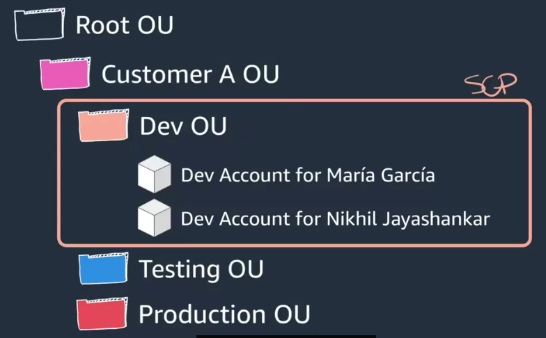
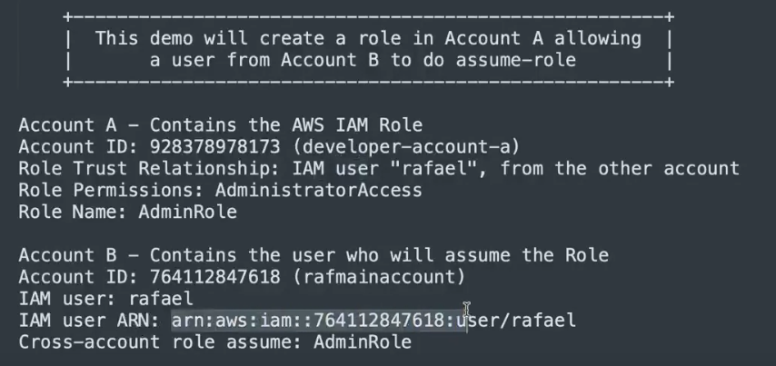
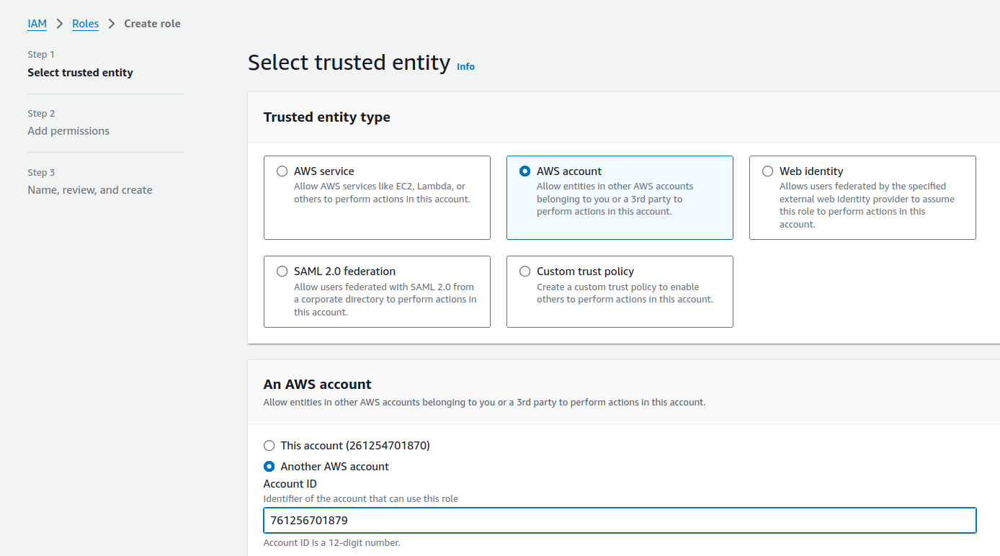
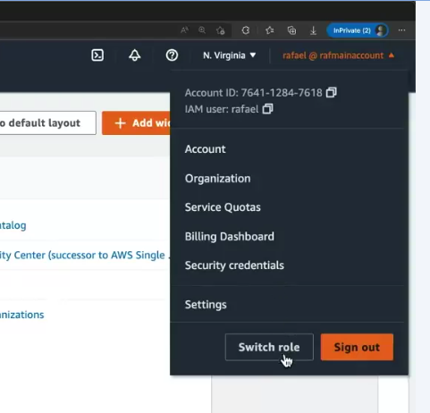
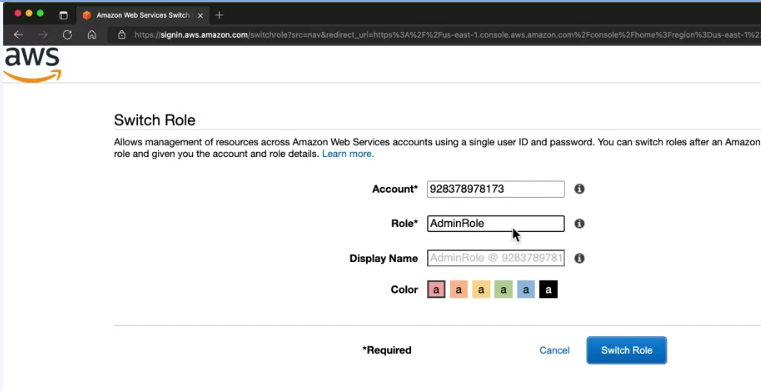

# A Fast Growing Start-up Company

## Requirements: 

- Design a plan for how to manage multiple AWS accounts.
- Create an account that users will use to authenticate to other accounts.
- Configure single sign-on and centralized credentials.
- Enforce configuration rules across AWS accounts
- Centralized logging on a dedicated account

Each business need is unique and there is no definitive formula to choose how resources should be grouped together. 

### Recomendations:
To group workloads based on business purpose and ownership. For example:
    
Customer A can have its own organizational unit (OU). Within that OU, customer A can have three other OUs.
    - One for Dev, another for testing,
    -  and another OU for production. 

In the Dev organizational unit, developers can have dedicated AWS accounts for themselves with a cloud IDE configured.
With the help of mechanisms, such as SCP or Service Control Policies in AWS organizations, you can prevent developers
from spinning up resources that are not authorized, like large instance types on Dev environments.
All that while still having billing controls  individually per account. 

  
   
  <i>Source: Architecting Solutions on AWS - <a>https://www.coursera.org/learn/architecting-solutions-on-aws</a></i>

Splitting all that into separate AWS accounts facilitates governance and access, making it easier for example, to limit the access to the product account
to only members from the Cloud Center of Excellence or the most experienced people in the company.

Also, billing in AWS is naturally charged per account, so having multiple accounts facilitates billing a lot, making it easier to identify potential billing bottlenecks. 

From the moment you start having multiple AWS accounts, you got to have two things in place:
    - automation and 
    - centralized credentialing. 

Benefits of multiple accounts:
1. Group workloads based on business purpose or ownership.
2. Centralize logging.
3. Constrain access to sensitive data.
4. Limit blast radius from adverse events.
5. Manage costs better
6. Distribute AWS service quotas  and API request rate limits across accounts.

### IAM Roles - The AWS Authentication Core Mechanism

  
   
  <i>Source: Architecting Solutions on AWS - <a>https://www.coursera.org/learn/architecting-solutions-on-aws</a></i>

  
   
  <i>Source: Architecting Solutions on AWS - <a>https://www.coursera.org/learn/architecting-solutions-on-aws</a></i>

Then assign permissions and the user of the other account.

To assume the role,  I can refer to the top right corner of the AWS Management Console and choose the option switch role.
Then I choose switch role again and I can specify what is the account that has the role and the role name. 

  
   
  <i>Source: Architecting Solutions on AWS - <a>https://www.coursera.org/learn/architecting-solutions-on-aws</a></i>

  
   
  <i>Source: Architecting Solutions on AWS - <a>https://www.coursera.org/learn/architecting-solutions-on-aws</a></i>

### IAM Roles, Trust Relationships, and Permissions

#### IAM Roles
An IAM role is an identity that you can create in your account, and it has specific permissions. An IAM role has some similarities to an IAM user. Roles and users are both AWS identities with permissions policies that determine what the identity can or can’t do in AWS. However, instead of being uniquely associated with one person, a role can be assumed by anyone who needs it.

#### AWS service role
An AWS service role is a role that a service assumes to perform actions in your account on your behalf. When you set up some AWS service environments, you must define a role for the service to assume. 

#### AWS service-linked role
An AWS service-linked role is a unique type of service role that’s linked directly to an AWS service. Service-linked roles are predefined by the service, and they include all permissions that the service needs to call other AWS services on your behalf. 

#### Delegation
Delegation is the granting of permissions to someone to allow access to resources that you control. Delegation involves setting up a trust between two accounts. The first account is the account that owns the resource (the trusting account). The second account is the account that contains the users that need to access the resource (the trusted account).

#### Federation
Federation is the creation of a trust relationship between an external IdP and AWS. Users can sign in to a web identity provider, such as Login with Amazon, Facebook, Google, or any IdP that is compatible with OIDC. Users can also sign in to an enterprise identity system that’s compatible with SAML 2.0, such as Microsoft Active Directory Federation Services. When you use OIDC and SAML 2.0 to configure a trust relationship between these external IdPs and AWS, the user is assigned to an IAM role. The user also receives temporary credentials that allow the user to access your AWS resources.

#### Federated user
Instead of creating an IAM user, you can use existing identities from AWS Directory Service, your enterprise user directory, or a web identity provider. These identities are known as federated users. AWS assigns a role to a federated user when access is requested through an identity provider.