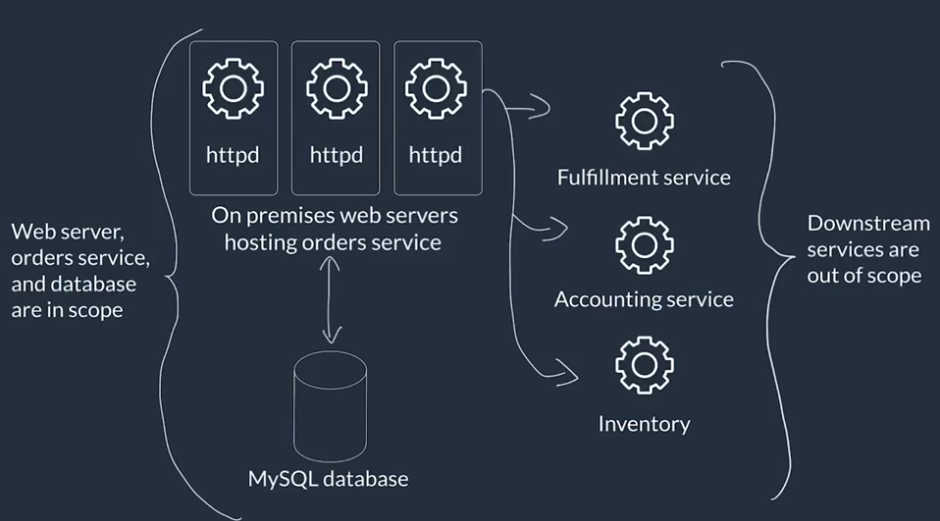

# Any Company Ecommerce - Sell cleaning products

## Requirements: 

- Have managed scaling (serverless services)
- Decouple solutions components to maximize resilience (single points of failure)
- Have centralized monitoring and logging
- Optimize for cost, performance efficiency and operational overhead

On-premises solutions right now:

  
   
  <i>Source: Architecting Solutions on AWS - <a>https://www.coursera.org/learn/architecting-solutions-on-aws</a></i>

# Architecting the Solution

## Selecting a serverless compute service
https://aws.amazon.com/products/compute

https://aws.amazon.com/products/databases