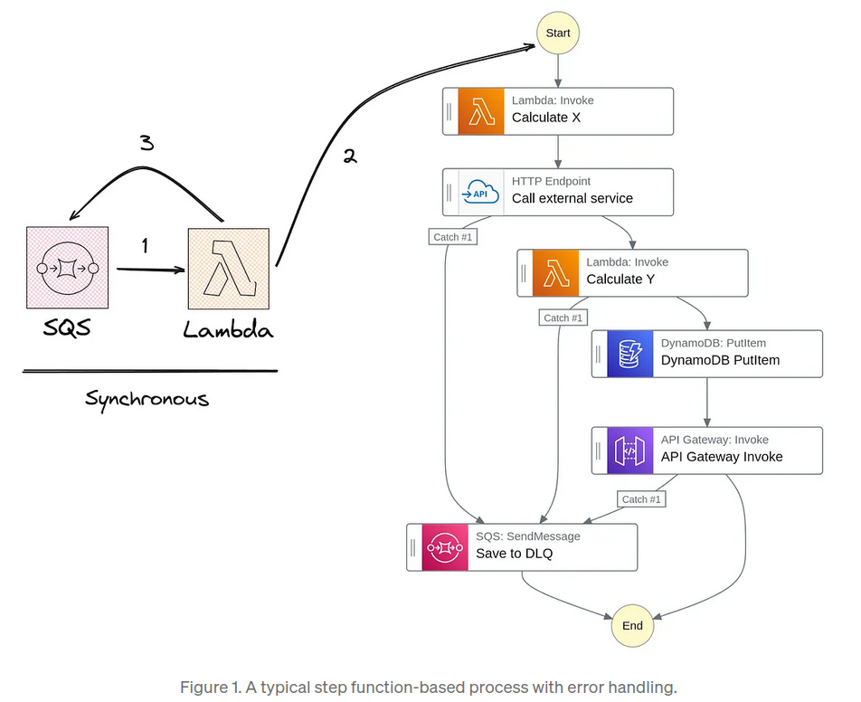
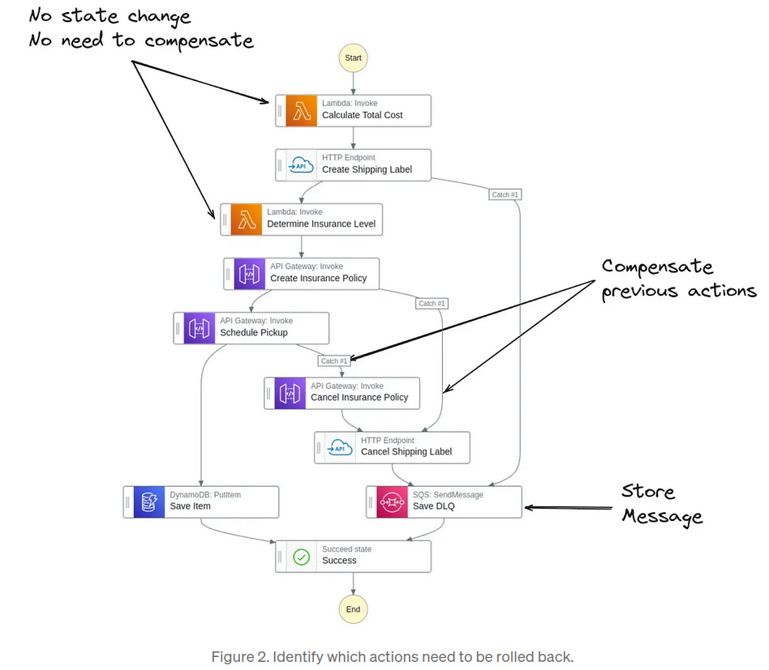
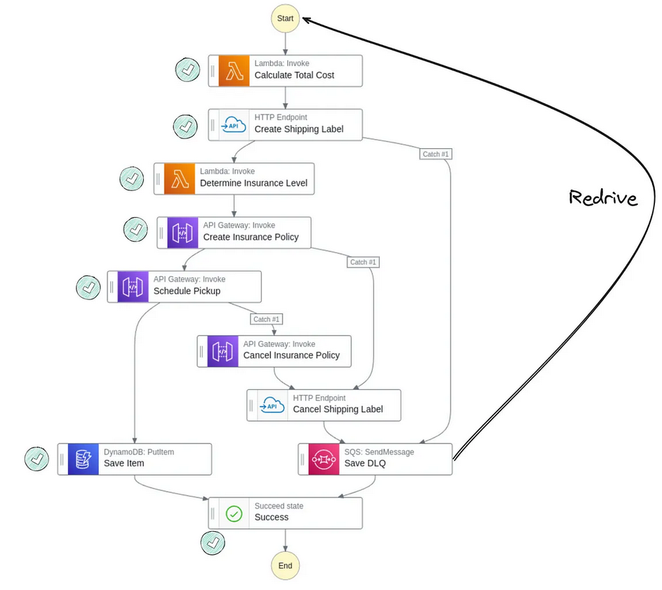
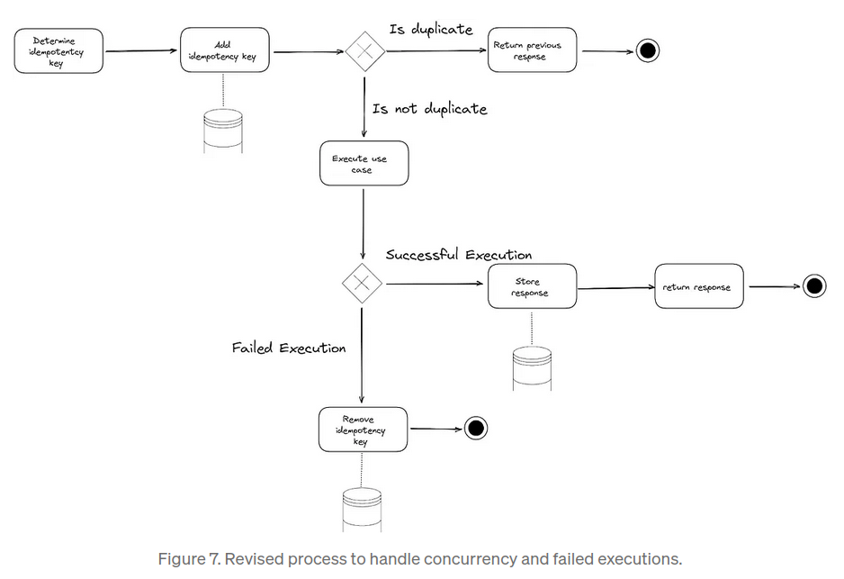
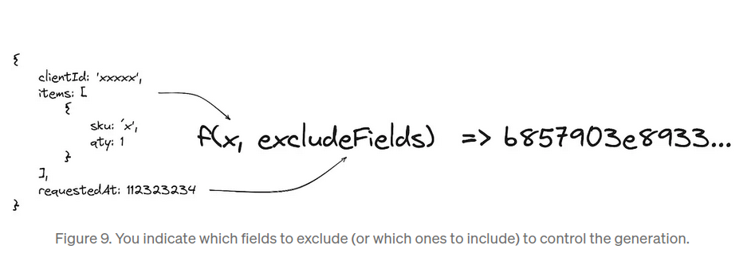
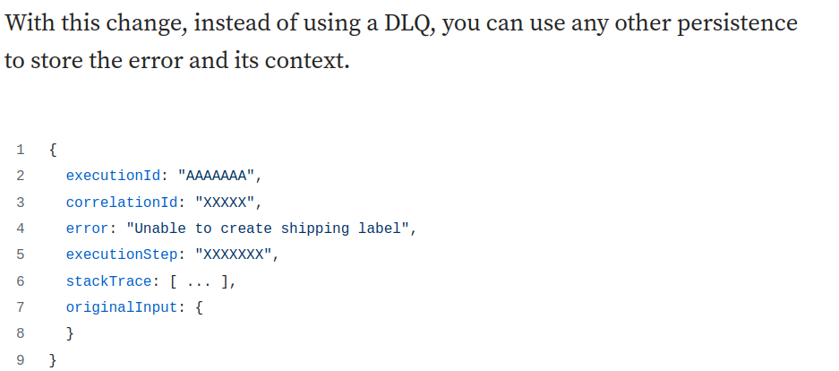

# Exploring Advanced Error Handling Patterns with Event-Driven Architecture

  
   
  <i>Source: Medium - <a>https://medium.com/ssense-tech/exploring-advanced-error-handling-patterns-with-event-driven-architecture-part-ii-235bb72cfa19</a></i>

## Rollback
One of the issues with a workflow is that if something fails midway, you are likely to end up in an inconsistent state. From a business capability perspective, we would like it to be binary: either it worked and gave us what we were looking for, or it failed and nothing changed.

  
   
  <i>Source: Medium - <a>https://medium.com/ssense-tech/exploring-advanced-error-handling-patterns-with-event-driven-architecture-part-ii-235bb72cfa19</a></i>

In this scenario, since the state of the system is the same as before, it becomes easier to redrive the message, if after inspection, you have addressed whatever was preventing it from succeeding.

  
   
  <i>Source: Medium - <a>https://medium.com/ssense-tech/exploring-advanced-error-handling-patterns-with-event-driven-architecture-part-ii-235bb72cfa19</a></i>

Unfortunately, there are cases where a certain step can’t be undone, or the cost of doing so is not worth it.

## Idempotency
The simplest way to achieve idempotency seems to be to somehow identify the uniqueness of a request and keep track if you have already successfully executed it.

  
   
  <i>Source: Medium - <a>https://medium.com/@mbneto/achieving-idempotency-there-are-more-ways-than-you-think-12c832f76841</a></i>

### Determining the Duplicate Request
We have to use some sort of identifier that provides the uniqueness check we are looking for. If we have such an identifier we can use it as the primary key in our persistence and have both concurrency and duplicate detection.

A generic approach is to use a hash function on the payload, in which the output value is expected to be unique. There is the chance of collision but it in most modern hash functions it is rare enough to be considered safe for use.

  
   
  <i>Source: Medium - <a>https://medium.com/@mbneto/achieving-idempotency-there-are-more-ways-than-you-think-12c832f76841</a></i>

Returning to the step function, if a given step can be made idempotent, redriving the message or restarting the execution would not generate duplicates for steps that have already been successfully completed.

Ultimately, we want to have all relevant information about the failure as easily accessible as possible. So instead of having to search for information on the DLQ, locate the error logs, and then redrive the message (or not) separately, why not aggregate all of this?

  
   
  <i>Source: Medium - <a>https://medium.com/ssense-tech/exploring-advanced-error-handling-patterns-with-event-driven-architecture-part-ii-235bb72cfa19</a></i>

In this example, we have the execution ID of the workflow, the error message, the stack trace (if available), and the correlation ID.

You can then have a specific application to review in a FIFO-like manner to access the errors.

We can enhance it to make sure the information is connected to any specific runbooks we have, based on the error/step where it failed, and even trigger specific actions accordingly.

Ultimately, this could lead you to determine if you need to redrive the original message, or a modified version, to the workflow.

If you decide to use a DLQ, consider enriching the information beyond the original input. Your support team will thank you for it every time an error occurs!