# Data-Driven Organizations

"Through 2026, organizations will accelerate their investments in data
and analytics services by 45 percent to become more data driven and digital"
Gartner, March 2022

**How do you decide...**
- Which restaurant near me serves the best Thai food?
- Where can I find a used child's bicycle?
- Which starters should I pick for my fantasy football team?
- Which type of job should I pursue?
- What should I pay for this home?

**How do organizations decide...**
- Which of these customer transactions should be flagged as fraud?
- Which webpage design leads to the most completed sales?
- Which patients are most likely to have a relapse?
- Which type of online activity represents a security issue?
- When is the optimum time to harvest this year's crop?

## Fueling decisions with data science
The data science behind data-driven decisions falls into two main categories:

| Data analytics | AI/ML |
|---|---|
| Data analytics is a broad term that describes is the systematics analysis of large datasets (big data) to find patterns and trends to produce actionable insights. | Is a set of mathematical models that are used to make predictions from data at a scale that is difficult or impossible for humans. |
| Uses programing logic to answer questions from data | Uses examples from large amounts of data to learn about the data and answer questions. |
| Is good for structured data with a limited number of variables | Is good for unstructured data and where the variables are complex |

Examples:

  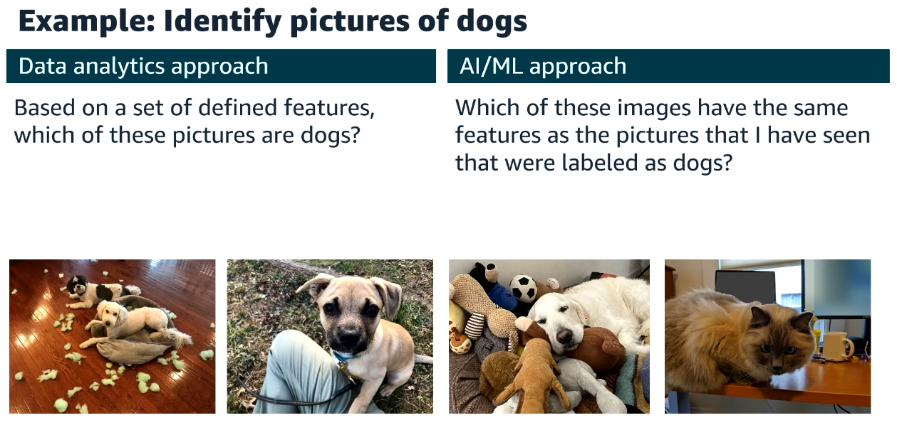
   
  <i>Source: https://www.awsacademy.com/</i>

  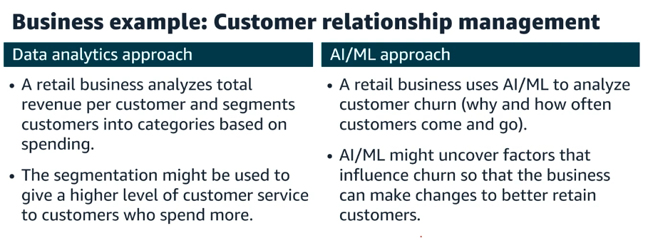
   
  <i>Source: https://www.awsacademy.com/</i>

**More valuable insights are more difficult to derive**

  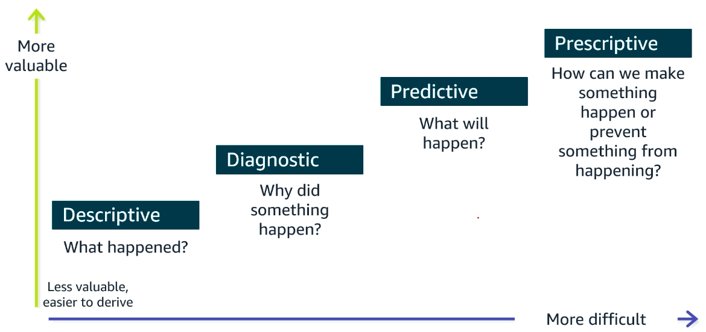
   
  <i>Source: https://www.awsacademy.com/</i>

### More data science in daily life
- You are shopping for shoes online and start to see a lot of shoe-related advertisements.
- You watch a movie or listen to a song on a streaming platform and begin to get recommendations for movies or music you might also like.
- You order pizza online and are kept up to date about each step in the preparation and delivery process.
- You use your credit card outside of your usual geographic area and get additional fraud alerts from your bank.
- Your navigation app on your phone alerts you to a traffic jam.

  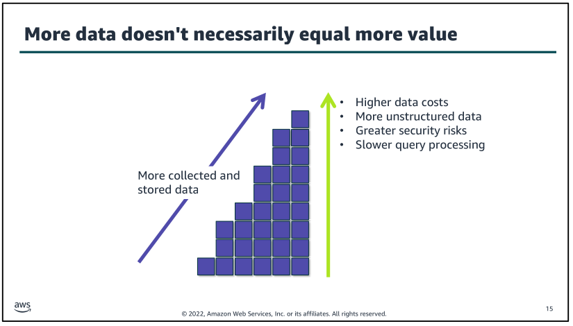
   
  <i>Source: https://www.awsacademy.com/</i>

### Data becomes less valuable for decision-making over time

  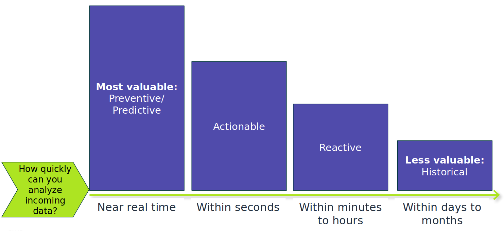
   
  <i>Source: https://www.awsacademy.com/</i>

  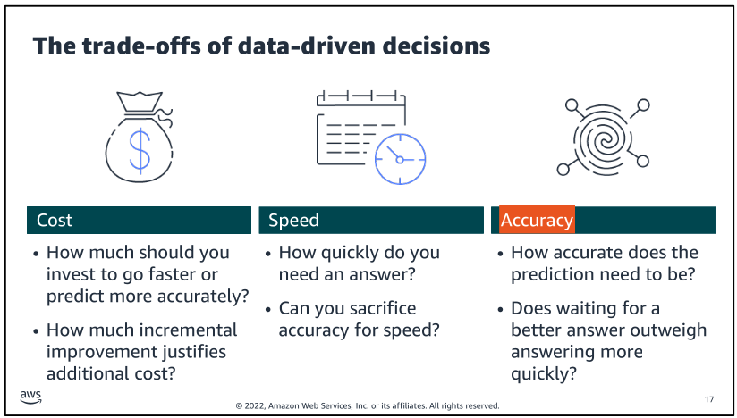
   
  <i>Source: https://www.awsacademy.com/</i>

# The data pipeline – infrastructure for data-driven decisions
A data pipeline in its simplest terms

  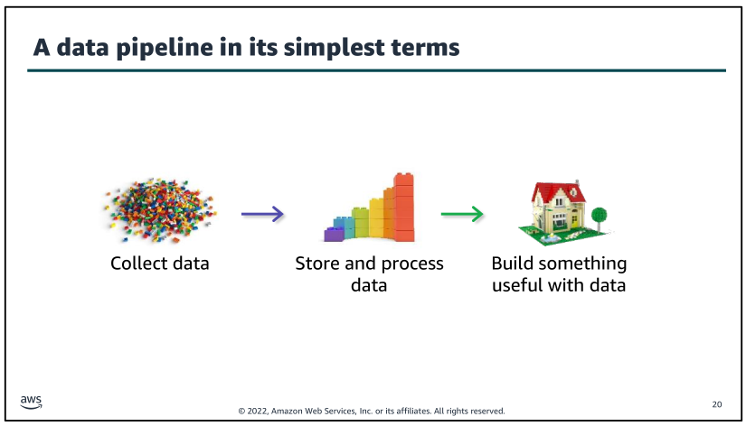
   
  <i>Source: https://www.awsacademy.com/</i>

## Work backwards to design your infrastructure
The key to designing an effective decision-making infrastructure is to start with the business problem to be solved or decision to be made. Then, build the pipeline that best suits that use case.

  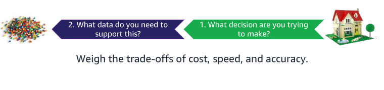
   
  <i>Source: https://www.awsacademy.com/</i>

## Layers of the pipeline infrastructure
To build an appropriate infrastructure, you will need to
understand the nature of the data and the intended type of processing and analysis to be performed.

  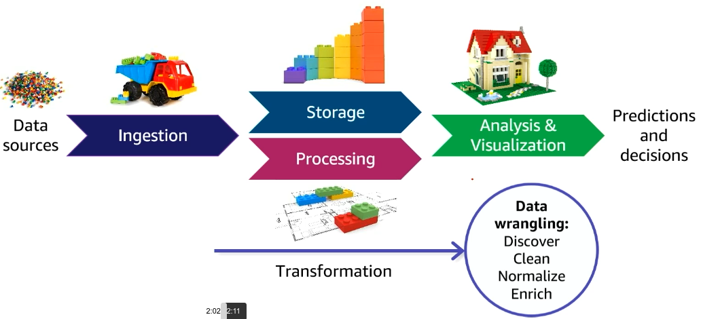
   
  <i>Source: https://www.awsacademy.com/</i>

## Iterative processing through the pipeline

Data will almost always be transformed as it moves through the pipeline. This might include modifying the format to support a specific analysis tool or replacing values (for example, zeroes in place of nulls). 

You might also augment the dataset by filling in gaps or enriching it with additional information. For example, you might calculate and
save additional data values to be used during analysis. 

You might also add metadata to categorize and catalog data. Data wrangling is a term that is used to describe the ways in which data is manipulated and transformed from its raw state into more meaningful states that downstream processes or users can use.

  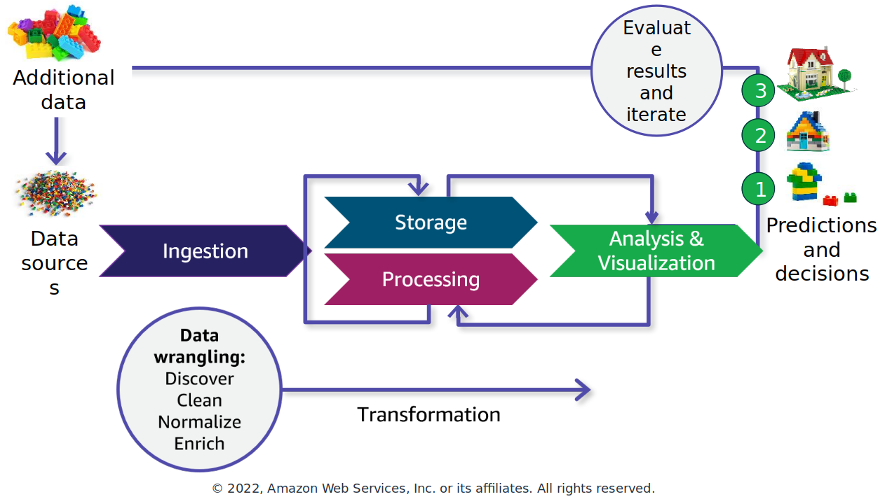
   
  <i>Source: https://www.awsacademy.com/</i>

Another key characteristic of deriving insights by using your data pipeline is that the process will almost always be iterative.

You might iterate within a pipeline segment, or you
might iterate across the entire pipeline. For example, in this illustration, the initial iteration (number 1) yielded a result that wasn't as defined as was desired. Therefore, the data scientist refined the model and reprocessed the data to get a better result
(number 2). After reviewing those results, they determined that additional data could improve the detail available in their result, so an additional data source was tapped and ingested through the pipeline to produce the desired result (number 3).

# The role of the data engineer in data-driven organizations

**Common data pipeline questions**

  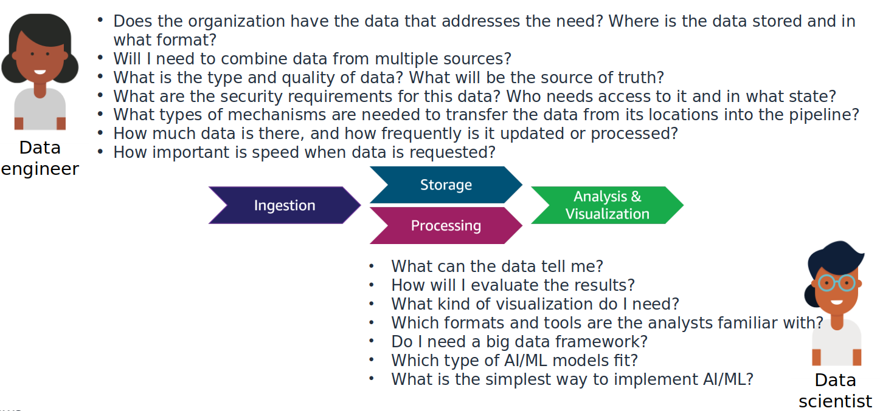
   
  <i>Source: https://www.awsacademy.com/</i>

To build the correct pipeline, the person responsible for building the pipeline needs to ask a lot of questions about the nature of the data and the intent for its processing.

Data scientists and data engineers both work with the data pipeline, and depending on your organization some tasks might be performed by either role. 

But generally speaking, the data engineer is focused on the infrastructure the data passes through and the data scientist is focused on analyzing the data in the pipeline. Both roles need to ask questions about how they data meets their needs, and iterate on their answers and design as they learn more.

## Modern data strategies

  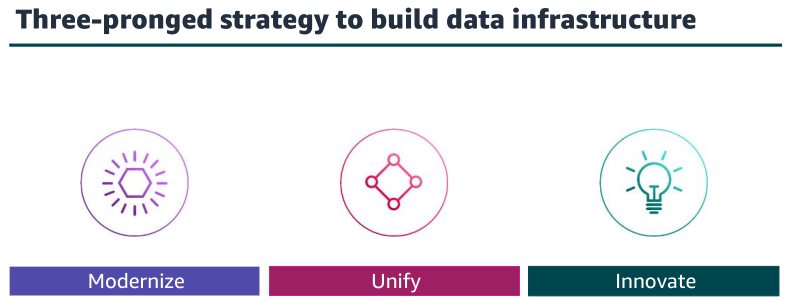
   
  <i>Source: https://www.awsacademy.com/</i>

- **Modernize - Increase agility and reduce undifferentiated lifting**
  - Move from on premises to cloud-based services.
    - By migrating applications and databases to the cloud, an organization can reduce its focus on administrative activities and instead focus development resources on business functionality.
    - An organization can choose the best set of tools and resources for each business problem. They can also experiment with new environment types or services without committing to resources long term.
  - Migrate to purpose-built tools and data stores.
    - Choose a data store that matches the data structure and scalability that are required for each use case.
  - Build loosely coupled pipelines.
    - use loosely coupled components so that you can use services that are designed for a targeted purpose and modify or scale them independently from each other. This greatly increases the flexibility of the infrastructure.

- **Unify - Create a single source of truth**
  - Break down data silos.
  - Democratize access.
  - Equip users with tools to visualize their own insights.
  - Use a data lake, and run queries directly on data.
  - Support simplified governance and movement between the data lake and purpose-built stores.

  Moving to this type of data structure often requires significant changes to the cultural aspects of who owns the data and the governance needed to maintain the single source of truth.

- **Innovate - Use AI and ML to discover new insights faster**
  - Move from reactive to proactive decision-making.
  - Incorporate AI/ML into decision-making, and tap into new insights in vast amounts of unstructured data.
  - Take advantage of cloud services with AI/ML features that democratize who can use ML.

  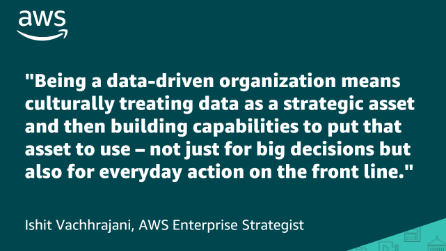
   
  <i>Source: https://www.awsacademy.com/</i>

 