# Elements of Data

  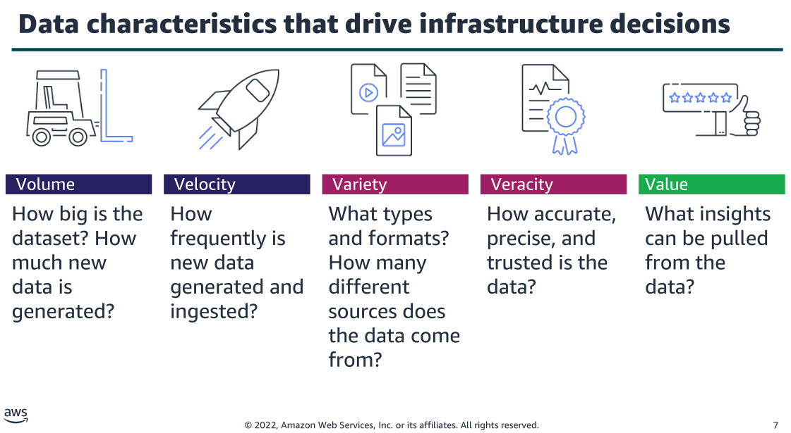
   
  <i>Source: https://www.awsacademy.com/</i>

 

## Volume and velocity

  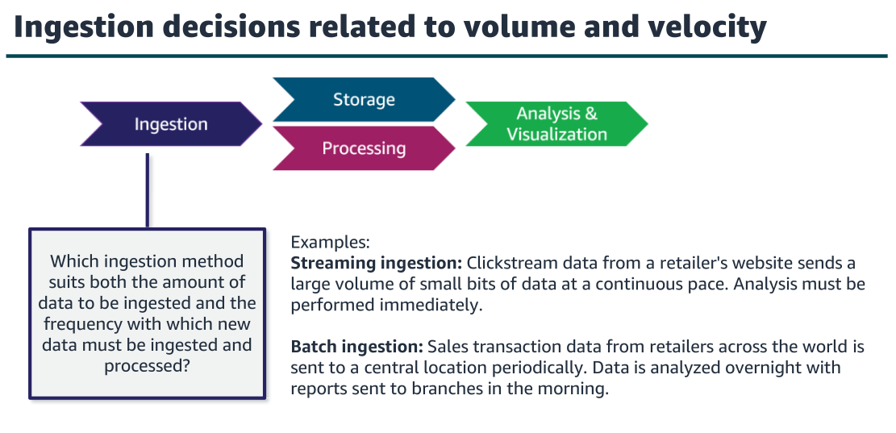
   
  <i>Source: https://www.awsacademy.com/</i>

 

Both of these examples include high volumes, but the velocity of their arrival and the
speed with which they must be processed impact your pipeline design.

  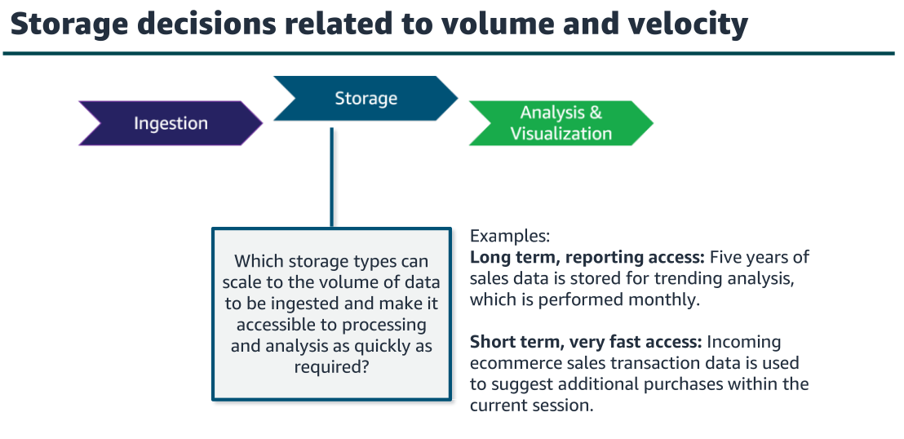
   
  <i>Source: https://www.awsacademy.com/</i>

 

You will also need to consider how the data will be
accessed. For example, will it reside in storage for periodic access over a long period
of time, or will it be stored only briefly before it loses value?

  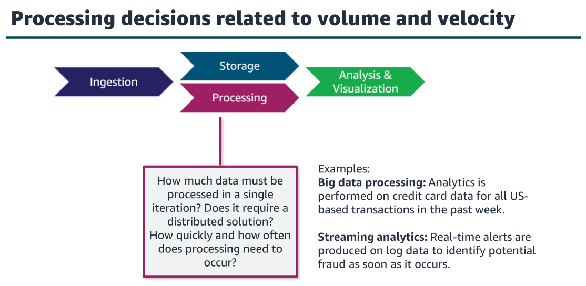
   
  <i>Source: https://www.awsacademy.com/</i>

 

The distinct needs for processing high volumes of data—that is, big data—have been
the driver behind big data frameworks (for example, Apache Hadoop and Spark).

These frameworks are designed to process really big chunks of data very quickly by
using a distributed system. The volume, frequency, and type of processing that you
need to do to find business insights might lead you to use a big data framework.

  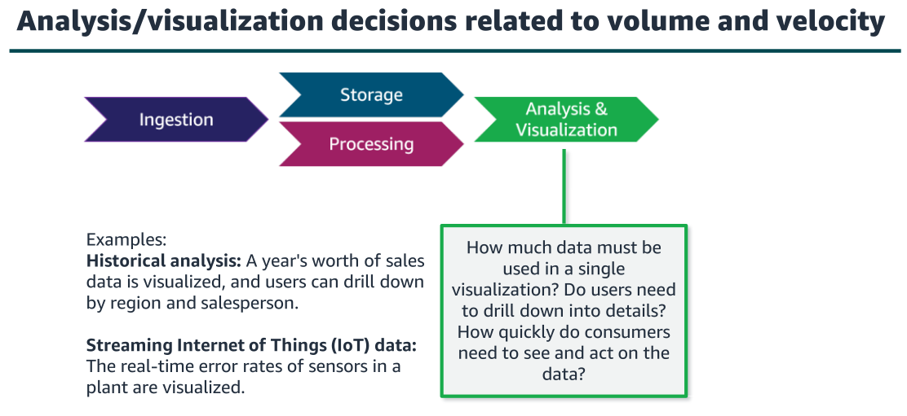
   
  <i>Source: https://www.awsacademy.com/</i>

 

## Variety – data types

  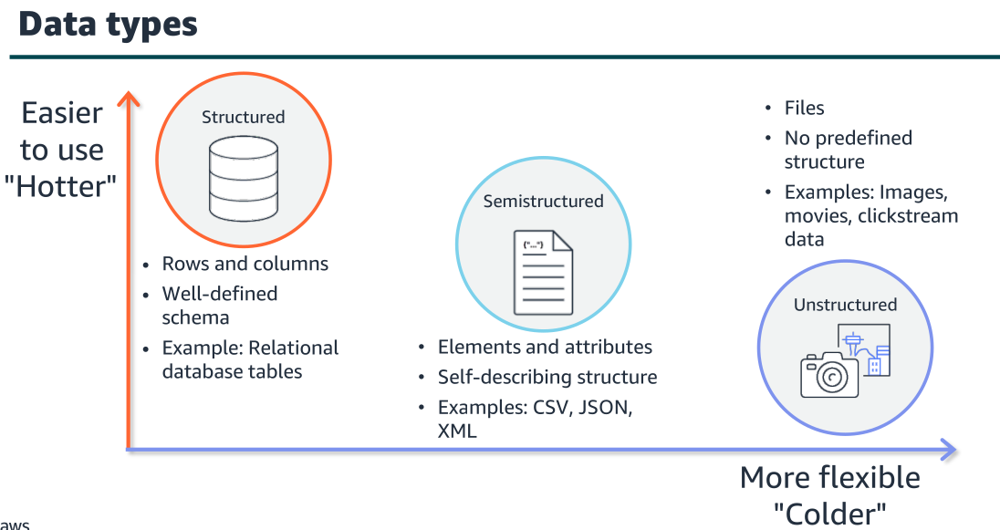
   
  <i>Source: https://www.awsacademy.com/</i>

 

  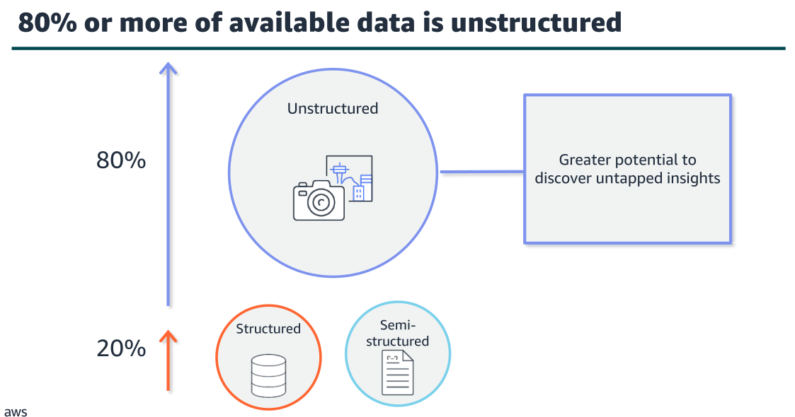
   
  <i>Source: https://www.awsacademy.com/</i>

 

The explosion of data that has been happening is unstructured, such as
clickstream data, social media posts, video and image files, and sensor data.

  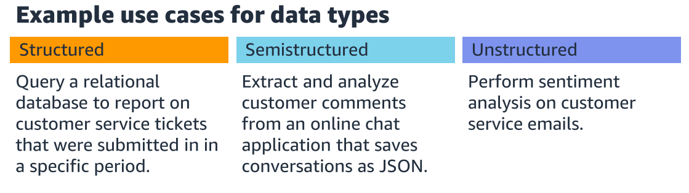
   
  <i>Source: https://www.awsacademy.com/</i>

 

## Variety – data sources

  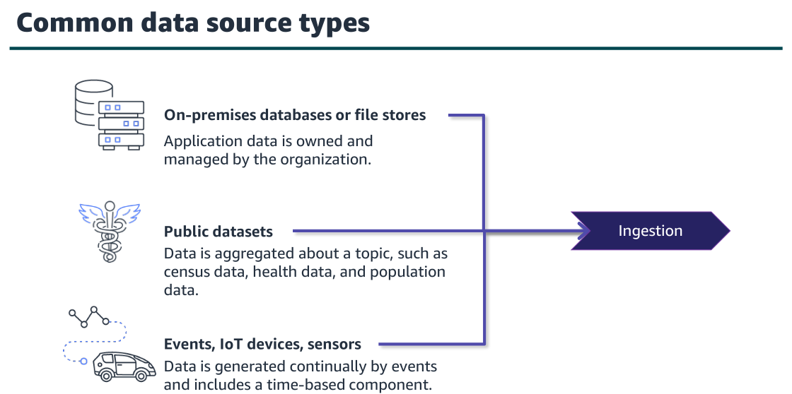
   
  <i>Source: https://www.awsacademy.com/</i>

 

Your pipeline might need to combine data from many different sources and pull them together as a new data source to be
analyzed.

  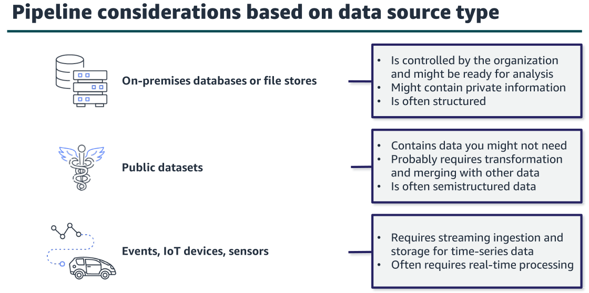
   
  <i>Source: https://www.awsacademy.com/</i>

 

  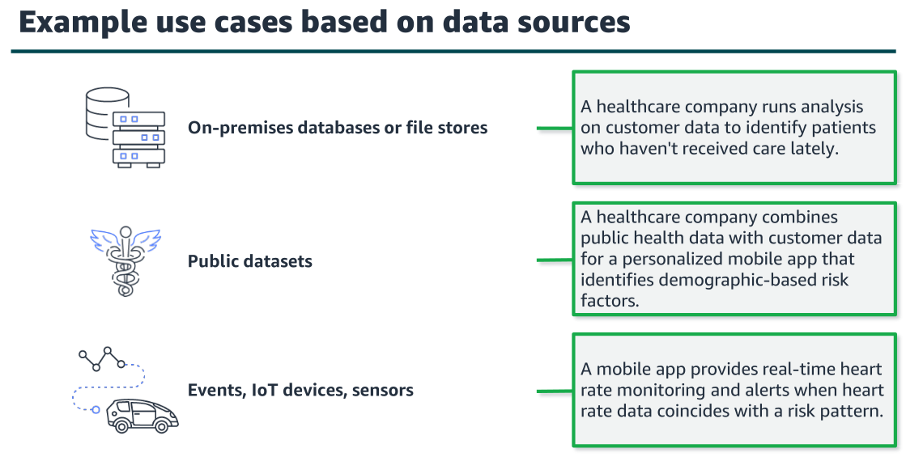
   
  <i>Source: https://www.awsacademy.com/</i>

 

**The challenges of variety**
- The way the data has been formatted and stored might impact your ability to analyze it.
- Ingestion and processing methods can become complex when you must combine different data types and sources.
- Data veracity can be more difficult to maintain when multiple data types and sources must be merged.

## Veracity and value

  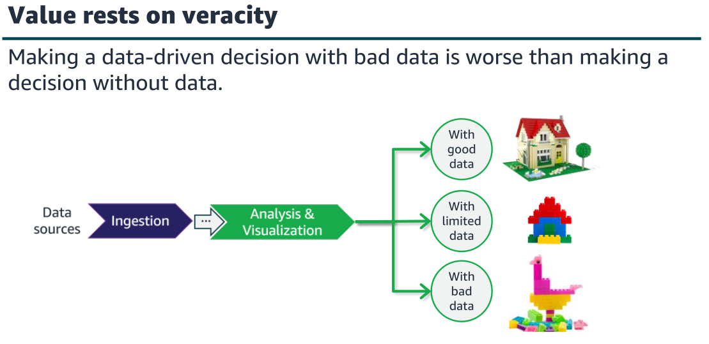
   
  <i>Source: https://www.awsacademy.com/</i>

 

  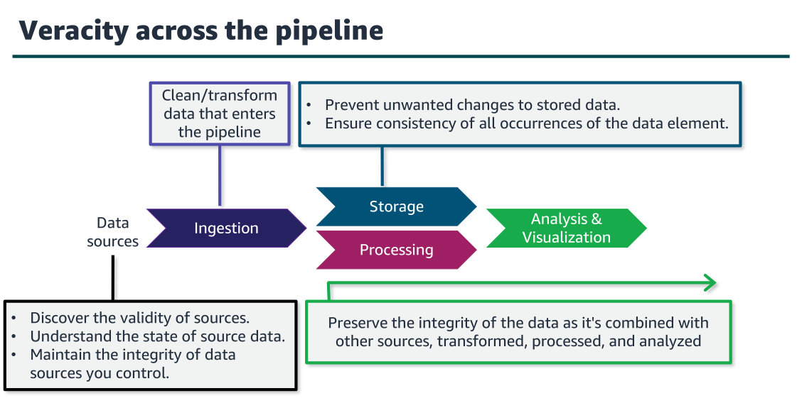
   
  <i>Source: https://www.awsacademy.com/</i>

 

- You might need to determine the integrity of the data source and adjust any areas
where that source might lack integrity. 
- Data changes over time. 
- As it is transferred from one process to another and through one system and another, there are
opportunities for the integrity of the data to be negatively impacted. 
- You must ensure that you maintain a high level of certainty that the data you are analyzing is
trustworthy.
- Understanding the full lifecycle of your data and knowing how to protect it effectively
will greatly strengthen the integrity of your data.

  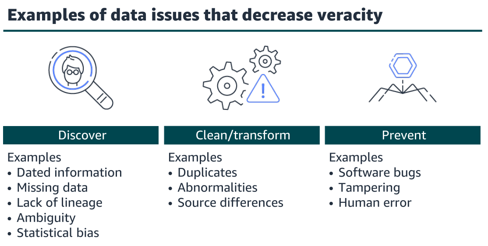
   
  <i>Source: https://www.awsacademy.com/</i>

 

## Activities to improve veracity and value

  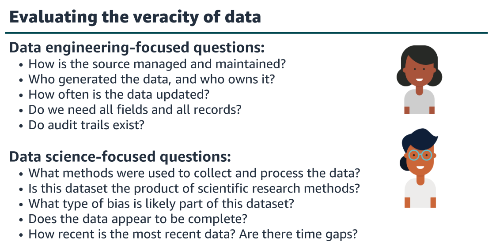
   
  <i>Source: https://www.awsacademy.com/</i>

 

- To evaluate the state of the data, you must ask the correct questions and dig into the
dataset. 

- You will want to wear your data engineer's hat to think about the mechanics
and technical requirements for the data and your data scientist's hat to really identify
whether the dataset will be valuable even in its cleanest form.

  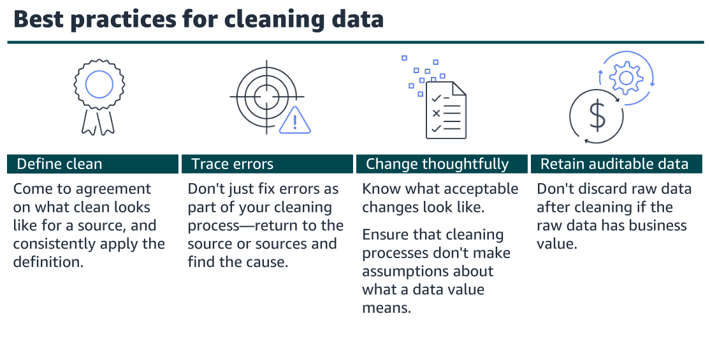
   
  <i>Source: https://www.awsacademy.com/</i>

 

- Some businesses deem clean data to be data in its raw format with limited business rules applied. 
- Others might consider data to be clean only after it has been normalized, been aggregated, and had value substitutions applied to regulate all entries. 
- These are two very different understandings of clean. Be sure to know which one you are aiming for.

- When you do need to change values in a field to use it, make sure that you understand the impact. For example, from a purely data-centric view, entering a zero in an empty column might seem like an easy data cleansing decision to make, but <null> might not mean zero in the source that you are using.

- In some systems, the original data is no longer valuable after it has been cleaned and
transformed. However, with highly regulated data or highly volatile data, it's
important to maintain both the original data and the transformed data in the
destination system.

  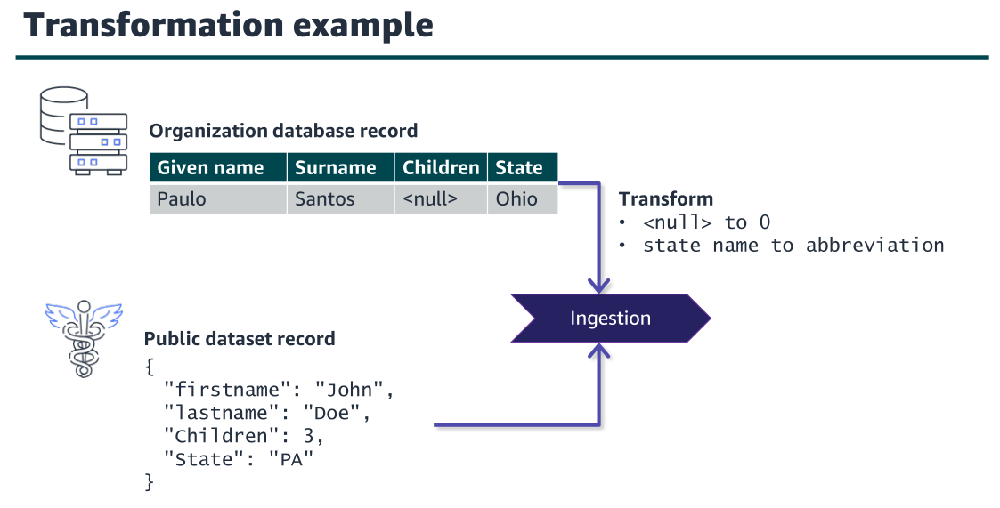
   
  <i>Source: https://www.awsacademy.com/</i>

 

- Transformations can be basic, such as the example pictured on this slide where you
need to convert field values to a common format. In this example, the database
record is transformed to replace the null value with a zero in the Children field and
replace the word Ohio with OH in the State field.

- Transformations can also be more advanced, such as applying business rules to the
data to calculate new values. Advanced transformations include filtering records,
complex join operations, aggregating rows, splitting columns, and data validation.

  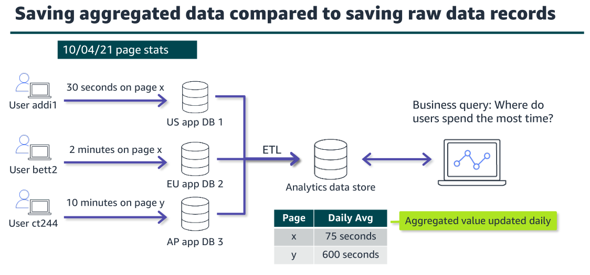
   
  <i>Source: https://www.awsacademy.com/</i>

 

- A common approach with applications that aggregate data is to make updates
directly to the aggregated value—for example, a count or average. Reporting and
business intelligence (BI) tools query the database and have access to the aggregated
value.

- In this example, the business is interested in learning where users spend most
of their time while on the website. 
- To support this, their extract, transform, and load
(ETL) process ingests page view stats daily and updates the daily average for each
page in their analytics database.

  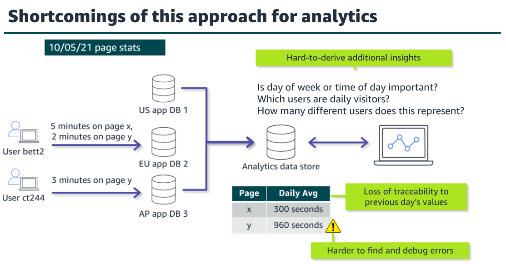
   
  <i>Source: https://www.awsacademy.com/</i>

 

- As the slide indicates, there are shortcomings to the approach of saving only the
aggregated values. 
- First, this approach is not flexible if the business decides that they
want to dig deeper or ask different questions. 
- Second, the analytics database doesn't have any traceability back to the previous day's value after the new day's data has
been incorporated into the average. 
- Finally, this approach makes it more difficult to find and debug errors. In this example, the total of 960 seconds for page y is
incorrect, but there isn't a way to easily figure out what is causing the error or to
audit it.

  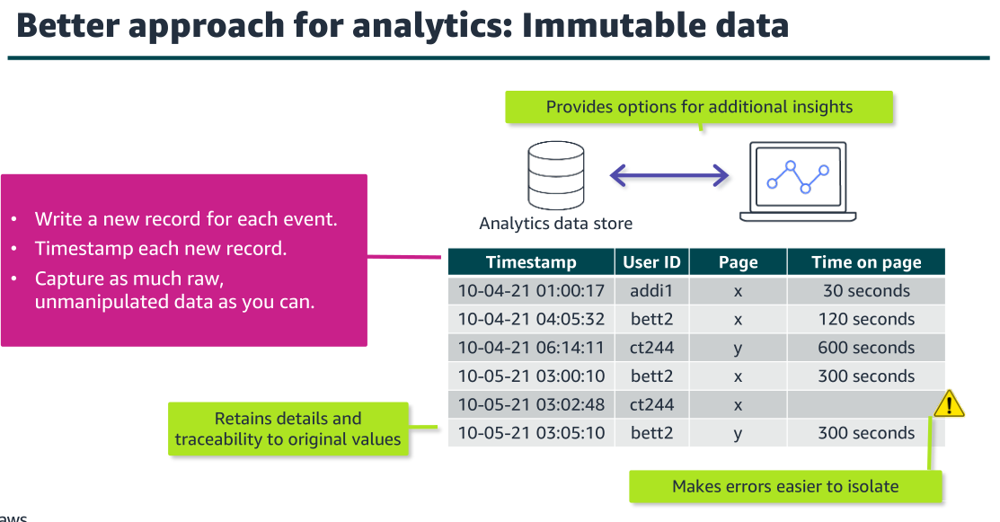
   
  <i>Source: https://www.awsacademy.com/</i>

 

- The ETL process writes a row in the analytics data store for each page view
and includes a time stamp. 
- This gives the business the opportunity to query the data
in different ways and retains the original values so that queries could be done for
different time periods. 
- This approach also provides traceability to the original values
and makes it easier to debug problems when errors occur.

**Maintaining data integrity and consistency**
- Secure all layers of the pipeline.
- Grant least privilege access.
- Apply best practices to maintain data integrity.
- Keep audit trails.
- Implement data compliance and governance processes including data classification and data cataloging.
- Maintain a single source of truth.
- Different types of data stores will have different methods to maintain data integrity,
and you need to implement the recommended best practices for each type.