# Design Principles and Patterns for Data Pipelines

## The evolution of data architectures

  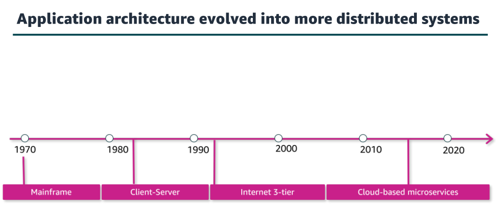
   
  <i>Source: https://www.awsacademy.com/</i>

  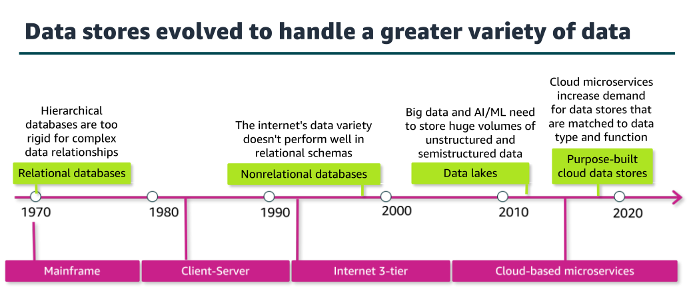
   
  <i>Source: https://www.awsacademy.com/</i>

Relational databases replaced hierarchical ones, which had limited abilities to define
relationships among data. Relational databases have been around since 1970 and continue to be the workhorse of many applications.

With the growth of big data and artificial intelligence and machine learning (AI/ML) applications, organizations realized that they wanted to collect as much data as possible for potential use, without the rigors of transforming it into a formal structure. Organizations wanted to simplify collection and querying of data in its most raw form. With a data lake, raw data could be loaded into the data store, where it could be held for a variety of use cases.

  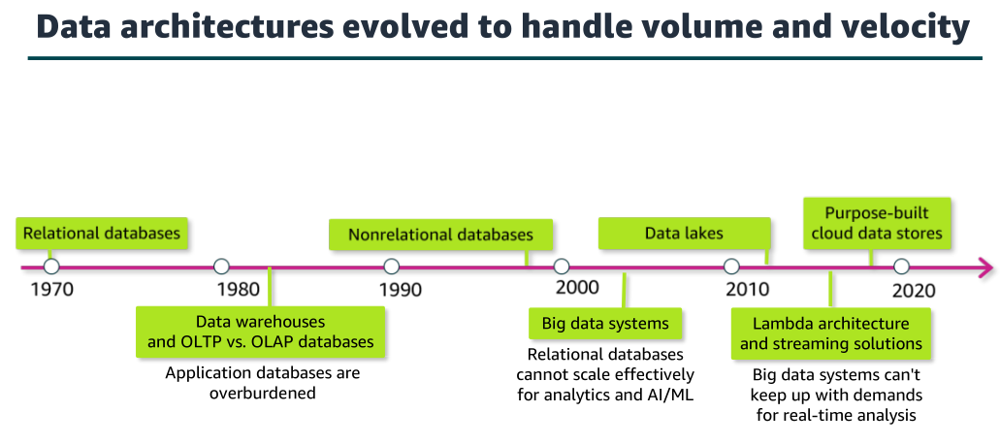
   
  <i>Source: https://www.awsacademy.com/</i>

- In the 1980s, data warehouses evolved as a way to separate operational reporting, which
requires read-heavy querying across a full dataset, from the application's transactional
database, which is focused on fast reads and writes in a much smaller set of records.

- Data warehouses are still relational databases, but they have been optimized for reporting and analytics. 

- Online analytical processing (OLAP) databases are optimized for reporting whereas
online transaction processing (OLTP) databases are designed for transactions, such as creating an order or making an ATM withdrawal. 

- The extract, transform, and load (ETL) process was introduced to extract data from OLTP databases, transform it, and then load it into the data
warehouse.

- The rise of the internet brought new data to be collected and analyzed. Even
with a data warehouse dedicated to analysis, keeping up with the volume and velocity of
incoming data created database bottlenecks.

- Administrators could scale vertically—that is,increase the size and speed of the database—but there wasn’t an easy way to scale horizontally—that is, to distribute the load across multiple databases.

- Big data frameworks were designed to distribute data across multiple nodes and handle any failures automatically. These frameworks also allowed the big data systems to handle many ETL transformations, which helped to increase the speed with which analysis could be done.

- Nathan Marz proposed the lambda architecture—an approach which combines the use of batch processing with stream processing to support close-to-real-time insights. This approach has become a standard way to process big data.

- So, which of these data stores or data architectures is the best one for your data pipeline? The reality is that a modern architecture might include all of these elements.

## Modern Data Architectures

  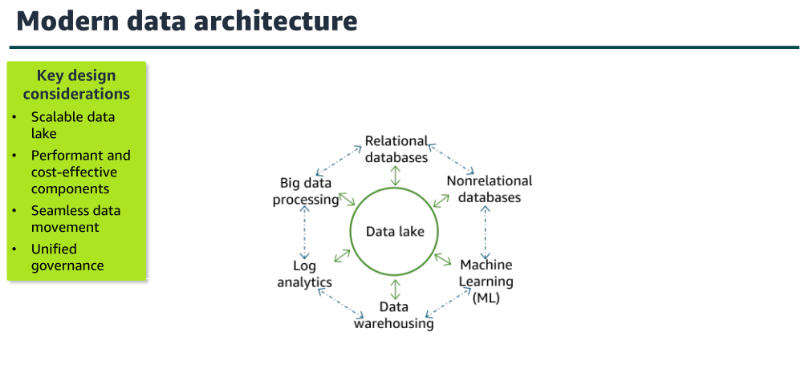
   
  <i>Source: https://www.awsacademy.com/</i>

- The goal of the modern data architecture is to store data in a centralized location and make it available to all consumers to perform analytics and run AI/ML applications. 

- But that doesn't mean that you have one data store—only that you have a single source of truth. 

- As illustrated on the slide, a data lake provides the centralized repository of data and is integrated with the other types of data stores and data processing systems. 

- Data might be queried directly from the lake, or it might be moved to and from other
purpose-built tools for processing.

- The movement of data among the lake and other integrated services falls into three general types: outside in, inside out, and around the perimeter.

  - **Outside** in is when an organization that stores data in purpose-built data stores, such as a data warehouse or a database, moves data into the lake to run analysis on it. 

  - **Inside** out is when an organization stores data in a data lake and then moves a portion of that data to a purpose-built data store to do additional ML or analytics. 

  - **Around** the perimeter is when an organization moves data directly between the other data store components that are integrated with the data lake without needing to access the data lake.

- To build a successful modern data architecture, your design must incorporate the following
features:
    - The data lake should be able to scale easily as data grows. Use a scalable, durable data store that supports multiple ways to bring data in.
        - For each component, select scalable services that balance the fastest performance at the lowest cost for the use case. Choose purpose-built tools. 
        - And continually assess options that could increase performance or reduce costs.
    - Your design should also support seamless data movement into and out of the data lake and around the perimeter. And whenever possible, provide direct access to the data.
    - Your design must also ensure consistency of data across all components of the architecture. As data in your various data stores and data lake continues to grow, it becomes more difficult to move all of that data around securely and in a governed way.

  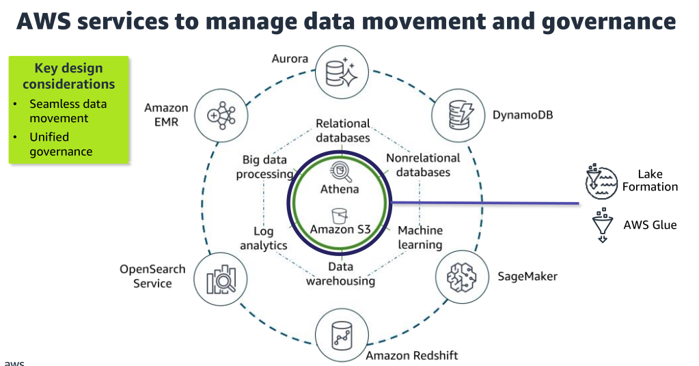
   
  <i>Source: https://www.awsacademy.com/</i>

- Amazon Simple Storage Service (Amazon S3) provides storage for structured and unstructured data and is the storage service of choice to build a data lake on AWS. 
- With Amazon S3, you can cost-effectively build and scale a data lake of any size in a secure environment with high durability.
- Amazon Athena is shown directly on the data lake to illustrate that it provides interactive querying of data directly in Amazon S3.

- The architecture illustrates the following other AWS purpose-built services that integrate with Amazon S3 and map to each component that was described on the previous slide:
    - Amazon Redshift is a fully managed data warehouse service.
    - Amazon OpenSearch Service is a purpose-built data store and search engine that is optimized for real-time analytics, including log analytics.
    - Amazon EMR provides big data processing and simplifies some of the most complex elements of setting up big data processing.
    - Amazon Aurora provides a relational database engine that was built for the cloud.
    - Amazon DynamoDB is a fully managed nonrelational database that is designed to run high-performance applications.
    - Amazon SageMaker is an AI/ML service that democratizes access to ML processing.

- Two additional services provide movement and governance for this architecture:
    - AWS Glue facilitates data movement and transformation between data stores, which helps to prepare data for analytics and ML much more quickly than traditional ETL methods.
    - AWS Lake Formation was built to make it easier to manage time-consuming tasks that are related to loading, monitoring, and managing data lakes. Lake Formation helps to catalog data and classify and secure it for different types of access.

### Modern data architecture pipeline: Ingestion and storage

  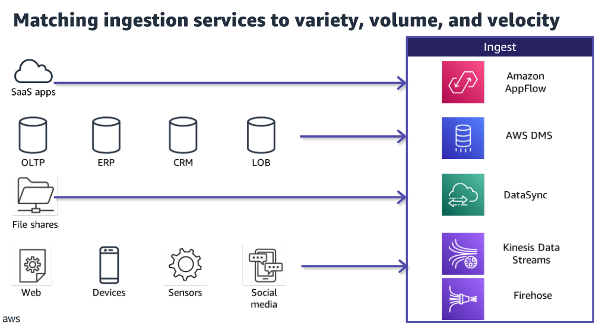
   
  <i>Source: https://www.awsacademy.com/</i>

- Amazon AppFlow can ingest from Software as a service (SaaS) applications, such as
Salesforce or Zendesk.
- AWS Database Migration Service (AWS DMS) can ingest from operational databases like
online transaction processing (OLTP), enterprise resource planning (ERP), customer
relationship management (CRM) and line of business (LOB) databases.
- AWS DataSync can ingest from file shares.
- Amazon Kinesis Data Streams and Amazon Data Firehose can ingest from streaming data
sources.

  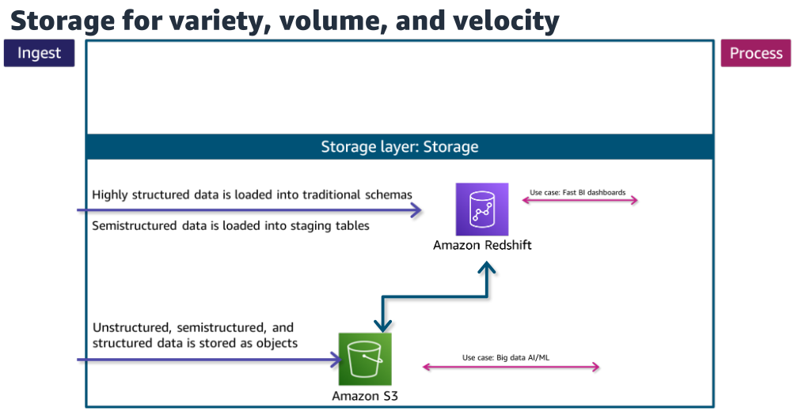
   
  <i>Source: https://www.awsacademy.com/</i>

- Highly structured data in the warehouse typically powers interactive queries and highly trusted, fast business intelligence (BI) dashboards. A modern cloud-native data warehouse, such as Amazon Redshift, provides low-latency turnaround of complex SQL queries.

- Amazon Redshift also supports ingestion of semistructured data into staging tables. To be accessed for analytics, data in the warehouse must be highly trusted and structured into traditional schemas.

- Data in the data lake typically drives ML, data science, and big data processing use cases. The data lake enables analysis of diverse datasets by using diverse methods.

- The Amazon S3 data lake supports storage of data in structured, semistructured, and
unstructured formats and can scale automatically.

- The native integration between Amazon S3 and Amazon Redshift means that you can ingest
data as is into Amazon S3 and then prepare it for the data warehouse as needed. This lets you offload historical data from warehouse storage into a more cost-efficient storage tier in Amazon S3, which reduces the cost of storage.

  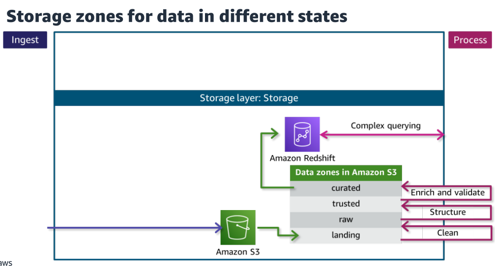
   
  <i>Source: https://www.awsacademy.com/</i>

- This slide looks closer at how data can be ingested as is into Amazon S3 and then prepared for other use cases, including storage in the data warehouse, by using the concept of storage zones.
- Each zone represents a different state of data and is represented by a bucket or prefix in Amazon S3. Zones include landing, raw, trusted, and curated. Data might pass through each zone as it is cleansed, normalized, augmented, or transformed in some other way.
- Data being ingested into the Amazon S3 data lake arrives at the landing zone, where it is first cleaned and stored into the raw zone for permanent storage. Because data that is destined for the data warehouse needs to be highly trusted and conformed to a schema, the data needs to be processed further.
- Additional transformations would include applying the schema and partitioning (structuring) as well as other transformations that are required to make the data conform to requirements that are established for the trusted zone.
- Finally, the processing layer prepares the data for the
curated zone by modeling and augmenting it to be joined with other datasets (enrichment) and then stores the transformed, validated data in the curated layer. Datasets from the curated layer are ready to be ingested into the data warehouse to make them available for low-latency access or complex SQL querying.

  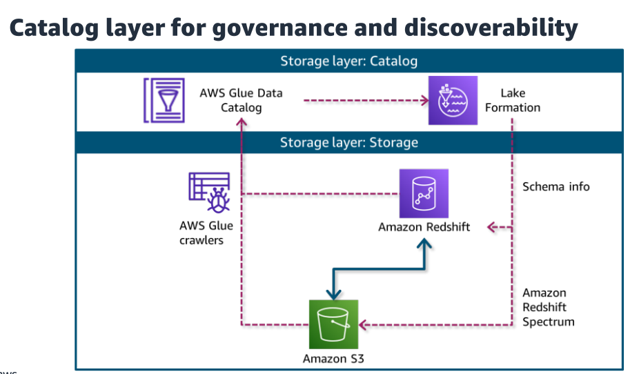
   
  <i>Source: https://www.awsacademy.com/</i>

- **The AWS Glue service** helps you simplify data movement and transformation within your pipeline. You can use AWS Glue to generate schemas for your data sources, which are then stored in an AWS Glue Data Catalog with other metadata about your sources.
- **AWS Glue data crawlers** can automatically discover schemas and metadata about data in the data lake and data warehouse and save those updates to the Data Catalog.
- **The Lake Formation service** is designed to simplify setting up, accessing, and securing data lakes. Lake Formation provides the data lake administrator with a central place to set up granular permissions for databases and tables that are hosted in the data lake.
- Lake Formation provides the central catalog for all datasets that are hosted in Amazon S3 and Amazon Redshift. The catalog includes both business attributes, such as data owner and column business definitions, and technical metadata, such as versioned table schemas and timestamps.
- **Amazon Redshift Spectrum**, a feature of Amazon Redshift, users can write SQL queries that combine data from the data lake and the data warehouse.

### Modern data architecture pipeline: Processing and consumption

  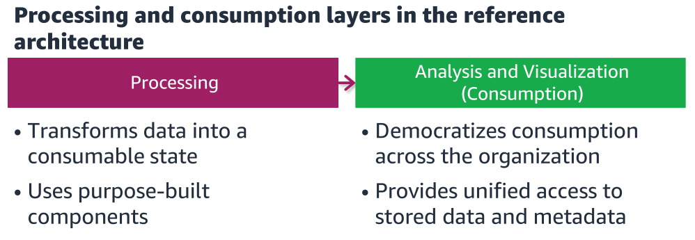
   
  <i>Source: https://www.awsacademy.com/</i>

The processing and consumption layers in the modern data architecture prepare data and make it available to consumers.

  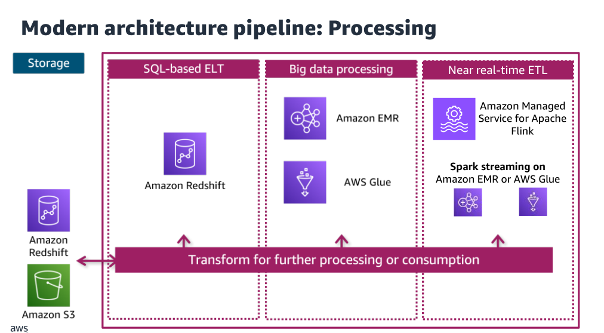
   
  <i>Source: https://www.awsacademy.com/</i>

- Each component can read and write data to both Amazon S3 and Amazon Redshift in the storage layer, and all can scale to very high data volumes.
- Each pipeline reads data from the storage layer, processes it using temporary storage as needed, and then writes it to the appropriate location in the storage layer. 
- The transformations are grouped into three main types, which are aligned to the use case:
    - SQL-based processing using a data warehouse (in this case, Amazon RedShift)
    - Big data processing using big data tools (in this case, Amazon EMR and AWS Glue)
    - Near real-time processing using streaming (in this case, Amazon Managed Service for Apache Flink or Spark streaming on Amazon EMR or AWS Glue)

### Modern data architecture: Consumption layer

  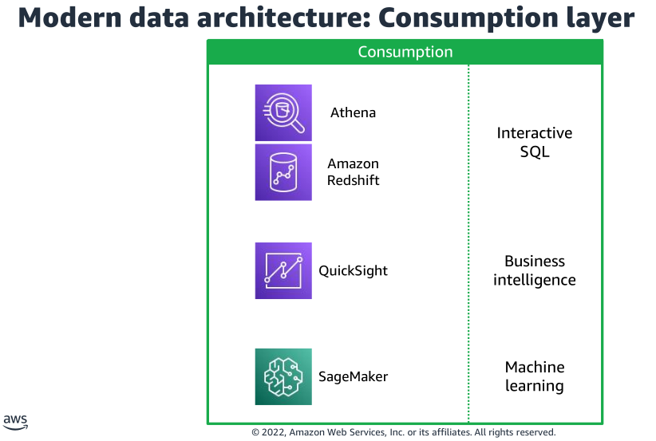
   
  <i>Source: https://www.awsacademy.com/</i>

- The consumption layer democratizes access to datasets for different types of users across the organization and enables different analysis methods.
- Each method has access to combine data
from the data warehouse, which is stored in traditional schemas, and data in the lake, which is stored in open formats.

  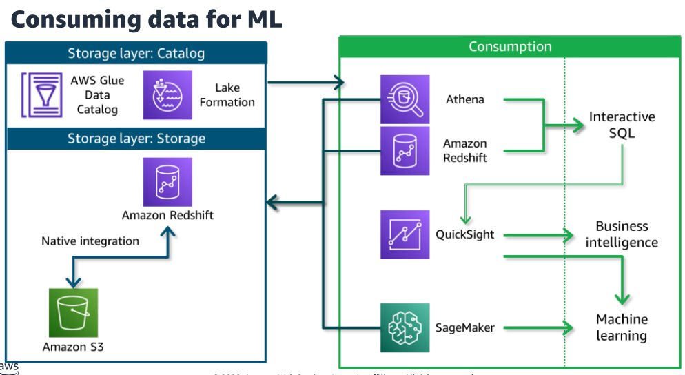
   
  <i>Source: https://www.awsacademy.com/</i>

- Business analysts and data scientists can use Amazon Redshift (with Redshift Spectrum) or Athena to explore all data in the storage layer by using interactive SQL.
- Business analysts can use the Athena or Amazon Redshift interactive SQL interface to power Amazon QuickSight dashboards with data from the storage layer.
  - QuickSight is serverless and helps you create and publish interactive BI dashboards. QuickSight is one example of a BI tool, and organizations might use a variety of tools or integrations to derive business intelligence.
- Data scientists typically need to explore, wrangle, and perform feature engineering on a variety of structured and unstructured datasets to prepare the data to train ML models.
  - In this AWS architecture, they could use SageMaker to connect to
the storage layer to access their training feature sets.
  - SageMaker is a fully managed service that provides components to build, train, and deploy ML models by using an integrated development environment (IDE) called Amazon SageMaker Studio.

## Streaming analytics pipeline
Streaming pipelines follow the same general layers as other pipelines, but there are  unique considerations. Data sources include clickstream logs, mobile apps, existing  databases, or Internet of Things (IoT) sensors. You might want to respond to this data in real time or use it for analysis later.

  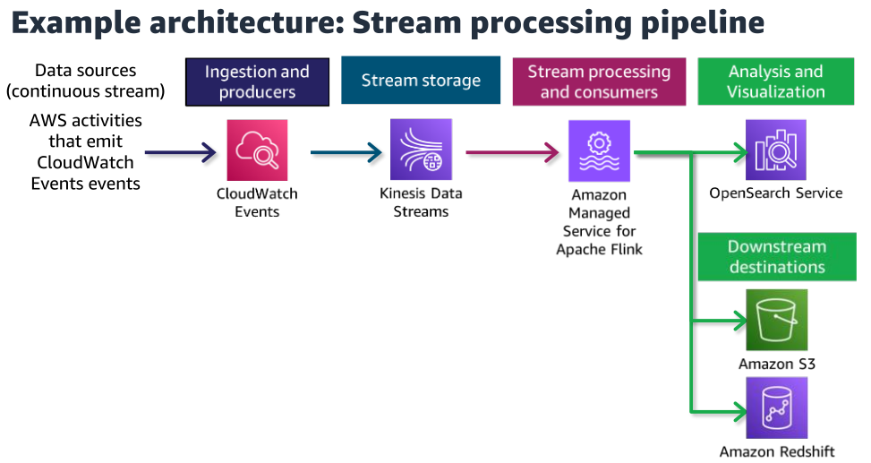
   
  <i>Source: https://www.awsacademy.com/</i>

- Producers are integrations that collect data from a source and load it onto the stream. 
- Consumers read data from the stream and perform their own processing on it. 
- The stream itself provides a temporary but durable storage layer for the streaming solution.
- Amazon CloudWatch Events is the producer that puts CloudWatch Events event data onto the stream. 
- Kinesis Data Streams provides the storage. The data is then available to multiple consumers.
- Amazon Managed Service for Apache Flink is a consumer of the stream and processes streaming data by using custom applications or standard SQL. 
-In this example, results are sent to OpenSearch Service, where they can be used to visualize real-time insights with OpenSearch Dashboards immediately.
- In this scenario, Amazon S3 and Amazon Redshift also consume the data that  Managed Service for Apache Flink processes. These downstream destinations aren't being used for real-time analytics but could be used for serving applications such as one- analytics and ML.