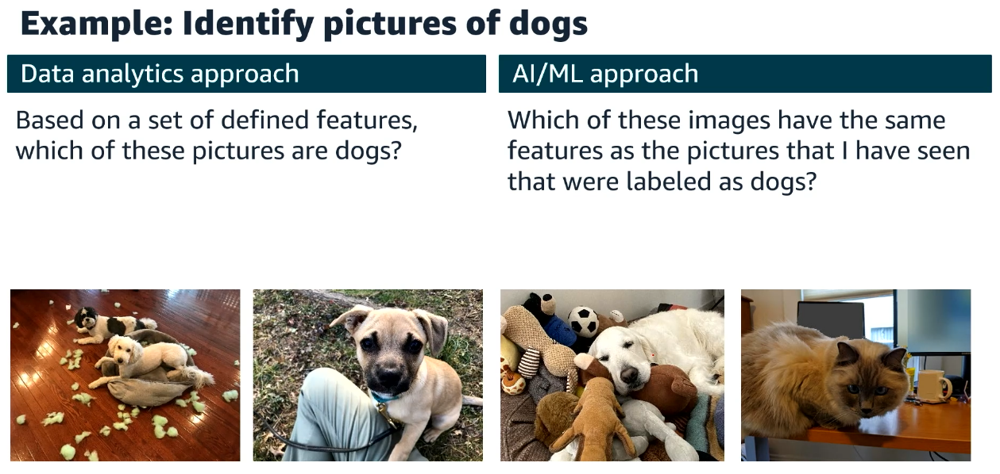
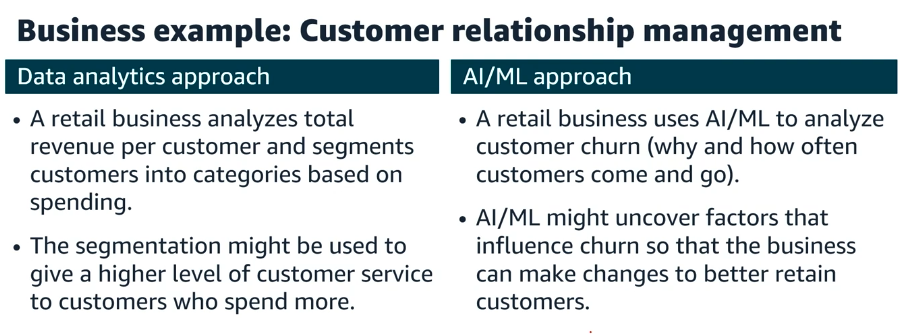
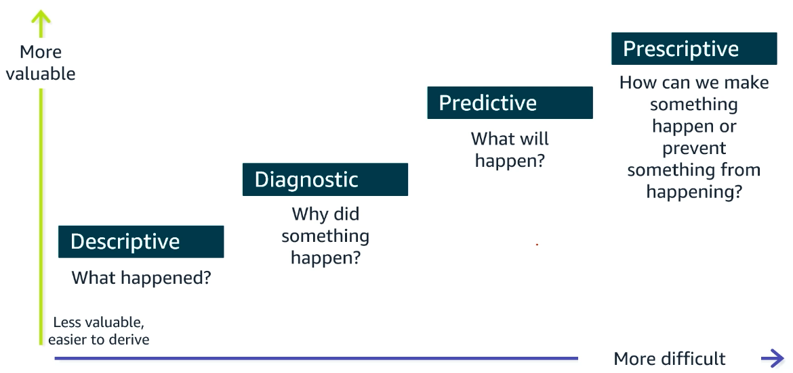
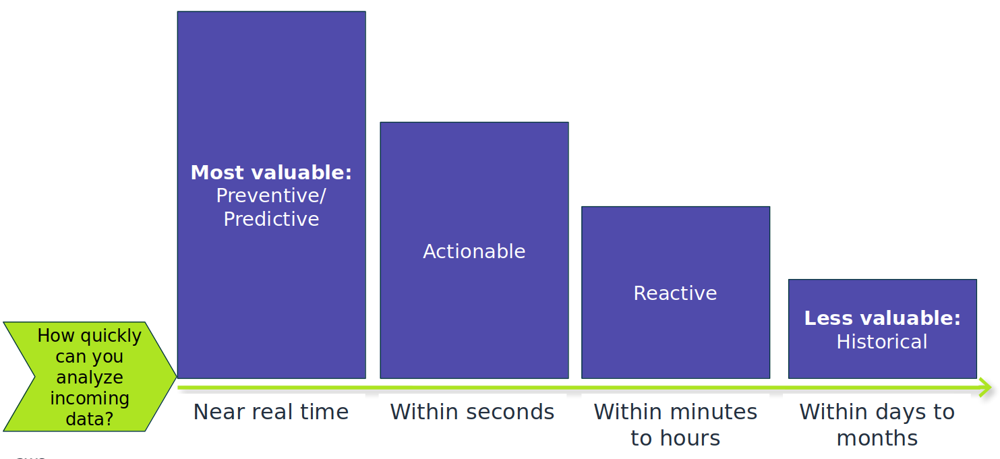
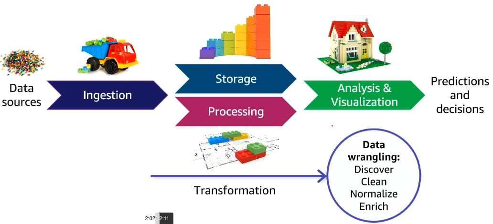
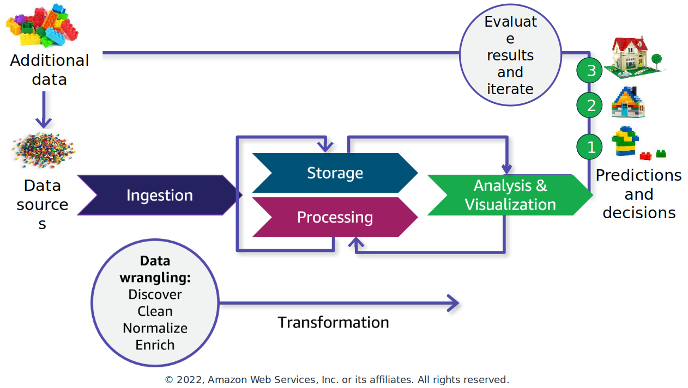
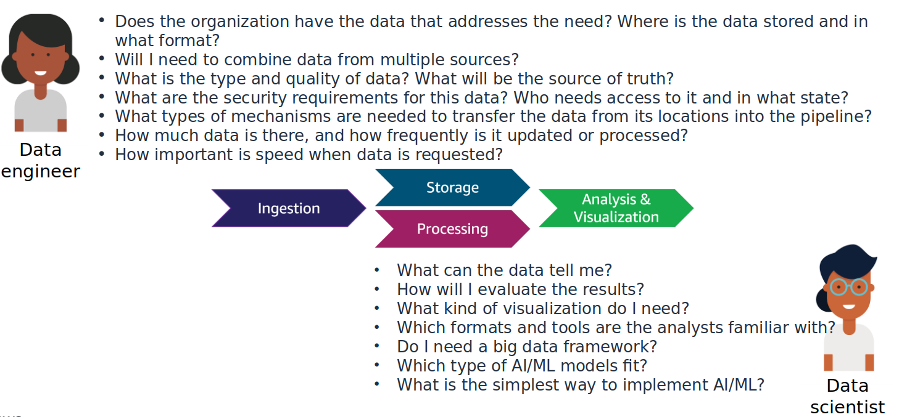

# Data-Driven Organizations

"Through 2026, organizations will accelerate their investments in data
and analytics services by 45 percent to become more data driven and digital"
Gartner, March 2022

**How do you decide...**
- Which restaurant near me serves the best Thai food?
- Where can I find a used child's bicycle?
- Which starters should I pick for my fantasy football team?
- Which type of job should I pursue?
- What should I pay for this home?

**How do organizations decide...**
- Which of these customer transactions should be flagged as fraud?
- Which webpage design leads to the most completed sales?
- Which patients are most likely to have a relapse?
- Which type of online activity represents a security issue?
- When is the optimum time to harvest this year's crop?

## Fueling decisions with data science
      
| Data analytics | AI/ML |
|---|---|
| Is the systematics analysis of large datasets (big data) to find patterns and trends to produce actionable insights. | Is a set of mathematical models that are used to make predictions from data at a scale that is difficult or impossible for humans. |
| Fses programing logic to answer questions from data | Uses examples from large amounts of data to learn about the data and answer questions. |
| Is good for structured data with a limited number of variables | Is good for unstructured data and where the variables are complex |

Examples:

  
   
  <i>Source: https://www.awsacademy.com/</i>

  
   
  <i>Source: https://www.awsacademy.com/</i>

**More valuable insights are more difficult to derive**

  
   
  <i>Source: https://www.awsacademy.com/</i>

### More data science in daily life
- You are shopping for shoes online and start to see a lot of shoe-related advertisements.
- You watch a movie or listen to a song on a streaming platform and begin to get recommendations for movies or music you might also like.
- You order pizza online and are kept up to date about each step in the preparation and delivery process.
- You use your credit card outside of your usual geographic area and get additional fraud alerts from your bank.
- Your navigation app on your phone alerts you to a traffic jam.

### Data becomes less valuable for decision-making over time

  
   
  <i>Source: https://www.awsacademy.com/</i>

# The data pipeline – infrastructure for data-driven decisions
A data pipeline in its simplest terms

collect data -> Store and process data -> Build something useful with data

## Layers of the pipeline infrastructure

  
   
  <i>Source: https://www.awsacademy.com/</i>

## Iterative processing through the pipeline

  
   
  <i>Source: https://www.awsacademy.com/</i>

# The role of the data engineer in data-driven organizations

**Common data pipeline questions**

  
   
  <i>Source: https://www.awsacademy.com/</i>

