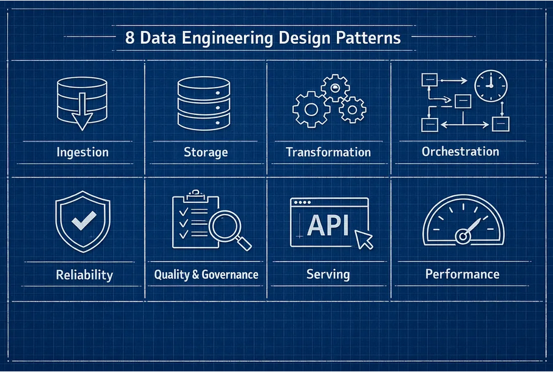

# Data Engineering Design Patterns

  
   

## Ingestion
Ingestion Patterns Decide Your System’s Tempo

Ingestion controls how fast the data platform can react to reality. Every pipeline makes an implicit choice about time. Some systems are designed to observe the world in snapshots. Others are designed to observe it as a continuous stream of events. Most production failures happen when those two models get mixed. Ingestion is not plumbing. It is traffic engineering.

1. **Batch**
Batch systems treat data as periodic shipments. Data arrives in large chunks on a schedule. Downstream systems only see the world at those checkpoints.

**Use batch when**
- Business reports update hourly or daily
- Source systems can only export files or database dumps
- Cost predictability matters more than freshness

**How it fails?**
Batch breaks when teams try to force it into real-time workloads. A daily job that pulls a 200 GB table will never support a dashboard that refreshes every five minutes, no matter how much Spark you throw at it. The bottleneck is not compute. The bottleneck is the ingestion pattern.

2. **Streaming**
Streaming treats every record as an event. Data flows continuously through the system, allowing downstream consumers to react in seconds instead of hours.

**Use streaming when**
- Latency needs to be measured in seconds or minutes
- Alerts, fraud detection, or live metrics depend on freshness
- Event-driven services subscribe to data changes

**How it fails?**
Streaming fails when it is used for data nobody needs in real time. Many teams run Kafka and Flink pipelines for tables that are only queried once per day. That creates operational cost, state management complexity, and failure modes with no business upside.

3. **Change Data Capture (CDC)**
Change Data Capture moves only what changed. Instead of copying whole tables, CDC streams inserts, updates, and deletes directly from database logs.

**Use CDC when**
- Operational databases are the system of record
- Tables are large but change slowly
- Production load must stay minimal

**How it fails?**
CDC breaks when teams ignore deletes, schema changes, and ordering guarantees. A CDC feed without correct primary keys, log retention, or schema evolution is worse than a batch job because it silently corrupts downstream state.

**The Thumb Rule**
Choose ingestion based on latency and change rate, not hype. If you get this decision wrong, everything built on top will fight reality.

## Storage
Storage Patterns Shape Everything Downstream

Storage is not where data rests, but it is where behavior gets locked in. The moment data is written, you have already decided how it will be queried, how it will be governed, how expensive it will be to scan, and how painful it will be to change. Teams treat storage as a neutral layer. It is not. Storage is the most opinionated part of the stack.

1. **Data Lake**
Data lakes store files, not tables. Everything is written in open file formats like Parquet or JSON into object storage. There is no built-in transaction layer and no enforced schema beyond what tools agree on.

**Use a data lake when**
- You ingest raw structured, and unstructured data
- Data science and machine learning need a full history
- Storage cost must be as low as possible

**How it fails?**
Lakes fail when multiple pipelines write to the same folders without coordination. One job overwrites files while another reads them. Partitions drift. Old files remain. Queries return inconsistent results. People call it a swamp, but the real problem is missing transaction control.

2. **Data Warehouse**
Warehouses store tables with strong contracts. Every insert, update, and query runs through a central engine that enforces schemas, indexes, and constraints.

**Use a warehouse when**
- Business reporting needs predictable performance
- Data models are stable
- Governance and access control matter

**How it fails?**
Warehouses fail when they are used as raw data stores. Dumping semi structured logs and CDC feeds into rigid schemas creates endless ingestion failures and expensive compute. Teams end up fighting the model instead of using it.

3. **Lakehouse**
Lakehouses combine open files with database rules. They store data in object storage but add a transaction log, schema enforcement, and versioning on top. Delta Lake and Iceberg are examples of this pattern.

**Use a lakehouse when**
- You need both raw and curated data in one place
- Streaming, batch, and ML share the same data
- You need time travel, ACID, and schema evolution

**How it fails?**
Lakehouses fail when teams ignore file management and table design. Without compaction, partitioning, and retention, query plans degrade and metadata explodes. The format does not save you from bad engineering.

**The Thumb Rule**
The storage pattern decides whether your data behaves like files or like tables. If you get it wrong, every pipeline above it becomes fragile.

## Transformation
Transformations decide how much damage a bad record can cause.

Most teams think transformation is just SQL or Spark jobs. In reality, transformation is where raw data becomes trusted data. The pattern you choose decides whether one broken row fails a single model or corrupts your entire warehouse.

1. **ETL**
Transform before loading. Data is cleaned, validated, and shaped before it ever touches analytical storage.

**Use ETL when**
- Regulatory or financial data must be validated first
- Source systems have strong contracts
- Storage is expensive

**How it fails?**
ETL fails when business logic changes. Every new column or rule requires rebuilding upstream jobs. Teams end up reprocessing terabytes of data just to add one metric.

2. **ELT**
Load first, transform later. Raw data is stored, then transformed inside the analytical engine.

**Use ELT when**
- You run on cloud warehouses or lakehouses
- Multiple teams need the same raw data
- Models change often

**How it fails?**
ELT fails when raw data becomes a dumping ground. Without strong models and tests, broken upstream data leaks into production dashboards.

3. **Incremental Processing**
Only process what changed. Instead of recomputing everything, the pipeline updates only new or modified records.

**This is mandatory in 2026 because**
- Data volumes grow faster than compute budgets
- Late-arriving data is normal
- Backfills must be cheap

**How it fails?**
Incremental pipelines fail when keys are unstable or when timestamps are wrong. Bad change tracking creates silent duplication or data loss.

**The Thumb Rule**
Transformation patterns define how the state is updated over time. Full refresh models recompute history. Incremental models mutate it. In 2026, only systems designed to track and apply change can scale without breaking cost, latency, or data correctness.

## Orchestration
Orchestration Patterns Define System Behavior

Orchestration is not scheduling, but it is how the data system decides what runs, when, and why. Two pipelines can run the same code and still behave completely differently based on how they are orchestrated. One will be predictable. The other will be fragile under load, retries, and partial failures.

1. **DAG-Based Orchestration**
Explicit control flow. Each task runs only after its dependencies succeed. Tools like Airflow, Prefect, and Dagster follow this model.

**Use DAGs when**
- Data must be processed in a strict order
- Backfills and re runs are common
- Failures must be traceable to a specific step

**How it fails?**
DAGs break when they try to model event driven systems. A single late file can block the entire graph. Teams add sensors, waits, and branching logic until the pipeline becomes unmaintainable.

2. **Event Driven Orchestration**
Reactive control flow. Jobs start when data arrives or when another system emits an event. Kafka, pub sub, and webhooks drive execution.

**Use events when**
- Data arrives unpredictably
- Systems need to scale independently
- Streaming or microservices are involved

**How it fails?**
Event driven systems fail when observability is weak. Without traceability, a missing event can silently drop data with no obvious error.

**The Thumb Rule**
DAGs give you control over order. Events give you control over time. Most modern data platforms need both because some workflows depend on strict ordering, while others depend on responding to data as it arrives. Systems that use only one will either miss data or block it.

## Reliability
Reliability Patterns Decide If Your Data Survives Reality

Every data system fails. The only question is whether it fails safely or silently. Most data pipelines work on good days. The real test happens when jobs retry, files arrive twice, networks glitch, or backfills collide with live traffic. Reliability patterns determine whether those events produce clean data or quiet corruption.

1. **Idempotent Jobs**
Same input. Same result. An idempotent pipeline can run twice and still produce one correct output.

**Use idempotency when**
- Jobs can be retried
- Events can be duplicated
- Backfills overlap with live data

**How it fails?**
Non-idempotent jobs double count records, overwrite correct data, or produce inconsistent results when retries occur.

2. **Retries and Dead Letter Queues**

Failures must go somewhere. Retries handle transient issues. Dead letter queues capture records that cannot be processed so they can be inspected and fixed.

**Use them when**
- Sources are unreliable
- Data quality varies
- Systems depend on upstream APIs

**How it fails?**
Without dead letter queues, bad data disappears. Teams only discover the problem when metrics drift weeks later.

3. **Backfills**
Replaying history safely. Backfills allow you to recompute past data without breaking production.

**Use backfills when**
- Logic changes
- Bugs are fixed
- Late data arrives

**How it fails?**
Backfills fail when they overwrite newer data or run with different logic than production pipelines.

**The Thumb Rule**
Production data systems operate in an environment where retries, duplicate events, late data, and partial failures are guaranteed. Pipelines must be designed to converge to the same correct state, regardless of how many times data is processed or replayed. If a pipeline only works when everything runs once and in order, it will corrupt data the first time reality deviates.

## Quality and Governance
Quality and governance patterns exist to make data defensible.

Fail fast at the boundary. Data should be checked as it enters the system, not weeks later in a dashboard.

**Use validation when**
- Data feeds come from external systems
- Business critical metrics depend on accuracy
- Schema drift is expected

**How it fails?**
Without validation, bad data flows through every downstream table. By the time someone notices, the error has already been copied into reports, ML models, and exports.

2. **Schema Evolution**
Change without breaking consumers. Schemas must change, but changes must be controlled.

**Use schema evolution when**
- New fields are added frequently
- Data contracts evolve
- Backward compatibility matters

**How it fails?**
Hard schema enforcement causes ingestion failures. No schema enforcement causes silent corruption. Good systems track versions and apply rules for compatibility.

3. **Lineage**
Trace every number back to its source. Lineage shows how data moved, changed, and was used.

**Use lineage when**
- Audits or compliance exist
- Metrics are business-critical
- Multiple teams share data

**How it fails?**
Without lineage, every data issue becomes a guessing game. Teams argue instead of debugging. Without these patterns, the team wastes days trying to figure out which pipeline caused the error.

**The Thumb Rule**
Data quality and governance must operate at the same layer where data changes. Validation, schema control, and lineage should be part of the data flow itself. When governance is added after the fact, errors have already propagated, and trust is already lost.

## Serving Pattern
Serving Patterns Decide Whether Data Creates Value

A perfect pipeline that nobody can use is a failure. Most data platforms break at the last mile. Data lands in storage, models run, and then consumers struggle to get consistent answers. Serving patterns decide how data is exposed, controlled, and trusted by the rest of the company.

1. **Semantic Layer**
One definition of truth. The semantic layer defines metrics, dimensions, and business logic once so every dashboard and query uses the same rules.

**Use a semantic layer when**
- Multiple BI tools exist
- Metrics must be consistent
- Business users query data directly

**How it fails?**
Without a semantic layer, every team writes its own SQL. Revenue, churn, and growth end up with multiple definitions.

2. **APIs**
Data as a product. APIs expose data to applications, ML models, and external systems with controlled access and rate limits.

**Use APIs when**
- Data powers products
- Machine learning needs features
- External partners consume data

**How it fails?**
Direct database access creates tight coupling. One heavy query can take down production.

**The Thumb Rule**
Data should be exposed through stable contracts that match how it is consumed. Analytical users need governed metrics, while applications need low-latency APIs. When all consumers hit raw tables, performance, cost, and correctness collapse.

## Performance
Performance Patterns Decide What Your Platform Costs

Every data platform looks fast in a demo. The bill shows up in production. Performance patterns determine how much data you scan, how often you recompute, and how much infrastructure stays idle. Most teams do not overspend because their queries are slow. They overspend because their systems are designed to move and process far more data than necessary.

1. **Partitioning**
Query less data. Partitioning physically organizes data so queries only scan what they need.

**Use partitioning when**
- Tables are large
- Queries filter on time, region, or customer
- Backfills are common

**How it fails?**
Bad partitioning forces full table scans. One dashboard query can read terabytes of data and drive massive compute costs.

2. **Caching**
Do not compute the same answer twice. Caching stores results close to users so repeated queries return instantly.

**Use caching when**
- Dashboards refresh often
- Many users run similar queries
- Data changes slowly

**How it fails?**
Caching fails when freshness rules are unclear. Stale data quietly breaks trust.

3. **Tiered Storage and On-Demand Compute**
Pay for use, not capacity. Hot data stays on fast storage. Cold data moves to cheap storage. Compute spins up only when queries run.

    **Use this when**
- Workloads spike
- Historical data is large
- Cost control matters

**How it fails?**
Without lifecycle rules and monitoring, old data piles up on expensive storage, and compute never scales down.

**The Thumb Rule**
Data platform cost and reliability are controlled by how much data is scanned, recomputed, and kept hot. Partitioning limits what gets read, caching limits what gets recomputed, and tiered storage limits what stays expensive. When these patterns are missing, performance problems turn into cost problems.

The Engineers Who Win Will Think in Design Patterns, Not Tools.

Most data engineers spend their careers fighting symptoms. Slow queries. Broken pipelines. Late data. Mismatched numbers. Rising cloud bills. All of those problems trace back to the same root cause. The system was built on the wrong data engineer design patterns.

When you understand ingestion, storage, transformation, orchestration, reliability, governance, serving, and performance as design choices, not tools, the chaos starts to make sense. You stop reacting to failures and start predicting them. You know when batch will break. You know when CDC will drift. You know when a lakehouse will collapse under bad partitioning. This is the difference between someone who runs pipelines and someone who designs data systems in 2026.

The Data Engineering Design Patterns Book by Bartosz Konieczny is one of the few resources that treats data platforms as systems rather than collections of tools. It covers the same ideas you saw here, but with real-world architectures, tradeoffs, and failure modes that show up in production. Data Engineering tools will keep changing, but these design patterns will let you keep up.

