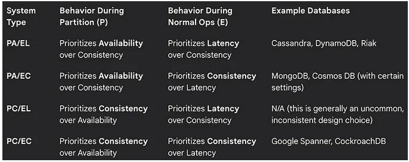

# What is Transactions?
- Transaction is a single unit of work. 
- If a transaction is successful, all of the data modifications made during the transaction are committed and become a permanent part of the database. 
- If a transaction encounters errors and must be canceled or rolled back, then all of the data modifications are erased.

# What is ACID?
- **Atomicity** : A transaction is an atomic unit of work that either completes or is not performed at all.
- **Consistency** : A transaction ensures that the database is always in a valid state before and after the transaction.
- **Isolation** : A transaction is isolated from other transactions, meaning that no other transaction can see the uncommitted changes of a transaction until it is committed.
- **Durability** : Once a transaction is committed, its changes are permanent and survive any subsequent failures.

# When to Use ACID (CP)
- Financial transactions
- Inventory management
- Booking systems
- Authentication services

# CAP Theorem
- CAP Theorem is not a suggestion. It is a law, like gravity. When a network partition happens, and it will, your database must make a choice.
- The Three Letters: What Each One Really Means
    - **Consistency (C)**
        - Every read returns the most recent write. 
        - All nodes agree on the data. 
        - If someone writes a value, anyone reading that value gets the new one, not an old copy.​
    - **Availability (A)**
        - Every request gets a response. 
        - The system does not block you or time out. 
        - You might not get the most recent data, but you get something.​
    - **Partition Tolerance (P)**
        - The system continues to work even when network communication between nodes breaks. 
        - A partition means nodes cannot talk to each other. 
        They are isolated. 
        The system must still function.​
- The key insight: in normal, healthy operations, a distributed system can provide all three. Consistency, availability, and partition tolerance coexist fine when the network is stable.​
- But the moment a network partition occurs, servers in data centre A cannot reach data centre B; the system must choose.​
- You pick two. The third becomes impossible.

## Why the CAP Theorem Matters
- In real-world distributed systems:
    - Networks are unreliable → Partition Tolerance (P) is usually non-negotiable.
    - You then have to choose between:
        - **Consistency (C)**: Data is always accurate but may not be available during partitions.
        - **Availability (A)**: System is always available but may return outdated data during partitions.

## CA Systems: Single Database (Sacrifices Partition Tolerance)
- CA means consistency and availability, but no partition tolerance.
- In practice: a single database server, or a system designed for a perfect network.
- Most traditional relational databases (PostgreSQL, MySQL) running on a single server are CA. They are fast, consistent, and always available. But they cannot handle network partitions gracefully.​

## CP Systems: Consistency Over Availability (MongoDB)
- CP means consistency and partition tolerance. 
- Sacrifices availability.
- When a network partition happens, the system chooses correctness. It stops responding to requests to prevent stale data from being served.​
- Example:​
    - A financial system. A network partition isolates replica A from replica B. The CP system shuts down the isolated replica. Why? Because it cannot guarantee that replica A and replica B see the same account balance. Rather than serve potentially wrong numbers, it stops responding.
- MongoDB exemplifies CP behaviour. 
    - It has a primary node and replicas. 
    - Writes go to the primary. 
    - If the primary is partitioned from the majority of the cluster, writes become unavailable until the partition heals. The system sacrifices responsiveness to protect correctness.​

## AP Systems: Availability Over Consistency (Cassandra)
- AP means availability and partition tolerance. 
- Sacrifices consistency.
- When a network partition occurs, the system continues to respond. All nodes remain available. But they might disagree on the data.
- Example:​
    - A social media feed. Network partition splits your cluster. The isolated partition still accepts “likes” on posts. When the partition heals, both sides reconcile. Your like count might be temporarily wrong, but the system never stopped responding.​
- Cassandra exemplifies AP behaviour. 
    - It has no single primary. 
    - Any node accepts writes. 
    - Partitions replicate independently. 
    - If a network partition isolates some nodes, they still serve requests. Consistency is eventual, not immediate.
    
## Decide based on use-case:
    - Banking: consistency is critical (CP)
    - Social media feeds: availability is critical (AP)
    - Eventual consistency is often used to balance C and A.

# The PACELC theorem 
- PACELC is an extension of the CAP theorem, providing a more complete picture of distributed system trade-offs. 
- The acronym stands for: Partition Tolerance, Availability, Consistency, Else, Latency, and Consistency.
- It can be broken down into two distinct parts:
    - If there is a Partition (P), you must choose between Availability (A) and Consistency. This is the familiar CAP theorem trade-off.
    - Else (E), when the system is running normally (no partition), you must choose between Latency (L) and Consistency. This second part is the critical addition.
- This is necessary because the CAP theorem only describes behavior during a network failure, which is a relatively rare event. 
- It doesn’t provide guidance for how to balance performance and data correctness during the 99% of the time the system is functioning normally.
- Pronunciation: PACELC is pronounced “pas-elk,” as coined by the theorem’s creator, Daniel J. Abadi.

## EL
- Latency refers to the time it takes for a system to respond to a request. 
- In a distributed system with replication, a key source of latency is the time required to synchronize data across all nodes. 
- To prioritize low latency, a system can use asynchronous replication.
- For example: 
    - a low-latency system (EL) might commit a write to a local node and immediately return a success message to the client, without waiting for the data to be replicated to other nodes. 
    - The replication happens in the background, out of the user’s critical path. 
    - A real-world example is a social media “like” count. 
    - When a user likes a post, they expect the counter to update instantly. 
    - The system prioritizes this low-latency response, and the temporary inconsistency (the counter on another user’s screen being slightly out of sync) is an acceptable trade-off.

## EC
- A system that prioritizes consistency (EC) in a normal state will use synchronous replication. 
- When a write request comes in, the system will not return a success message to the client until the data has been successfully written to all (or a quorum of) replicas.
- This ensures that any subsequent read request will retrieve the most recent, correct data.
- The cost of this choice is higher latency. 
- The response time for a write is directly proportional to the network and processing time required to sync with the furthest replica. For example, a financial trading system must be EC. 
- A buy or sell order cannot be considered complete until all replica nodes have a consistent record of the transaction.

    
     

## Practical Examples & Scenarios
1. **A PA/EL System: An E-commerce Product Reviews**
- When a user submits a product review, they expect it to be processed quickly. The system is designed for PA/EL. In the case of a network partition (P), the system remains available to accept the review, and it will be stored locally. This is a higher priority than ensuring immediate consistency. 
- During normal operations (E), the review is written to a local replica and a success message is returned immediately (low latency). The review is then asynchronously replicated to other nodes. A user on another server might see the review appear a few seconds later, but the system’s responsiveness is maintained.

2. **A PC/EC System: A Bank’s Account Balance**
- The system managing a user’s bank account balance must be a PC/EC system. During a network partition (P), the system will prioritize consistency over availability. If a withdrawal request comes in and the system cannot confirm the balance with all relevant replica nodes, it will fail the transaction to prevent an overdraft. 
- During normal operations (E), a deposit will not be confirmed until it has been successfully written to all necessary replicas (prioritizing consistency). The client will experience a higher latency on the write operation, but they are guaranteed that the balance they see is the single, correct source of truth.

3. **A PA/EC System: A Collaborative Document Editor**
- A real-time collaborative document editor like Google Docs is a fascinating example of a nuanced PACELC choice. During a network partition (P), the system must remain available, allowing users to continue typing offline. The changes are stored locally. 
- However, during normal operation (E), the system prioritizes consistency to prevent edit conflicts. Changes are not simply replicated asynchronously; a sophisticated conflict-resolution protocol ensures that all users eventually see the same, correct version of the document, even if it introduces some latency. This system sacrifices strong consistency during a partition but demands it during normal operation.