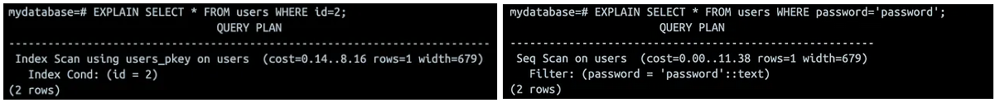

# What are Indexes?
PostgreSQL indexes are like shortcuts for finding data faster. It kind of like the index in a book that helps us jump to the right page without reading the whole thing.

# Why Use Indexes?
Without an index, PostgreSQL performs a Sequential Scan. This means it looks at every row in the table to find matches. For small tables, this isn’t a big deal, but as tables grow larger, sequential scans become very slow and resource-intensive, consuming more CPU and memory.

# Index Setbacks
Indexes are great for speeding up SELECT queries and WHERE clauses, but they use extra space and can slow down data changes (INSERT, UPDATE, DELETE) since the index has to stay updated.

## Indexes drawbacks:
- Takes space: Indexes use extra disk storage.
- Slower writes: INSERT, UPDATE, DELETE are slower because indexes need updating.
- Maintenance: Sometimes indexes must be rebuilt to stay fast.
- Query planner confusion: The database might not use an index if it determines a full table scan is more efficient, such as when querying a columns with few unique values.

# When to Use and When Not to Use Indexes
PostgreSQL indexes have their setbacks, so knowing “when” and “when not” to use them is essential for making efficient, performance-conscious decisions.

## When to Use an Index:
- WHERE columns: Speeds up filtering.
- JOIN columns: Makes joining tables faster.
- ORDER BY / GROUP BY columns: Speeds up sorting/grouping.
- Unique columns: Enforces uniqueness and quick lookup.
- Large tables: Improves performance for big datasets.

## When Not to Use:
- Frequently updated columns (slows writes).
- Columns with few distinct values, like a boolean (true or false)
- Small tables (scans are already fast).

# Index Types in PostgreSQL
## B-Tree (default)
B-Tree (Balanced Tree) is the default and most versatile index type. It works well with any data type that can be sorted, such as numbers, strings, and dates.

Think of it like A sorted phonebook — easy to find names starting with “A” or find everyone between “B” and “D”.

B-Tree is effective for a wide range of queries like:
- Equality: =
- Ranges: <, >, <=, >=
- Ordering: ORDER BY
- Pattern matching: LIKE 'prefix%', ~ '^prefix'

Use Case: Almost everything. Primary keys, unique constraints, and general-purpose columns like user_id, email, or created_at.

```
CREATE INDEX idx_users_email ON users (email);
```

## Hash
Hash indexes are only useful for simple equality comparisons (=). Hash can be faster than B-Trees for very large datasets where only equality checks are needed.

Think of it like A locker system — we have the exact key, and it jumps straight to the value.

Use Case: Indexing a UUID column where we only ever query for exact matches.

```
CREATE INDEX idx_users_uuid ON users USING HASH (user_uuid);
```

## GIN (Generalized Inverted Index)
GIN indexes are designed for columns that contain multiple values, such as arrays or JSONB data types. They are highly efficient for finding rows where a specific value is present within one of these multi-valued columns.

    Think of it like An index at the back of a textbook — showing all pages where a word appears.

Use Case:
- Indexing array columns (int[], text[]).
- Full-text search.
- Indexing jsonb data to query specific keys or values.

-- For full-text search
```
CREATE INDEX idx_articles_content_gin ON articles USING GIN (to_tsvector('english', content));
```
-- For a JSONB column
```
CREATE INDEX idx_products_tags_gin ON products USING GIN (tags); -- Assuming 'tags' is a JSONB array
```

## GiST (Generalized Search Tree)
GiST is a highly versatile index type that can be used for a wide variety of indexing needs. It’s often used for non-standard data types and complex queries.

    Think of it like A map — helpful for finding what’s nearby or overlaps with something.

Use Case:
- Geometric data: Finding which polygons contain a point.
- Full-text search: It can be used for this, though GIN is often faster for searching but slower to build.

-- For finding nearby locations using the cube and earthdistance extensions
```
CREATE INDEX idx_locations_gist ON locations USING GIST (ll_to_earth(lat, lon));
```

## BRIN (Block Range Index)
BRIN indexes are small and efficient, designed for very large tables where the physical order of the data on disk correlates with its values.

    Think of it like Chapter summaries — it doesn’t know the exact page, but can tell us which range to look in.

Use Case: A massive, append-only events or logs table ordered by a timestamp.

```
CREATE INDEX idx_logs_timestamp_brin ON logs USING BRIN (log_timestamp);
```

## Multi-Column (Composite) Indexes
A composite index is a single index that includes two or more columns which is designed to help with queries that filter or sort using those columns together. An index on (col_a, col_b) can be used for queries filtering on col_a alone, or on both col_a and col_b. It is generally not used for queries filtering on col_b alone.

    Think of it like A spreadsheet that’s sorted by multiple columns.

-- Good for: WHERE tenant_id = ? AND user_id = ?
-- Also good for: WHERE tenant_id = ?
-- Not good for: WHERE user_id = ?

```
CREATE INDEX idx_users_tenant_user ON users (tenant_id, user_id);
```

Use Case:
- Filter by multiple columns
- Sort by multiple fields
- Join/filter combo
- Unique multi-field constraint
- Fast reads with all data in index

```
CREATE INDEX idx_users_name ON users (last_name, first_name);
```

## Partial Indexes
A partial index only includes a subset of the table’s rows, defined by a WHERE clause in the CREATE INDEX statement, which specifies the condition that a row must meet to be included in the index. This results in a smaller index that is faster to update and scan.

    Think of it like a shortcut in a city that only works during rush hour — it doesn’t cover everything, but it’s highly efficient when conditions are right.

Use Case: Frequently filtered rows with a common condition. Example: We have an orders table and frequently query for orders that are not yet shipped. Indexing the entire status column might be inefficient if 99% of orders are shipped.

```
CREATE INDEX idx_orders_unshipped ON orders (order_id) WHERE status <> 'shipped';
```

## Expression (Functional) Indexes
We can index the result of a function or expression. This is useful when we queries consistently use that function in the WHERE clause.

    Think of it like a pre-calculated cheat sheet that stores the result of a formula — so we don’t have to do the math every time we search.

Use Case: Queries that transform data (e.g. LOWER(), EXTRACT(), TRIM()). Example: Searching for users by their email in a case-insensitive way. A query like WHERE lower(email) = 'test@example.com' cannot use a regular index on email.

```
CREATE INDEX idx_users_email_lower ON users (lower(email));
```

# Constraints and Indexes
In PostgreSQL, certain constraints automatically create indexes behind the scenes to enforce data rules efficiently.
Primary Key

When we define a PRIMARY KEY on a column (or a group of columns), PostgreSQL automatically creates a unique B-tree index.

This index ensures that:
- Each value in the primary key column(s) is unique.
- No NULL values are allowed.

## Unique Constraint
A UNIQUE constraint also creates a unique index to ensure that no two rows have the same value in that column (or combination of columns).

# Index Management and Maintenance
## Creating an Index Concurrently
Using the standard CREATE INDEX locks the table for writes, which isn’t ideal on a Production. To avoid that, we can create the index concurrently. It takes more time, but lets the table stay writable while the index is being built.

```
CREATE INDEX CONCURRENTLY idx_users_created_at ON users (created_at);
```

## List Index
Checking a table’s indexes helps us know which columns are indexed, avoid duplicates, and troubleshoot slow queries. It’s important for planning changes, optimizing storage, and ensuring security.

```
SELECT indexname, tablename, indexdef 
FROM pg_indexes 
WHERE tablename = 'employees';
```

## Finding Unused Indexes
Indexes add overhead, so it’s good practice to find and remove any that are never used. We can query the pg_stat_user_indexes view.

```
SELECT
    relname AS table_name,
    indexrelname AS index_name,
    idx_scan AS times_used
FROM
    pg_stat_user_indexes
WHERE
    schemaname = 'public' AND idx_scan = 0
ORDER BY
    relname,
    indexrelname;
```

## Rebuilding Indexes
Over time, especially on tables with frequent updates and deletes, indexes can become “bloated” and less efficient. We can rebuild them to reclaim space and improve performance.

```
-- Locks the table
REINDEX INDEX my_index;

-- Rebuilds without locking writes (PostgreSQL 12+)
REINDEX INDEX CONCURRENTLY my_index;
```

## Drop Index
Indexes take up disk space and slow down write operations like INSERT, UPDATE, and DELETE. Dropping no longer used or needed index can improve database performance and reduce maintenance overhead. It helps keep your database lean and efficient by getting rid of unnecessary indexes.

```
DROP INDEX idx_employee_last_name;
```

## Query Planning and Index Usage
The query planner is a crucial component of PostgreSQL (and other relational databases) that determines the most efficient way to execute a given query. When we run a query, PostgreSQL’s query planner decides how to fetch the data. It chooses the most efficient method based on available indexes, table size, and query conditions.

The planner considers many factors when creating a plan, including:
- The tables and columns involved in the query.
- The conditions in the WHERE clause.
- The presence of indexes on the relevant columns.
- The statistical data about the distribution of data in the tables.

## How Indexes Influence Query Planning
Indexes are central to how PostgreSQL’s query planner decides the fastest way to execute a query. The planner uses a cost-based optimizer to weigh options which sometimes an index helps.

### PostgreSQL scan methods
These are strategies PostgreSQL uses to read data from a table, depending on what’s most efficient for a given query.

- Sequential Scan: Reads every row in the table. Best for small tables or when retrieving a large portion of rows.
- Index Scan: Uses the index to jump directly to matching rows. Faster when only a small part of the table is needed. The planner picks this only if it’s cheaper than a full scan.
- Index-Only Scan: Runs directly from the index without touching the table. Works only when the index contains all the columns needed.
- Bitmap Scan: Useful for queries with multiple conditions. Combines results from different indexes into a “bitmap” of matching rows, then fetches them efficiently. Especially effective for AND queries on multiple columns.

### Query Planning in Action
We can use the EXPLAIN command in PostgreSQL to see the execution plan for any given query. This is an invaluable tool for understanding how the query planner works and for identifying where indexes can be used to improve performance.

Check the Query Plan

```
EXPLAIN SELECT * FROM users WHERE password='password';
EXPLAIN SELECT * FROM users WHERE id=2; --id is primary key
```

<p align="center">
    
    <br/>

Run the Query with Analysis to see how well the index actually performs

```
EXPLAIN ANALYZE SELECT * FROM users WHERE password='password';
```

When the Index Isn’t Used (the planner chooses a Sequential Scan instead), it could mean:
- The table is small, so scanning is faster than using the index.
- The query doesn’t match the index columns.
- Statistics are outdated — try running ANALYZE userswhich will tells PostgreSQL to scan the table and update its statistics. After that, the query planner has accurate info to decide whether using an index or scanning the whole table is faster.

# Final note
-  Indexes are not a magic bullet. Over-indexing can lead to slower performance on INSERT, UPDATE, and DELETE operations, as every change to the data may also require updating multiple indexes.