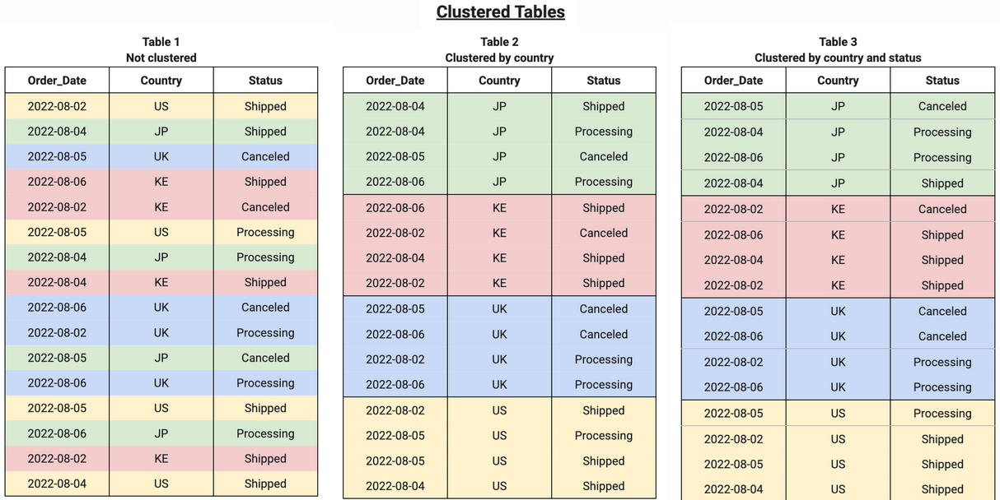

# BigQuery: Basics & Internals
https://medium.com/google-cloud/bigquery-basics-internals-part-1-9eda52b65960

## Previous definitions
- **A Data Lake** is a data dump yard — this is where we store all RAW files, often containing Unstructured data, and acts as a staging environment, before the transformed and cleaned extracts of data is put into Data warehouses!
- **A Data Mart** is a segment/part of a data warehouse — which is designed specifically for something or someone very specific, like a department in our organisation!

## BigQuery
- BigQuery  is the flagship Data Warehousing and Data Analytics product of Google Cloud Platform (GCP). 
- BigQuery is a perfect solution of a Data warehouse, which also supports implementations of Data Lakes and Data Marts!
- The ideation of BigQuery started actually from the ground concepts of **Map Reduce Programming Model** in reality!

### MapReduce
MapReduce is basically a software programming model / software framework, which allows us to process data in parallel across multiple computers in a cluster, often running on commodity hardware, in a reliable and fault-tolerant fashion.

A MapReduce program is composed of a map procedure, which performs filtering and sorting (such as sorting students by first name into queues, one queue for each name), and a reduce method, which performs a summary operation (such as counting the number of students in each queue, yielding name frequencies). 

The “MapReduce System” (also called "infrastructure" or "framework") orchestrates the processing by marshalling the distributed servers, running the various tasks in parallel, managing all communications and data transfers between the various parts of the system, and providing for redundancy and fault tolerance.

<p align="center">
  
  <br/>
</p>

#### Key Concepts related to MapReduce
1. **Job:** A Job in the context of Hadoop MapReduce is the unit of work to be performed as requested by the client / user. The information associated with the Job includes the data to be processed (input data), MapReduce logic / program / algorithm, and any other relevant configuration information necessary to execute the Job.

2. **Task:** Hadoop MapReduce divides a Job into multiple sub-jobs known as Tasks. These tasks can be run independent of each other on various nodes across the cluster. There are primarily two types of Tasks – Map Tasks and Reduce Tasks.

3. **JobTracker:** Just like the storage (HDFS), the computation (MapReduce) also works in a master-slave / master-worker fashion. A JobTracker node acts as the Master and is responsible for scheduling / executing Tasks on appropriate nodes, coordinating the execution of tasks, sending the information for the execution of tasks, getting the results back after the execution of each task, re-executing the failed Tasks, and monitors / maintains the overall progress of the Job.  Since a Job consists of multiple Tasks, a Job’s progress depends on the status / progress of Tasks associated with it. There is only one JobTracker node per Hadoop Cluster.

4. **TaskTracker:** A TaskTracker node acts as the Slave and is responsible for executing a Task assigned to it by the JobTracker. There is no restriction on the number of TaskTracker nodes that can exist in a Hadoop Cluster. TaskTracker receives the information necessary for execution of a Task from JobTracker, Executes the Task, and Sends the Results back to JobTracker.

5. **Map():** Map Task in MapReduce is performed using the Map() function. This part of the MapReduce is responsible for processing one or more chunks of data and producing the output results.

6. **Reduce():** The next part / component / stage of the MapReduce programming model is the Reduce() function. This part of the MapReduce is responsible for consolidating the results produced by each of the Map() functions/tasks.

7. **Data Locality:** MapReduce tries to place the data and the compute as close as possible. First, it tries to put the compute on the same node where data resides, if that cannot be done (due to reasons like compute on that node is down, compute on that node is performing some other computation, etc.), then it tries to put the compute on the node nearest to the respective data node(s) which contains the data to be processed. This feature of MapReduce is “Data Locality”.

#### How Map Reduce Works
MapReduce works by breaking the data processing into two phases: Map phase and Reduce phase. The map is the first phase of processing, where we specify all the complex logic/business rules/costly code. Reduce is the second phase of processing, where we specify light-weight processing like aggregation/summation.
<p align="center">
  
  <br/>
</p>


1. **Input Files:** The data for a MapReduce task is stored in input files, and input files typically lives in  Hadoop Distributed Filesystem (HDFS). The format of these files is arbitrary, while line-based log files and binary format can also be used.

2. **InputFormat:** InputFormat defines how these input files are split and read. It selects the files or other objects that are used for input. InputFormat creates InputSplit. Types of InputFormat: 
- FileInputFormat
    - Default
    - Specifies input directory where data files are located.
    - FileInputFormat will read all files and divides these files into one or more InputSplits.
- TextInputFormat
    - Treats each line of each input file as a separate record and performs no parsing.
    - Key: It is the byte offset of the beginning of the line within the file (not whole file just one split), so it will be unique if combined with the file name.
    - Value: It is the contents of the line, excluding line terminators.
- KeyValueTextInputFormat
    - breaks the line itself into key and value by a tab character (‘/t’). Here Key is everything up to the tab character while the value is the remaining part of the line after tab character.
    - breaks the line itself into key and value by a tab character (‘/t’). Here Key is everything up to the tab character while the value is the remaining part of the line after tab character.
- SequenceFileInputFormat
    - reads sequence files.
    - Sequence files are binary files that stores sequences of binary key-value pairs
- SequenceFileAsTextInputFormat
    - reads sequence files
    - converts the sequence file key values to Text objects. By calling tostring().
- SequenceFileAsBinaryInputFormat
    - can extract the sequence file’s keys and values as an opaque binary object
- NLineInputFormat
    - N is the number of lines of input that each mapper receives.
    - By default (N=1), each mapper receives exactly one line of input. If N=2, then each split contains two lines. One mapper will receive the first two Key-Value pairs and another mapper will receive the second two key-value pairs.
- DBInputFormat
    -  reads data from a relational database

3. **InputSplits:** It is created by InputFormat, logically represent the data which will be processed by an individual Mapper. One map task is created for each split; thus the number of map tasks will be equal to the number of InputSplits. The split is divided into records and each record will be processed by the mapper.

4. **RecordReader:** It communicates with the InputSplit in Hadoop MapReduce and converts the data into key-value pairs suitable for reading by the mapper. By default, it uses TextInputFormat for converting data into a key-value pair. RecordReader communicates with the InputSplit until the file reading is not completed. It assigns byte offset (unique number) to each line present in the file. Further, these key-value pairs are sent to the mapper for further processing.

5. **Mapper:** It processes each input record (from RecordReader) and generates new key-value pair, and this key-value pair generated by Mapper is completely different from the input pair. The output of Mapper is also known as intermediate output which is written to the local disk. The output of the Mapper is not stored on HDFS as this is temporary data and writing on HDFS will create unnecessary copies (also HDFS is a high latency system). Mappers output is passed to the combiner for further process

6. **Combiner:** The combiner is also known as 'Mini-reducer'. Hadoop MapReduce Combiner performs local aggregation on the mappers’ output, which helps to minimize the data transfer between mapper and reducer. Once the combiner functionality is executed, the output is then passed to the partitioner for further work.

7. **Partitioner:** Partitioner comes into the picture if we are working on more than one reducer (for one reducer partitioner is not used). Partitioner takes the output from combiners and performs partitioning. Partitioning of output takes place on the basis of the key and then sorted. By hash function, key (or a subset of the key) is used to derive the partition.

According to the key value in MapReduce, each combiner output is partitioned, and a record having the same key value goes into the same partition, and then each partition is sent to a reducer. Partitioning allows even distribution of the map output over the reducer. 

8. **Shuffling and Sorting:** The output of various mapping parts (k’, v’), then goes into Shuffling and Sorting phase.​ All the same values are deleted, and different values are grouped together based on same keys.​ The output of the Shuffling and Sorting phase will be key-value pairs again as key and array of values (k, v[ ]).

9. **Reducer:** It takes the set of intermediate key-value pairs produced by the mappers as the input and then runs a reducer function on each of them to generate the output. The output of the reducer is the final output, which is stored in HDFS. 

10. **RecordWriter:** It writes these output key-value pair from the Reducer phase to the output files.

11. **OutputFormat:** The way these output key-value pairs are written in output files by RecordWriter is determined by the OutputFormat. OutputFormat instances provided by the Hadoop are used to write files in HDFS or on the local disk. Thus the final output of reducer is written on HDFS by OutputFormat instances.


## BigQuery Elements
BigQuery uses a few elements to improve its performance:
**Jupiter:** highly scalable and high throughput network (super-fast and global scale petabyte scale network)
**Colossus:** highly redundant and performant disk organisation
**Dremel:** sophisticated processing engine

<p align="center">
  
  <br/>
</p>

<p align="center">
  
  <br/>
</p>

### Capacitor
BigQuery, uses columnar storage, where each column is stored in a separate area on the residing disk. The chunk of data stored on disks is otherwise fondly known as Capacitors. In simple words, capacitor is the file format of storage on Colossus system for BigQuery data.

BigQuery, uses columnar storage, where each column is stored in a separate area on the residing disk. The chunk of data stored on disks is otherwise fondly known as Capacitors. In simple words, capacitor is the file format of storage on Colossus system for BigQuery data.

However, this doesn’t necessarily indicate, that each column is in its own file; it simply designates that each column is stored in a file block, which is further compressed independently.

**File Header** contains all the metadata related details about columns present in the file. This includes, but obviously not limited to, the column name, data type, and other metadata details, for each and every column. 

<p align="center">
  
  <br/>
</p>

### Encoding Of Column Data
One common way of encoding column data, as used by BigQuery, is Dictionary based Encoding.

<p align="center">
  
  <br/>
</p>

What is effectively happening is the way the original data, shown on the left side of the above diagram, is being stored internally as organised like a dictionary, as shown on the right side of the diagram!

Also known as Run length encoding method, this allows BigQuery to efficiently store repeated values.

### Record Reordering
Is also another way of how BigQuery organises the data internally for faster analytical operations.

<p align="center">
  
  <br/>
</p>

Essentially, what is happening here is, Capacitor is internally re-ordering records, to be able to try and group repeated fields, so as to make Run Length Encoding (RLE) method more successful!

### Colossus: Physical Storage Pattern
BigQuery storage is a Regional &/or Multi-Regional service, as chosen during creation of a "dataset"
<p align="center">
  
  <br/>
</p>

in Colossus:
- all data is automatically compressed, encrypted, replicated, and distributed.
- There are many levels of defence against unauthorised access in Google Cloud Platform, as we are aware of, wherein one of them is the fact that100% of data is encrypted at rest.
- Colossus ensures durability using erasure encoding to store redundant chunks of data on multiple physical disks.
- Immediately upon writing data to Colossus, BigQuery starts the geo-replication process, mirroring all the data into different data centres around the specified region

Some critical points to be taken into account are as follows:
- In a single region, data is stored only in the region. Note: In this case, there is no Google Cloud–provided backup or replication to another region.
- In a multi-regional type of dataset in BigQuery, data is stored in a single region but is backed up in a geographically-separated region to provide resilience to a regional disaster.
- Many customers store their data in multi-regional datasets to ensure automated backups and better disaster recovery, but sometimes it is a better option, even from a legal or data privacy standpoint, to chose a single region for a dataset in BigQuery, which is aimed to be close to on-premise or to GCP Application workloads; this is done to minimise any latency between the Application and the BigQuery instances/workers!


### Design Patterns — Partitioning & Clustering

#### Partitioning
A partitioned table is divided into segments, called partitions, that make it easier to manage and query your data. By dividing a large table into smaller partitions, you can improve query performance and control costs by reducing the number of bytes read by a query. You partition tables by specifying a partition column which is used to segment the table.

<p align="center">
  
  <br/>
</p>

#### How does partitioning (or pruning) actually work?

For Read Operations:

- Dremel, the BigQuery query execution engine, sends request to metadata server, which queries Storage Sets table (just another name for storage object on Colossus) filtering on the PartitionKey column (as mentioned in the WHERE clause), and finally, responds with the list of storage sets with PartitionKey within the requested range. This is not the actual data reading stage, but simply the data identification stage, as we can call.
- Next, Dremel opens capacitor files within StorageSets, checks the minimum & maximum values for each column in the file (available in capacitor file header).
- If [min, max] is outside the relevant range it will skip the remaining of the file, else data will be read from this file!

There are 2 types of Partitioning possible on any BigQuery table:

- **Ingestion date/time partitioning:** Based on date/time that data is loaded. For this, we filter our table’s data using pseudo-columns: _PARTITIONDATE, _PARTITIONTIME. One example query can be: SELECT col FROM d.t WHERE _PARTITIONDATE > “2018–05–01”
- **Column partitioning:** Partition tables based on any of the following column types: TIMESTAMP, DATE, DATETIME (hour, day, month, or year granularity), INT64 (you define the range: start, end, and interval). Here again, we filter using column name and reduce data scanned. Example: SELECT COUNT(*) FROM d.t WHERE datecol > "2018–05–01"

Examples:

```
CREATE TABLE
  mydataset.newtable (transaction_id INT64, transaction_date DATE)
PARTITION BY
  transaction_date
  OPTIONS (
    partition_expiration_days = 3,
    require_partition_filter = TRUE);
```

The default partitioning type for DATE columns is daily partitioning. To specify a different partitioning type, include the DATE_TRUNC function in the PARTITION BY clause.the following query creates a table with monthly partitions:

```
CREATE TABLE
  mydataset.newtable (transaction_id INT64, transaction_date DATE)
PARTITION BY
  DATE_TRUNC(transaction_date, MONTH)
  OPTIONS (
    partition_expiration_days = 3,
    require_partition_filter = TRUE);
```

You can also specify a TIMESTAMP or DATETIME column as the partitioning column. In that case, include the TIMESTAMP_TRUNC or DATETIME_TRUNC function in the PARTITION BY clause to specify the partition type. For example, the following statement creates a table with daily partitions based on a TIMESTAMP column:

```
CREATE TABLE
  mydataset.newtable (transaction_id INT64, transaction_ts TIMESTAMP)
PARTITION BY
  TIMESTAMP_TRUNC(transaction_ts, DAY)
  OPTIONS (
    partition_expiration_days = 3,
    require_partition_filter = TRUE);
```

However, partitioning requires BigQuery to maintain more metadata than with an unpartitioned table. As the number of partitions increases, the amount of metadata to maintain increases.

#### Clustering
Clustered tables in BigQuery are tables that have a user-defined column sort order using clustered columns. Clustered tables can improve query performance and reduce query costs.

With clustering, BigQuery automatically sorts your data based on the values of a few columns that you specify and colocates them in optimally sized blocks. Clustering improves query performance compared to not using clustering. With clustering, BigQuery can better estimate the cost of running the query than without clustering. With clustered columns, queries also eliminate scans of unnecessary data, and can calculate aggregates quicker because the blocks colocate records with similar values.

<p align="center">
  
  <br/>
</p>

##### When to use clustering
- Unpartitioned tables larger than 64 MB are likely to benefit from clustering. Similarly, table partitions larger than 64 MB are also likely to benefit from clustering. Clustering smaller tables or partitions is possible, but the performance improvement is usually negligible.
-If your queries commonly filter on particular columns, clustering accelerates queries because the query only scans the blocks that match the filter.
- If your queries filter on columns that have many distinct values (high cardinality), clustering accelerates these queries by providing BigQuery with detailed metadata for where to get input data.

<p align="center">
  
  <br/>
</p>

#### Combine clustered and partitioned tables
When you create a table that is clustered and partitioned, you can achieve more finely grained sorting

<p align="center">
  
  <br/>
</p>

##### Automatic reclustering

As data is added to a clustered table, the new data is organized into blocks, which might create new storage blocks or update existing blocks. Block optimization is required for optimal query and storage performance because new data might not be grouped with existing data that has the same cluster values.

To maintain the performance characteristics of a clustered table, BigQuery performs automatic reclustering in the background. For partitioned tables, clustering is maintained for data within the scope of each partition.