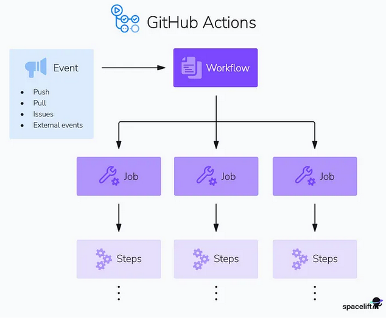

# Introduction
- GitHub Actions is a continuous integration and continuous delivery/deployment (CI/CD) platform that automates your software development workflows. 
- It allows you to build, test, and deploy software source code directly from your GitHub repository by creating custom workflows or pipelines. 

# Key Concepts
- **Workflows**: Automated processes that run when specific events occur in your repository (e.g., push, pull request, issue creation).
- **Events**: Triggers that start a workflow (e.g., `push`, `pull_request`, `schedule`, `workflow_dispatch`).
- **Jobs**: A set of steps that execute on the same runner and can run in parallel with other jobs.
- **Steps**: Individual tasks within a job, which can be shell commands or Docker actions.
- **Runners**: Servers that execute your workflows. GitHub provides hosted runners (Linux, Windows, macOS) or you can use self-hosted runners.
- **Actions**: Reusable units of code that perform specific tasks. They can be created by you, GitHub, or the community.

# How does GitHub Actions work?

    
     
- GitHub Actions workflows are configured using YAML files that define the sequence of tasks or actions to be executed when triggered by events like code pushes, pull requests, and releases.

- Actions are reusable units of code that perform specific tasks, such as setting up dependencies, running tests, and deploying to a cloud provider or on-premise servers. You can create and publish custom Actions for your specific requirements.

- GitHub provides virtual machines, a.k.a. runners, to run your workflows on Linux, Windows, and macOS environments. You can also host your own self-hosted runners. Runners support any programming language, platform, and cloud provider, making GitHub flexible for various projects.

- GitHub Actions seamlessly integrates with other GitHub features, such as Issues, PRs, and Marketplace, allowing you to create automated workflows based on events in your repository.