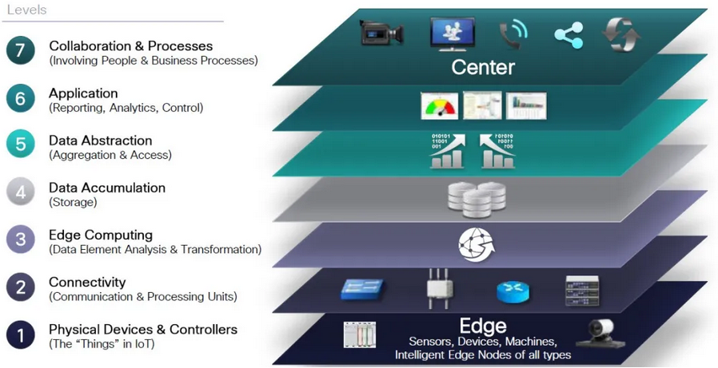
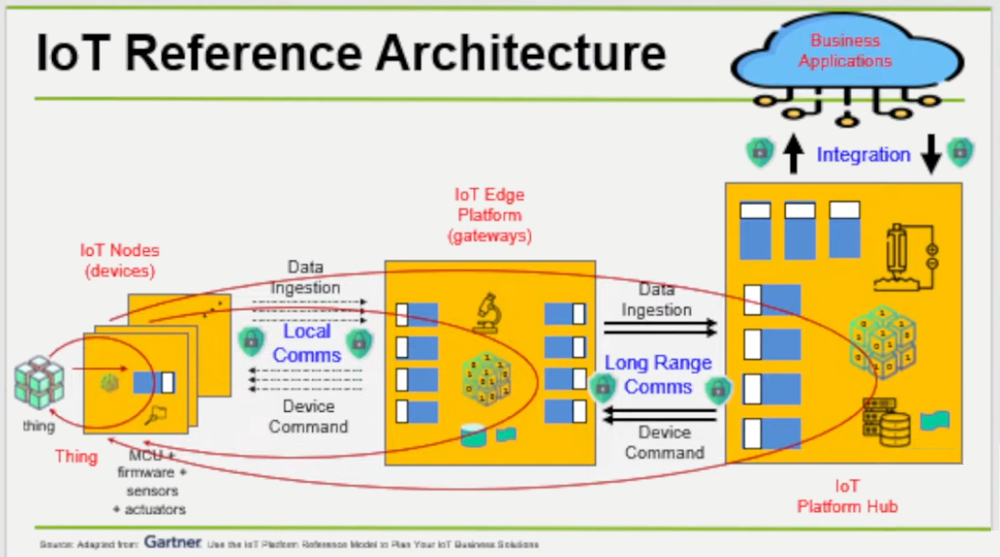
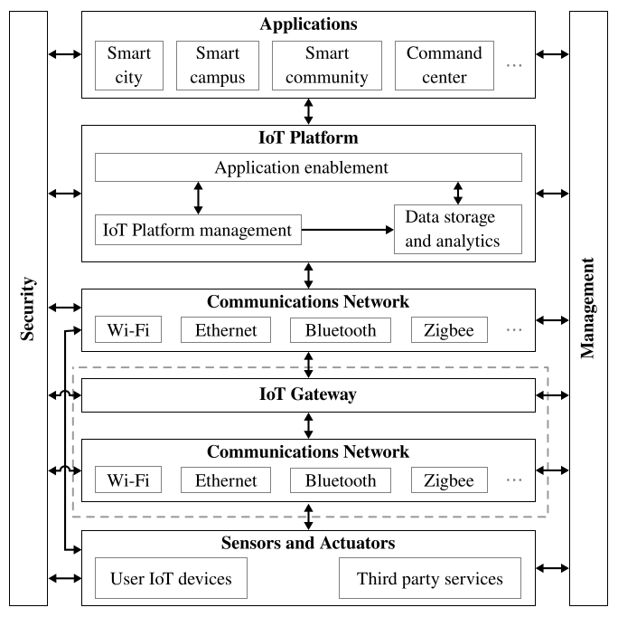
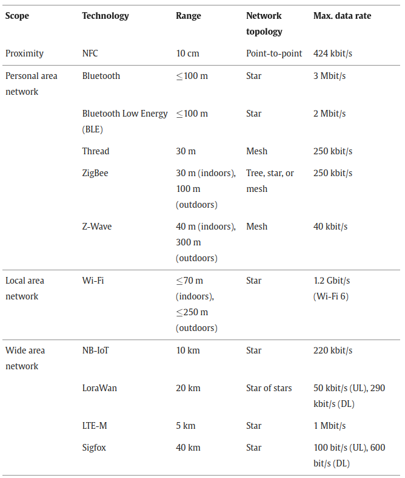
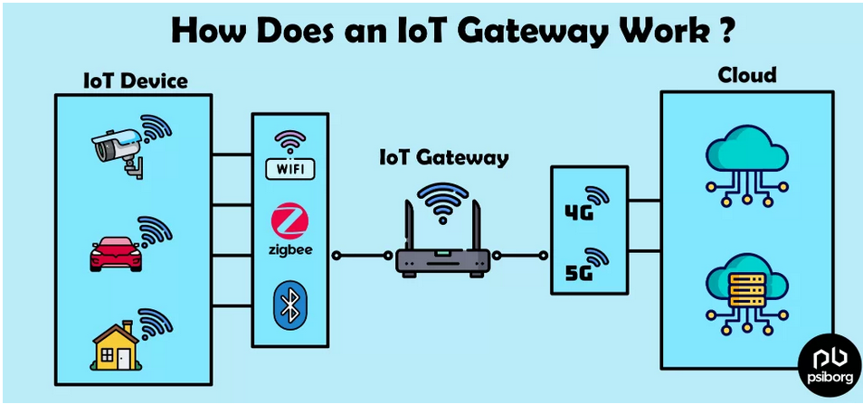

# IoT Architecture and Core IoT Modules 

## IoT World Forum Reference Model

  
   

- **Physical Devices and Controllers:** These are similar to the sensor nodes discussed earlier. The actual things in the Internet of Things.
- **Connectivity:** The nodes in sensor nodes discussed earlier can be related to this. The basic device that has some connectivity radios and contains the sensors. The Network devices also fall in the same segment.
- **Edge Computing:** The small level data processing at the gateway and sensor nodes is known as edge computing. Some small tasks and actuator handling can also be done here.
- **Data Accumulation:** The data that is sent over the internet via gateways by the sensor nodes are acquired and stored in a database on the Cloud.
- **Data Abstraction:** Normalization, filtering, expansion, aggregation of the data is done at the cloud mainly.The main aim is ti get the required and significant data out of all the data that is collected. Some small operations can be done at the Edge also.
- **Application:** Analytics over the data and responding according to the data to control the actuators at the sensor nodes is one of the main applications of the IoT Architecture.
- **Collaboration and Processes:** In many commercial and industrial applications of IoT, the data collected has to be acted upon. How does that happen? Well, one needs to have a Workflow and Rules to route incoming messages from devices to the appropriate audiences under the appropriate conditions.  g. "if fire sensor is ON, make automated call to Fire Department". 

## IoT Reference Architecture (An Overview of the Main Stages in the IoT Architecture Diagram)

  
   
  <a href="https://www.youtube.com/watch?v=VzvWWcumBjs">Desarrollando soluciones IoT, Dr. Eugenio Tamura</a>
  

## IoT Reference Architecture (Components)

  
   

- **Sensors and actuators**

Sensors are hardware devices that measure physical parameters from the environment (e.g., temperature or humidity) or from other systems (e.g., a current meter). 

Actuators are hardware devices that carry out actions based on IoT requests (e.g., any device that can be turned on or off). Usually, these are small devices with limited resources, and in the simplest cases the needed processing capabilities may be achieved using a small microcontroller without an operating system. 
    
When more complex capabilities are needed small operating systems designed specifically for these kind of systems, such as Contiki, TinyOS, and FreeRTOS, are used.

Different type of Sensors:

    Temperature Sensors:
        Thermocouples: Measure temperature based on the Seebeck effect.
        Thermistors: Resistance changes with temperature.
        RTDs (Resistance Temperature Detectors): Precise temperature measurements based on resistance change in a metal.
        Digital Temperature Sensors: Provide digital readings of temperature.

    Humidity Sensors:
        Capacitive Humidity Sensors: Measure humidity by changes in capacitance.
        Resistive Humidity Sensors: Measure humidity by changes in resistance.
        Thermal Humidity Sensors: Measure humidity using thermal conductivity.

    Light Sensors:
        Photodiodes: Convert light into electrical current.
        Phototransistors: Amplify the current produced by light.
        Photoresistors (LDRs - Light Dependent Resistors): Resistance decreases with light exposure.
        Ambient Light Sensors: Measure overall light levels in the environment.
        UV Sensors: Detect ultraviolet radiation.

    Pressure Sensors:
        Strain Gauge Pressure Sensors: Measure pressure based on mechanical deformation.
        Capacitive Pressure Sensors: Measure pressure by changes in capacitance.
        Piezoresistive Pressure Sensors: Measure pressure based on changes in resistance due to stress.
        Barometric Pressure Sensors: Measure atmospheric pressure.

    Motion and Position Sensors:
        Accelerometers: Measure acceleration forces.
        Gyroscopes: Measure angular velocity (rotation).
        Magnetometers: Measure magnetic field strength and direction.
        Inertial Measurement Units (IMUs): Combine accelerometers, gyroscopes, and sometimes magnetometers.
        GPS (Global Positioning System) Sensors: Determine geographic location.

    Gas Sensors:
        Carbon Monoxide (CO) Sensors: Detect CO levels.
        Carbon Dioxide (CO2) Sensors: Detect CO2 levels.
        Methane (CH4) Sensors: Detect methane concentrations.
        Oxygen (O2) Sensors: Detect oxygen levels.
        VOC (Volatile Organic Compound) Sensors: Detect various organic compounds in the air.

    Proximity Sensors:
        Infrared (IR) Proximity Sensors: Detect nearby objects using infrared light.
        Ultrasonic Proximity Sensors: Use sound waves to detect distance.
        Capacitive Proximity Sensors: Detect proximity based on changes in capacitance.

    Image Sensors:
        Cameras: Capture visual information (used for surveillance, object recognition, etc.).

    Sound Sensors:
        Microphones: Detect sound waves and convert them into electrical signals.

    Level Sensors:
        Ultrasonic Level Sensors: Measure liquid or solid levels using ultrasound.
        Float Sensors: Measure liquid levels based on float position.
        Pressure Level Sensors: Measure liquid level based on hydrostatic pressure.

    Current/Voltage Sensors:
        Current Transducer: Measure electrical current flow.
        Voltage Sensors: Measure the potential difference between two points in a circuit.
        Power Sensors: Calculate power based on both voltage and current.

Different type of Actuators:

    Motors:
        DC Motors: Rotational motion using DC power.
        Servo Motors: Precision control of position and speed.
        Stepper Motors: Precise stepping motion.
        Linear Actuators: Produce linear motion.

    Valves:
        Solenoid Valves: Control fluid flow using electromagnetic force.
        Pneumatic Valves: Control airflow.
        Hydraulic Valves: Control liquid flow.

    Relays:
        Electromechanical Relays: Electrically operated switches.
        Solid State Relays (SSRs): Solid-state electronic switches.

    Heaters:
        Resistive Heaters: Convert electrical energy into heat.
        Thermoelectric Heaters (Peltier): Can heat or cool by changing the direction of current.

    Lighting Devices:
        LEDs (Light Emitting Diodes): Emit light using semiconductors.
        Smart Bulbs: Lighting with adjustable color and intensity.

    Displays:
        LCD (Liquid Crystal Displays): Used to display information.
        OLED (Organic Light Emitting Diode) Displays: Higher contrast and brighter than LCDs.

    Speakers:
        Audio Speakers: Reproduce audio signals.

    Pumps:
        Diaphragm Pumps: Use a diaphragm to pump fluid.
        Centrifugal Pumps: Use rotation to pump fluid.

    Robotic Arms/Grippers
        Multi-jointed arms: Perform complex movements and tasks.
        Grippers: Mechanisms for picking up and holding objects.

- **Network**

The most common protocols are the following:

- IPv4: the Internet protocol (IP) version 4 (IPv4) is currently the most used of the IP versions, which are used to address the Internet. It was first implemented in 1983 and uses 32 bit addresses.

- IPv6: To solve the address exhaustion problem, the IP version 6 (IPv6) was developed. IPv6 uses 128 bit addresses, thus being the number of addresses much larger than the one of IPv4.

- 6LoWPAN: The IPv6 over Low-Power Wireless Personal Area Networks was developed by the Internet Engineering Task Force (IETF) to make an adaptation layer that allows IPv6 with the low-rate wireless personal area networks defined by the IEEE 802.15.4 standard.

Overview of some of the most relevant communications technologies for IoT: 

  
   
  <i>Source: https://www.sciencedirect.com/</i>

-  **IoT Gateway**

An IoT gateway links devices and the cloud  by transmitting data from sensors to the cloud for further analysis and  action. In many cases, sensors lack the inherent capability to transmit  this information directly to the cloud. Without the intermediary role of a gateway to relay and streamline this data flow, the full potential of these sensor networks to offer meaningful insights remains untapped.

  
   
  <i>Source: https://psiborg.in/</i>

Not all IoT devices require a gateway. Devices with built-in cellular connectivity can communicate directly with the cloud. However, networks that use protocols like LoRaWAN, prioritizing low power consumption and long range over high bandwidth, require a gateway to bridge the communication gap between the devices and the cloud.

Key gateway functionalities:
- Establishing cloud connectivity
- Data filtering and preprocessing
- Secure data transmission
- Local data caching
- Protocol translation
- Receives information back from the cloud

**IoT Platform**

The IoT platform is the central hub of the IoT system, enabling the connected sensors and actuators to be controlled and
monitored with the help of applications. Are considered three fundamental building blocks: 
    - device management and connectivity
    - data storage and analytics
    - and application enablement.

- IoT platform management:
    - Creation and configuration of user accounts.
    - Integration and management of devices: allows the connection of devices to the platform and configures the data to be
    retrieved (in the case of sensors) or the possible actions to be performed (in the case of actuators).
    - Data and system management : allows for checking the status of the IoT platform, viewing system logs, creating backup
copies of configuration and/or sensor data, and updating software, among others.
    - Interface to the management and security layers of the IoT system: the security and management blocks,   can interact with all other blocks in the system. Thus, the IoT platform management block may provide the means to easily access or interact with those blocks.

- Data storage and analytics: This block provides functionalities to the IoT platform to store and access the received sensor data.
In addition, it may also provide functionalities to analyze the data. Typically, the platform does not store all the collected data
indefinitely, but it is necessary to define the lifetime of the data.

- Application enablement: This block provides functionalities for developing and deploying applications for the IoT system.
Such functionalities may be an API, integrations with third-party systems, support for rule-based applications, graphical user
interface (GUI) development tools for data visualization and control, etc.

- Applications: An application is a software component that performs a specific task reading data captured by the sensors and/or controlling
the actuators.

- Security: 
Security will touch every component from physical sensors to the CPU and digital hardware, to the radio communication systems, to the communication protocols themselves. Each level needs to ensure security, authenticity, and integrity. There cannot be the weak link in a chain, as the IoT will form the largest attack surface on earth.

