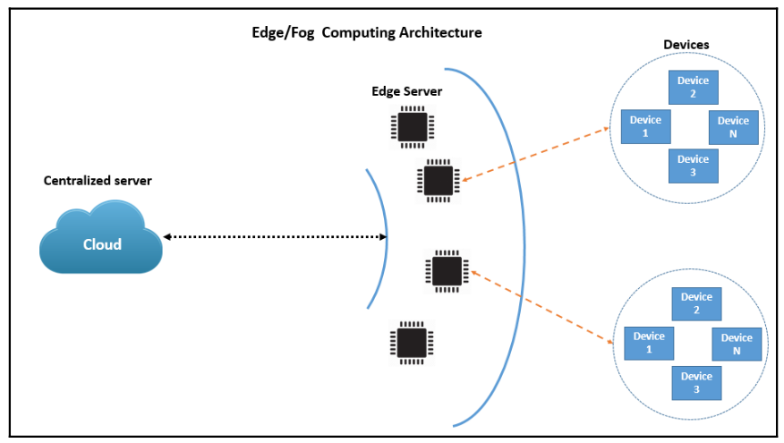
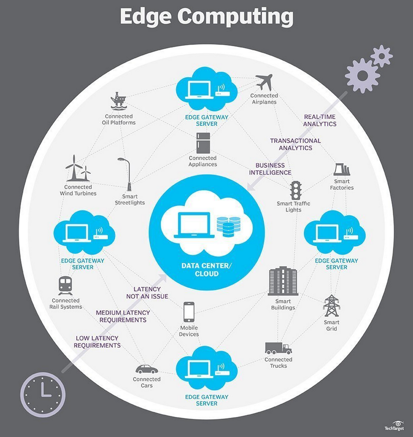
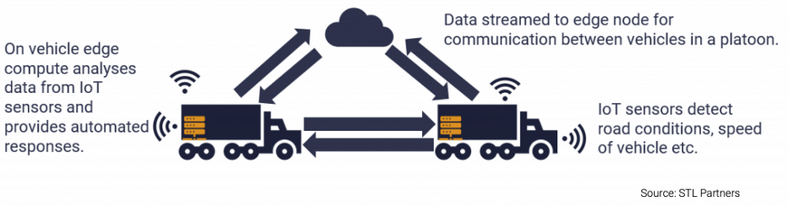

#  How Does Edge Computing Affect the IoT?

Edge Computing allows IoT devices to be more independent, storing, processing, and analyzing data locally instead of just sending it to a centralized server. This can improve the effectiveness of existing IoT devices, and make new devices and deployment topologies possible. 

Edge computing involves moving computing, storage, and networking functions at or near to the physical location of users or data sources. By moving computing services closer to these locations, users benefit from faster, more reliable services and better user experience, and organizations have the ability to deploy new types of latency-sensitive applications.

## Benefits from Edge Computing
- Reduced latency of communication between IoT devices and the central IT networks.
- Faster response times and increased operational efficiency.
- Improved network bandwidth.
- Continued systems operation offline when a network connection is lost.
- Local data processing, aggregation, and rapid decision making via analytics algorithms and machine learning.

## Edge computing and cloud computing

  
   
  <i>Source: Smarter Decisions – The Intersection of Internet of Things and Decision Science</i>

In a cloud computing model, compute resources and services are often centralized at large datacenters. Clouds often provide a portion of the network infrastructure required to connect IoT devices to the internet.

Edge devices require network connectivity to central locations for different purposes: 
    - To allow remote management, 
    - to receive automation instructions, 
    - to forward network telemetry traffic needed for analytics, 
    - to minimize interruptions,
    - To improve scalability,
    - and to send data information which will be lately stored in databases, and analyzed to accomplish business objectives.

The communication provided by a cloud service may just be the transfer of data from an edge device, across a cloud, and into a datacenter—or it could be the edge device sending a log of the decisions it made back to the datacenter for data storage, data management, data processing, or big data analysis.

## Use case examples

  
   

1. Autonomous vehicles

  
   

2. Remote monitoring of assets in the oil and gas industry

3. Smart grid
Sensors and IoT devices connected to an edge platform in factories, plants and offices are being used to monitor energy use and analyse their consumption in real-time. 

4. Predictive maintenance
Monitor machine health with low latencies and perform analytics in real-time.

5. In-hospital patient monitoring
Edge also enables right-time notifications to practitioners of unusual patient trends or behaviours (through analytics/AI), and creation of 360-degree view patient dashboards for full visibility.

6. Cloud gaming
Cloud gaming companies are looking to build edge servers as close to gamers as possible in order to reduce latency and provide a fully responsive and immersive gaming experience.

7. Smart homes

## 3 Edge Computing Architectures
Here are three common options for edge computing architecture:

- Pure edge—deploying all compute resources on-premises. This is suitable for organizations with security or compliance requirements that do not allow sending data to the cloud. This requires a larger initial investment.
    
- Thick edge + cloud—deploying an on-prem data center, cloud-based resources, and edge computing devices. This lets an organization leverage existing investments in on-premise data centers, but use the cloud for aggregating, analyzing, and storing some of the data.
    
- Thin edge + cloud—this approach connects edge resources directly to the public cloud, with no on-premise data center. This is the most lightweight and flexible approach, which also has the lowest upfront costs. But it provides less control over the operating environment and might raise security issues.

## IoT Edge Computing Capabilities

**Consolidated Workloads**

    -  Traditional edge devices have a real time operating system (RTOS), and run proprietary software on top of the RTOS. 
    ‍- Modern IoT devices use a hypervisor that can run multiple operating systems. This makes it possible to flexibly run different workloads on the same IoT device, consolidate workloads on IoT devices, and reduce the physical footprint of each device.

**Pre-Processing and Data Filtering**

    - Traditionally, in an edge computing system a remote server would “poll” edge devices continuously for data, whether there was a recent change or not. 
    - Modern IoT edge computing pre-processes data at the end and sends only relevant data to the cloud. This reduces network bandwidth requirements, improves performance, and reduces the need for massive cloud storage to store IoT logs.

**Scalable Management**

    - Traditional edge devices used outdated serial communication protocols. 
    - Modern edge devices can be connected to a local area network (LAN) or wide area network (WAN), integrating IoT devices into the network ecosystem and enabling central management. This has given rise to edge management platforms that can help manage fleets of edge devices.

**Open Architecture**

    - Traditional edge devices used closed, proprietary architectures. This resulted in vendor lock-in, high integration costs, and high complexity of switching or updating equipment. 
    ‍- Modern edge computing relies on an open architecture with standard protocols such as OPC UA and MQTT, and data structures like Sparkplug that enable open data exchange. This promotes interoperability, easy integration, and agility of edge systems.

**Edge Analytics**

    - Traditional edge devices were typically limited to performing a single task, such as ingesting data or reporting a specific metric. They had limited computing capacity by design.
    - Modern IoT edge systems have much more powerful processing capabilities, which go beyond “dumb” data collection to enable data analysis at the edge. This enables new use cases that require low latency and high data throughput.

**Distributed Apps**

    - Traditional IoT devices typically ran one proprietary application that performed a designated function.
    - Modern IoT edge computing systems de-couple applications from IoT hardware. This makes it possible to move and scale applications vertically (from edge resources to the cloud) and horizontally (from one edge resource to another).

## Role of Machine Learning in IoT Edge Computing

Machine learning (ML) plays a key role in IoT edge runtimes and IoT applications, and many DevOps teams are incorporating machine learning into their application designs. Machine learning allows organizations to analyze and make predictions based on the data stored and processed by IoT devices.

ML application programming interfaces (APIs) can analyze data from IoT devices to identify data patterns, user behavior, trends, and more. By carrying out this analysis at the edge, an organization can reduce the time required for processing, and can continuously update the analysis based on real time data from IoT devices.