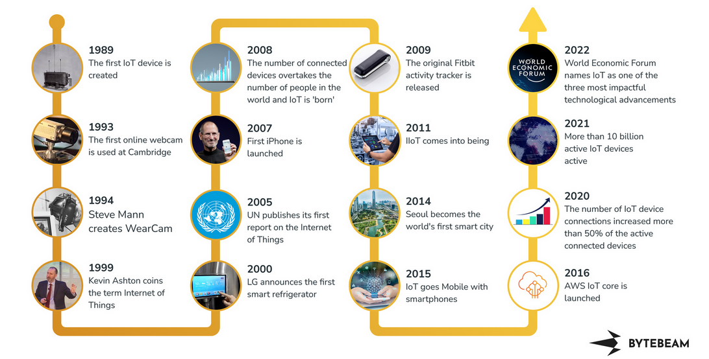
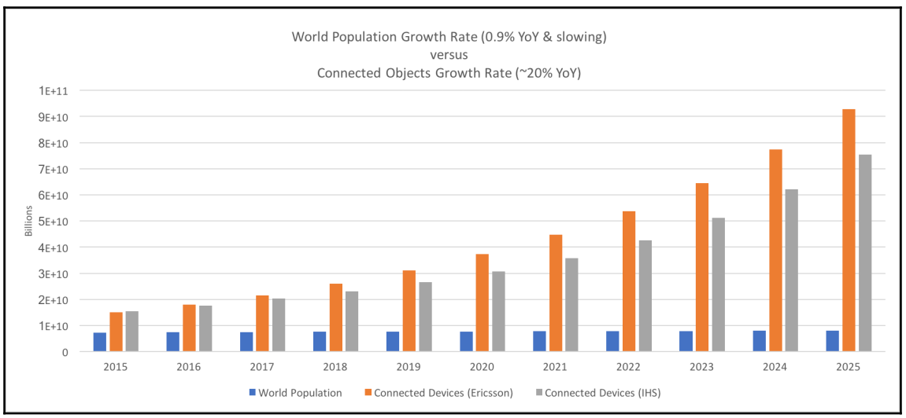

# Internet of Things - a comprehensive timeline

  
   

<a href="https://defence.nridigital.com/global_defence_technology_feb24/timeline-internet-of-things">TimeLine IoT</a>

The average of these 10 analyst forecasts is about 33.4 billion connected things by 2020-2021. ARM recently conducted a study and forecast that by 2035 one trillion connected devices will be operational.

  
   
  <i>Source: Internet of Things for Architects</i>

After the first public website went live at CERN in 1990, it took 15 years to reach 1 billion people on Earth over the Internet. IoT is looking to add 6 billion connected devices per year.

  
   
  <i>Source: Internet of Things for Architects</i>

# Sectors of industry and how IoT will affect them

## Industrial and manufacturing
The Industrial Internet of Things (IIoT) is the collection of:
  - sensors
  - instruments
  - and autonomous devices connected through the internet to industrial applications. 

This network makes it possible to gather data, carry out analyses and optimise production, 
increasing the efficiency and reducing the costs of the manufacturing process and the provision of services.

Current IIoT applications are primarily concentrated in manufacturing, transport and energy, 
with an investment of over 300 billion dollars worldwide in 2019 which is expected to double by 2025.

The difference between the Internet of Things (IoT) and its industrial version (IIoT):
- is that while IoT focuses on services for consumers, IIoT focuses on increasing safety and efficiency at production sites.

IIoT applications and solutions:
- Use of autonomous vehicles (autonomous vehicles that are able to move from one side of the factory to the other by detecting obstacles)
- Optimisation of machine performance
  - An inactive machine represents a loss of revenue. Thanks to sensors and data processing, it is possible to optimise machine utilisation time inside a manufacturing plant.
- Reduction of human errors
- Improvement in logistics and distribution
- Decrease in the number of accidents

## Consumer
Consumer-based devices were one of the first segments to adopt things being connected on
the internet.

  
   

### Consumer IoT use cases
The following are some of the consumer IoT use cases:
- Smart home gadgetry: Smart irrigation, smart garage doors, smart locks, smart
- lights, smart thermostats, and smart security.
- Wearables: Health and movement trackers, smart clothing/wearables.
- Pets: Pet location systems, smart dog doors.

## Retail, financial, and marketing
Retail, financial and marketing IoT impact is already in process, with the goal of lowering sales costs and improving customer experience.

### Retail IoT use cases
- Targeted advertising, such as locating known or potential customers by proximity and providing sales information.
- Beaconing, such as proximity sensing customers, traffic patterns, and inter-arrival times as marketing analytics.
- Asset tracking, such as inventory control, loss control, and supply chain optimizations.
- Cold storage monitoring, such as analyze cold storage of perishable inventory.
Apply predictive analytics to food supply.
- Insurance tracking of assets.
- Insurance risk measurement of drivers.
- Digital signage within retail, hospitality, or citywide.
- Beaconing systems within entertainment venues, conferences, concerts,
amusement parks, and museums.

## Healthcare
The IoT is poised to allow for remote and flexible monitoring of patients wherever they may be. 

Advanced analytics and machine learning tools will observe patients in order to diagnose illness and prescribe
treatments. 

Such systems will also be the watchdogs in the event of needed life-critical care.

Currently, there are about 500 million wearable health monitors, with double-digit growth
in the years to come.

The constraints on healthcare systems are significant:
- From HIPAA compliance to the security of data
- IoT systems need to act like hospital quality tools and equipment. 
- Field systems need to communicate with healthcare centers 24/7
- reliably and with zero downtime if the patient is being monitored at home. 
- Systems may need to be on a hospital network while monitoring a patient in an emergency vehicle.

### Healthcare IoT use cases
Some of the healthcare IoT use cases are as follows:
- In-home patient care
- Learning models of predictive and preventative healthcare
- Dementia and elderly care and tracking
- Hospital equipment and supply asset tracking
- Pharmaceutical tracking and security
- Remote field medicine
- Drug research
- Patient fall indicators

## Transportation and logistics
Transportation and logistics will be significant, if not the leading driver in IoT. 

The use cases involve tracking the asset on devices being delivered, transported, or shipped,
whether that's on a truck, train, plane, or boat. 

This is also the area of connected vehicles that communicate to offer assistance to the driver, or preventative maintenance on behalf of the driver. 

Right now, an average vehicle purchased new off a lot will have about 100 sensors. That number will double as vehicle-to-vehicle communication, vehicle-to-road communication, and automated driving become must-have features for safety or comfort.

### Transportation and logistics IoT use cases
Following are some of the transportation and logistics IoT use cases:
- Fleet tracking and location awareness
- Railcar identification and tracking
- Asset and package tracking within fleets
- Preventative maintenance of vehicles on the road

## Agricultural and environmental
Farming and environmental IoT includes elements of:
  - livestock health
  - land and soil analysis
  - micro-climate predictions
  - efficient water usage
  - energy saving (vs common dumb incandescent lighting)
  - and even disaster predictions

An important global issue is that the demand for food production is set to double by 2035. 
- Using smart lighting to adjust the
spectrum frequency based on poultry age can increase growth rates and decrease mortality
rates based on stress on chicken farms.
- Detecting livestock health based on sensor movement and positioning
- Find animals with the propensity of sickness before a bacterial or viral
infection were to spread

### Agricultural and environmental IoT use cases
Some of the agricultural and environmental IoT use cases are as follows:
- Smart irrigation and fertilization techniques to improve yield
- Smart lighting in nesting or poultry farming to improve yield
- Livestock health and asset tracking
- Preventative maintenance on remote farming equipment via manufacturer
- Drones-based land surveys
- Farm-to-market supply chain efficiencies with asset tracking
- Robotic farming
- Volcanic and fault line monitoring for predictive disasters

## Energy
This segment includes the monitoring of energy production at source to and through
the usage energy at the client. 
 - A significant amount of research and development has
focused on consumer and commercial energy monitors such as smart electric meters that
communicate over low-power and long-range protocols to reveal real-time energy usage.
- Many energy production facilities are in remote or hostile environments such as desert
regions for solar arrays, steep hillsides for wind farms, and hazardous facilities for nuclear
reactors.
  - data may need real-time or near real-time response for critical
response to energy production control systems

### Energy IoT use cases
The following are some of the use cases for energy IoT:
- Oil rig analysis of thousands of sensors and data points for efficiency gains
- Remote solar panel monitoring and maintenance
- Hazardous analysis of nuclear facilities
- Smart electric meters in a citywide deployment to monitor energy usage and
demand
- Real-time blade adjustments as a function of weather on remote wind turbines

## Smart city
Smart cities are one of the fastest growing segments, and show substantial cost/benefit ratios.
Smart cities also touch citizens' lives through safety, security, and ease of use.
  - cities such as Barcelona are fully connected and monitor trash containers and bins for pickup
based on the current capacity, but also the time since the last pickup.

One of the characteristics of smart city deployment may be the number of sensors used:
  - For example, a smart camera installation on each street corner in New York would require over
3,000 cameras.
  - A city such as Barcelona will deploy nearly one million
environmental sensors to monitor electric usage, temperature, ambient conditions, air
quality, noise levels, and parking spaces (quantity and bandwidth).

### Smart city IoT use cases
Some of the smart city IoT use cases are as follows:
- Pollution control and regulatory analysis through environmental sensing
- Microclimate weather predictions using citywide sensor networks
- Efficiency gains and improved costs through waste management service on demand
- Improved traffic flow and fuel economy through smart traffic light control and patterning
- Energy efficiency of city lighting on demand
- Smart snow plowing based on real-time road demand, weather conditions, and nearby plows
- Smart irrigation of parks and public spaces, depending on weather and current usage
- Smart cameras to watch for crime and real-time automated AMBER Alerts
- Smart parking lots to automatically find best space parking on demand
- Bridge, street, and infrastructure wear and usage monitors to improve longevity and service

## Government and military
Take California's executive order B-30-15 which states that by 2030 greenhouse gas emissions affecting global
warming will be at levels 40 percent below 1990 levels. 
- The government's role in the IoT also comes into play in the form of standardization,
frequency spectrum allocation, and regulations. Take, for example, how the frequency space
is divided, secured, and portioned to various providers.

### Government and military IoT use cases
Following are some of the government and military IoT use cases:
- Terror threat analysis through IoT device pattern analysis and beacons
- Swarm sensors through drones
- Sensor bombs deployed on the battlefield to form sensor networks to monitor threats
- Government asset tracking systems
- Real-time military personal tracking and location services
- Synthetic sensors to monitor hostile environments
- Water level monitoring to measure dam and flood containment