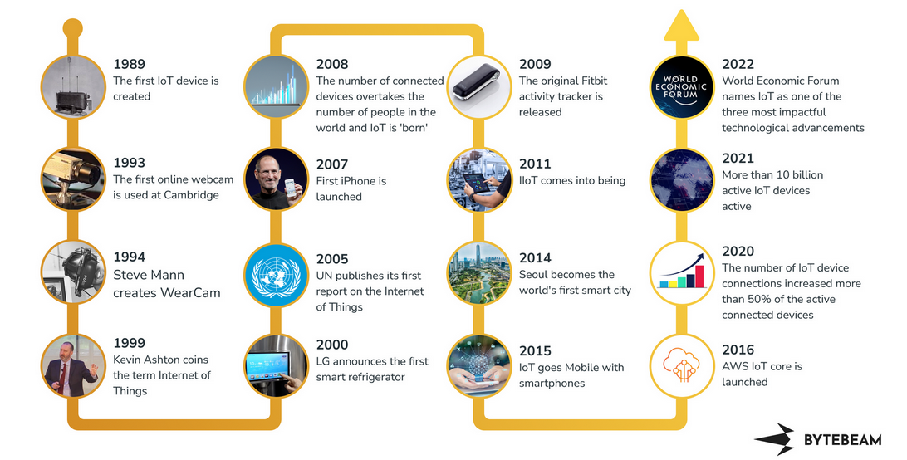
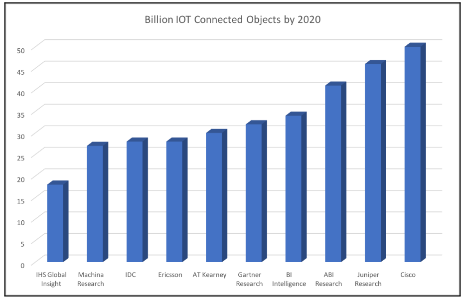
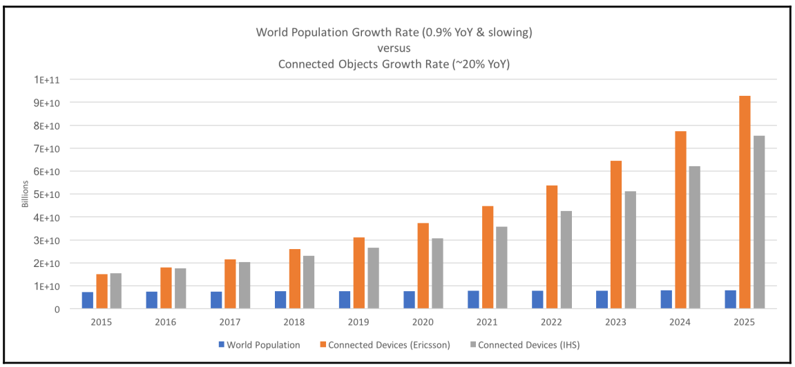

# Internet of Things - a comprehensive timeline

  
   

<a href="https://defence.nridigital.com/global_defence_technology_feb24/timeline-internet-of-things">TimeLine IoT</a>

The average of these 10 analyst forecasts is about 33.4 billion connected things by 2020-2021. ARM recently conducted a study and forecast that by 2035 one trillion connected devices will be operational.

  
   
  <i>Source: Internet of Things for Architects</i>

After the first public website went live at CERN in 1990, it took 15 years to reach 1 billion people on Earth over the Internet. IoT is looking to add 6 billion connected devices per year.

  
   
  <i>Source: Internet of Things for Architects</i>

# Sectors of industry and how IoT will affect them

## Industrial and manufacturing
