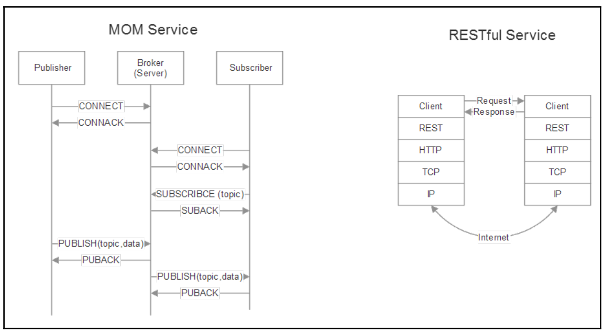
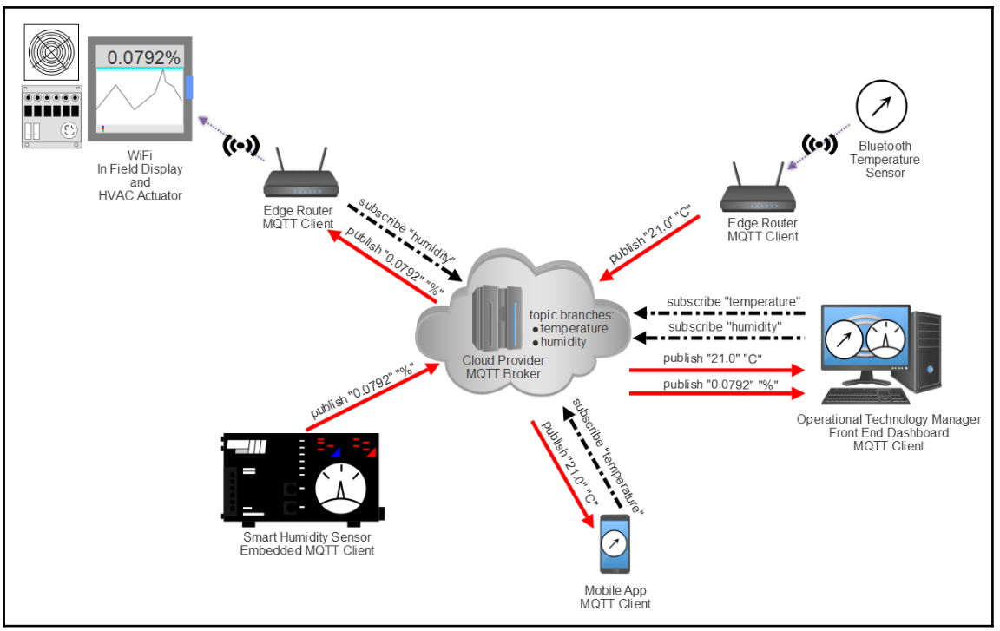
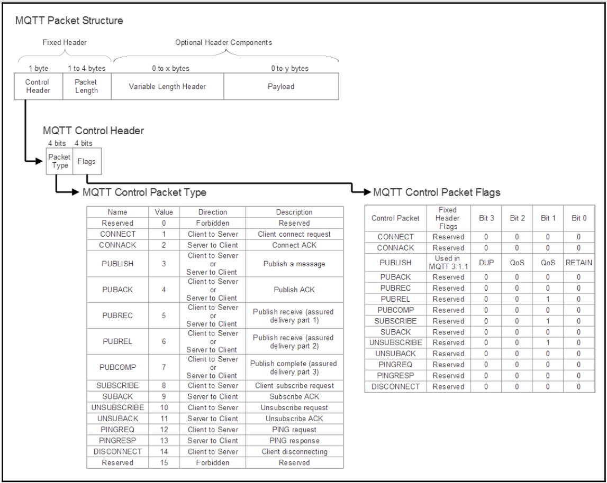
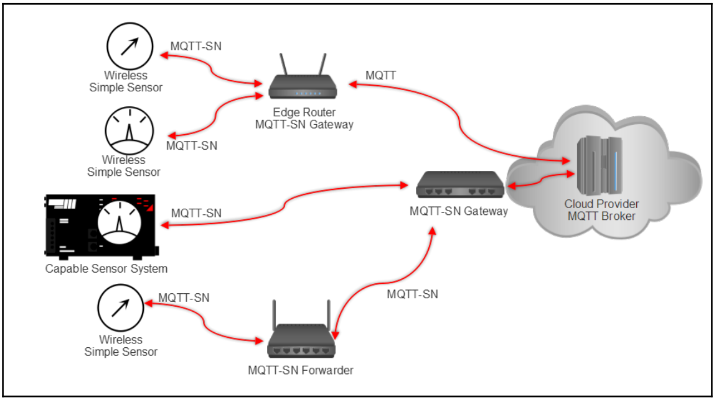

# IoT Edge to Cloud Protocols 
Why are there any protocols outside of HTTP to transport data across the WAN? 

HTTP has provided significant services and abilities for the internet for over 20
years, yet was designed and architected for general purpose computing in client/server
models. 

IoT devices can be very constrained, remote, and bandwidth limited. Therefore,
more efficient, secure, and scalable protocols are necessary to manage a plethora of devices
in various network topologies such as mesh networks.

The protocols listed here are **Message Orientated Middleware (MOM)** implementations. The basic idea of a MOM is that communication between two devices takes places using distributed message queues.

Some devices produce data to be added to a queue while others consume data stored in a queue. Some implementations require a broker or middleman be the central service. 

In that case, producers and consumers have a publish and subscribe-type relationship with the broker. AMQP, MQTT, and STOMP are MOM.

  
   

## MQTT  (MQ Telemetry Transport)
A derivative of the WebSphere Message Queue (1993) was authored by Andy Stanford-Clark and Arlen Nipper at IBM in 1999 to address the particular constraints of connecting remote oil and gas pipelines over a satellite connection. That protocol became known as the MQTT.

The goals of this IP-based transport protocol are:
- It must be extremely simple to implement
- Designed for constrained devices
- To provide a form of quality of service
- To be very lightweight and bandwidth efficient or unreliable networks
- To be data agnostic
- To have continuous session awareness
- To address security issues
- Publish/subscribe

MQTT was an internal and proprietary protocol for IBM for many years until being released
in version 3.1 in 2010 as a royalty-free product. In 2013, MQTT was standardized and
accepted into the OASIS consortium.

### MQTT publish-subscribe
Also known as pub/sub, is a way to decouple a client transmitting a message from another client receiving a message.

MQTT is a pub/sub architecture, but is not a message queue. Message queues by nature store messages while
MQTT does not. 

In MQTT, if no one is subscribing (or listening) to a topic, it is simply ignored and lost.

The Publish-subscribe pattern is a messaging pattern that decouples the clients that send messages (publishers) from the clients that receive messages (subscribers) by allowing them to communicate without having direct connections or knowledge of each other's existence.

  
   
  <i>Source: Internet of Things for Architects</i>

MQTT successfully decouples publishers from consumers. Since the broker is the governing body between publishers and consumers there is no need to directly identify a publisher and consumer based on physical aspects (such as an IP address).

Cloud-managed MQTT brokers typically can ingest millions of messages per hour and support tens of thousands of publishers.

MQTT is data format agnostic. 

Any type of data may reside in the payload which is why
both the publishers and subscribers must both understand and agree to the data format. 

It is possible to transmit text messages, image data, audio data, encrypted data, binary data,
JSON objects, or virtually any other structure in the payload. 

JSON text and binary data, however, are the most common data payload types.

The maximum allowable packet size in MQTT is 256 MB, which allows for 
an extremely large payload.

### MQTT architecture details

- MQTT is TCP based, and therefore includes some guarantee that a packet is transferred reliably.

- MQTT is also an asymmetric protocol:

| Feature             | Symmetric Protocol        | Asymmetric Protocol     |
|----------------------|-------------------------------------------|----------------------------------------|
| **Roles**           | All participants have similar roles       | Differentiated roles: Client and Server|
| **Interaction**      | Egalitarian, horizontal                   | Hierarchical, initiated by the client  |
| **Initiative**       | Anyone can initiate communication        | The client initiates the request      |
| **Control**          | Distributed among participants           | Centralized on the server             |
| **Examples**         | P2P, some instant messaging protocols    | Client-Server, web, email            |

- There are no message queues inherent in the protocol. While it is possible to queue messages, it's not necessary and often not done. This mode of operation is controlled by a flag on a normal message transmission.

- Last Will and Testament (LWT)
MQTT (Message Queuing Telemetry Transport), the **Last Will and Testament (LWT)**, also known as the **Will Message**, is a feature that allows a client to inform other clients about its unexpected disconnection. Essentially, it's a predefined message that the MQTT broker will publish on a specific topic if the client disconnects in an unplanned manner.

    - LWT Configuration:
        - When a client connects to the MQTT broker, it can optionally specify an LWT.
        - This LWT consists of three components:
            -   **Topic:** The topic where the message will be published.
            -   **Payload:** The message to be published (can be text, binary data, etc.).
            -   **QoS (Quality of Service):** The quality of service level (0, 1, or 2) with which the message will be published.

    - How LWT Works
        1.  **LWT Configuration:**
            - When a client connects to the MQTT broker, it can optionally specify an LWT.
            - This LWT consists of three components:
                -   **Topic:** The topic where the message will be published.
                -   **Payload:** The message to be published (can be text, binary data, etc.).
                -   **QoS (Quality of Service):** The quality of service level (0, 1, or 2) with which the message will be published.

        2.  **Successful Connection:**
            - If the client's connection to the broker is successful, the LWT is stored in the broker.
            - The broker does not publish the LWT message at this point.

        3.  **Unexpected Disconnection:**
            - If the client disconnects from the broker unexpectedly (e.g., due to network failure, software crash, or abrupt shutdown), the broker detects the disconnection.
            - At this time, the broker will publish the LWT message on the specified topic, using the defined QoS level.

        4.  **Clean Disconnection:**
            - If the client disconnects from the broker correctly by sending a `DISCONNECT` message, the LWT is **not** published. In this case, it is considered a planned and controlled disconnection.

    - Why is LWT Important?

        *   **Failure Detection:** LWT is crucial for detecting device and connection failures in an IoT (Internet of Things) system. It allows other system components to know when a client has unexpectedly stopped working.

        *   **Alerts and Monitoring:** LWT can be used to generate alerts when a device fails or disconnects. Monitoring systems can subscribe to the LWT topic to track device availability.

        *   **Maintenance and Diagnostics:** LWT facilitates the identification of problems in the system, as it provides information about which devices are working and which are not.

        *   **Recovery Actions:** In some cases, LWT can trigger recovery actions, such as attempting to restart a device or sending a notification to an administrator.

    - Practical Example**

        Imagine a temperature sensor that connects to an MQTT broker.

        -   **Client (Sensor):**
            -   Connects to the broker with an LWT configured:
                -   **Topic:** `sensors/status/sensor1`
                -   **Payload:** `Offline`
                -   **QoS:** 1
        -   **Broker:**
            -   Stores the LWT.
        -   **Client (Monitor):**
            -   Subscribed to the `sensors/status/sensor1` topic.
        -   **Normal Operation:**
            -   The sensor periodically sends temperature readings to other topics.
            -   The monitor receives these readings.
        -   **Sensor Failure:**
            -   The sensor disconnects unexpectedly.
        -   **Broker:**
            -   Publishes the LWT message `Offline` on the `sensors/status/sensor1` topic.
        -   **Client (Monitor):**
            -   Receives the `Offline` message, knowing that the sensor has failed.
            -   Can generate an alert or take other actions.

- keep-alive:
    - MQTT broker and client have assurance that the
    connection is still valid even if there hasn't been a transmission for some time. The client
    sends a PINGREQ packet to the broker, which in turn acknowledges the message with a
    PINGRESP.

    - If a message has not been
    transmitted from either within a predetermined time limit, a keep-alive packet should be
    sent. Both a PINGREQ or a message will reset the keep-alive timer.

    - The maximum keep alive time is 18 hours, 12 minutes and 15 seconds.
    Setting the keep-alive internal to 0 will disable the keep-alive functionality.

    - There are three levels of quality of service in MQTT:
        - QoS-0 (non-assured transmission): It is a best-effort delivery process
        - Qos-1 (assured transmission): This mode will guarantee delivery of the message at least once to the receiver.
        - QoS-2 (assured service on applications): This is the highest level of QoS that ensures and informs both the sender and receiver that a message has been transmitted correctly  (generates more traffic)

    - Typical use cases:
        - QoS-0: Should be used when message queuing isn't needed. It is best for wired connections or when the system is severely constrained on bandwidth.
        - Qos-1: This should be the default usage. QoS1 is much faster than QoS2 and greatly reduces transmission cost.
        - QoS-2: For mission-critical applications. Also, cases where retransmission of duplicate message could cause faults.

  
   
  <i>Source: Internet of Things for Architects</i>

### MQTT-SN
MQTT-SN (MQTT for Sensor Networks) is a simplified version of the MQTT protocol, specifically designed for use in resource-constrained sensor networks, such as low-power, wide-area networks (LPWANs). Unlike standard MQTT, which is oriented towards reliable TCP/IP connections, MQTT-SN is intended to operate in networks where communication is more challenging, with unstable connections and limited bandwidth.

## Key Features of MQTT-SN:

1.  **Low-Power, Wide-Area Networks (LPWAN):**
    *   MQTT-SN is optimized for networks where devices typically operate on batteries, with limited processing and memory resources, and where connectivity is intermittent.
    *   It is designed for link layer protocols such as LoRaWAN, Zigbee, Bluetooth LE, etc., which are common in IoT environments.

2.  **Flexible Transport:**
    *   While MQTT relies on TCP/IP, MQTT-SN is transport-agnostic. This allows it to operate over protocols like UDP, making it lighter and more efficient for resource-constrained networks.

3.  **Topic ID Management:**
    *   In MQTT, topics are sent as complete strings. In MQTT-SN, topics can be replaced by short numerical identifiers, which are established during the connection process, thus reducing data overhead in low-bandwidth networks.

4.  **Reduced Message Overhead:**
    *   MQTT-SN introduces mechanisms to reduce the size of message headers, which is crucial when operating in networks where every byte counts.
    *   This includes the use of shorter message identifiers.

5.  **Offline Operation:**
    *   MQTT-SN devices can operate in offline mode for periods, and messages are stored until the connection is re-established, ensuring reliable delivery even under intermittent connectivity conditions.

6.  **Sleep and Wake-Up Functionalities:**
    *   To save power, MQTT-SN devices can enter a low-power (sleep) mode when they do not need to communicate, and they can wake up when they need to send or receive data.

## Key Differences between MQTT and MQTT-SN:

| Feature              | MQTT                                 | MQTT-SN                              |
| -------------------- | ------------------------------------ | ------------------------------------ |
| **Transport**         | TCP/IP                               | Transport-agnostic (UDP, etc.)       |
| **Target Networks**    | IP networks, fixed infrastructure   | Sensor networks, LPWANs              |
| **Resources**        | Moderate resource requirements      | Limited resource requirements         |
| **Message Size**     | Full headers and topics             | Compressed headers and topics         |
| **Connection**       | Persistent connections               | Possibility of intermittent connections|
| **Sleep Support**   | Limited                              | Native and designed for power saving |
| **Topic Management** | Text strings                        | Numerical identifiers               |

  
   
  <i>Source: Internet of Things for Architects</i>

Wireless sensors communicate either to MQTT-SN gateways, which translate MQTT-SN to MQTT, to other protocol forms

---

## CoAP Protocol Overview for IoT

CoAP (Constrained Application Protocol) is a specialized web application protocol designed for resource-constrained IoT devices, similar to HTTP but with a simpler and more efficient architecture. It focuses on communication between devices with limitations in terms of power, memory, and bandwidth, making it ideal for sensor networks, embedded devices, and other IoT environments.

**Key Characteristics of CoAP:**

*   **Client-Server Architecture:** Like HTTP, CoAP uses a client-server model for data exchange. Clients send requests to servers, which respond with the requested information.

*   **RESTful Communication Model:** CoAP adopts the REST (Representational State Transfer) architectural style, which organizes resources as entities that are accessed through well-defined operations (methods) (GET, POST, PUT, DELETE).

*   **Lightweight Protocol:** CoAP is distinguished by its lightweight nature, using smaller messages and a simplified structure compared to HTTP. This is crucial for networks with limited bandwidth and devices with limited processing capabilities.

*   **UDP-Based:** Unlike HTTP (which uses TCP), CoAP is built on top of UDP. This minimizes transmission overhead, although it requires additional mechanisms to ensure reliable message delivery (which CoAP manages).

*   **HTTP-like Functionalities:** CoAP implements many HTTP functionalities, such as request methods (GET, POST, PUT, DELETE), response codes, content negotiation (Content-Type), and URI management.

*   **Observe Feature:** CoAP includes a feature called "Observe," which allows clients to subscribe to a resource on a server and receive notifications of changes in that resource without having to make repeated requests.

*   **Security with DTLS:** To secure communications, CoAP uses DTLS (Datagram Transport Layer Security), a version of TLS designed for UDP.

*   **URI Usage:** CoAP uses URIs to identify resources, similar to HTTP, although with some differences in how resource paths are defined.

*   **Request Methods:**
    *   `GET`: Retrieves information from the specified resource.
    *   `POST`: Creates a new resource on the server.
    *   `PUT`: Updates an existing resource.
    *   `DELETE`: Removes a resource.

*   **Response Codes:** Servers respond to requests with response codes that indicate the status of the operation (e.g., 200 OK, 404 Not Found).

*   **Binary Message Format:** CoAP messages are binary, which makes them more compact than text-based HTTP messages, reducing the required bandwidth.

**Main Advantages of CoAP for IoT:**

*   **Efficiency:** Efficient use of resources, ideal for devices with limited memory and power.
*   **Low Overhead:** Reduction of message headers and the use of UDP, which minimizes bandwidth consumption.
*   **Low Latency:** The use of UDP reduces latency compared to TCP, which is important for real-time applications.
*   **Multicast Support:** CoAP supports multicast communication, which allows sending messages to multiple devices simultaneously, optimizing bandwidth usage.
*   **Web Integration:** CoAP is designed to easily integrate with the web ecosystem, allowing interaction between IoT devices and web applications.

**Common Use Cases:**

*   **IoT Sensors:** Collecting data from environmental, industrial, and health sensors.
*   **Actuators:** Controlling devices such as lights, motors, and valves.
*   **Smart Buildings:** Managing heating, ventilation, and lighting systems.
*   **Smart Cities:** Monitoring traffic, parking, and waste.
*   **Industrial Automation:** Controlling processes and machinery in factories.

**Quick Comparison with HTTP:**

| Feature           | CoAP                              | HTTP                              |
| ----------------- | --------------------------------- | --------------------------------- |
| **Transport**       | UDP (with TCP option)             | TCP                               |
| **Resources**     | Optimized for limited resources   | Higher resource requirements      |
| **Message Size**   | Small, binary                     | Larger, text-based               |
| **Main Use**      | IoT, constrained devices         | Web, general applications       |
| **Latency**        | Low                                | Higher                            |

**In Summary:**

CoAP is a protocol designed to simplify communication in the IoT domain. By offering an efficient alternative to HTTP for resource-constrained devices, CoAP enables the creation of more scalable and low-power IoT applications. Its RESTful model, along with its observation and security mechanisms, makes it a solid option for managing and controlling devices in connected environments.

--- 

## AMQP Protocol Overview for IoT

AMQP (Advanced Message Queuing Protocol) is a standard application-level messaging protocol designed for communication between different systems. While not specifically created for IoT, its robustness, flexibility, and reliability make it a viable option for certain IoT scenarios where more advanced messaging is required than what lighter protocols offer.

**Key Features of AMQP for IoT:**

1.  **Message-Oriented:** AMQP operates under a message-oriented model, where information is exchanged in the form of individual messages. This makes it ideal for applications where data is discrete and not necessarily transmitted in continuous streams.

2.  **Message Exchange Model:**
    *   **Exchanges:** Receive messages from publishers and send them to message queues based on routing rules.
    *   **Queues:** Store messages until they are processed by consumers.
    *   **Bindings:** Define how messages are routed from exchanges to queues, based on criteria such as "routing keys".

3.  **Robust Quality of Service (QoS):** AMQP offers sophisticated mechanisms to ensure message delivery, even in environments with network problems:
    *   **At-Least-Once Delivery:** Ensures that a message is delivered at least once, although duplicates may occur.
    *   **Exactly-Once Delivery:** Guarantees that a message is delivered exactly once, without duplicates.
    *   **Delivery Confirmations:** Publishers can confirm the successful delivery of a message.

4.  **Flexible Routing:** AMQP exchanges enable flexible routing of messages to queues:
    *   **Direct Exchange:** Routes messages to queues based on a specific "routing key".
    *   **Fanout Exchange:** Sends copies of a message to all queues bound to the exchange.
    *   **Topic Exchange:** Routes messages based on patterns ("wildcards") in the "routing key".
    *   **Headers Exchange:** Routes messages based on the attributes of the message headers.

5.  **Security:** AMQP supports the use of TLS/SSL to encrypt communications and provides mechanisms for authentication and authorization, essential for data security in IoT environments.

6.  **Reliability:** AMQP is designed to ensure the reliability of message delivery, handling reconnections, delivery failures, and storage in memory or disk when necessary.

7.  **Languages and Platforms:** There are libraries and support for AMQP in multiple programming languages and platforms, which facilitates its integration into different ecosystems.

8.  **Message Persistence:** Messages can be stored persistently in queues on disk, ensuring they are not lost in case of system failures.

9.  **Session Management:** AMQP manages sessions between clients and servers, which allows for more efficient management of connections and resources.

**Advantages of AMQP for IoT:**

*   **Messaging Reliability:** Ensures message delivery, even in unstable networks or when there are connectivity problems.
*   **Advanced Routing:** Provides great flexibility in routing messages to different recipients based on specific criteria.
*   **Robust Security:** Offers security mechanisms to protect data in transit and control access to information.
*   **Scalability:** Allows managing large volumes of data and a large number of devices with a robust and scalable architecture.
*   **Interoperability:** As a standard protocol, it facilitates interoperability between different platforms and applications.

**Disadvantages of AMQP for IoT:**

*   **Higher Complexity:** It is more complex to implement than other lighter protocols like MQTT or CoAP.
*   **Higher Resource Usage:** Requires more processing, memory, and bandwidth resources compared to lighter protocols.
*   **Not as Suitable for Highly Resource-Constrained Devices:** It may not be the best option for sensors with very limited resources, as its requirements may be too high.

**Common Use Cases in IoT:**

*   **Industrial Applications:** Control and supervision systems for industrial plants where reliable and quality-of-service communication is required.
*   **Logistics Systems:** Tracking assets and managing fleets with reliable delivery of information between devices and servers.
*   **Smart City Applications:** Reliable collection and analysis of sensor data, even under variable connectivity conditions.
*   **Data Integration:** Connecting different IoT systems that need to share information consistently and reliably.
*   **Large-Scale Device Control:** Managing a large number of devices in an organized and scalable manner.

**Quick Comparison with MQTT:**

| Feature              | AMQP                                | MQTT                                  |
| -------------------- | ----------------------------------- | ------------------------------------- |
| **Messaging Model**   | Exchanges, Queues, Bindings         | Publish/Subscribe (Broker/Topic)      |
| **QoS**             | More sophisticated, varied options  | Simple (0, 1, 2)                     |
| **Routing**          | Flexible, multiple options         | Simple, based on topics             |
| **Security**         | TLS/SSL, robust authentication      | TLS/SSL, basic authentication        |
| **Resources**        | Higher resource requirements        | Lower resource requirements           |
| **Use Cases**      | More robust for complex systems    | Lighter for constrained environments |

**In Summary:**

AMQP is a robust and flexible protocol for messaging in IoT applications that require high reliability in message delivery, flexible routing, and robust security. While it may not be ideal for all IoT use cases due to its complexity and resource requirements, it is an excellent option for larger, more complex systems where reliability is a priority.