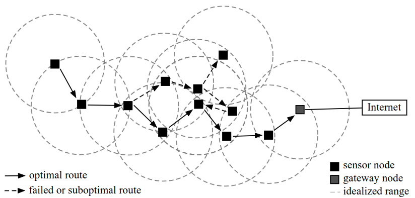
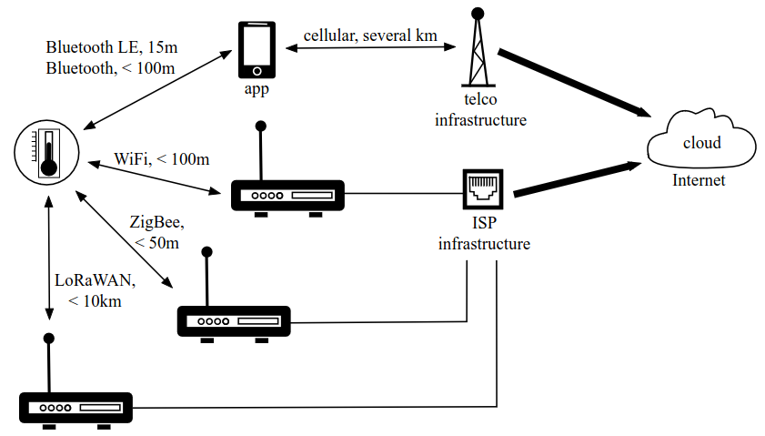
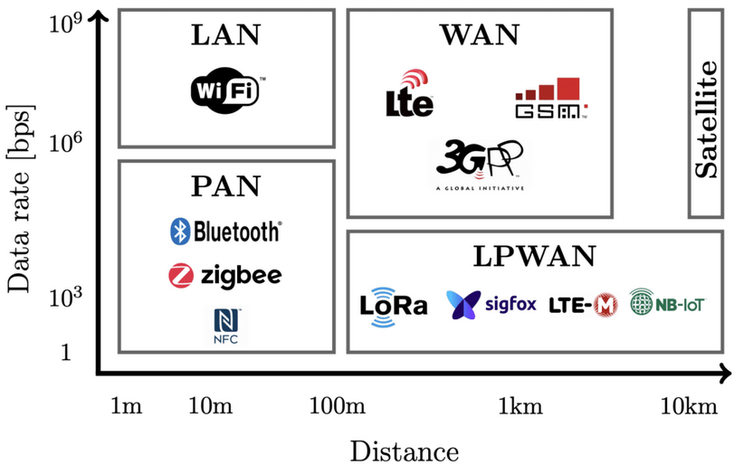

The IoT is a conglomeration of many disparate devices autonomously producing and/or
consuming data on the very far edge of layers of networks and protocols. It is important to
understand the constraints in building communication systems for the IoT or any form of
networking. The internet of things will combine personal area networks, local area
networks, and long-range wide area networks into a web of communication channels.

# IoT Requirements for Networking Protocols 

## Constrained Devices

In IoT, devices are usually small and limited in processing, memory and power. These are called constrained devices. A constrained device is limited in one or more of the following dimensions: 

- Maximum code complexity (ROM/Flash).
- Size of run-time state and buffers (RAM).
- Amount of computation feasible in a specific period of time ("processing power”).
- Available power resources.
- Management of user interface and accessibility in deployment (ability to set security keys, update software, etc.)

IETF RFC 7228 defines a taxonomy of constrained devices based on the first two
dimensions above, which recognizes three classes of devices:

  
   
  <a href="https://datatracker.ietf.org/doc/html/rfc7228">Terminology for Constrained-Node Networks</a>

- **Class 0 devices** are the most severely constrained in memory and processing
power. In general, such devices do not have the resources to connect to an IP network directly and will leverage the services of helper devices such as proxies or gateways for connectivity.
- **Class 1 device** are highly constrained in terms of code space and processing
capacity; however they are capable of connecting to an IP network directly.
- **Class 2 devices** are less constrained when compared to the first two classes and
are capable of running the same IP stack that runs on general compute nodes today.

Another dimension that characterizes constrained devices is power and/or energy
resource constraints. These could be attributed to a number of factors such as the
device size, primary mode of use, cost, operational environment, etc.

Energy consumption is a major issue for IoT devices. Research studies suggest that
communication is over three orders of magnitude more expensive in terms of energy
consumption than performing local processing functions.

To this reason, a common strategy employed by power-constrained devices is to remain in sleep mode with no network connectivity for extended periods of time and to connect only long enough to send the local data
either based on periodic timers or asynchronous triggers (e.g., when new data is
present or an event is detected).

## Massive Scalability

### Device Addressing
the IoT vision requires that a global
IP address be assigned to each one of the billions of devices that will be connected.
Taking into account the fact that the IPv4 address space was completely depleted by
February 1, 2011, it becomes clear that the massive scalability of the IoT will accelerate the transition of the Internet to IPv6.

### Security Credentials Management
Shared key distribution, certificate management, etc.) poses a significant challenge in today’s Internet.
The massive scalability of the IoT calls for lightweight, low-touch, and highly automated credentials management   mechanisms.

### Control Layer
The Internet uses various control protocols to discover topology, communicate connectivity, signal sessions, and ensure quality of service. These protocols synchronize information between nodes through messages. The number of nodes and messages increases when scaling, affecting resources and response times. IoT scalability requires control mechanisms adaptable to the large number of devices. Scaling control protocols without proper design can cause issues.

### Wireless Spectrum
The global network of objects, sensors, actuators, etc. must be connected to the Internet in some way, and in many cases wirelessly.
The  wireless spectrum is a finite resource.

## Determinism
IoT opens up the door for supporting use cases that demand mission critical networking with high requirements for real-time response as well as overall network, protocol, and device robustness.

Real-time information transfer: the time it takes for each packet to traverse a path from its source to its
destination should be determined; that is, the process must be deterministic.

## Security and Privacy
The widespread use of IoT across all aspects of life makes security and privacy crucial. Connecting traditionally offline systems to the internet exposes them to increasing and sophisticated attacks, impacting various industries with potentially severe consequences, even loss of life. While IoT threats may seem similar to traditional IT threats, their impact is often more profound, emphasizing the importance of threat analysis and risk assessment in IoT.

One of the main problems is that current security algorithms demand processing power that IoT devices do not have. 

# Common IoT Architectures
There is no one-size-fits-all solution for IoT architectures. In many cases, the choice between a mesh network, a star topology with a local network, or a direct data connection over the cellular network (or combinations thereof) depends on the particular constraints of an application. Each architecture has advantages and disadvantages.

## Mesh Networks
Mesh networks are useful for deployments in large but spatially restricted areas
where devices are placed at relatively high density. Typical applications are meshed
sensor networks, in which each device combines the ability to take measurements
and send data, but also to receive and forward incoming radio messages. 

  
   
  <i>eBook: The Technical Foundations of IoT, Adryan, Boris; Obermaier, Dominik; Fremantle, Paul, 2017.</i>

Mesh network. Sensor nodes (black squares) propagate measurements along various
routes with their radio range (indicated by dashed circles). On the way to a gateway node (gray square)
that mediates the connection to the Internet, there are many failing or suboptimal routes for a data
package. In order to prevent lag times, the optimal route is often remembered and reutilized.

A great advantage of the mesh is that there is no single-point-of-failure.

The biggest disadvantage of mesh networks is the relatively low data throughput. Effective meshing requires frequent hops between radio channels to avoid collisions between neighboring nodes and the utilization of half-duplex time synchronised send-and-receive patterns.

## Local Gateway
The two most common options are tethering IoT end devices to (a)
mobile phones via BLE or (b) to local gateways such as WiFi routers or hubs
supporting other types of radio standards

  
   
  <i>eBook: The Technical Foundations of IoT, Adryan, Boris; Obermaier, Dominik; Fremantle, Paul, 2017.</i>

Most phone-based solutions build on standard BLE chip sets, for which
mature hardware and stable software stacks exist. The phone then passes data from
BLE to the Internet via WiFi or available cellular data connection, and vice versa.
Modern phones also have a degree of compute power, allowing for processing and
caching before that forwarding takes place.

## Direct Connection
In contrast to the gateway approach using a mobile phone and BLE, here
the end device itself holds a communication module and subscriber identity module
(SIM) or equivalent to connect to the cellular network. 

In areas where there is no cellular network, satellite communication may
represent a feasible option for data connections. While expensive in operation
and dependent on special hardware, these modems link to a satellite via a surface
antenna. The routing of data through satellite connections leads to relatively high
latency, but especially in case of one-way data communication this can sometimes
be neglected.

# The most common IoT Wireless communication protocols

  
   
  <a href="https://emanuelepagliari.it/2020/10/13/internet-of-things-wireless-communication-protocols/">The most common IoT Wireless communication protocols</a>

## Non-IP WPAN Protocols (Wireless personal area Networks standards)

In the context of Wireless Personal Area Networks (WPAN) for IoT, several non-IP based protocols are significant. Here are some of the most relevant, along with their operating frequencies and approximate ranges:

#### 1. Bluetooth Low Energy (BLE)
*   **Frequency:** 2.4 GHz (ISM - Industrial, Scientific, and Medical band).
*   **Range:** Generally 10 to 100 meters, though it can vary based on the device's power class and environmental conditions. BLE is known for its energy efficiency.
*   **Common Uses:** Low-power sensors, wearables, beacons, health devices, asset tracking.
*   **Key Features:** Low power consumption, low-latency connections, simple implementation.

#### 2. Zigbee
*   **Frequency:** 2.4 GHz (primarily), 915 MHz (in some regions), and 868 MHz (in Europe).
*   **Range:** Typically 10 to 100 meters. Can be extended with repeaters or mesh network devices.
*   **Common Uses:** Home automation, industrial control, wireless sensor networks, smart lighting.
*   **Key Features:** Mesh networking, low power consumption, high scalability.

#### 3. Z-Wave
*   **Frequency:** Varies by region but is usually around 868 MHz (Europe), 908 MHz (US), 919 MHz (Australia).
*   **Range:** Approximately 30 meters. Range can be extended with repeaters.
*   **Common Uses:** Home automation, lighting control, home security.
*   **Key Features:** Low power consumption, designed for home automation networks, interoperability between devices.

#### 4. ANT/ANT+
*   **Frequency:** 2.4 GHz.
*   **Range:** Typically up to 30 meters.
*   **Common Uses:** Sports and fitness devices (heart rate monitors, cadence sensors), health and wellness.
*   **Key Features:** Low power consumption, highly optimized for monitoring and fitness devices.

#### 5. Thread
*   **Frequency:** 2.4 GHz.
*   **Range:** Similar to Zigbee and BLE, typically 10 to 100 meters, with extension possible via mesh networks.
*   **Common Uses:** Home automation, smart buildings, sensor networks.
*   **Key Features:** Low-power IP network (though considered non-IP at its lowest layer), robust, scalable, built-in security.

#### 6. NFC (Near Field Communication)
*   **Frequency:** 13.56 MHz.
*   **Range:** Very short, typically up to 4-10 cm.
*   **Common Uses:** Contactless payments, device pairing, information exchange, access control.
*   **Key Features:** Very short-range communication, very low power, ideal for authentication and tasks requiring physical proximity.

#### 7. Sigfox
*   **Frequency:** Sub-GHz (generally 868 MHz in Europe, 915 MHz in North America).
*   **Range:** Several kilometers up to 50km in rural environments with good propagation.
*   **Common Uses:** Asset tracking, telemetry, environmental monitoring, smart agriculture.
*   **Key Features:** Low Power Wide Area Network (LPWAN), low cost, high energy efficiency for sending small data packets.

#### 8. LoRa/LoRaWAN
*   **Frequency:** Sub-GHz (varies by region, e.g., 868 MHz in Europe, 915 MHz in North America).
*   **Range:** Several kilometers up to 15 km in rural environments, or even more.
*   **Common Uses:** Smart cities, agriculture, logistics, remote monitoring, industrial applications.
*   **Key Features:** LPWAN, long range, low power consumption, ideal for infrequent data applications.

#### Summary Table

| Protocol       | Frequency(s)        | Range (Approx.)          | Common Uses                               |
| -------------- | ------------------- | ------------------------ | ------------------------------------------ |
| BLE            | 2.4 GHz             | 10 - 100 meters          | Sensors, wearables, beacons, health       |
| Zigbee         | 2.4 GHz, Sub-GHz    | 10 - 100 meters          | Home automation, industrial control, sensors|
| Z-Wave         | Sub-GHz             | 30 meters                | Home automation, security                  |
| ANT/ANT+       | 2.4 GHz             | 30 meters                | Fitness, health                             |
| Thread         | 2.4 GHz             | 10 - 100 meters          | Home automation, smart buildings, sensors  |
| NFC            | 13.56 MHz           | 4-10 cm                  | Payments, pairing, access control        |
| Sigfox         | Sub-GHz             | Up to 50 km (rural)   | Asset tracking, telemetry                 |
| LoRa/LoRaWAN   | Sub-GHz             | Up to 15 km (rural)   | Smart cities, agriculture, logistics       |

#### Key Points

*   **The ISM band** refers to a set of radio frequency bands that are internationally reserved for the use of Industrial, Scientific, and Medical (ISM) applications. These bands are designed for unlicensed use, meaning that devices operating within these frequencies generally do not require a specific license from regulatory bodies like the FCC (in the US) or ETSI (in Europe).
*   **Sub-GHz:** Frequencies below 1 GHz offer better range and penetration compared to 2.4 GHz, but generally at lower data rates.
*   **LPWAN (Low Power Wide Area Network):** Technologies like Sigfox and LoRa/LoRaWAN are designed for long-range, low-power communications, highly useful in IoT.
*   **Mesh Networking:** is a type of network topology where devices (nodes) connect directly to each other in a decentralized manner, creating a "mesh" of interconnected links. Unlike traditional network setups that rely on a central point (like a router or access point), a mesh network allows devices to communicate with each other through multiple paths.
*   **Interoperability:** Interoperability between devices using different protocols remains a challenge in IoT.

#### Additional Considerations

The choice of the appropriate protocol depends on the specific requirements of the application, such as the necessary range, power consumption, data rate, cost, and scalability. It's essential to carefully evaluate these factors before selecting a protocol for a particular IoT project.

## IP-Based WPAN and WLAN Protocols for IoT

Let's explore the IP-based WPAN (Wireless Personal Area Network) and WLAN (Wireless Local Area Network) protocols used in IoT, along with their operating frequencies and ranges.

#### IP-Based WPAN Protocols for IoT

These protocols primarily focus on shorter-range communications and often have lower power consumption compared to WLAN.

###### 1. Thread

*   **Frequencies:** 2.4 GHz.
*   **Range:** Typically 10-100 meters. This range can be extended through its mesh networking capabilities.
*   **Description:** Thread is a low-power, IPv6-based mesh networking protocol specifically designed for IoT. It's built to be reliable, secure, and scalable. It allows devices to connect directly to an IP network without requiring a gateway or bridge (although a border router is required for internet connectivity).
*   **Common Use Cases:** Smart home devices, building automation, and various sensor networks.
*   **Key Features:** Low power, mesh topology, IPv6 support, end-to-end security, scalable.

#### IP-Based WLAN Protocols for IoT

These protocols are designed for higher bandwidth, more complex networking and are often used in applications that require a longer reach. They are most commonly associated with Wi-Fi.

###### 1. Wi-Fi (IEEE 802.11 standards)

*   **Frequencies:**
    *   **2.4 GHz:** Commonly used for longer range, but susceptible to interference. (802.11b/g/n/ax)
    *   **5 GHz:** Generally offers higher data rates and less interference, but shorter range. (802.11a/n/ac/ax)
    *   **6 GHz (Wi-Fi 6E):** Newest addition, offers additional channels in a less congested band. (802.11ax)
*   **Range:**
    *   **2.4 GHz:** Typically up to 100 meters indoors, but can vary a lot based on the environment.
    *   **5 GHz:** Typically up to 30-50 meters indoors.
    *   **6 GHz:** Can offer similar range to 5 GHz, sometimes slightly less due to its higher frequency.
*   **Description:** Wi-Fi is the most well-known and widely used wireless networking standard. It offers relatively high data rates and is very versatile. It can be used in a simple setup (single router/access point) or a complex enterprise environment.
*   **Common Use Cases:** IoT devices that require higher bandwidth, such as smart cameras, smart displays, and devices that stream audio or video. Also in smart homes, industrial settings, and more.
*   **Key Features:** Widely available, high data rates, relatively long range compared to WPANs, uses Infrastructure mode (through an access point).

#### Important Notes:

*   **IP-based:** All of these protocols use the Internet Protocol (IP), which is the foundation for internet communication. This allows IoT devices to communicate directly with cloud services, web applications, and other IP networks.
*   **Range Variation:** Actual range can vary greatly based on the device power, antenna type, the physical environment (walls, obstacles), and interference.
*   **Bandwidth vs. Range:** Higher frequencies like 5 GHz and 6 GHz offer higher bandwidth and less interference, but at the cost of shorter ranges compared to 2.4 GHz.
*   **Power Consumption:** Protocols like Thread are optimized for low power consumption, making them ideal for battery-powered IoT devices. WiFi is generally more power intensive.
*   **Mesh Networking:** While not unique to Thread, Mesh Networking is used by Thread in order to extend its range and improve reliability. WiFi does not typically use mesh networking by default, but it can be implemented using access points and mesh routers.

#### Summary Table:

| Protocol      | Frequency(s)                       | Range (Approx.)          | Key Characteristics                                                               |
|---------------|------------------------------------|--------------------------|---------------------------------------------------------------------------------|
| **Thread**    | 2.4 GHz                             | 10 - 100 meters         | Low power, IPv6, Mesh network, secure, scalable, WPAN                                   |
| **Wi-Fi**     | 2.4 GHz, 5 GHz, 6 GHz                | 30-100 meters (indoors)        | High data rates, Infrastructure mode, widely used, WLAN, multiple variants (802.11 a/b/g/n/ac/ax) |

#### Use Case Considerations:

*   **Low-power, low-data rate IoT:** Thread is usually the better choice, given its low power and mesh networking capabilities.
*   **High-bandwidth, more data transfer IoT:** Wi-Fi is better suited when you need high throughput or for large amounts of data to be transferred.
*   **Scalability:** Both Wi-Fi and Thread can be used for scaling, but Thread is more optimized for handling very large device networks.
*   **Complexity:** Wi-Fi can be more complex to configure compared to simpler WPAN protocols.

In conclusion, the choice between an IP-based WPAN protocol like Thread and an IP-based WLAN protocol like Wi-Fi depends largely on the specific needs of the IoT application. Factors like power consumption, data throughput, range requirements, and network scale all play a critical role in the decision.

#### Long-Range Communication Systems and Protocols (WAN) for IoT

These protocols are categorized as Low-Power Wide Area Networks (LPWANs) due to their ability to cover wide areas with lower power needs.

###### 1. Cellular (LTE-M, NB-IoT)

*   **Frequencies:** Uses licensed cellular frequencies, which vary by region and carrier. These can be in the 700 MHz to 2.1 GHz ranges (and sometimes higher).
    *   **LTE-M (Long Term Evolution for Machines):** Often uses existing LTE bands but optimized for IoT devices.
    *   **NB-IoT (Narrowband IoT):** Uses dedicated narrow bands within LTE spectrum.
*   **Range:** Up to 10-15 km, although it can vary based on cell tower density and signal conditions.
*   **Description:** Cellular technology provides wide-area coverage using existing infrastructure. LTE-M and NB-IoT are specific standards designed to support low-power IoT devices.
*   **Common Use Cases:** Asset tracking, smart metering, smart agriculture, connected cars, and applications requiring robust long-range connectivity.
*   **Key Features:** Wide coverage, reliable infrastructure, good security, higher cost.

###### 2. LoRaWAN

*   **Frequencies:** Sub-GHz bands, varying by region (e.g., 868 MHz in Europe, 915 MHz in North America, 433 MHz in Asia).
*   **Range:** From a few kilometers in urban areas to 10-15 km in rural areas (and even further with good line of sight).
*   **Description:** LoRaWAN uses the LoRa physical layer and a network protocol designed for long-range, low-power communication with high scalability and support for mesh networking.
*   **Common Use Cases:** Smart cities, agriculture, industrial IoT, asset tracking, and environmental monitoring.
*   **Key Features:** Long range, low power consumption, low cost, good scalability, open standard.

###### 3. Sigfox

*   **Frequencies:** Sub-GHz bands (e.g., 868 MHz in Europe, 915 MHz in North America).
*   **Range:** Similar to LoRaWAN, covering several kilometers in urban areas and up to 40-50 km in rural areas.
*   **Description:** Sigfox is an LPWAN technology that is designed for very low data rate communications, focusing on low power and long range. Uses a proprietary network and is deployed on a subscription basis.
*   **Common Use Cases:** Asset tracking, smart metering, environmental monitoring, and applications that require infrequent data transfers over a wide area.
*   **Key Features:** Ultra-low power, long range, low cost, proprietary network.

###### 4. Satellite IoT

*   **Frequencies:** Uses various satellite frequencies, often in the L-band (1-2 GHz), S-band (2-4 GHz) and even in higher bands.
*  **Range:** Global coverage, or coverage based on the specific satellite constellation used.
*   **Description:** Provides global communication coverage. Useful in remote areas where terrestrial networks are not available.
*   **Common Use Cases:** Remote asset tracking, environmental monitoring in isolated areas, maritime applications, and emergency communication.
*   **Key Features:** Global coverage, reliable, higher cost, lower data rates.
    *   **Examples:** Iridium, Globalstar, and specific IoT focused satellite constellations like Starlink IoT or companies like Swarm Technologies.

###### 5. Weightless

*   **Frequencies:** Sub-GHz bands, varying based on region (licensed or unlicensed).
*   **Range:** Varies but can cover up to 2-5 km in urban areas and more in rural areas.
*   **Description:** Weightless is a set of open standards for LPWANs. There are several flavors like Weightless-N (narrowband), Weightless-P (proprietary), and Weightless-W (White spaces or unlicensed). Weightless-N is intended for long-range communication.
*   **Common Use Cases:** Smart metering, industrial IoT, environmental monitoring.
*   **Key Features:** Open standard, long range, low power, variable data rates.

#### Key Points:

*   **Sub-GHz:** Many LPWAN technologies use sub-GHz frequencies as they offer better propagation characteristics and penetration compared to higher frequency bands.
*   **Licensed vs. Unlicensed:** Cellular technologies use licensed spectrum, while many LPWAN technologies like LoRaWAN and Sigfox utilize unlicensed spectrum (though regulations still apply).
*   **Data Rate:** LPWAN protocols are typically designed for lower data rates, focusing on efficient communication of small data packets. This contributes to their low power consumption.
*   **Power Consumption:** These protocols are designed for low power, extending the battery life of IoT devices and allowing them to function for years on a single battery in some cases.
*   **Cost:** Cost varies greatly depending on the protocol. Cellular options tend to be more expensive than technologies like LoRaWAN and Sigfox, especially for large deployments. Satellite IoT solutions are generally the most expensive to deploy and use.

#### Summary Table:

| Protocol           | Frequencies                     | Range (Approx.)           | Key Characteristics                                                                          |
|--------------------|---------------------------------|---------------------------|-------------------------------------------------------------------------------------------|
| **Cellular (LTE-M/NB-IoT)** | Licensed, varied        | Up to 10-15 km          | Wide coverage, reliable, existing infrastructure, higher cost.                                      |
| **LoRaWAN**         | Sub-GHz, varied by region      | Up to 15 km (rural)        | Long range, low power, low cost, open standard, good scalability.                                   |
| **Sigfox**          | Sub-GHz, varied by region      | Up to 40-50 km (rural)    | Ultra-low power, long range, low cost, proprietary network.                                       |
| **Satellite IoT**   | Varied (L/S Bands, etc)    | Global/Constellation Based          | Global coverage, reliable, higher cost, lower data rates.  |
| **Weightless**      | Sub-GHz, varied by region       | Up to 2-5 km (urban), more in rural      | Open standard, long range, low power, variable data rates.                                         |

#### Use Case Considerations:

*   **Global coverage:** Satellite IoT is the only choice if you need global coverage. Cellular options are best when available and when very wide coverage is necessary.
*   **Low power, low cost, wide range:** LoRaWAN and Sigfox are good options for applications where low cost, low power, and wide coverage are key requirements.
*   **Higher bandwidth and data rates:** Cellular (LTE-M) offers more data than other LPWANs, but with a higher cost and power consumption.

The choice of which long-range communication protocol to use depends greatly on the specific use case of the IoT application, considering factors such as required range, data throughput, power consumption, cost, and coverage needs.