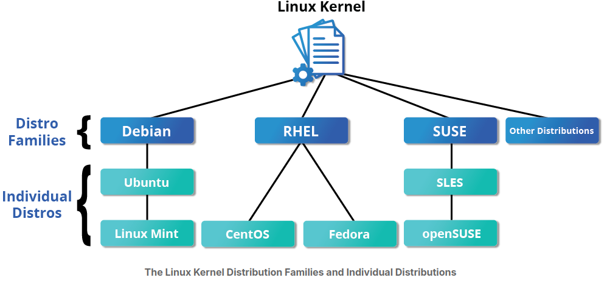
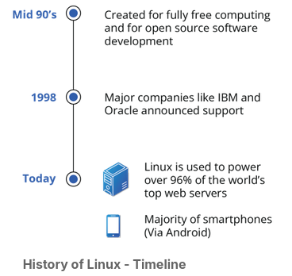
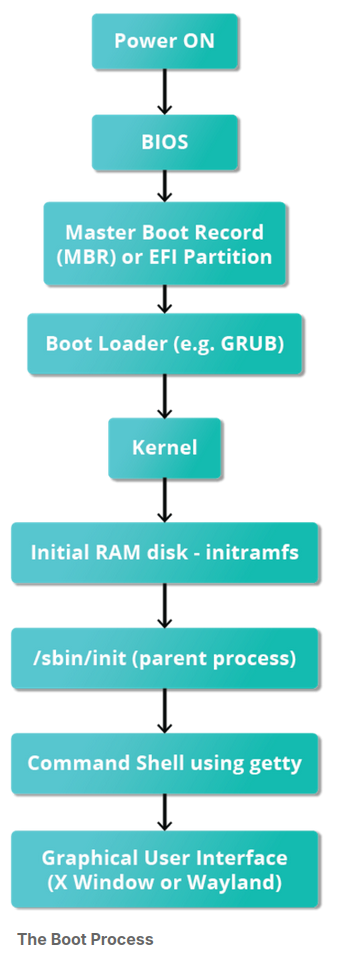

# Introduction

1.  Linux is based on the UNIX operating system. UNIX is a powerful, multi-user, multitasking operating system originally developed in the 1970s at AT&T Bell Labs. It laid the foundation for many modern operating systems, including Linux.

- Linux is free and open-source, accessible to everyone.
- This promotes global collaboration and innovation.
- Linux offers efficient performance and strong security.
- It works well across many devices and industries.

<p align="center">

<br/>
</p>

- Red Hat Enterprise Linux (RHEL) heads the family that includes CentOS, CentOS Stream, Fedora and Oracle Linux.

- The relationship between SUSE (SUSE Linux Enterprise Server, or SLES) and openSUSE is similar to the one described between RHEL, CentOS, and Fedora.

- Debian is a pure open source community project (not owned by any corporation) and has a strong focus on stability.

- Debian provides by far the largest and most complete software repository to its users of any Linux distribution.

# Linux History

Linux is an open source computer operating system, initially developed on and for Intel x86-based personal computers.

Linus Torvalds was a student in Helsinki, Finland, in 1991, when he started a project: writing his own operating system kernel. He also collected together and/or developed the other essential ingredients required to construct an entire operating system with his kernel at the center. It wasn't long before this became known as the Linux kernel. 

In 1992, Linux was re-licensed using the General Public License (GPL) by GNU (a project of the Free Software Foundation or FSF, which promotes freely available software), which enabled it to build a worldwide community of developers. By combining the kernel with other system components from the GNU project, numerous other developers created complete systems called Linux Distributions, which first appeared in the mid-90s.

<p align="center">

<br/>
</p>

# Linux Philosophy

- It was written to be a free and open source alternative.
- Files are stored in a hierarchical filesystem, with the top node of the system being the root or simply "/". 
- Linux makes its components available via files or objects that look like files. 
-Processes, devices, and network sockets are all represented by file-like objects and can often be worked with using the same utilities used for regular files. 
- Linux is a fully multitasking (i.e., multiple threads of execution are performed simultaneously), multiuser operating system with built-in networking and service processes known as daemons in the UNIX world.

# The Boot Process

The Linux boot process is the procedure for initializing the system. It consists of everything that happens from when the computer power is first switched on until the user interface is fully operational. 

<p align="center">

<br/>
</p


## Basic commands

- **ls**: List directory contents.
  ```bash
  ls -l          # List files with detailed info (permissions, size, owner)
  ls -a          # List all files, including hidden ones (starting with .)
  ls -lh         # List files with human-readable sizes (e.g., 1K, 234M)
  ```
- **cd**: Change directory.
  ```bash
  cd /var/log    # Go to the /var/log directory
  cd ..          # Go up one directory level
  cd ~           # Go to the current user's home directory
  cd -           # Go back to the previous directory
  ```
- **pwd**: Print working directory.
  ```bash
  pwd            # Outputs the absolute path of the current directory
  ```
- **mkdir**: Make directory.
  ```bash
  mkdir photos            # Create a directory named 'photos'
  mkdir -p projects/a/b   # Create a directory tree (nested directories) even if parents don't exist
  ```
- **rm**: Remove files or directories.
  ```bash
  rm file.txt       # Remove a single file
  rm -r foldername  # Remove a directory and its contents recursively
  rm -rf foldername # Force remove a directory and contents (use with caution)
  ```
- **cp**: Copy files or directories.
  ```bash
  cp file1.txt file2.txt      # Copy file1 to file2
  cp -r src_dir dest_dir      # Recursively copy a directory
  cp *.jpg /backup/images/    # Copy all .jpg files to a specific folder
  ```
- **mv**: Move files or directories.
  ```bash
  mv file.txt /new/path/      # Move a file to a new location
  mv oldname.txt newname.txt  # Rename a file
  ```
- **cat**: Concatenate and display file contents.
  ```bash
  cat file.txt           # Display the contents of file.txt
  cat file1.txt file2.txt > combined.txt # Combine two files into one
  ```
- **less**: View file contents one page at a time.
  ```bash
  less huge_log_file.log # Open a large file; use arrow keys to scroll, 'q' to quit
  ```
- **head**: Display the beginning of a file.
  ```bash
  head file.txt          # Show the first 10 lines
  head -n 5 file.txt     # Show the first 5 lines
  ```
- **tail**: Display the end of a file.
  ```bash
  tail file.txt          # Show the last 10 lines
  tail -f /var/log/syslog # Follow the file in real-time (great for logs)
  ```
- **grep**: Search for patterns in files.
  ```bash
  grep "error" server.log        # Search for "error" in server.log
  grep -r "config" /etc/         # Recursively search for "config" in /etc/ directory
  grep -i "user" auth.log        # Case-insensitive search
  ```
- **find**: Search for files in a directory hierarchy.
  ```bash
  find /home -name "*.txt"       # Find files ending in .txt inside /home
  find . -type d -name "backup"  # Find directories named "backup" in current folder
  find /var/log -size +50M       # Find files larger than 50MB
  ```
- **chmod**: Change file permissions.
  ```bash
  chmod 755 script.sh      # Give execute permission to owner, read/execute to others
  chmod +x script.sh       # Make a file executable
  chmod 600 private.key    # Read/write for owner only
  ```
- **chown**: Change file ownership.
  ```bash
  chown user:group file.txt    # Change owner and group
  chown -R user:group folder/  # Recursively change ownership of a folder
  ```
- **ps**: Display process information.
  ```bash
  ps aux                 # View all running processes
  ps -ef | grep python   # Search for running python processes
  ```
- **top**: Display real-time process information.
  ```bash
  top                    # Open the interactive process monitor (Press 'q' to exit)
  ```
- **kill**: Terminate a process.
  ```bash
  kill 1234              # Kill process with PID 1234
  kill -9 1234           # Force kill process 1234
  killall firefox        # Kill all processes named 'firefox'
  ```
- **df**: Display disk space usage.
  ```bash
  df -h                  # Show disk usage in human-readable format (GB, MB)
  ```
- **du**: Display disk usage of files or directories.
  ```bash
  du -sh foldername      # Show total size of a specific folder
  du -h                  # Show size of all files/directories recursively
  du -h --max-depth=1    # Show size of all files/directories recursively up to depth 1
  ```
- **free**: Display memory usage.
  ```bash
  free -h                # Show memory and swap usage in human-readable units
  ```
- **uname**: Display system information.
  ```bash
  uname -a               # Show all system info (kernel version, architecture)
  uname -r               # Show only the kernel release
  ```
- **man**: Display manual pages.
  ```bash
  man ls                 # Show the manual for the 'ls' command (press 'q' to quit)
  ```
- **help**: Display help information.
  ```bash
  help cd                # Show help for built-in shell commands like 'cd'
  ls --help              # Most commands support a --help flag for quick info
  ```
  exit                   # Log out of the current shell session
  ```

- **sudo**: Execute a command as the superuser.
  ```bash
  sudo apt update        # Update package list
  sudo systemctl restart nginx  # Restart a service
  sudo useradd newuser   # Add a new user
    ```

- **ln**: Create links between files.
  ```bash
  ln -s /path/to/original /path/to/link  # Create a symbolic link
  sudo ln -s /opt/scripts/super-herramienta-v1.0.2-linux /usr/local/bin/herramienta
  ls -l        # To see the links
  ```

- Hard link:
  - In Linux, a file is divided into two parts:
    - **The Inode:** This is the “body” of the file. It contains the actual data on the disk, the size, and the permissions. It does not have a name, but rather a number.
    - **The name entry:** This is the "name" that you see. It is simply a label that points to an Inode number.

  ```bash
  ln file1.txt file2.txt                 # Create a hard link
  ls -l        # To see the links
  ```
  - "A hard link is an additional directory entry for a file. Both the original name and the hard link point to the same inode, which contains the actual data on the disk. Even if you delete the original file, the data remains accessible through the hard link until the link count reaches zero."