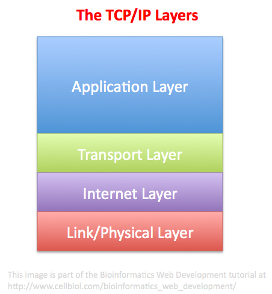

# The TCP/IP family of Internet protocols

## TCP/IP
The Transmission Control Protocol/Internet Protocol, can be defined as a set of rules, or protocols, used to exchange data between hardware devices connected to the Internet, including (but not limited to) the client and servers computers. These rules include all the packets exchange mechanism described above, and a set of specific protocols such as SMTP, FTP, HTTP, DHCP and many more, each designed to allow the exchange a particular kind of data (e-mail, files, web pages, connection information etc..).

<p align="center">

<br/>
</p>

1. **Internet Protocol (IP)**

    The Internet Protocol (IP) is a protocol, or set of rules, for routing and addressing packets of data so that they can travel across networks and arrive at the correct destination. Data traversing the Internet is divided into smaller pieces, called packets. IP information is attached to each packet, and this information helps routers to send packets to the right place. Every device or domain that connects to the Internet is assigned an IP address, and as packets are directed to the IP address attached to them, data arrives where it is needed.

    <p align="center">
    
    <br/>
    </p>

    In the above figure, IP packet header is comprised of 6 rows:
    **Row1**

        Version: IPv4 or IPv6.
        IHL: Header length.
        TOS: This includes minimize delay, maximize throughput, maximize reliability, and minimize monetary cost.
        Total Length: The total length of the IP datagram or the fragment with its maximum value being 2¹⁶-1=65,535.

    **Row2**

        Identification: Unique for each packet potentially critical in reassembling fragmented packets.
        IP Flags: The status of a packet, fragmented (M) or not (D). which can be used to evade IDS and firewalls by manipulating this field.
        Fragment Offset: Used when packets are fragmented.

    **Row3**

        TTL: How many hops over the internet before the packet expires.
        Protocol: Which protocol is used in conjunction with IP, e.g., 6 for TCP, 1 for ICMP, 17 for UDP.
        Header Checksum: Error-checking to determine the integrity of the data in the header.

    **Row4 & Row5 & Row6**

        Source / Destination: The source and destination IP addresses.

        Option: Variable in length (optional).
        Padding: The remaining bits and bytes of the header.


    **An IP Address** is a unique identifier assigned to a device or domain that connects to the Internet.

    **IPv4/IPv6**

    **IPv4 (Internet Protocol version 4)** is the most widely used IP address format. It uses a 32-bit addressing system, allowing for about 4.3 billion unique addresses. While that number might seem large, the rapid expansion of the internet has led to a shortage of IPv4 addresses, which is one of the reasons IPv6 was introduced.

    An IPv4 address is written in dotted decimal notation, consisting of four numbers separated by periods (dots). Each number can range from 0 to 255, corresponding to 8 bits (1 byte), for a total of 32 bits.

    Example:
    ```sh
    192.168.0.1
    ```

    **Private vs. Public IPv4 Addresses**

        **Private IP addresses** are used within local networks (such as in your home or office) and are not routable on the internet. Examples include addresses like 192.168.x.x or 10.x.x.x.

        **Public IP addresses** are globally unique and assigned by internet service providers (ISPs) to be routable over the internet.

    **IPv6: The Future of Internet Addressing**

    As the internet grew, it became clear that the IPv4 address space would eventually be exhausted. This led to the development of IPv6 (Internet Protocol version 6), which uses a 128-bit addressing scheme. This allows for approximately 340 undecillion addresses (3.4 x 10³⁸), more than enough to accommodate future growth.

    An IPv6 address is written in hexadecimal notation and consists of eight groups of four hexadecimal digits, separated by colons. 
    
    Example:
    ```sh
    2001:0db8:85a3:0000:0000:8a2e:0370:7334
    ```

2. **TCP**
    Transmission Control Protocol (TCP) is a communications standard that enables application programs and computing devices to exchange messages over a network. It is designed to send packets across the internet and ensure the successful delivery of data and messages over networks.

    Example: TCP is used in applications where reliability is crucial, such as web browsing and email.


3. **UDP**
    Definition: The User Datagram Protocol, or UDP, is a communication protocol used across the Internet for especially time-sensitive transmissions such as video playback or DNS lookups. It speeds up communications by not formally establishing a connection before data is transferred.

    Example: UDP is often used in live streaming and online gaming where speed is more critical than reliability.

12. **IMAP**
    Definition: The Internet Message Access Protocol (IMAP) is a protocol for receiving email. Protocols standardize technical processes so computers and servers can connect with each other regardless of whether or not they use the same hardware or software.

    Example: IMAP allows you to access your email from multiple devices by keeping emails on the server.

14. **SSH**
    Definition: The Secure Shell (SSH) protocol is a method for securely sending commands to a computer over an unsecured network. SSH uses cryptography to authenticate and encrypt connections between devices.

    Example: SSH is used by administrators to log into remote servers securely.


17. **ICMP**
    Definition: The Internet Control Message Protocol (ICMP) is a network layer protocol used by network devices to diagnose network communication issues. ICMP is mainly used to determine whether or not data is reaching its intended destination on time.

    Example: ICMP is used in the ping command to test the reachability of a host.

18. **DNS**
    Definition: The Domain Name System (DNS) is the phonebook of the Internet. Humans access information online through domain names, such as nytimes.com or espn.com. Web browsers interact through Internet Protocol (IP) addresses. DNS translates domain names to IP addresses so browsers can load Internet resources.

    Example: When you type a URL in your browser, DNS resolves the domain name to the IP address of the web server.


19. **ARP**
    Definition: Address Resolution Protocol (ARP) is a protocol or procedure that connects an ever-changing Internet Protocol (IP) address to a fixed physical machine address, also known as a media access control (MAC) address, in a local-area network (LAN).

    Example: ARP is used when a device needs to find the MAC address of another device on the same local network.

20. **DHCP**
    Definition: Dynamic Host Configuration Protocol (DHCP) is a network protocol used to automate the process of configuring devices on IP networks, thus allowing them to use network services such as DNS, NTP, and any communication protocol based on UDP or TCP.

    Example: DHCP automatically assigns a new IP address to your computer when you connect to a Wi-Fi network.

7. **FTP**
    Definition: File Transfer Protocol (FTP) refers to a process that involves the transfer of files between devices over a network. The process works when one party allows another to send or receive files over the internet.

    Example: FTP is used to upload files to a website’s server.

11. **SMTP**
    Definition: Simple Mail Transfer mechanism (SMTP) is a mechanism for exchanging email messages between servers. It is an essential component of the email communication process and operates at the application layer of the TCP/IP protocol stack.

    Example: When you send an email, SMTP is used to transmit your message to the recipient’s mail server.


13. **POP3**
    Definition: POP3 is a standard email protocol that allows users to retrieve email messages from a mail server onto their local device, such as a computer or mobile phone. When an email is sent to a user’s email address, it is first stored on the email server. The POP3 protocol allows the user’s email client to access the email server, download the email messages, and delete them from the server.

    Example: Unlike IMAP, POP3 downloads email to a single device and deletes it from the server.


14. **HTTP/HTTPS**
    Definition: Hypertext transfer protocol secure (HTTPS) is the secure version of HTTP, which is the primary protocol used to send data between a web browser and a website. HTTPS is encrypted in order to increase the security of data transfer.

    Example: When you enter a URL in your browser, HTTP/HTTPS protocols are used to fetch and display the web page.


15. **WebSocket**
    Definition: WebSocket is a communication protocol that allows a web server and a client, like a web browser, to exchange data in real-time. It’s different from the traditional HTTP method of loading web pages, which requires a separate request and response for each piece of data.

    Example: WebSockets are commonly used in applications requiring real-time updates, like chat apps and online gaming.


16. **WebRTC**
    Definition: WebRTC (Web Real-Time Communication) is an open-source technology created by Google that enables browser-to-browser real-time communication and data exchange, primarily focused on audio and video traffic.

    Example: WebRTC is used in video chat applications and real-time data sharing between browsers.


17. **OSPF**
    Definition: Open Shortest Path First (OSPF) is a link-state routing protocol that is used to find the best path between the source and the destination router using its own Shortest Path First). OSPF was developed by Internet Engineering Task Force (IETF) as one of the Interior Gateway Protocol (IGP), i.e, the protocol which aims at moving the packet within a large autonomous system or routing domain.

    Example: OSPF is widely used in large enterprise networks for efficient routing.

18. **MQTT**
    Definition: MQTT stands for Message Queuing Telemetry Transport. It is a lightweight messaging protocol for use in cases where clients need a small code footprint and are connected to unreliable networks or networks with limited bandwidth resources.

    Example: MQTT is commonly used in IoT applications for sending messages between devices.

19. **AMQP**
    Definition: The Advanced Message Queuing Protocol (AMQP) is an open standard for passing business messages between applications or organizations. It connects systems, feeds business processes with the information they need and reliably transmits onward the instructions that achieve their goals.

    Example: AMQP is used in financial services for handling high-value, high-speed transactions.

20. **RPC**
    Definition: Remote Procedure Call (RPC) allows a program to execute a procedure on a remote server as if it were local. It is a network programming model or interprocess communication technique that is used for point-to-point communications between software applications. Client and server applications communicate during this process.

    Example: RPC is used in distributed systems for communication between different components.

21. **SNMP**
    Definition: SNMP stands for “Simple Network Management Protocol.” It’s an application layer protocol included in the Internet protocol suite, a set of the most commonly used communication protocols online.

    Example: SNMP is used for network management, monitoring network performance, and detecting network faults.


