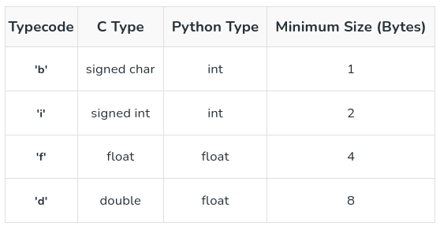

# Python Arrays
In Python, array is a collection of items stored at contiguous memory locations. The idea is to store multiple items of the same type together. Unlike Python lists (can store elements of mixed types), arrays must have all elements of same type. Having only homogeneous elements makes it memory-efficient. It requires a Typecode during initialization to define the C-type.

```python
import array as arr
a = arr.array('i', [1, 2, 3])

# accessing First Araay
print(a[0])

# result:
1

# adding element to array
a.append(5)
print(a)

# result:
array('i', [1, 2, 3, 5])
```

<p align="center">
    
    <br/>
    </p>

## Create an Array in Python
Array in Python can be created by importing an array module. array( data_type , value_list ) is used to create array in Python with data type and value list specified in its arguments. 

```python
import array as arr

# Creating an array
arr = arr.array('i', [1, 2, 3, 4, 5])
print(arr)

# result:
array('i', [1, 2, 3, 4, 5])
```

## Adding Elements to an Array
Elements can be added to the Python Array by using built-in insert() function. Insert is used to insert one or more data elements into an array. Based on the requirement, a new element can be added at the beginning, end, or any given index of array. append() is also used to add the value mentioned in its arguments at the end of the Python array. 

```python
import array as arr

# Creating an array
arr = arr.array('i', [1, 2, 3, 4, 5])

# Adding element to array
arr.insert(2, 6)
print(arr)

# result:
array('i', [1, 2, 6, 3, 4, 5])

# Adding element to array
arr.append(7)
print(arr)

# result:
array('i', [1, 2, 6, 3, 4, 5, 7])
```

## Accessing Array Items
In order to access the array items refer to the index number. Use the index operator [ ] to access an item in a array in Python. The index must be an integer. 

```python
import array as arr

# Creating an array
arr = arr.array('i', [1, 2, 3, 4, 5])

# Accessing array items
print(arr[0])

# result:
1
```

## Removing Elements from the Array

Elements can be removed from the Python array by using built-in remove() function. It will raise an Error if element doesn’t exist. Remove() method only removes the first occurrence of the searched element. To remove range of elements, we can use an iterator.

pop() function can also be used to remove and return an element from the array. By default it removes only the last element of the array. To remove element from a specific position, index of that item is passed as an argument to pop() method. 

```python
import array as arr

# Creating an array
arr = arr.array('i', [1, 2, 3, 4, 5])

# Removing element from array
arr.remove(3)
print(arr)

# result:
array('i', [1, 2, 4, 5])

# Removing element from array
arr.pop(2)
print(arr)

# result:
array('i', [1, 2, 5])
```

## Deleting an Array

An array can be deleted using the del keyword. 

```python
import array as arr

# Creating an array
arr = arr.array('i', [1, 2, 3, 4, 5])

# Deleting array
del arr
print(arr)

# result:
NameError: name 'arr' is not defined
```

## Slicing of an Array 
- Elements from beginning to a range use [:Index]
- Elements from end use [:-Index]
- Elements from specific Index till the end use [Index:]
- Elements within a range, use [Start Index:End Index]
- Print complete List, use [:].
- For Reverse list, use [::-1]. 

```python
import array as arr

# Creating an array
arr = arr.array('i', [1, 2, 3, 4, 5])

# Slicing array
print(arr[:3])
print(arr[:-2])
print(arr[2:])
print(arr[1:4])
print(arr[:])
print(arr[::-1])

# result:
array('i', [1, 2, 3])
array('i', [1, 2])
array('i', [3, 4, 5])
array('i', [2, 3, 4])
array('i', [1, 2, 3, 4, 5])
array('i', [5, 4, 3, 2, 1])
```

## Searching Element in an Array
In order to search an element in the array we use a python in-built index() method. This function returns the index of the first occurrence of value mentioned in arguments. 

```python
import array as arr

# Creating an array
arr = arr.array('i', [1, 2, 3, 4, 5])

# Searching element in array
print(arr.index(3))

# result:
2
```

## Updating Elements in an Array
In order to update an element in the array we simply reassign a new value to the desired index we want to update. 

```python
import array as arr

# Creating an array
arr = arr.array('i', [1, 2, 3, 4, 5])

# Updating element in array
arr[2] = 6
print(arr)

# result:
array('i', [1, 2, 6, 4, 5])
```

## Different Operations on Python Arrays
### Counting Elements in an Array
We can use count() method to count given item in array.

```python
import array as arr

# Creating an array
arr = arr.array('i', [1, 2, 3, 4, 3, 5])

# Counting elements in array
print(arr.count(3))

# result:
2
```

### Reversing an Array
We can use reverse() method to reverse the array.

```python
import array as arr

# Creating an array
arr = arr.array('i', [1, 2, 3, 4, 5])

# Reversing array
arr.reverse()
print(arr)

# result:
array('i', [5, 4, 3, 2, 1])
```

### Extend Element from Array
In Python, an array is used to store multiple values or elements of the same datatype in a single variable. The extend() function is simply used to attach an item from iterable to the end of the array. In simpler terms, this method is used to add an array of values to the end of a given or existing array. 

```python
import array as arr

# Creating an array
arr = arr.array('i', [1, 2, 3, 4, 5])

# Extending array
arr.extend([6, 7, 8])
print(arr)

# result:
array('i', [1, 2, 3, 4, 5, 6, 7, 8])
```