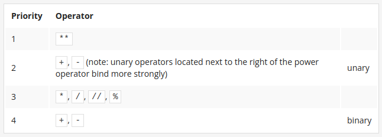
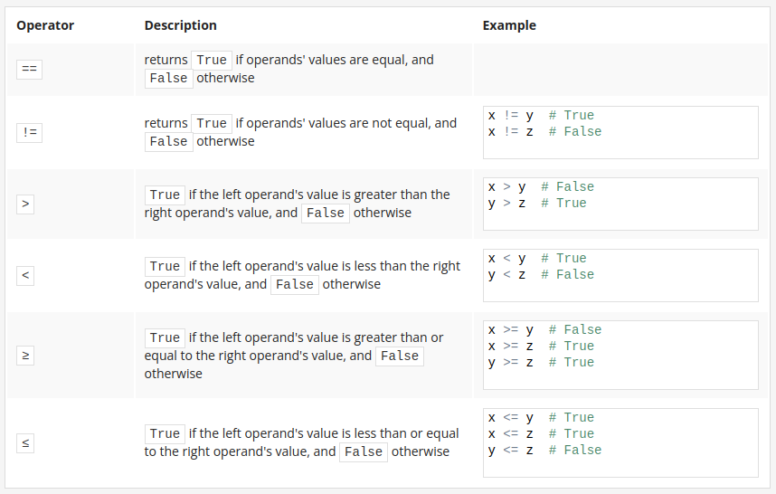
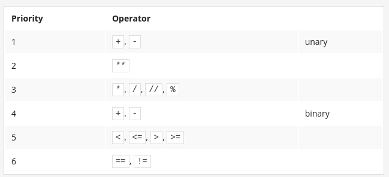
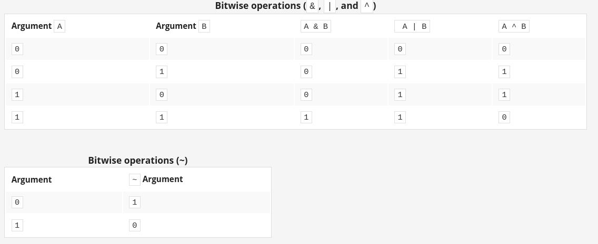
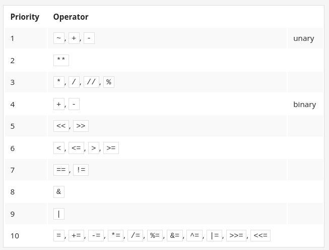

# Introduction
Python is a widely-used, interpreted, object-oriented, and high-level programming language with dynamic semantics, used for general-purpose programming.

And while you may know the python as a large snake, the name of the Python programming language comes from an old BBC television comedy sketch series called Monty Python's Flying Circus.

Python was created by Guido van Rossum, born in 1956 in Haarlem, the Netherlands. Of course, Guido van Rossum did not develop and evolve all the Python components himself.

Python is an interpreted language. This means that you can run the code as soon as you complete it - there are no additional phases of translation

## Cython
This is what Cython is intended to do – to automatically translate the Python code (clean and clear, but not too swift) into "C" code (complicated and talkative, but agile).

## Jython
Jython can communicate with existing Java infrastructure more effectively. the current Jython implementation follows Python 2 standards. There is no Jython conforming to Python 3, so far.

The current Jython implementation follows Python 2 standards. There is no Jython conforming to Python 3, so far.


## print and input functions (built-in functions)
1. The print() function sends data to the console, while the input() function gets data from the console.

2. The input() function comes with an optional parameter: the prompt string. It allows you to write a message before the user input, e.g.:
``
name = input("Enter your name: ")
print("Hello, " + name + ". Nice to meet you!")
``

3. When the input() function is called, the program's flow is stopped, the prompt symbol keeps blinking (it prompts the user to take action when the console is switched to input mode) until the user has entered an input and/or pressed the Enter key.

### Tip: 
the above-mentioned feature of the input() function can be used to prompt the user to end a program. Look at the code below:
``
name = input("Enter your name: ")
print("Hello, " + name + ". Nice to meet you!")

print("\nPress Enter to end the program.")
input()
print("THE END.")
``

4. The result of the input() function is a string. You can add strings to each other using the concatenation (+) operator. Check out this code:
``
num_1 = input("Enter the first number: ") # Enter 12
num_2 = input("Enter the second number: ") # Enter 21

print(num_1 + num_2) # the program returns 1221
``

5. You can also multiply (* ‒ replication) strings, e.g.:
``
my_input = input("Enter something: ") # Example input: hello
print(my_input * 3) # Expected output: hellohellohello
``

## Python literals
1. Literals are notations for representing some fixed values in code. Python has various types of literals - for example, a literal can be a number (numeric literals, e.g., 123), or a string (string literals, e.g., "I am a literal.").

2. The binary system is a system of numbers that employs 2 as the base. Therefore, a binary number is made up of 0s and 1s only, e.g., 1010 is 10 in decimal.
Octal and hexadecimal numeration systems, similarly, employ 8 and 16 as their bases respectively. The hexadecimal system uses the decimal numbers and six extra letters.

3. Integers (or simply ints) are one of the numerical types supported by Python. They are numbers written without a fractional component, e.g., 256, or -1 (negative integers).

4. Floating-point numbers (or simply floats) are another one of the numerical types supported by Python. They are numbers that contain (or are able to contain) a fractional component, e.g., 1.27.

5. To encode an apostrophe or a quote inside a string you can either use the escape character, e.g., 'I\'m happy.', or open and close the string using an opposite set of symbols to the ones you wish to encode, e.g., "I'm happy." to encode an apostrophe, and 'He said "Python", not "typhoon"' to encode a (double) quote.

6. Boolean values are the two constant objects True and False used to represent truth values (in numeric contexts 1 is True, while 0 is False.

### EXTRA
There is one more, special literal that is used in Python: the None literal. This literal is a so-called NoneType object, and it is used to represent the absence of a value. We'll tell you more about it soon.

## Aritmethic operators and the hierarychy of priorities
1. An expression is a combination of values (or variables, operators, calls to functions ‒ you will learn about them soon) which evaluates to a certain value, e.g., 1 + 2.

2. Operators are special symbols or keywords which are able to operate on the values and perform (mathematical) operations, e.g., the * operator multiplies two values: x * y.

3. Arithmetic operators in Python: + (addition), - (subtraction), * (multiplication), / (classic division ‒ always returns a float), % (modulus ‒ divides left operand by right operand and returns the remainder of the operation, e.g., 5 % 2 = 1), ** (exponentiation ‒ left operand raised to the power of right operand, e.g., 2 ** 3 = 2 * 2 * 2 = 8), // (floor/integer division ‒ returns a number resulting from division, but rounded down to the nearest whole number, e.g:
```
3 // 2.0 = 1.0
6 // 3 = 2
6 // 3. = 2.0
6. // 3 = 2.0
6. // 3. = 2.0
6 // 4 = 1
6. // 4 = 1.0
-6 // 4 = -2
6. // -4 = -2.0
```

4. A unary operator is an operator with only one operand, e.g., -1, or +3.

5. A binary operator is an operator with two operands, e.g., 4 + 5, or 12 % 5.

6. Some operators act before others – the hierarchy of priorities:

    the ** operator (exponentiation) has the highest priority;
    then the unary + and - (note: a unary operator to the right of the exponentiation operator binds more strongly, for example: 4 ** -1 equals 0.25)
    then *, /, //, and %;
    and, finally, the lowest priority: the binary + and -.

<p align="center">
  
  <br/>
</p>


7. Subexpressions in parentheses are always calculated first, e.g., 15 - 1 * (5 * (1 + 2)) = 0.

8. The exponentiation operator uses right-sided binding, e.g., 2 ** 2 ** 3 = 256

## Variables
1. A variable is a named location reserved to store values in the memory. A variable is created or initialized automatically when you assign a value to it for the first time. 

2. Each variable must have a unique name - an identifier. A legal identifier name must be a non-empty sequence of characters, must begin with the underscore(_), or a letter, and it cannot be a Python keyword. The first character may be followed by underscores, letters, and digits. Identifiers in Python are case-sensitive. 

3. Python is a dynamically-typed language, which means you don't need to declare variables in it.  To assign values to variables, you can use a simple assignment operator in the form of the equal (=) sign, i.e., var = 1.

4. You can also use compound assignment operators (shortcut operators) to modify values assigned to variables, e.g., var += 1, or var /= 5 * 2. 

5. You can assign new values to already existing variables using the assignment operator or one of the compound operators, e.g.: 
```
var = 2
print(var)

var = 3
print(var)

var += 1
print(var)
``` 

6. You can combine text and variables using the + operator, and use the print() function to output strings and variables, e.g.: 
```
var = "007"
print("Agent " + var)
```

### Integers: octal and hexadecimal numbers
Integers (or simply ints) are one of the numerical types supported by Python. They are numbers written without a fractional component, e.g., 256, or -1 (negative integers).
4 is an integer

If an integer number is preceded by an 0O or 0o prefix (zero-o), it will be treated as an octal value. This means that the number must contain digits taken from the [0..7] range only.

print(0o123)
83

hexadecimal numbers. Such numbers should be preceded by the prefix 0x or 0X (zero-x).

0x123 is a hexadecimal number with a (decimal) value equal to 291. The print() function can manage these values too. 

print(0x123)
291


### Operators and their bindings
The binding of the operator determines the order of computations performed by some operators with equal priority, put side by side in one expression.

Most of Python's operators have left-sided binding, which means that the calculation of the expression is conducted from left to right.

print(9 % 6 % 2)  This is left to right
1

Exception (the exponentiation operator uses right-sided binding.)
print(2 ** 2 ** 3) 
256


### Shortcut operators
For example, if we need to calculate a series of successive values of powers of 2, we may use a piece like this:
x = x * 2

sheep = sheep + 1

Python offers you a shortened way of writing operations like these, which can be coded as follows:
x *= 2
sheep += 1

If op is a two-argument operator (this is a very important condition) and the operator is used in the following context:
variable = variable op expression  
It can be simplified and shown as follows  
variable op= expression

Examples:

i = i + 2 * j  -----> i += 2 * j

var = var / 2  -----> var /= 2

rem = rem % 10 -----> rem %= 10

j = j - (i + var + rem) -----> j -= (i + var + rem)

x = x ** 2 -----> x **= 2


## Variables
A variable is a named location reserved to store values in the memory. A variable is created or initialized automatically when you assign a value to it for the first time.

# Input function
The input() function is able to read data entered by the user and to return the same data to the running program.

anything = float(input("Enter a number: "))
something = anything ** 2.0
print(anything, "to the power of 2 is", something)

# String operators
- Concatenation (+)
Don't forget - if you want the + sign to be a concatenator, not an adder, you must ensure that both its arguments are strings.
- Replication (*)
It replicates the string the same number of times specified by the number.
Examples:
Carlos * 3 = CarlosCarlosCarlos
A number less than or equal to zero produces an empty string.


# Making decisions
## Comparison: equality operator
== is the question are these values equal?; a == b compares a and b.

It is a binary operator with left-sided binding. It needs two arguments and checks if they are equal.

## Inequality: the not equal to operator (!=)
The != (not equal to) operator compares the values of two operands, too. Here is the difference: if they are equal, the result of the comparison is False. If they are not equal, the result of the comparison is True.


<p align="center">
  
  <br/>
</p>

<p align="center">
  
  <br/>
</p>

# Loops
There are two types of loops in Python: while and for
- the while loop executes a statement or a set of statements as long as a specified boolean condition is true
- the for loop executes a set of statements many times; it's used to iterate over a sequence (e.g., a list, a dictionary, a tuple, or a set - you will learn about them soon) or other objects that are iterable (e.g., strings). You can use the for loop to iterate over a sequence of numbers using the built-in range function. Look at the examples below:

## range
The range() function may also accept three arguments 

for i in range(2, 8, 3):    # start in 2, until 8, increment 3
    print("The value of i is currently", i)

for i in range(1, 1):  # nothing, second argument must be greater than the first.
    print("The value of i is currently", i)

power = 1
for expo in range(16): # start in 0 until 15
    print("2 to the power of", expo, "is", power)
    power *= 2

## break and continue
- break - exits the loop immediately, and unconditionally ends the loop's operation; the program begins to execute the nearest instruction after the loop's body;
    
- continue - behaves as if the program has suddenly reached the end of the body; the next turn is started and the condition expression is tested immediately.

## The while loop and the else branch
The loop's else branch is always executed once, regardless of whether the loop has entered its body or not.

# Bitwise operators
Four operators that allow you to manipulate single bits of data. They are called bitwise operators.

<p align="center">
  
  <br/>
</p>


- & requires exactly two 1s to provide 1 as the result;
- | requires at least one 1 to provide 1 as the result;
- ^ requires exactly one 1 to provide 1 as the result.

Bitwise operators are stricter: they deal with every bit separately.

```
i = 15
j = 22
i: 00000000000000000000000000001111
j: 00000000000000000000000000010110

log = i and j
log:True

Now the bitwise operation - here it is:
bit = i & j


The & operator will operate with each pair of corresponding bits separately, producing the values of the relevant bits of the result. Therefore, the result will be as follows:

i 	00000000000000000000000000001111
j 	00000000000000000000000000010110

bit = i & j 	00000000000000000000000000000110

These bits correspond to the integer value of six.

bitneg = ~i

i 	00000000000000000000000000001111
bitneg = ~i 	11111111111111111111111111110000

Each of these two-argument operators can be used in abbreviated form. These are the examples of their equivalent notations:
x = x & y 	x &= y
x = x | y 	x |= y
x = x ^ y 	x ^= y

```

## Binary left shift and binary right shift

The shift operators in Python are a pair of digraphs: << and >>, clearly suggesting in which direction the shift will act.
value << bits
value >> bits


The left argument of these operators is an integer value whose bits are shifted. The right argument determines the size of the shift.

```
var = 17
print(str(bin(var)))
var_right = var >> 1
var_left = var << 10
print(str(bin(var_right)))
print(str(bin(var_left)))
print(var, var_left, var_right)

0b10001

0b1000

0b100010000000000

17 17408 8


```


<p align="center">
  
  <br/>
</p>


# List
The assignment: list_2 = list_1 copies the name of the array, not its contents. In effect, the two names (list_1 and list_2) identify the same location in the computer memory. Modifying one of them affects the other, and vice versa.

## slices
A slice is an element of Python syntax that allows you to make a brand new copy of a list, or parts of a list.

It actually copies the list's contents, not the list's name.

This is exactly what you need. Take a look at the snippet below:
list_1 = [1]
list_2 = list_1[:]
list_1[0] = 2
print(list_2)

One of the most general forms of the slice looks as follows:
my_list[start:end]

slices negatives
my_list = [10, 8, 6, 4, 2]
new_list = my_list[1:-1]
print(new_list)
[8, 6, 4]


If the start specifies an element lying further than the one described by the end (from the list's beginning point of view), the slice will be empty:
my_list = [10, 8, 6, 4, 2]
new_list = my_list[-1:1]
print(new_list)


The snippet's output is:
[]

As we've said before, omitting both start and end makes a copy of the whole list:
my_list = [10, 8, 6, 4, 2]
new_list = my_list[:]
print(new_list)


The previously described del instruction is able to delete more than just a list's element at once - it can delete slices too:
my_list = [10, 8, 6, 4, 2]
del my_list[1:3]
print(my_list)


Note: in this case, the slice doesn't produce any new list!

The snippet's output is: [10, 4, 2].

Deleting all the elements at once is possible too:
my_list = [10, 8, 6, 4, 2]
del my_list[:]
print(my_list)

## list comprehension
row = []

for i in range(8):
    row.append(WHITE_PAWN)


is the same that this:

row = [WHITE_PAWN for i in range(8)]

other examples:

squares = [x ** 2 for x in range(10)]
odds = [x for x in squares if x % 2 != 0 ]

## Lists in lists: two-dimensional arrays

board = []
EMPTY = ''

for i in range(8):
    row = [EMPTY for i in range(8)]
    board.append(row)

board = [[EMPTY for i in range(8)] for j in range(8)]


EMPTY = "-"
ROOK = "ROOK"
board = []

for i in range(8):
    row = [EMPTY for i in range(8)]
    board.append(row)

board[0][0] = ROOK
board[0][7] = ROOK
board[7][0] = ROOK
board[7][7] = ROOK

print(board)

### Three-dimensional arrays

Python does not limit the depth of list-in-list inclusion. Here you can see an example of a three-dimensional array:

rooms = [[[False for r in range(20)] for f in range(15)] for t in range(3)]

rooms[1][9][13] = True


## Tuples
tuples

1. Tuples are ordered and unchangeable (immutable) collections of data. They can be thought of as immutable lists. They are written in round brackets:
my_tuple = (1, 2, True, "a string", (3, 4), [5, 6], None)
print(my_tuple)

my_list = [1, 2, True, "a string", (3, 4), [5, 6], None]
print(my_list)


Each tuple element may be of a different type (i.e., integers, strings, booleans, etc.). What is more, tuples can contain other tuples or lists (and the other way round).

2. You can create an empty tuple like this:
empty_tuple = ()
print(type(empty_tuple))    # outputs: <class 'tuple'>


3. A one-element tuple may be created as follows:
one_elem_tuple_1 = ("one", )    # Brackets and a comma.
one_elem_tuple_2 = "one",       # No brackets, just a comma.


If you remove the comma, you will tell Python to create a variable, not a tuple:
my_tuple_1 = 1, 
print(type(my_tuple_1))    # outputs: <class 'tuple'>

my_tuple_2 = 1             # This is not a tuple.
print(type(my_tuple_2))    # outputs: <class 'int'>


4. You can access tuple elements by indexing them:
my_tuple = (1, 2.0, "string", [3, 4], (5, ), True)
print(my_tuple[3])    # outputs: [3, 4]


5. Tuples are immutable, which means you cannot change their elements (you cannot append tuples, or modify, or remove tuple elements). The following snippet will cause an exception:
my_tuple = (1, 2.0, "string", [3, 4], (5, ), True)
my_tuple[2] = "guitar"    # The TypeError exception will be raised.


However, you can delete a tuple as a whole:

my_tuple = 1, 2, 3, 
del my_tuple
print(my_tuple)    # NameError: name 'my_tuple' is not defined

6. You can loop through a tuple elements (Example 1), check if a specific element is (not)present in a tuple (Example 2), use the len() function to check how many elements there are in a tuple (Example 3), or even join/multiply tuples (Example 4):
# Example 1
tuple_1 = (1, 2, 3)
for elem in tuple_1:
    print(elem)

# Example 2
tuple_2 = (1, 2, 3, 4)
print(5 in tuple_2)
print(5 not in tuple_2)

# Example 3
tuple_3 = (1, 2, 3, 5)
print(len(tuple_3))

# Example 4
tuple_4 = tuple_1 + tuple_2
tuple_5 = tuple_3 * 2

print(tuple_4)
print(tuple_5)


EXTRA

You can also create a tuple using a Python built-in function called tuple(). This is particularly useful when you want to convert a certain iterable (e.g., a list, range, string, etc.) to a tuple:
my_tuple = tuple((1, 2, "string"))
print(my_tuple)

my_list = [2, 4, 6]
print(my_list)    # outputs: [2, 4, 6]
print(type(my_list))    # outputs: <class 'list'>
tup = tuple(my_list)
print(tup)    # outputs: (2, 4, 6)
print(type(tup))    # outputs: <class 'tuple'>


By the same fashion, when you want to convert an iterable to a list, you can use a Python built-in function called list():
tup = 1, 2, 3, 
my_list = list(tup)
print(type(my_list))    # outputs: <class 'list'>


## Dictionaries

1. Dictionaries are unordered*, changeable (mutable), and indexed collections of data. (*In Python 3.6x dictionaries have become ordered by default.

Each dictionary is a set of key: value pairs. You can create it by using the following syntax:
my_dictionary = {
    key1: value1,
    key2: value2,
    key3: value3,
    }


2. If you want to access a dictionary item, you can do so by making a reference to its key inside a pair of square brackets (ex. 1) or by using the get() method (ex. 2):
pol_eng_dictionary = {
    "kwiat": "flower",
    "woda": "water",
    "gleba": "soil"
    }

item_1 = pol_eng_dictionary["gleba"]    # ex. 1
print(item_1)    # outputs: soil

item_2 = pol_eng_dictionary.get("woda")
print(item_2)    # outputs: water


3. If you want to change the value associated with a specific key, you can do so by referring to the item's key name in the following way:
pol_eng_dictionary = {
    "zamek": "castle",
    "woda": "water",
    "gleba": "soil"
    }

pol_eng_dictionary["zamek"] = "lock"
item = pol_eng_dictionary["zamek"]    
print(item)  # outputs: lock


4. To add or remove a key (and the associated value), use the following syntax:
phonebook = {}    # an empty dictionary

phonebook["Adam"] = 3456783958    # create/add a key-value pair
print(phonebook)    # outputs: {'Adam': 3456783958}

del phonebook["Adam"]
print(phonebook)    # outputs: {}


You can also insert an item to a dictionary by using the update() method, and remove the last element by using the popitem() method, e.g.:
pol_eng_dictionary = {"kwiat": "flower"}

pol_eng_dictionary.update({"gleba": "soil"})
print(pol_eng_dictionary)    # outputs: {'kwiat': 'flower', 'gleba': 'soil'}

pol_eng_dictionary.popitem()
print(pol_eng_dictionary)    # outputs: {'kwiat': 'flower'}


5. You can use the for loop to loop through a dictionary, e.g.:
pol_eng_dictionary = {
    "zamek": "castle",
    "woda": "water",
    "gleba": "soil"
    }

for item in pol_eng_dictionary:
    print(item) 

# outputs: zamek
#          woda
#          gleba

6. If you want to loop through a dictionary's keys and values, you can use the items() method, e.g.:
pol_eng_dictionary = {
    "zamek": "castle",
    "woda": "water",
    "gleba": "soil"
    }

for key, value in pol_eng_dictionary.items():
    print("Pol/Eng ->", key, ":", value)


7. To check if a given key exists in a dictionary, you can use the in keyword:
pol_eng_dictionary = {
    "zamek": "castle",
    "woda": "water",
    "gleba": "soil"
    }

if "zamek" in pol_eng_dictionary:
    print("Yes")
else:
    print("No")


8. You can use the del keyword to remove a specific item, or delete a dictionary. To remove all the dictionary's items, you need to use the clear() method:
pol_eng_dictionary = {
    "zamek": "castle",
    "woda": "water",
    "gleba": "soil"
    }

print(len(pol_eng_dictionary))    # outputs: 3
del pol_eng_dictionary["zamek"]    # remove an item
print(len(pol_eng_dictionary))    # outputs: 2

pol_eng_dictionary.clear()   # removes all the items
print(len(pol_eng_dictionary))    # outputs: 0

del pol_eng_dictionary    # removes the dictionary


9. To copy a dictionary, use the copy() method:
pol_eng_dictionary = {
    "zamek": "castle",
    "woda": "water",
    "gleba": "soil"
    }

copy_dictionary = pol_eng_dictionary.copy()

## Exceptions
Exceptions

1. In Python, there is a distinction between two kinds of errors:

    syntax errors (parsing errors), which occur when the parser comes across a statement that is incorrect. For example:

    Trying to execute the following line:
    print("Hello, World!)


    will cause a SyntaxError, and result in the following (or similar) message being displayed in the console:
      File "main.py", line 1

        print("Hello, World!)
                            ^
    SyntaxError: EOL while scanning string literal

    output

    Pay attention to the arrow – it indicates the place where the Python parser has run into trouble. In our case, it's the missing double quote. Did you notice it?
    exceptions, which occur even when a statement/expression is syntactically correct; these are the errors that are detected during execution when your code results in an error which is not uncoditionally fatal. For example:

    Trying to execute the following line:
    print(1/0)


    will cause a ZeroDivisionError exception, and result in the following (or similar) message being displayed in the console:
    Traceback (most recent call last):
      File "main.py", line 1, in 
        print(1/0)
    ZeroDivisionError: division by zero

    output

    Pay attention to the last line of the error message – it actually tells you what happened. There are many different types of exceptions, such as ZeroDivisionError, NameError, TypeError, and many more; and this part of the message informs you of what type of exception has been raised. The preceding lines show you the context in which the exception has occured.

2. You can "catch" and handle exceptions in Python by using the try-except block. So, if you have a suspicion that any particular snippet may raise an exception, you can write the code that will gracefully handle it, and will not interrupt the program. Look at the example:

while True:
    try:
        number = int(input("Enter an integer number: "))
        print(number/2)
        break
    except:
        print("Warning: the value entered is not a valid number. Try again...")

The code above asks the user for input until they enter a valid integer number. If the user enters a value that cannot be converted to an int, the program will print Warning: the value entered is not a valid number. Try again..., and ask the user to enter a number again. What happens in such a case?

    The program enters the while loop.
    The try block/clause is executed. The user enters a wrong value, for example: hello!.
    An exception occurs, and the rest of the try clause is skipped. The program jumps to the except block, executes it, and then continues running after the try-except block.

    If the user enters a correct value and no exception occurs, the subsequent instructions in the try block are executed.

3. You can handle multiple exceptions in your code block. Look at the following examples:

while True:
    try:
        number = int(input("Enter an int number: "))
        print(5/number)
        break
    except ValueError:
        print("Wrong value.")
    except ZeroDivisionError:
        print("Sorry. I cannot divide by zero.")
    except:
        print("I don't know what to do...")

You can use multiple except blocks within one try statement, and specify particular exception names. If one of the except branches is executed, the other branches will be skipped. Remember: you can specify a particular built-in exception only once. Also, don't forget that the default (or generic) exception, that is the one with no name specified, should be placed at the bottom of the branch (use the more specific exceptions first, and the more general last).

You can also specify and handle multiple built-in exceptions within a single except clause:

while True:
    try:
        number = int(input("Enter an int number: "))
        print(5/number)
        break
    except (ValueError, ZeroDivisionError):
        print("Wrong value or No division by zero rule broken.")
    except:
        print("Sorry, something went wrong...")

4. Some of the most useful Python built-in exceptions are: ZeroDivisionError, ValueError, TypeError, AttributeError, and SyntaxError. One more exception that, in our opinion, deserves your attention is the KeyboardInterrupt exception, which is raised when the user hits the interrupt key (CTRL-C or Delete). Run the code above and hit the key combination to see what happens.

To learn more about the Python built-in exceptions, consult the official Python documentation.

5. Last but not least, you should remember about testing and debugging your code. Use such debugging techniques as print debugging; if possible – ask someone to read your code and help you to find bugs in it or to improve it; try to isolate the fragment of code that is problematic and susceptible to errors: test your functions by applying predictable argument values, and try to handle the situations when someone enters wrong values; comment out the parts of the code that obscure the issue. Finally, take breaks and come back to your code after some time with a fresh pair of eyes.

Exercise

What is the output of the following program if the user enters 0?
try:
    value = int(input("Enter a value: "))
    print(value/value)
except ValueError:
    print("Bad input...")
except ZeroDivisionError:
    print("Very bad input...")
except:
    print("Booo!")


