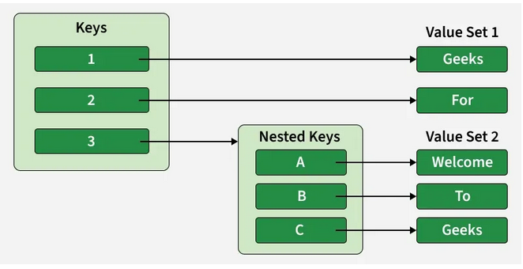

# Python Dictionaries
A Python dictionary is a data structure that stores data in key-value pairs, where each key is unique and is used to retrieve its associated value. It is mainly used when you want to store and access data by a name (key) instead of by position like in a list.

```python
data = { "name": "Jake", "age": 22 }
print(data)
# result:
{'name': 'Jake', 'age': 22}
```

## Creating a Dictionary
A dictionary is created by writing key-value pairs inside { }, where each key is connected to a value using colon (:). A dictionary can also be created using the dict() function.

```python
d1 = {1: 'Geeks', 2: 'For', 3: 'Geeks'}
print(d1)
# result:
{1: 'Geeks', 2: 'For', 3: 'Geeks'}

# using dict() constructor
d2 = dict(a = "Geeks", b = "for", c = "Geeks")
print(d2)
# result:
{'a': 'Geeks', 'b': 'for', 'c': 'Geeks'}
```

## Accessing Dictionary Items
A value in a dictionary is accessed by using its key. This can be done either with square brackets [ ] or with the get() method. Both return the value linked to the given key.

```python
d = { "name": "Kat", 1: "Python", (1, 2): [1,2,4] }

# Access using key
print(d["name"])

# result:
Kat

# Access using get()
print(d.get("name"))
# result:
Kat

print(d[(1,2)])
# result:
[1, 2, 4]
```

## Adding and Updating Dictionary Items
New items are added to a dictionary using the assignment operator (=) by giving a new key a value. If an existing key is used with the assignment operator, its value is updated with the new one.

```python
d = {1: 'Geeks', 2: 'For', 3: 'Geeks'}

# Adding a new key-value pair
d["age"] = 22

# Updating an existing value
d[1] = "Python dict"
print(d)

# result:
{1: 'Python dict', 2: 'For', 3: 'Geeks', 'age': 22}
```

## Removing Dictionary Items
Dictionary items can be removed using built-in deletion methods that work on keys:
- del: removes an item using its key
- pop(): removes the item with the given key and returns its value
- clear(): removes all items from the dictionary
- popitem(): removes and returns the last inserted key–value pair

```python
d = {1: 'Geeks', 2: 'For', 3: 'Geeks', 'age':22}

# Using del 
del d["age"]
print(d)

#result:
{1: 'Geeks', 2: 'For', 3: 'Geeks'}

# Using pop() 
val = d.pop(1)
print(val)

# result:
Geeks

print(d)
# result:
{2: 'For', 3: 'Geeks'}

# Using popitem()
key, val = d.popitem()
print(f"Key: {key}, Value: {val}")

# result:
Key: 2, Value: For

# Using clear()
d.clear()
print(d)

# result:
{}
```

## Iterating Through a Dictionary
A dictionary can be traversed using a for loop to access its keys, values or both key-value pairs by using the built-in methods keys(), values() and items().

```python
d = {1: 'Geeks', 2: 'For', 'age':22}

# Iterate over keys
for key in d:
    print(key)

# Iterate over values
for value in d.values():
    print(value)

# Iterate over key-value pairs
for key, value in d.items():
    print(f"{key}: {value}")
```

### With enumerate()

```python
d = {1: 'Geeks', 2: 'For', 'age':22}

for index, (key, value) in enumerate(d.items()):
    print(f"Index: {index}, Key: {key}, Value: {value}")
```

### With list comprehension

```python
d = {1: 'Geeks', 2: 'For', 'age':22}

result = [f"Key: {key}, Value: {value}" for key, value in d.items()]
print(result)
# result:
['Key: 1, Value: Geeks', 'Key: 2, Value: For', 'Key: age, Value: 22']
```

## Nested Dictionaries
A nested dictionary is a dictionary that contains another dictionary as one of its values. Below diagram shows how a nested dictionary works, where key 3 points to another dictionary inside the main dictionary. 

<p align="center">
    
    <br/>
    </p>

```python
d = {1: 'Geeks', 2: 'For', 3: {'a': 'Geeks', 'b': 'For', 'c': 'Geeks'}}
print(d[3]['a'])
# result:
Geeks

d = {1: 'Geeks', 2: 'For', 3: {'A': 'Welcome', 'B': 'To', 'C': 'Geeks'}}
print(d)
# result:
{1: 'Geeks', 2: 'For', 3: {'A': 'Welcome', 'B': 'To', 'C': 'Geeks'}}
```

