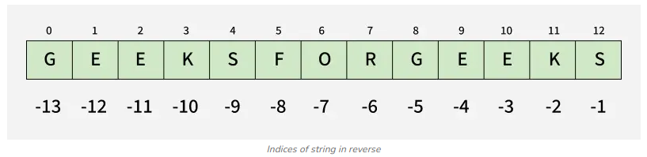

# Python Strings
In Python, a string is a sequence of characters written inside quotes. It can include letters, numbers, symbols, and spaces.

## Creating a String
Strings can be created using either single ('...') or double ("...") quotes. Both behave the same.

```python
s1 = 'GfG'  # single quote
s2 = "GfG"  # double quote
print(s1)
print(s2)
# result: GfG
# result: GfG
```

## Multi-line Strings
Use triple quotes ('''...''' ) or ( """...""") for strings that span multiple lines. Newlines are preserved.

```python
s = """I am Learning
Python String on GeeksforGeeks"""
print(s)

s = '''I'm a 
Geek'''
print(s)
# result: I am Learning
# Python String on GeeksforGeeks
# result: I'm a 
# Geek
```

## Accessing characters in String
Strings are indexed sequences. Positive indices start at 0 from the left; negative indices start at -1 from the right as represented in below image:

<p align="center">
    
    <br/>
    </p>

```python
s = "GeeksforGeeks"
print(s[0])   # first character
print(s[4])   # 5th character
# result: G
# result: s

# Read characters from the end using negative indices.
s = "GeeksforGeeks"
print(s[-10])   # 3rd character
print(s[-5])    # 5th character from end
# result: k
# result: G
```

## String Slicing
A common feature of list, tuple, str, and all sequences types in python is the support of slicing operations.
Slicing is a way to extract a portion of a string by specifying the start and end indexes. The syntax for slicing is string[start:end], where start starting index and end is stopping index (excluded).

```python
s = "GeeksforGeeks"
print(s[1:4])    # characters from index 1 to 3
print(s[:3])     # from start to index 2
print(s[3:])     # from index 3 to end
print(s[::-1])   # reverse string
# result: eek
# result: Gee
# result: ksforGeeks
# result: skeGrofskeeG
```

## String Iteration
Strings are iterable; you can loop through characters one by one.

```python
s = "Python"
for char in s:
    print(char)
# result:
P
y
t
h
o
n
```

## String Immutability
Strings are immutable, which means that they cannot be changed after they are created. If we need to manipulate strings then we can use methods like concatenation, slicing or formatting to create new strings based on original.

```python
s = "geeksforGeeks"
s = "G" + s[1:]   # create new string
print(s)
# result: GeeksforGeeks
``` 

## Deleting a String
In Python, it is not possible to delete individual characters from a string since strings are immutable. However, we can delete an entire string variable using the del keyword.

```python
s = "geeksforgeeks"
del s
print(s)
# result: NameError: name 's' is not defined
```

## Updating a String
As strings are immutable, “updates” create new strings using slicing or methods such as replace().

```python
s = "hello geeks"
s1 = "H" + s[1:]                   # update first character
s2 = s.replace("geeks", "GeeksforGeeks")  # replace word
print(s1)
print(s2)
# result: Hello geeks
# result: Hello GeeksforGeeks
``` 

## Common String Methods

| Method | Description |
| --- | --- |
| `len()` | Returns the length of the string. |
| `upper()` | Converts the string to uppercase. |
| `lower()` | Converts the string to lowercase. |
| `strip()` | Removes leading and trailing whitespace. |
| `replace(old, new)` | Replaces all occurrences of `old` with `new`. |
| `split(sep)` | Splits the string into a list of substrings based on `sep`. |
| `join(iterable)` | Concatenates elements of an iterable into a string. |
| `find(sub)` | Returns the lowest index of `sub` if found, else -1. |
| `startswith(prefix)` | Returns `True` if the string starts with `prefix`. |
| `endswith(suffix)` | Returns `True` if the string ends with `suffix`. |
| `count(sub)` | Returns the number of non-overlapping occurrences of `sub`. |
| `isdigit()` | Returns `True` if all characters are digits. |
| `isalpha()` | Returns `True` if all characters are alphabetic. |
| `isalnum()` | Returns `True` if all characters are alphanumeric. |
| `isspace()` | Returns `True` if all characters are whitespace. |
| `istitle()` | Returns `True` if the string is titlecased. |
| `isupper()` | Returns `True` if all characters are uppercase. |
| `islower()` | Returns `True` if all characters are lowercase. |
| `capitalize()` | Capitalizes the first character of the string. |
| `title()` | Converts the string to title case. |
| `encode(encoding, errors)` | Encodes the string into bytes. |
| `decode(encoding, errors)` | Decodes bytes into a string. |

## Formatting Strings
Python provides several ways to include variables inside strings.

