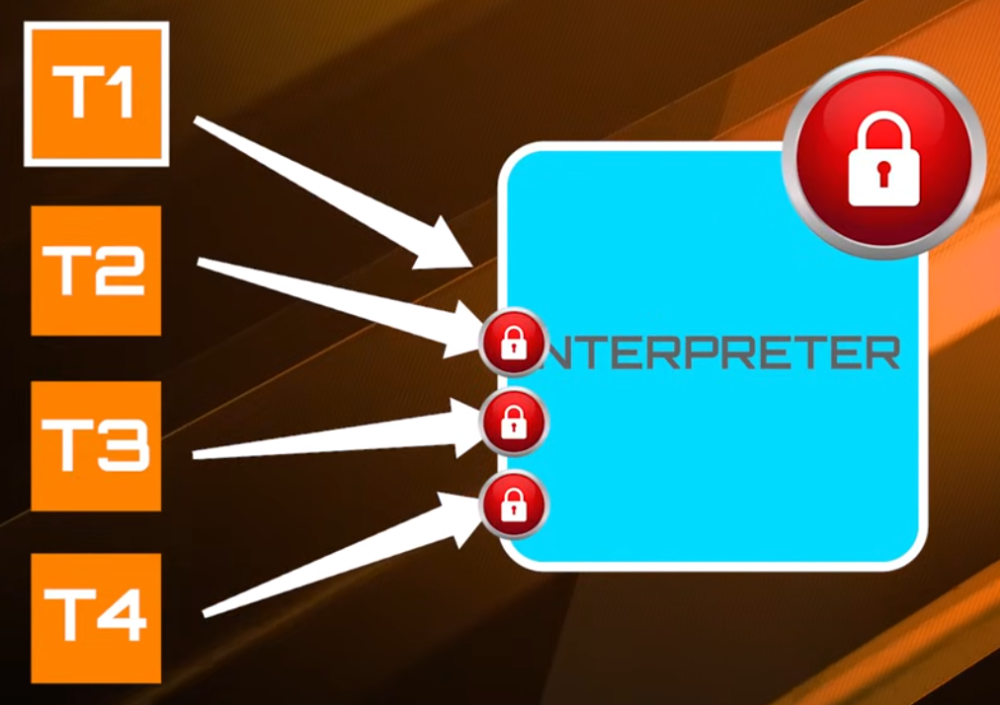

# GIL (Global Interpreter Lock)

1. The GIL is a mutex that protects access to Python objects, preventing multiple threads from executing Python bytecode at the same time.

2. A thread is a basic unit of CPU utilization; it comprises a thread ID, a program counter (PC), a register set, and a stack. It shares with other threads belonging to the same process its code section, data section, and other operating-system resources, such as open files and signals. A traditional process has a single thread of control. If a process has multiple threads of control, it can perform more than one task at a time.

3. By default, the primary Python interpreter process runs on a single CPU core due to the Global Interpreter Lock (GIL).
  - The GIL ensures that only one thread holds control of the interpreter at any given time. This simplifies memory management but acts as a bottleneck for CPU-bound programs seeking to use multiple cores with threads.
  - Default Behavior: When you run a standard Python script, it starts as a single process, and therefore primarily uses a single CPU core for the Python bytecode execution. 

4. How to Use Multiple CPU Cores
  - To take advantage of multiple CPU cores in Python for CPU-intensive tasks, you must use techniques that bypass the GIL's single-core limitation: 
    - Multiprocessing: The standard and most common approach is to use Python's built-in multiprocessing module. This module spawns separate, independent Python interpreter processes, each with its own memory space and its own GIL. These processes can then run on different CPU cores simultaneously, achieving true parallelism.

    

      
       
    

    - C Extensions: Libraries written in lower-level languages like C or C++ (e.g., NumPy) can release the GIL during their long computations, allowing other threads to run in parallel.

    - Multithreading: Python's multithreading module allows you to create and manage multiple threads within a single process. However, due to the GIL, only one thread can execute Python bytecode at a time. This means that multithreading is not effective for CPU-bound tasks but can be useful for I/O-bound tasks where threads can release the GIL while waiting for I/O operations to complete.

      [example](../examples/thread_vs_processing.py)

      

        
         
      

    - Asyncio: Python's asyncio module provides a framework for writing concurrent code using coroutines and an event loop. Asyncio is particularly well-suited for I/O-bound tasks, as it allows you to manage multiple I/O operations concurrently without the overhead of creating multiple threads.

