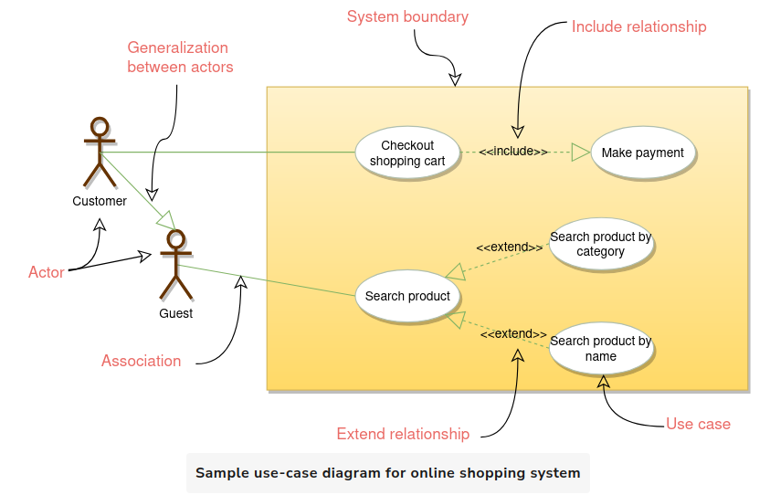
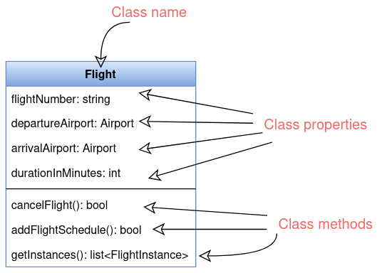
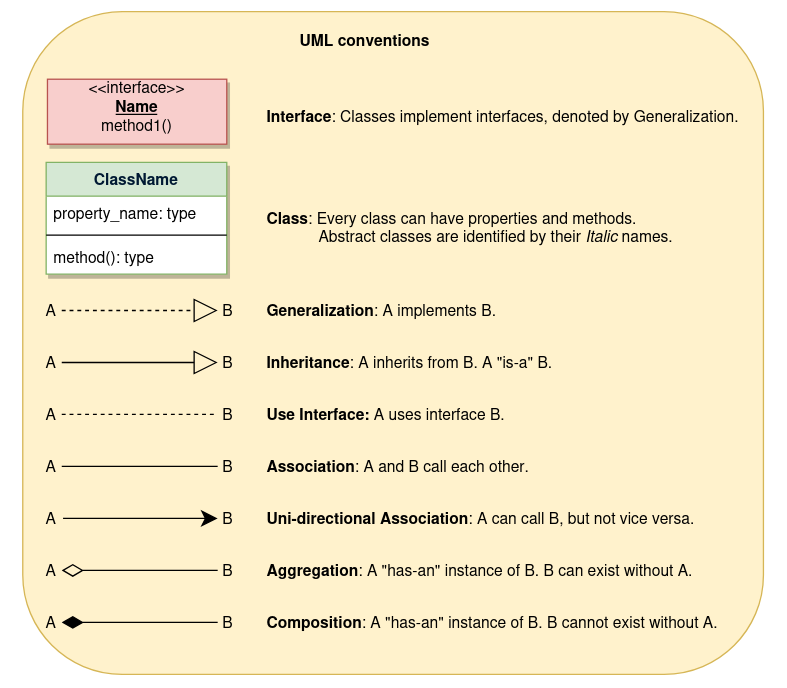
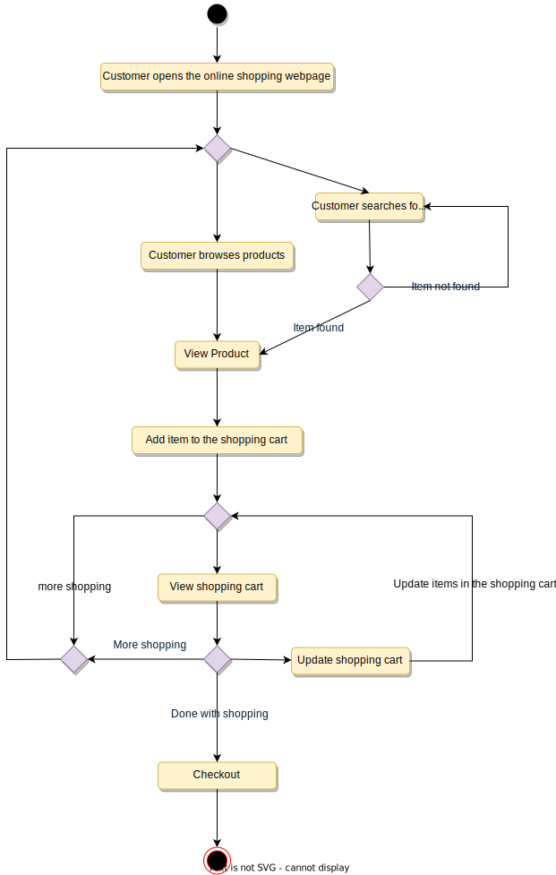

# Introduction
bject-oriented programming (OOP) is a style of programming that focuses on using objects to design and build applications. Contrary to procedure-oriented programming where programs are designed as blocks of statements to manipulate data, OOP organizes the program to combine data and functionality and wrap it inside something called an "Object".

## The four principles of object-oriented programming are encapsulation, abstraction, inheritance, and polymorphism.

### Encapsulation: 
Encapsulation is the mechanism of binding the data together and hiding it from the outside world. Encapsulation is achieved when each object keeps its state private so that other objects don’t have direct access to its state. Instead, they can access this state only through a set of public functions.

### Abstraction: 
Abstraction can be thought of as the natural extension of encapsulation. It means hiding all but the relevant data about an object in order to reduce the complexity of the system. In a large system, objects talk to each other, which makes it difficult to maintain a large code base; abstraction helps by hiding internal implementation details of objects and only revealing operations that are relevant to other objects.

### Inheritance: Inheritance is the mechanism of creating new classes from existing ones.

### Polymorphism: 
Polymorphism (from Greek, meaning “many forms”) is the ability of an object to take different forms and thus, depending upon the context, to respond to the same message in different ways. Take the example of a chess game; a chess piece can take many forms, like bishop, castle, or knight and all these pieces will respond differently to the 'move' message.

## OO Analysis and Design

OO Analysis and Design is a structured method for analyzing and designing a system by applying object-oriented concepts. This design process consists of an investigation into the objects constituting the system. It starts by first identifying the objects of the system and then figuring out the interactions between various objects.

The process of OO analysis and design can be described as:

- Identifying the objects in a system;
- Defining relationships between objects;
- Establishing the interface of each object; and,
- Making a design, which can be converted to executables using OO languages.

## UML
UML stands for Unified Modeling Language and is used to model the Object-Oriented Analysis of a software system. UML is a way of visualizing and documenting a software system by using a collection of diagrams, which helps engineers, businesspeople, and system architects understand the behavior and structure of the system being designed.

### Diagrams
#### Use Case Diagrams
Use case diagrams describe a set of actions (called use cases) that a system should or can perform in collaboration with one or more external users of the system (called actors). Each use case should provide some observable and valuable result to the actors.

  
   

- Include: Include relationship represents an invocation of one use case by another use case. From a coding perspective, it is like one function being called by another function.

- Extend: This relationship signifies that the extended use case will work exactly like the base use case, except that some new steps will be inserted in the extended use case.

#### Class Diagram
Class diagram is the backbone of object-oriented modeling - it shows how different entities (people, things, and data) relate to each other. In other words, it shows the static structures of the system.

  
   

  
   

#### Activity Diagrams
We use Activity Diagrams to illustrate the flow of control in a system. An activity diagram shows the flow of control for a system functionality; it emphasizes the condition of flow and the sequence in which it happens. We can also use an activity diagram to refer to the steps involved in the execution of a use case.

  
   

##### What is the difference between Activity diagram and Sequence diagram?
- Activity diagram captures the process flow. It is used for functional modeling. A functional model represents the flow of values from external inputs, through operations and internal data stores, to external outputs.

- Sequence diagram tracks the interaction between the objects. It is used for dynamic modeling, which is represented by tracking states, transitions between states, and the events that trigger these transitions.

#### Sequence Diagrams
Sequence diagrams describe interactions among classes in terms of an exchange of messages over time and are used to explore the logic of complex operations, functions or procedures. In this diagram, the sequence of interactions between the objects is represented in a step-by-step manner.

  
   

