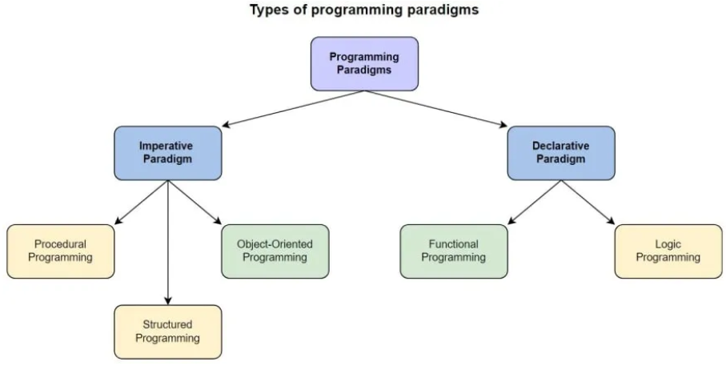

"A programming paradigm is a relatively high-level way to conceptualize and structure the implementation of a computer program. A programming language can be classified as supporting one or more paradigms." By Wikipedia.

  
   

# Imperative Paradigm
Imperative programming is a software development paradigm that focuses on on solving a problem by performing a sequence of steps. In imperative programming, the code specifies how the problem is to be solved by executing steps that change the program’s state. For example, assigning values to variables, controlling the flow of execution with loops and conditionals, and calling functions to perform specific tasks. Imperative programming focuses on describing how a program should work to solve a problem or acheive a desired result.

Examples of imperative programming languages include C, C++, and Java.

## Advantages

- Easy to Learn: Imperative programming is basically the way we think in real world about how to solve our problems hence it is usually easier to learn for beginners than other programming paradigms, as we are a;ready used to solving problems in this way.
- Precise Control: Imperative programming allows for precise control over the flow of a program which is essential for systems which require very high efficiency.
- Efficiency: Imperative programming languages are good for compute intensive tasks as they can be highly optimized which allows the system to acheive high performance.
- Low-level Programming: Imperative programming is mostly used in low-level programming, like kernels or device drivers, because it provides provides high level of control over the hardware. Communication between hardware and drivers can be highly optimized with the help of these languages.

## Disadvantages

- Limited Abstraction: It is difficult to acheive abstraction in imperative programming. This makes it difficult to design larger complex system as it’s availability is highly compromized due to limited abstraction of errors/issues.
- Prone to Errors: The close relationship between program flow and program state makes it more prone to errors and bugs in larger complex systems
- More Code: Imperative programming usually requires a lot more lines of code than other paradigms, which leads to very high amounts of boilerplate code that can be difficult to manage in large complex systems.
- Difficult to Parallelize: Imperative programming is difficult to parallelize, which is highly disadvantageous for distributed systems as it compromises on concurrency.

Imperative programming is divided into three broad categories: Procedural, OOP and parallel processing. These paradigms are as follows:

### Procedural programming paradigm
This is an evolution of imperative programming that uses procedures, also known as subroutines or functions. These procedures break the main program into smaller components for easy reuse. The main program interacts with a procedure through an interface. Procedural programming imposes greater structure, organization, and modularity on a program, and allows programmers to limit the scope of variables. There is no difference in between procedural and imperative approach. Examples of Procedural programming paradigm:
- C : developed by Dennis Ritchie and Ken Thompson
- C++ : developed by Bjarne Stroustrup
- Java : developed by James Gosling at Sun Microsystems
- ColdFusion : developed by J J Allaire
- Pascal : developed by Niklaus Wirth

### Object oriented programming
The program is written as a collection of classes and object which are meant for communication. The smallest and basic entity is object and all kind of computation is performed on the objects only. More emphasis is on data rather procedure. It can handle almost all kind of real life problems which are today in scenario. Examples of Object Oriented programming paradigm:
- Simula : first OOP language
- Java : developed by James Gosling at Sun Microsystems
- C++ : developed by Bjarne Stroustrup
- Objective-C : designed by Brad Cox
- Visual Basic .NET : developed by Microsoft
- Python : developed by Guido van Rossum
- Ruby : developed by Yukihiro Matsumoto 
- Smalltalk : developed by Alan Kay, Dan Ingalls, Adele Goldberg 

### Parallel processing approach
Parallel processing is the processing of program instructions by dividing them among multiple processors. A parallel processing system posses many numbers of processor with the objective of running a program in less time by dividing them. This approach seems to be like divide and conquer. Examples are NESL (one of the oldest one) and C/C++ also supports because of some library function.

# Declarative programming
In contrast with imperative programming, declarative programming describes what you want the program to achieve rather than how it should run. The focus is on what needs to be done rather how it should be done. This is the only difference between imperative (how to do) and declarative (what to do) programming paradigms. Getting into deeper we would see logic, functional and database.

Examples of declarative programming languages include:
    - SQL
    - Miranda
    - Prolog
    - Lisp
    - Many markup languages (e.g., HTML)

## Advantages
- Expressive and concise code
- Easier to reason about and understand the program’s behavior
- Supports domain
- Specific languages and problem-solving at a higher level of abstraction

## Disadvantages
- Can be less efficient than imperative programming
- May require more advanced language features and runtime support
- Limited control over low-level details and optimizations

### Logic programming paradigms
A logic programming paradigm is a set of principles and techniques that guide the design and implementation of logic programs. A logic program consists of a collection of facts and rules that describe the relationships and properties of entities, and a query language that allows asking questions and obtaining answers from the program. A logic programming paradigm defines the syntax and semantics of the facts, rules, and queries, as well as the inference mechanism that derives new facts and rules from the existing ones.

### Functional programming paradigms
It is a programming paradigm where programs are coded by applying and composing functions. Here the computation is treated as a mathematical function evaluation and developers evade changing mutable data and state.

Simply put, in functional programming, functions can be assigned to variables, returned from other functions, and passed as arguments. Some examples are Erlang, Haskell, Lisp, Scala, PureScript, Elixir, and more.

### Database/Data driven programming approach
This programming methodology is based on data and its movement. Program statements are defined by data rather than hard-coding a series of steps. A database program is the heart of a business information system and provides file creation, data entry, update, query and reporting functions. There are several programming languages that are developed mostly for database application. For example SQL. It is applied to streams of structured data, for filtering, transforming, aggregating (such as computing statistics), or calling other programs.

## Other Important Paradigms:

*   **Aspect-Oriented Programming (AOP):** Allows modularizing cross-cutting concerns (aspects) that affect multiple parts of a program, such as logging, security, or transaction management.
    *   **Languages/Frameworks:** AspectJ (Java), PostSharp (.NET)
*   **Generic Programming:** Allows writing code that works with different data types without having to rewrite it for each type.
    *   **Languages:** C++, Java, C#, Go
*   **Concurrent/Parallel Programming:** Designed to execute multiple tasks simultaneously, whether through threads, processes, or multiple processors.
    *   **Languages/Frameworks:** Go, Java (threads), Python (multiprocessing), OpenMP (for C/C++)
*   **Event-Driven Programming:** The program's flow is determined by events (user actions, messages, etc.). Common in graphical user interfaces (GUIs).
    *   **Languages/Frameworks:** JavaScript (for web), C# (for .NET GUI), Java (Swing, JavaFX)
*   **Meta-Programming:** Allows writing code that manipulates other programs (or itself) as data. It is used to generate code, perform static analysis, or extend the functionality of a language.
    *   **Languages:** Lisp, Ruby, Python, C++ (with templates)
*   **Component-Based Programming:** Based on the development of applications by combining reusable components.
    *   **Languages/Frameworks:** .NET, Java EE (Enterprise JavaBeans - EJB), React, Angular, Vue.js (in the context of user interfaces)
*   **Constraint Programming:** Defines a problem as a set of constraints that must be satisfied. The system finds solutions that meet those constraints.
    *   **Languages/Solvers:** Prolog (with constraint libraries), Choco (Java), Gecode (C++)
*   **Domain-Driven Design (DDD):** Focuses on modeling software according to the problem domain, using a common language between developers and domain experts. While not a programming paradigm itself, it influences how code is structured and organized.