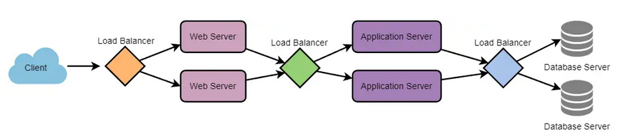
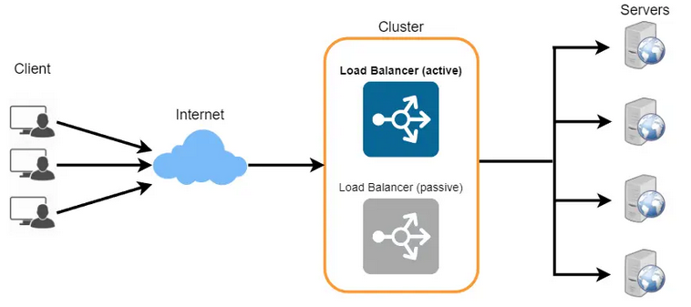
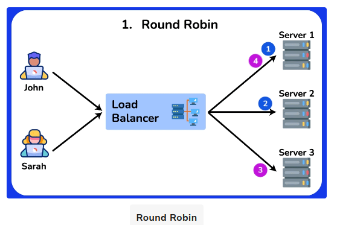
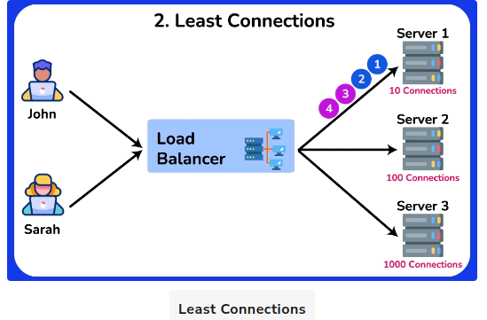
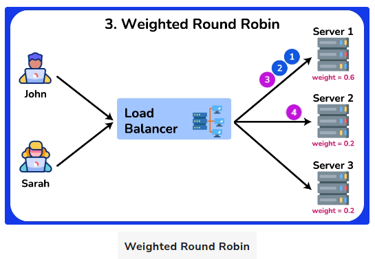

# Load Balancing Algorithms
A load balancing algorithm is a method used by a load balancer to distribute incoming traffic and requests among multiple servers or resources. The primary purpose of a load balancing algorithm is to ensure efficient utilization of available resources, improve overall system performance, and maintain high availability and reliability.

To utilize full scalability and redundancy, we can try to balance the load at each layer of the system. We can add LBs at three places:

    Between the user and the web server
    Between web servers and an internal platform layer, like application servers or cache servers
    Between internal platform layer and database.

  

## Benefits of Load Balancing
- Users experience faster, uninterrupted service. Users won’t have to wait for a single struggling server to finish its previous tasks. Instead, their requests are immediately passed on to a more readily available resource.
- Service providers experience less downtime and higher throughput. Even a full server failure won’t affect the end user experience as the load balancer will simply route around it to a healthy server.
- Load balancing makes it easier for system administrators to handle incoming requests while decreasing wait time for users.
- Smart load balancers provide benefits like predictive analytics that determine traffic bottlenecks before they happen. As a result, the smart load balancer gives an organization actionable insights. These are key to automation and can help drive business decisions.
- System administrators experience fewer failed or stressed components. Instead of a single device performing a lot of work, load balancing has several devices perform a little bit of work.

## Redundant Load Balancers
- The load balancer can be a single point of failure; to overcome this, a second load balancer can be connected to the first to form a cluster. Each LB monitors the health of the other and, since both of them are equally capable of serving traffic and failure detection, in the event the main load balancer fails, the second load balancer takes over.

  

## Load Balancing Algorithms
Load balancing algorithms help to prevent any single server or resource from becoming overwhelmed, which could lead to performance degradation or failure. By distributing the workload, load balancing algorithms can optimize response times, maximize throughput, and enhance user experience. These algorithms can consider factors such as server capacity, active connections, response times, and server health, among others, to make informed decisions on how to best distribute incoming requests.

1. Round Robin

This algorithm distributes incoming requests to servers in a cyclic order. It assigns a request to the first server, then moves to the second, third, and so on, and after reaching the last server, it starts again at the first.

Pros:

    - Ensures an equal distribution of requests among the servers, as each server gets a turn in a fixed order.
    - Easy to implement and understand.
    - Works well when servers have similar capacities.

Cons:

    - No Load Awareness: Does not take into account the current load or capacity of each server. All servers are treated equally regardless of their current state.
    - No Session Affinity: Subsequent requests from the same client may be directed to different servers, which can be problematic for stateful applications.
    - Performance Issues with Different Capacities: May not perform optimally when servers have different capacities or varying workloads.
    - Predictable Distribution Pattern: Round Robin is predictable in its request distribution pattern, which could potentially be exploited by attackers who can observe traffic patterns and might find vulnerabilities in specific servers by predicting which server will handle their requests.

  Use Cases

    - Homogeneous Environments: Suitable for environments where all servers have similar capacity and performance.
    - Stateless Applications: Works well for stateless applications where each request can be handled independently.

  

2. Least Connections

The Least Connections algorithm is a dynamic load balancing technique that assigns incoming requests to the server with the fewest active connections at the time of the request. This method ensures a more balanced distribution of load across servers, especially in environments where traffic patterns are unpredictable and request processing times vary.

Pros:

    - Load Awareness: Takes into account the current load on each server by considering the number of active connections, leading to better utilization of server resources.
    - Dynamic Distribution: Adapts to changing traffic patterns and server loads, ensuring no single server becomes a bottleneck.
    - Efficiency in Heterogeneous Environments: Performs well when servers have varying capacities and workloads, as it dynamically allocates requests to less busy servers.

Cons:

    - Higher Complexity: More complex to implement compared to simpler algorithms like Round Robin, as it requires real-time monitoring of active connections.
    - State Maintenance: Requires the load balancer to maintain the state of active connections, which can increase overhead.
    - Potential for Connection Spikes: In scenarios where connection duration is short, servers can experience rapid spikes in connection counts, leading to frequent rebalancing.

Use Cases

    - Heterogeneous Environments: Suitable for environments where servers have different capacities and workloads, and the load needs to be dynamically distributed.
    - Variable Traffic Patterns: Works well for applications with unpredictable or highly variable traffic patterns, ensuring that no single server is overwhelmed.
    - Stateful Applications: Effective for applications where maintaining session state is important, as it helps distribute active sessions more evenly.

  

  

3. Weighted Round Robin

Weighted Round Robin (WRR) is an enhanced version of the Round Robin load balancing algorithm. It assigns weights to each server based on their capacity or performance, distributing incoming requests proportionally according to these weights. This ensures that more powerful servers handle a larger share of the load, while less powerful servers handle a smaller share.
Pros

    - Load Distribution According to Capacity: Servers with higher capacities handle more requests, leading to better utilization of resources.
    - Flexibility: Easily adjustable to accommodate changes in server capacities or additions of new servers.
    - Improved Performance: Helps in optimizing overall system performance by preventing overloading of less powerful servers.

Cons

    - Complexity in Weight Assignment: Determining appropriate weights for each server can be challenging and requires accurate performance metrics.
    - Increased Overhead: Managing and updating weights can introduce additional overhead, especially in dynamic environments where server performance fluctuates.
    - Not Ideal for Highly Variable Loads: In environments with highly variable load patterns, WRR may not always provide optimal load balancing as it doesn't consider real-time server load.

Use Cases

    - Heterogeneous Server Environments: Ideal for environments where servers have different processing capabilities, ensuring efficient use of resources.
    - Scalable Web Applications: Suitable for web applications where different servers may have varying performance characteristics.
    - Database Clusters: Useful in database clusters where some nodes have higher processing power and can handle more queries.

  

4. Weighted Least Connections

Weighted Least Connections is an advanced load balancing algorithm that combines the principles of the Least Connections and Weighted Round Robin algorithms. It takes into account both the current load (number of active connections) on each server and the relative capacity of each server (weight). This approach ensures that more powerful servers handle a proportionally larger share of the load, while also dynamically adjusting to the real-time load on each server.
Pros

    - Dynamic Load Balancing: Adjusts to the real-time load on each server, ensuring a more balanced distribution of requests.
    - Capacity Awareness: Takes into account the relative capacity of each server, leading to better utilization of resources.
    - Flexibility: Can handle environments with heterogeneous servers and variable load patterns effectively.

Cons

    -Complexity: More complex to implement compared to simpler algorithms like Round Robin and Least Connections.
    - State Maintenance: Requires the load balancer to keep track of both active connections and server weights, increasing overhead.
    - Weight Assignment: Determining appropriate weights for each server can be challenging and requires accurate performance metrics.

Use Cases

    - Heterogeneous Server Environments: Ideal for environments where servers have different processing capacities and workloads.
    - High Traffic Web Applications: Suitable for web applications with variable traffic patterns, ensuring no single server becomes a bottleneck.
    - Database Clusters: Useful in database clusters where nodes have varying performance capabilities and query loads.

