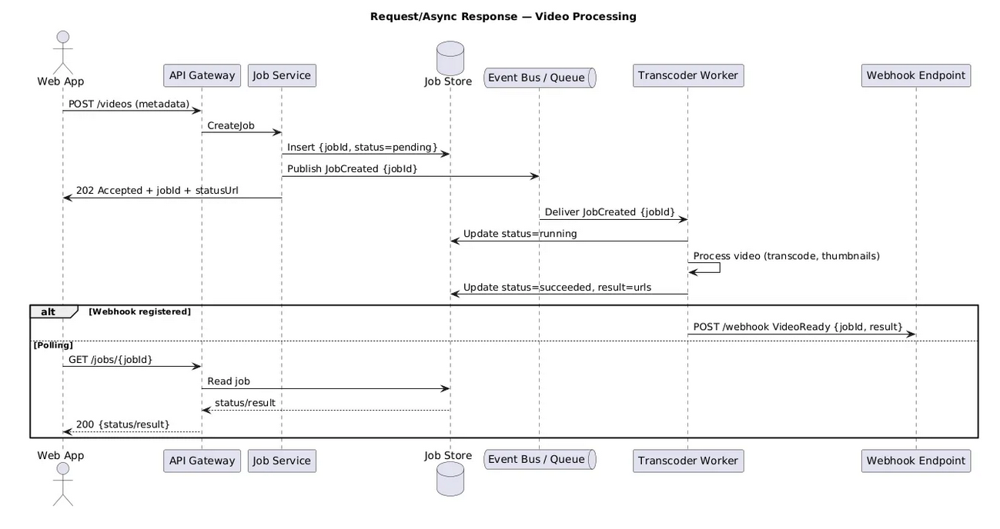

# The Need for Asynchronous Processing
In a microservices architecture, backend services often perform long-running computations that take seconds or minutes to complete. But client apps still expect immediate responses to not block the user experience.

## A Practical Example
Consider a web application that processes payroll on a schedule. When a manager submits timecards, a payroll service asynchronously runs the calculations in the background.

How can this service support both synchronous calls from clients and asynchronous processing?

## Implementing the Pattern
The key pieces are:
- API endpoint accepts requests and queues processing
    - With async request-reply, you can immediately return a job ID. The user can close their browser, make a sandwich, contemplate the nature of existence, whatever. Your server processes the request when it's ready, and the client can check in whenever convenient. 
- Status endpoint polls for completion
- Background function dequeues and processes work

  

## When to Use This Pattern
- **Perfect for:**
    - Long-running operations (video processing, report generation, complex calculations)
    - Tasks involving external systems with unpredictable response times
    - Batch processing operations
    - Scenarios where you need to scale request processing independently from request acceptance
    - Operations that might fail and need retry logic without blocking the client

- **Terrible for:**
    - Reading a user's profile (just return it immediately, don't be dramatic)
    - Simple CRUD operations that take milliseconds
    - Cases where you absolutely need the result before proceeding
    - Real-time chat applications (use WebSockets, friend)

