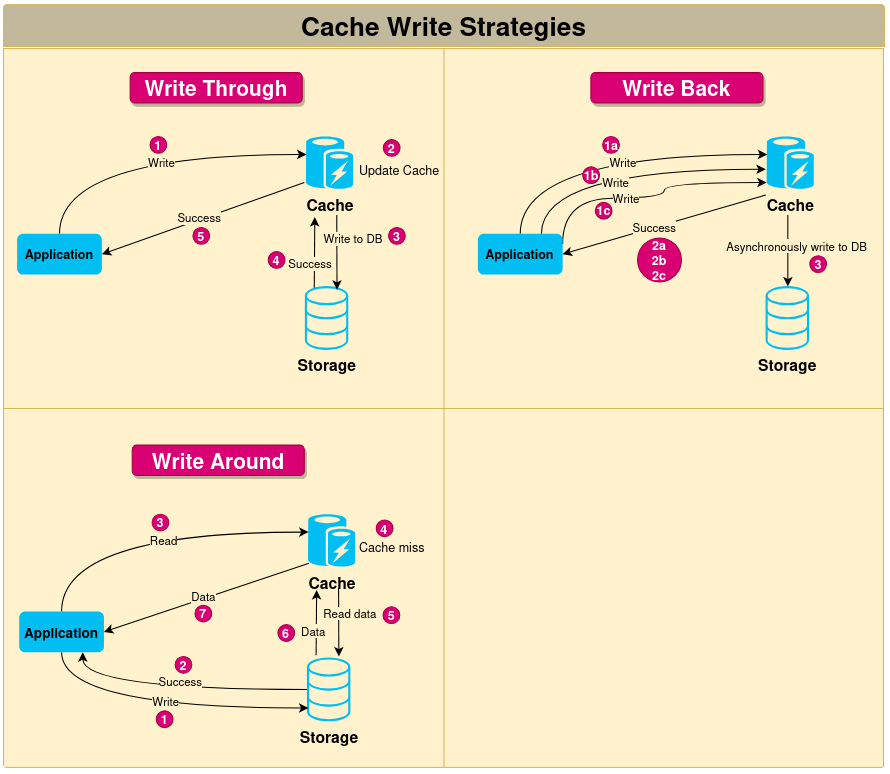
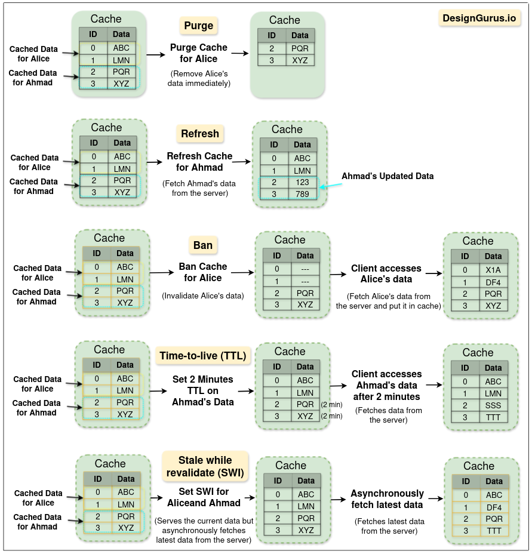
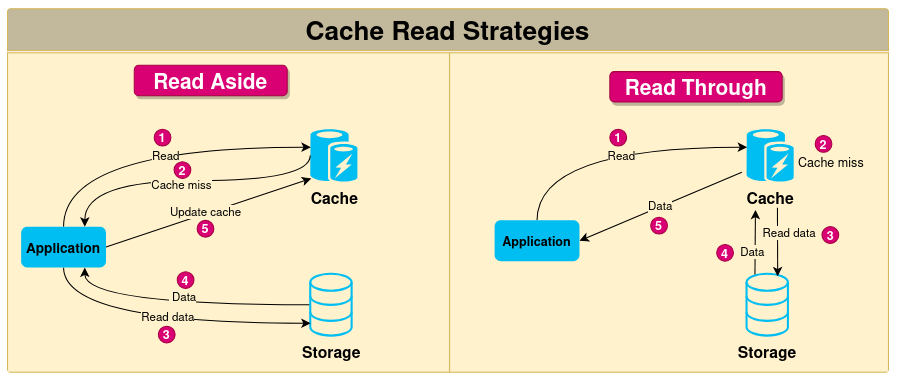

# What is Caching?
- The cache is a high-speed storage layer that sits between the application and the original source of the data, such as a database, a file system, or a remote web service. When data is requested by the application, it is first checked in the cache. If the data is found in the cache, it is returned to the application. If the data is not found in the cache, it is retrieved from its original source, stored in the cache for future use, and returned to the application.
- Caching can be used for various types of data, such as web pages, database queries, API responses, images, and videos. The goal of caching is to reduce the number of times data needs to be fetched from its original source, which can result in faster processing and reduced latency.

## Types of Caching
Caching can be implemented in various ways, depending on the specific use case and the type of data being cached. Here are some of the most common types of caching:
1. In-memory caching

    In-memory caching stores data in the main memory of the computer, which is faster to access than disk storage. In-memory caching is useful for frequently accessed data that can fit into the available memory. This type of caching is commonly used for caching API responses, session data, and web page fragments. To implement in-memory caching, software engineers can use various techniques, including using a cache library like Memcached or Redis, or implementing custom caching logic within the application code.

2. Disk caching

    Disk caching stores data on the hard disk, which is slower than main memory but faster than retrieving data from a remote source. Disk caching is useful for data that is too large to fit in memory or for data that needs to persist between application restarts. This type of caching is commonly used for caching database queries and file system data.

3. Database caching

    Database caching stores frequently accessed data in the database itself, reducing the need to access external storage. This type of caching is useful for data that is stored in a database and frequently accessed by multiple users. Database caching can be implemented using a variety of techniques, including database query caching and result set caching.

4. Client-side caching

    This type of caching occurs on the client device, such as a web browser or mobile app. Client-side caching stores frequently accessed data, such as images, CSS, or JavaScript files, to reduce the need for repeated requests to the server. Examples of client-side caching include browser caching and local storage.

5. Server-side caching

    This type of caching occurs on the server, typically in web applications or other backend systems. Server-side caching can be used to store frequently accessed data, precomputed results, or intermediate processing results to improve the performance of the server. Examples of server-side caching include full-page caching, fragment caching, and object caching.

6. CDN caching

    CDN caching stores data on a distributed network of servers, reducing the latency of accessing data from remote locations. This type of caching is useful for data that is accessed from multiple locations around the world, such as images, videos, and other static assets. CDN caching is commonly used for content delivery networks and large-scale web applications.

7. DNS caching

    DNS cache is a type of cache used in the Domain Name System (DNS) to store the results of DNS queries for a period of time. When a user requests to access a website, their computer sends a DNS query to a DNS server to resolve the website’s domain name to an IP address. The DNS server responds with the IP address, and the user’s computer can then access the website using the IP address. DNS caching improves the performance of the DNS system by reducing the number of requests made to DNS servers. When a DNS server receives a request for a domain name, it checks its local cache to see if it has the IP address for that domain name. If the IP address is in the cache, the DNS server can immediately respond with the IP address without having to query other servers. This can significantly reduce the response time for DNS queries and improve the overall performance of the system.

## Cache Strategies

  

## Cache Invalitation methods

  

## Cache read strategies

  

