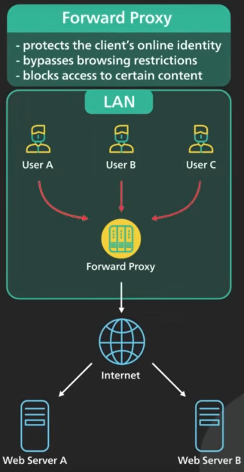
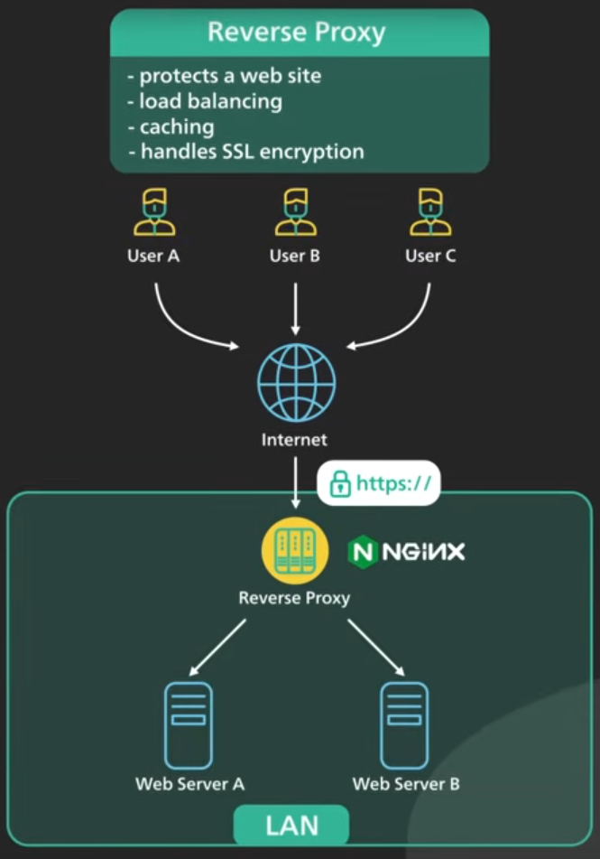

# Proxy
A proxy is a server that acts as an intermediary for requests from clients seeking resources from other servers. It's essentially a gateway between you and the rest of the internet.

When a client connects to a proxy, it sends its request to the proxy server instead of directly to the destination. The proxy then forwards the request to the destination server. Once the destination server responds, the proxy receives the response and sends it back to the original client. This process can be used for various purposes, including enhancing security, filtering content, or improving performance.

## Forward Proxy
A forward proxy is the most common type of proxy. It acts as an intermediary for a client or a group of clients trying to access external resources, such as websites on the internet. The client configures their browser to send all requests to the proxy. The proxy then forwards the request to the destination server on the client's behalf. It's useful for bypassing content blocks, enhancing client security, and controlling user access to the internet within a corporate network.

  

## Reverse Proxy
A reverse proxy is the opposite of a forward proxy. It sits in front of one or more web servers and handles requests from internet clients, forwarding them to the appropriate server. It is primarily used to protect internal servers, load balance traffic, and improve application performance.

  

