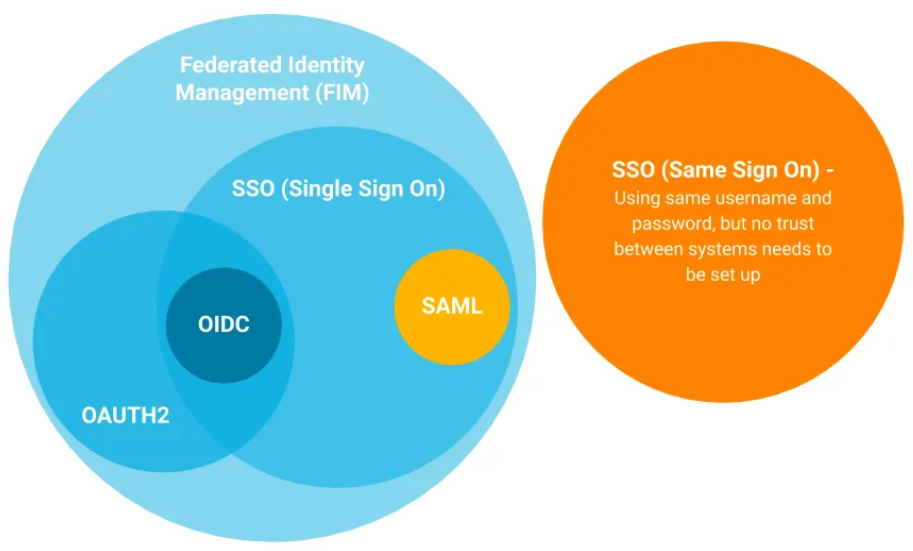
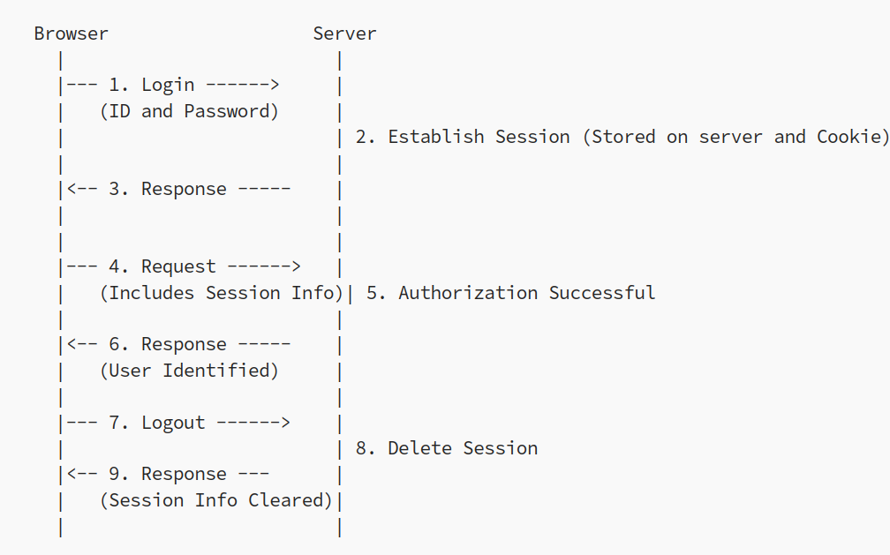
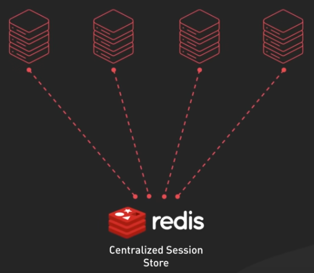
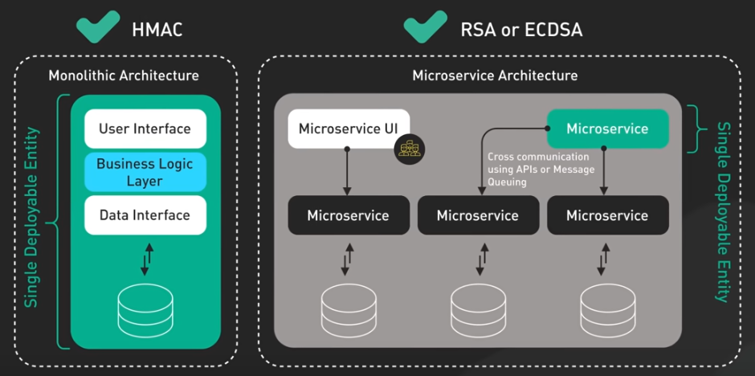
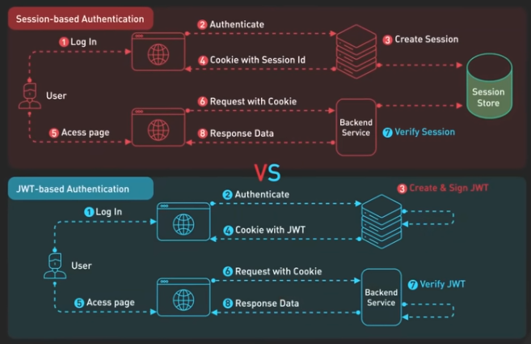

# Web Security

## Authorization
Authorization is defined as a process ensuring that correctly authenticated users can access only those resources for which the owner has given them approval.

## Authentication
Authentication checks if an entity is who they say they are before letting them access resources.

### Authentication Types
There are several authentication methods. These include:

- **Username and password authentication:** This is the most common form, where users provide a username and password to access server resources.
  - **Basic Auth:** Basic Auth (short for Basic Authentication) is a way to authenticate using a username and password, but in a specific format used over HTTP.
    - It's the same as logging in with a username and password but the way the credentials are transmitted is what makes it different. In Basic Auth, the credentials are sent with every request, encoded (not encrypted).
    - That’s why you should never use it without HTTPS, otherwise, someone could easily intercept them.
    - How does it work?
      1. The client takes the username and password
      2. It joins them like this: username:password
      3. Then encodes the result in Base64
      4. And sends it in an HTTP header like this:
        ```
        GET /data HTTP/1.1
        Host: example.com
        Authorization: Basic YWRtaW46c2VjcmV0

        Where YWRtaW46c2VjcmV0 is admin:secret in Base64.
        ```

- **Two-factor/Multi-factor authentication (2FA/MFA):** Users must provide more than one verification method before being granted access.

- **Biometric authentication:** This utilizes users’ physical uniqueness, such as fingerprints, facial recognition, or voice recognition.

- **Single Sign-On (SSO):** Users authenticate once with a central service and access multiple applications without separate logins. 
  - An example of one such feature is Google. With a single login, you can access all of their services like Gmail, Photos, Drive, and many more. Other applications also allow users to use Google login for authentication provided they have their system integrated with Identity Providers like Google, Facebook, etc.

    <p align="center">
      
      <br/>
      <a href="https://www.onelogin.com/images/patterns/text-image/sso-types.png">Understanding Session-Based Authentication from Scratch</a>
    </p>

  - There are a lot of standards and protocols that provide SSO and some of the famous ones are
    - **Security Assertion Markup Language (SAML):** SAML is an open standard that has become one of the core standards for SSO. SAML uses an XML document called Assertion (that contains the user authorization) that the Identity Provider sends to the service provider.
    - **Open Authorization (OAuth):** OAuth is a newer standard than SAML, and it was jointly developed by Google and Twitter beginning in 2006. It was developed in part to compensate for SAML’s deficiencies on mobile platforms and is based on JSON rather than XML. OAuth2 uses JWT tokens widely and hence is lighter and faster than SAML.
    - **Open ID Connect (OIDC):** OpenID Connect (OIDC) is an authentication protocol that allows apps (like websites or mobile apps) to verify who you are using a trusted identity provider (such as Google, Microsoft, Auth0, etc.).
    - **Web Services Federation (WS-Federation):** WS-Federation (or WS-Fed) is an authentication protocol that allows users to log into a web application using an account from another organization or system.
      It’s like an agreement between systems that says:
        “I trust who you say this user is, so I don’t need to ask them to log in again.”
      - WS-Federation is built on WS-Trust and SOAP (uses XML-based technologies).
      - It uses a security token (often SAML) to carry user identity info.
    - **Kerberos:** Kerberos is an authentication protocol that allows users to securely access services within a network, without sending their password every time.
      It was developed at MIT and is widely used in enterprise environments, especially with Windows and Active Directory.
      Kerberos uses tickets instead of direct passwords. Here’s how it works:
        - The user wants to access a service (like a printer or a database).
        - They request a "ticket" from the authentication server (KDC).
        - If the user authenticates correctly, the KDC gives them an encrypted access ticket.
        - Then, the user presents that ticket to the service they want to use.
        - The service accepts it (because it trusts the KDC), and the user is allowed access without re-entering their password.

- **Session Authentication:** Session authentication is a method of identifying users in subsequent requests after they have logged in once.
  - Separate storage required for storing session information.
  - Invalid session is easy (When you need the ability to revoke sessions instantly)
  - Scaling also involves the session store
  - Keep sensitive data on the server, which can be a security advantage

    <p align="center">
      
      <br/>
      <a href="https://medium.com/@884m884/understanding-session-based-authentication-from-scratch-64110bcfc00f">Understanding Session-Based Authentication from Scratch</a>
    </p>

    <p align="center">
      
      <br/>
      <i>Source: ByteByteGo.com</i>
    </p>

- **Token-based authentication:** This uses unique tokens (e.g., API keys, JWTs) for verification instead of usernames and passwords.
  - **JWT Authentication (short for JSON Web Token and pronounced “jot”)**
    JWT is an open standard used to create compact, self-contained tokens used for securely transmitting information between different applications or services. These tokens are typically used for authentication and authorization, as they can contain information that verifies the identity of a user, and their permissions.

  - **Structure of a JWT**
    1. Header: Is a JSON object and typically contains two properties: The type of token and the encryption algorithm.

    ```sh
    {
      "alg": "HS256",
      "typ": "JWT"
    }
    ```

    2. Payload: Is another JSON object where all of  the transmitted data lives.
    3. Signature: Is created by signing the  Base64Url encoded  header and payload with a secret key and algorithm specified by the developers.

    All three of these parts are Base64Url encoded strings concatenated with periods ('.').

  - Algorithms
    - HMAC: Symmetric signing method, the secret key is used to sign and verify the token, simple and efficient,
    but requires sharing the secret  key with any service that needs to verify the token. 
    - RSA and ECDSA  are asymmetric signing methods, the private key is used  to sign the token and the public key to verify it.

  <p align="center">
    
    <br/>
    <i>Source: ByteByteGo.com</a></i>
  </p>

  - **Advantages of using JWTs**
    - When you need  a stateless architecture
    - You store all the necessary data in the token itself.
    - No storage needed
    - Invalidation of a JWT is not easy
    - Scaling client and server is easy

  - **Session vs JWT**
    <p align="center">
      
      <br/>
      <i>Source: ByteByteGo.com</a></i>
    </p>

### OAuth2
OAuth2 is a secure open authorization protocol (NOT an authentication protocol). It is the latest version of the OAuth protocol.

OAuth 2.0 uses Access Tokens. An Access Token is a piece of data that represents the authorization to access resources on behalf of the end-user. OAuth 2.0 doesn’t define a specific format for Access Tokens. However, in some contexts, the JSON Web Token (JWT) format is often used. This enables token issuers to include data in the token itself. Also, for security reasons, Access Tokens may have an expiration date.

#### OAuth2.0 Roles

The idea of roles is part of the core specification of the OAuth2.0 authorization framework. These define the essential components of an OAuth 2.0 system, and are as follows:

  - Resource Owner: The user or system that owns the protected resources and can grant access to them.

  - Client: The client is the system that requires access to the protected resources. To access resources, the Client must hold the appropriate Access Token.

  - Authorization Server: This server receives requests from the Client for Access Tokens and issues them upon successful authentication and consent by the Resource Owner. The authorization server exposes two endpoints: the Authorization endpoint, which handles the interactive authentication and consent of the user, and the Token endpoint, which is involved in a machine to machine interaction.

  - Resource Server: A server that protects the user’s resources and receives access requests from the Client. It accepts and validates an Access Token from the Client and returns the appropriate resources to it.


#### OAuth 2.0 Scopes
Scopes are an important concept in OAuth 2.0. They are used to specify exactly the reason for which access to resources may be granted. Acceptable scope values, and which resources they relate to, are dependent on the Resource Server.

#### Mapping of Roles in Cognito
| OAuth2 Role            | In Cognito                                                                   |
|------------------------|------------------------------------------------------------------------------|
| **Resource Owner**      | 👉 The **end user** who logs in (user of the *User Pool*)                     |
| **Client**              | 👉 Your **web/mobile application** registered in Cognito as an **App Client** |
| **Authorization Server**| 👉 **Amazon Cognito User Pool** (Cognito Hosted UI or `/oauth2/` endpoints)   |
| **Resource Server**     | 👉 Your **protected API**, which validates the `access_token` issued by Cognito |


