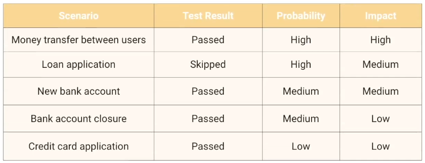
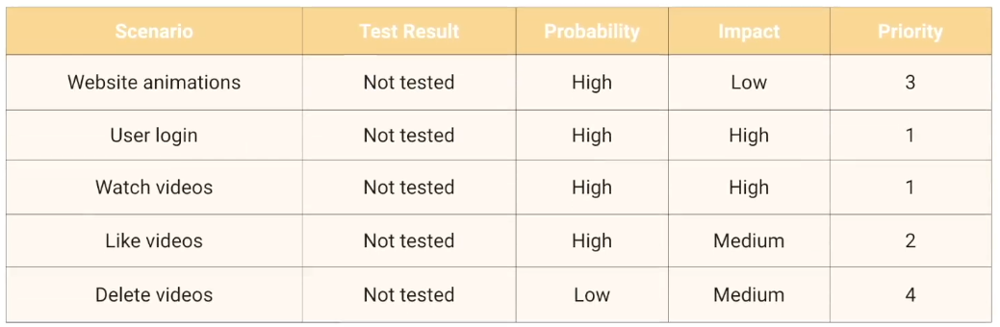

# Experienced Based Testing
- Experienced based testing is the technique of executing testing activities with the help of experience gained through several years of working in a similar domain.
    - Test cases are derived from the tester skills:
        - Intuition
        - experience with similar applications and Technologies.
    - Help identify tests were not easily identified by other more systematic techiques
- Techniques:
    - Error Guessing
        - Used to anticipate the occurrence of Errors defects and failures based on testers knowledge
        - The person knows:
            - the history of the application
            - kind of errors
            - failures that have occurred in other applications
        - Predict what can go wrong
    - Exploratory Testing
        -  Testing approach where the testers dynamically explores the software application without relying on predefined test cases it involves simultaneously test design and test execution allowing the tester
        to learn investigate and adapt the testing process as they navigate through the system.
    - Checklist-based Testing

# Risk Based Testing
- Risk-based testing is a powerful approach that enables prioritizing of testing efforts to achieve a higher level of quality.
- To achieve a higher level of quality as testers our primary objective is to uncover significant problems in the product and risk-based testing helps us to do it more efficiently.
- Test cases are derived from the tester skills intuition and their experience with similar applications and Technologies.

  

Risk = Impact x Likelihood

  

