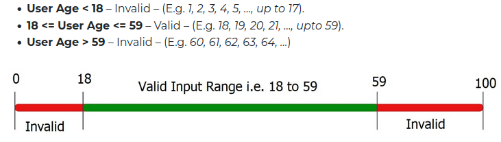
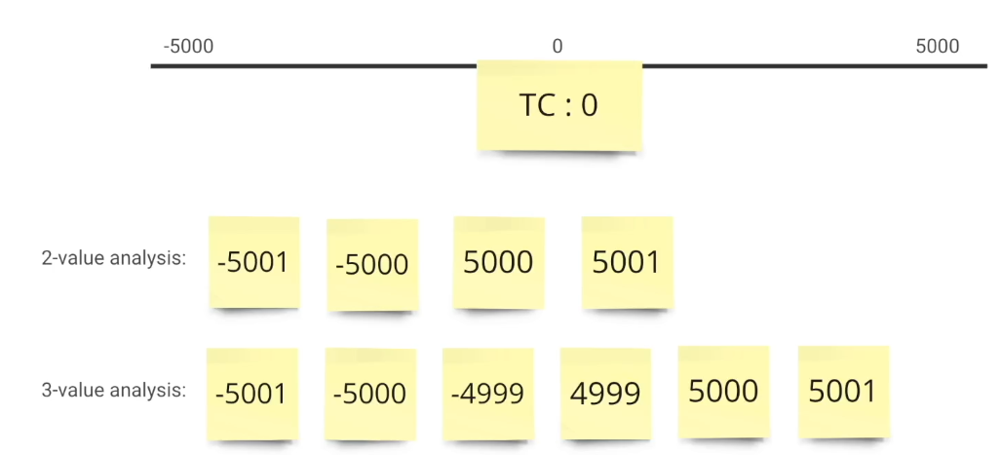
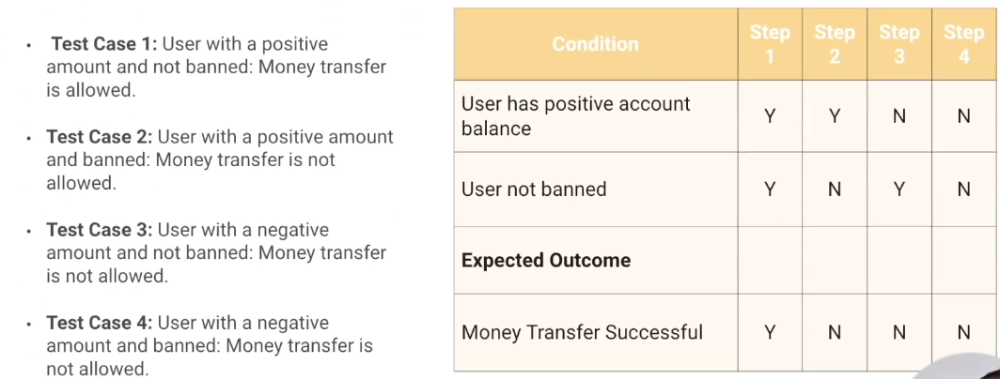
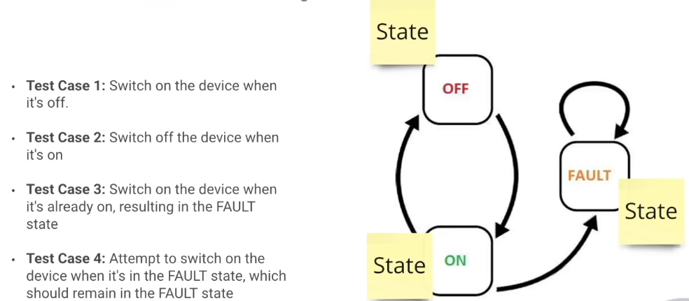
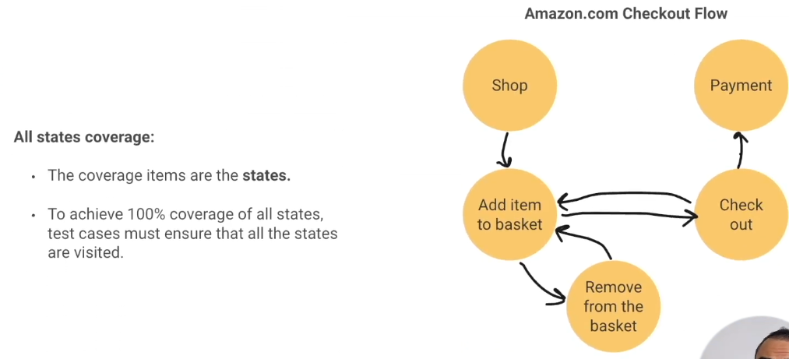
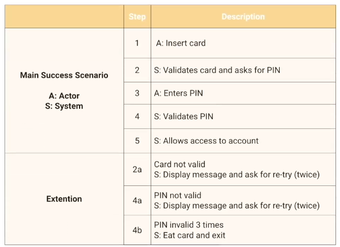
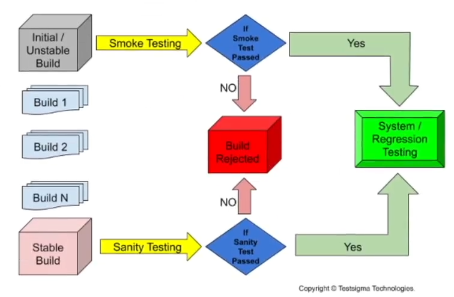
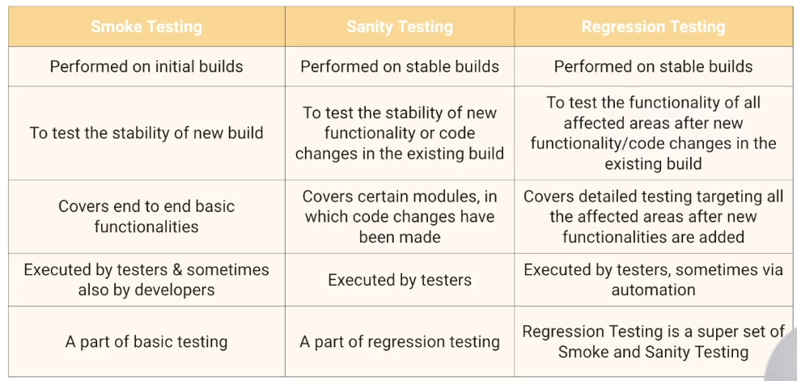

# Black Box testing
- Black Box testing is a method of testing software in which the tester is unaware of the internal workings in this techniques we test the software from the end user's perspective we interact with the application and check if it aligns with the expect results.
- When interacting with the software we need to do it cleverly to cover the most part with the least 
efforts Black Box testing techniques help us to achieve that.
- There are five black box testing techniques:
    1. Equivalence Partitioning
    2. Boundary Value Analysis
    3. Decision Table Testing
    4. State Transition Testing
    5. Use Case Testing

## Equivalence Partitioning
Equivalence partitioning is a powerful testing technique that focuses on eliminating sets of input data that result in the same system behavior and produce identical outcomes during application testing its main objective is to reduce the number of repetitive test cases by identifying and eliminating inputs that generate the same output by careful selecting represent the values from each partition we can effectively cover various scenarios and ensure thorough test coverage.

  

## Boundary Value Analysis (numbers, dates and times). 
- Boundary value analysis focuses on testing the boundaries of input values as it is widely recognized that errors tend to occur more frequently. 
- When applying boundary value analysis it is important to remember that it complements equivalence partitioning while equivalence partitioning helps us divide the input data into meaningful sets, boundary value analyzes allows us to specifically target the boundaries within those partitions by testing the edges of the equivalence classes.
    - 2-Value Boundary Value Analysis
        - The boundary value and the value that is just over the boundary by the smallest possible increment are used.
        - Requirement: Field can accepts values between 1 and 100
            - Test cases: 0, 1, 100, 101
    - 3-Value Boundary Value Analysis
        -  Expands upon the two value approach by including an additional test case within each boundary.
        - Requirement: Field can accepts values between 1 and 100
            - Test cases: 0, 1, 2, 99, 100, 101

  

## Decision Table Testing
- Decision tables are a useful way to record complex business rules that the system must implement they assist testers in understanding the effects of combinations of different inputs and other software states that must correctly implement the business rules.
- Requirement: The users should have a positive amount to be able to transfer money and they should not be banned

  

- Number of test cases: 2^n
    - For 2 condition: 2^2 = 4 test cases
    - For 3 condition: 2^3 = 8 test cases
    - For 4 condition: 2^4 = 16 test cases

## State Transition Testing
-  That aims to ensure that the system transitions between different states correctly and consistently

  

- State transition testing is particularly useful when the sequence of events needs to be tested.

  

## Use Case Testing
- The concept of a Use Case can be likened to a real-life scenario in which users and their objectives are present.
- Use Case Testing is a software testing technique designed to ensure that the system under test meets and exceeds the stakeholders’ expectations. 
- Characteristics:
  - This method simulates real-life scenarios, ensuring the software functions seamlessly and delivers an exceptional user experience.
  - It focuses on testing the system’s behavior and functionality from the end user’s perspective.
  - It involves identifying and defining various use cases or scenarios that represent how the system will be used in real-world situations.
  - It helps ensure the system meets the specified requirements and performs as expected in different usage scenarios.
  - It allows testers to validate the interactions between users, systems, or external entities and the system under test.
  - It helps uncover potential defects or issues related to user interactions, data flow, or system integration.

  

# Negative Testing
- We need to cover both positive and negative cases where we examine situations involving unexpected or involved inputs
- Positive testing verifies that your application works as expected if an error is encountered during positive testing the test fails it is also commonly referred to as happy path testing.

# Smoke, Sanity and Regression Testing
## Smoke Testing
- Smoke testing is an approach that is usually carried out during the initial development stages of the software development lifecycle. 
- It is purpose is to make sure that the core functionalities of the program are working fine without any issues.
- It is executed before any detailed functional tests are done on the software the main intent of smoke testing is not to perform deep testing.
- When to perform smoke testing:
  - in unstable builds
  - Developers provide a fresh build to the Quality Assurane team.
  - New module is added to the existing functionality

## Sanity and Regression Testing
- Sanity testing is a kind of testing performed to check whether the software product is working correctly when a new module or functionality gets implemented in an existing product
- is performed on stable builds

  

- When to perform sanity testing:
  - When the build is received after many regressions or if there is a minor change in the code.
  - The build is received after a bug fix
  - Before deployment on production

## Regression Testing
- Regression Testing is the process of verifying that the software still performs correctly after changes were introduced.
  - Bug fix does not affected the previous build
  - New tests are not created
-  once sanity testing of the change function is completed all the impacted features of the application require complete testing. This is called regression testing.
- When to perform regression testing:
  - New features being introduced
  - Detects being fixed
  - Performance fixes
  - Change in requirement
- Number of selected test cases prioritised by risk areas before each release.
- Some ideas for areas to test during regression testing:
  - Areas exposed to a high number of users
  - Areas that have frequent defects
  - Code features
  - High complex functionality
  - Areas that have undergone recent changes
  - Critical integrations

  

