# What is a Container Orchestration System?
In Development (Dev) environments, running containers on a single host for development and testing of applications may be a suitable option. However, when migrating to Quality Assurance (QA) and Production (Prod) environments, that is no longer a viable option because the applications and services need to meet specific requirements:

- Fault-tolerance
- On-demand scalability
- Optimal resource usage
- Auto-discovery to automatically discover and communicate with each other
- Accessibility from the outside world
- Seamless updates/rollbacks without any downtime.

Container orchestrators are tools which group systems together to form clusters where containers' deployment and management is automated at scale while meeting the requirements mentioned above. 

The clustered systems confer the advantages of distributed systems, such as increased performance, cost efficiency, reliability, workload distribution, and reduced latency.

## Container Orchestrators
- Amazon Elastic Container Service (ECS)
- Amazon Elastic Kubernetes Service (EKS)
- Azure Container Instances
- Azure Service Fabric
- Google Kubernetes Engine
- Oracle Container Engine
- IBM Cloud Kubernetes Service

Orchestrators make things much easier for users especially when it comes to managing hundreds or thousands of containers running on a global infrastructure.

## Where to Deploy Container Orchestrators?
Most container orchestrators can be deployed on the infrastructure of our choice - on bare metal, Virtual Machines, on-premises, on public and hybrid clouds. 

Kubernetes, for example, can be deployed on a workstation, with or without an isolation layer such as a local hypervisor or container runtime, inside a company's data center, in the cloud on AWS Elastic Compute Cloud (EC2) instances, Google Compute Engine (GCE) VMs, DigitalOcean Droplets, IBM Virtual Servers, OpenStack, etc.

# What Is Kubernetes?
According to the Kubernetes website:
"Kubernetes is an open-source system for automating deployment, scaling, and management of containerized applications".

Kubernetes is highly inspired by the Google Borg system, a container and workload orchestrator for its global operations, Google has been using for more than a decade. It is an open source project written in the Go language and licensed under the License, Version 2.0

Kubernetes was started by Google and, with its v1.0 release in July 2015, Google donated it to the Cloud Native Computing Foundation (CNCF), one of the largest sub-foundations of the Linux Foundation.

github: https://github.com/kubernetes/kubernetes

## Kubernetes features
- **Automatic bin packing:** Kubernetes automatically schedules containers based on resource needs and constraints, to maximize utilization without sacrificing availability.
- **Designed for extensibility:** A Kubernetes cluster can be extended with new custom features without modifying the upstream source code.
- **Self-healing:** Kubernetes automatically replaces and reschedules containers from failed nodes. It terminates and then restarts containers that become unresponsive to health checks, based on existing rules/policy. It also prevents traffic from being routed to unresponsive containers.
- **Horizontal scaling:** Kubernetes scales applications manually or automatically based on CPU or custom metrics utilization.
- **Service discovery and load balancing:** Containers receive IP addresses from Kubernetes, while it assigns a single Domain Name System (DNS) name to a set of containers to aid in load-balancing requests across the containers of the set.

another features:
- **Automated rollouts and rollbacks:** Kubernetes automatically rolls out and rolls back application updates.
- **Secret and configuration management:** Secrets consist of sensitive/confidential information passed to the application without revealing the sensitive content to the stack configuration, like on GitHub.
- **Storage orchestration:** Kubernetes automatically mounts software-defined storage (SDS) solutions to containers from local storage, external cloud providers, distributed storage, or network storage systems.
- **Batch execution:** Kubernetes supports batch execution, long-running jobs, and replaces failed containers.
- **IPv4/IPv6 dual-stack:** Kubernetes supports both IPv4 and IPv6 addresses.

## Kubernetes Architecture
<p align="center">
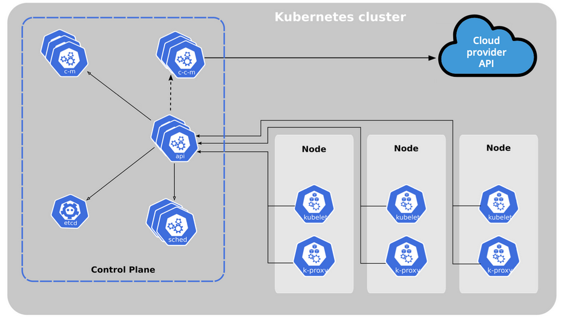
<br/>
- One or more control plane nodes
- One or more worker nodes (optional, but recommended).

### Control Plane Node Overview
The control plane node provides a running environment for the control plane agents responsible for managing the state of a Kubernetes cluster, and it is the brain behind all operations inside the cluster. 

The control plane components are agents with very distinct roles in the cluster's management. In order to communicate with the Kubernetes cluster, users send requests to the control plane via a Command Line Interface (CLI) tool, a Web User-Interface (Web UI) Dashboard, or an Application Programming Interface (API).

It is important to keep the control plane running at all costs. Losing the control plane may introduce downtime, causing service disruption to clients, with possible loss of business. To ensure the control plane's fault tolerance, control plane node replicas can be added to the cluster, configured in High-Availability (HA) mode. While only one of the control plane nodes is dedicated to actively managing the cluster, the control plane components stay in sync across the control plane node replicas. This type of configuration adds resiliency to the cluster's control plane, should the active control plane node fail.

To persist the Kubernetes cluster's state, all cluster configuration data is saved to a distributed key-value store which only holds cluster state related data, no client workload generated data. The key-value store may be configured on the control plane node (stacked topology), or on its dedicated host (external topology) to help reduce the chances of data store loss by decoupling it from the other control plane agents.

#### Control Plane Node Components
A control plane node runs the following essential control plane components and agents: 
- **API server**
    -  The API Server intercepts RESTful calls from users, administrators, developers, operators and external agents, then validates and processes them.
    - The API Server is the only control plane component to talk to the key-value store, both to read from and to save Kubernetes cluster state information
- **scheduler**
    - The role of the kube-scheduler is to assign new workload objects, such as pods encapsulating containers, to nodes - typically worker nodes. 
    -  The scheduler obtains from the key-value store, via the API Server, resource usage data for each worker node in the cluster.
    - The scheduler also receives from the API Server the new workload object's requirements which are part of its configuration data.
    - The scheduler is highly configurable and customizable through scheduling policies, plugins, and profiles.
- **controller managers**
    - The controller managers are components of the control plane node running controllers or operator processes to regulate the state of the Kubernetes cluster. 
    - Controllers are watch-loop processes continuously running and comparing the cluster's desired state (provided by objects' configuration data) with its current state (obtained from the key-value store via the API Server). 
    - In case of a mismatch, corrective action is taken in the cluster until its current state matches the desired state.
- **key-value data store**
    - etcd is an open source project under the Cloud Native Computing Foundation (CNCF). etcd is a strongly consistent, distributed key-value data store used to persist a Kubernetes cluster's state.


<p align="center">
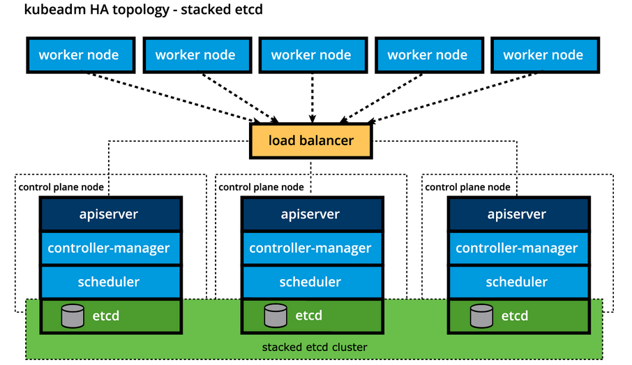
<br/>

<p align="center">
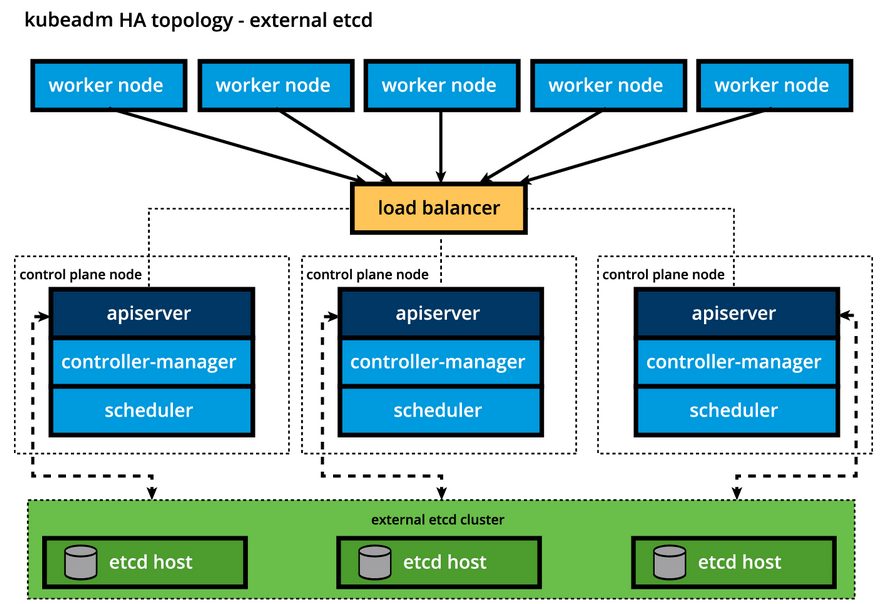
<br/>


### Worker Node Overview

A worker node provides a running environment for client applications. 

These applications are microservices running as application containers. 

In Kubernetes the application containers are encapsulated in Pods, controlled by the cluster control plane agents running on the control plane node. Pods are scheduled on worker nodes, where they find required compute, memory and storage resources to run, and networking to talk to each other and the outside world. 

A Pod is the smallest scheduling work unit in Kubernetes. It is a logical collection of one or more containers scheduled together, and the collection can be started, stopped, or rescheduled as a single unit of work.

Also, in a multi-worker Kubernetes cluster, the network traffic between client users and the containerized applications deployed in Pods is handled directly by the worker nodes, and is not routed through the control plane node.

#### Worker Node Components

A worker node has the following components: 
- container runtime
    -  In order to manage a container's lifecycle, Kubernetes requires a container runtime on the node where a Pod and its containers are to be scheduled. A runtime is required on each node of a Kubernetes cluster, both control plane and worker.
    - container runtimes:
        - CRI-O: A lightweight container runtime for Kubernetes, supporting quay.io and Docker Hub image registries.
        - containerd: A simple, robust, and portable container runtime.
        - Docker Engine: A popular and complex container platform which uses containerd as a container runtime.
        - Mirantis Container Runtime: Formerly known as the Docker Enterprise Edition.
- node agent - kubelet
    - The kubelet is an agent running on each node, control plane and workers, and it communicates with the control plane. 
    - It receives Pod definitions, primarily from the API Server, and interacts with the container runtime on the node to run containers associated with the Pod.
    - It also monitors the health and resources of Pods running containers.
<p align="center">

<br/>
- CRI shims
    - Originally the kubelet agent supported only a couple of container runtimes, first the Docker Engine followed by rkt, through a unique interface model integrated directly in the kubelet source code. 
    - Kubernetes started migrating towards a standardized approach to container runtime integration by introducing the CRI. 
    - Kubernetes adopted a decoupled and flexible method to integrate with various container runtimes without the need to recompile its source code.
    - Shims are Container Runtime Interface (CRI) implementations, interfaces or adapters, specific to each container runtime supported by Kubernetes. 
    - cri-containerd: cri-containerd allows containers to be directly created and managed with containerd at kubelet's request
        <p align="center">
            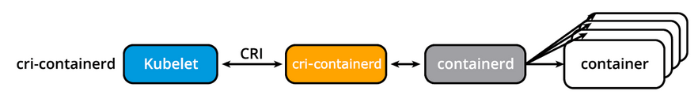
            <br/>
        <p align="center">
            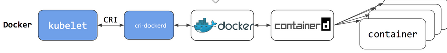
            <br/>
- proxy - kube-proxy
    - The kube-proxy is the network agent which runs on each node, control plane and workers, responsible for dynamic updates and maintenance of all networking rules on the node. 
    - It abstracts the details of Pods networking and forwards connection requests to the containers in the Pods.
    - The kube-proxy is responsible for TCP, UDP, and SCTP stream forwarding or random forwarding across a set of Pod backends of an application, and it implements forwarding rules defined by users through Service API objects.
    - The kube-proxy node agent operates in conjunction with the iptables of the node.
- add-ons
    - Add-ons are cluster features and functionality not yet available in Kubernetes, therefore implemented through 3rd-party plugins and services.
    - DNS: Cluster DNS is a DNS server required to assign DNS records to Kubernetes objects and resources.
    - Dashboard: A general purpose web-based user interface for cluster management.
    - Monitoring: Collects cluster-level container metrics and saves them to a central data store.
    - Logging: Collects cluster-level container logs and saves them to a central log store for analysis.
    - Device Plugins: For system hardware resources, such as GPU, FPGA, high-performance NIC, to be advertised by the node to application pods.

#### Networking Challenges
Decoupled microservices based applications rely heavily on networking in order to mimic the tight-coupling once available in the monolithic era. 

Networking, in general, is not the easiest to understand and implement. Kubernetes is no exception - as a containerized microservices orchestrator it needs to address a few distinct networking challenges:

- Container-to-Container communication inside Pods
- Pod-to-Pod communication on the same node and across cluster nodes
- Service-to-Pod communication within the same namespace and across cluster namespaces
- External-to-Service communication for clients to access applications in a cluster

##  Installing Kubernetes 
Kubernetes can be installed using different cluster configurations. The major installation types are described below:

- **All-in-One Single-Node Installation**
    In this setup, all the control plane and worker components are installed and running on a single-node. While it is useful for learning, development, and testing, it is not recommended for production purposes.
- **Single-Control Plane and Multi-Worker Installation**
    In this setup, we have a single-control plane node running a stacked etcd instance. Multiple worker nodes can be managed by the control plane node.
- **Single-Control Plane with Single-Node etcd, and Multi-Worker Installation**
    In this setup, we have a single-control plane node with an external etcd instance. Multiple worker nodes can be managed by the control plane node.
- **Multi-Control Plane and Multi-Worker Installation**
    In this setup, we have multiple control plane nodes configured for High-Availability (HA), with each control plane node running a stacked etcd instance. The etcd instances are also configured in an HA etcd cluster and multiple worker nodes can be managed by the HA control plane.
- **Multi-Control Plane with Multi-Node etcd, and Multi-Worker Installation**
    In this setup, we have multiple control plane nodes configured in HA mode, with each control plane node paired with an external etcd instance. The external etcd instances are also configured in an HA etcd cluster, and multiple worker nodes can be managed by the HA control plane. This is the most advanced cluster configuration recommended for production environments. 

There are a variety of installation tools allowing us to deploy single- or multi-node Kubernetes clusters on our workstations, for learning and development purposes. While not an exhaustive list, below we enumerate a few popular ones:

- **Minikube**
    Single- and multi-node local Kubernetes cluster, recommended for a learning environment deployed on a single host.
- **Kind**
    Multi-node Kubernetes cluster deployed in Docker containers acting as Kubernetes nodes, recommended for a learning environment.
- **Docker Desktop**
    Including a local Kubernetes cluster for Docker users.
- **Podman Desktop**
    Including Kubernetes integration for Podman users.
- **MicroK8s**
    Local and cloud Kubernetes cluster for developers and production, from Canonical.
- **K3S**
    Lightweight Kubernetes cluster for local, cloud, edge, IoT deployments, originally from Rancher, currently a CNCF project.

Installing Production Clusters with Deployment Tools

When it comes to production ready solutions, there are several recommended tools for Kubernetes cluster bootstrapping and a few that are also capable of provisioning the necessary hosts on the underlying infrastructure.

Let's take a look at the most popular installation tools available.

Installation Tools:

- **kubeadm**
    kubeadm is a tool that helps you bootstrap a minimal, production-grade Kubernetes cluster. It automates the setup of the control plane and the joining of worker nodes to the cluster.
- **kubespray**
    Kubespray is a set of Ansible playbooks for deploying Kubernetes clusters. It is highly flexible and can be used to deploy clusters on various cloud providers and bare-metal infrastructure.
- **kops**
    Kops is a tool for deploying, managing, and upgrading production-grade, highly available Kubernetes clusters from the command line. It supports multiple cloud providers, including AWS, GCP, and Azure.
- **Hosted Solutions**
    - **Google Kubernetes Engine (GKE)**
    - **Amazon Elastic Kubernetes Service (EKS)**
    - **Azure Kubernetes Service (AKS)** 
    - **Red Hat OpenShift**
    - **Oracle Container Engine for Kubernetes (OKE)**
    - **IBM Cloud Kubernetes Service (IKS)**
    - **Alibaba Cloud Container Service for Kubernetes (ACK)**
    - **Tencent Cloud Kubernetes Engine (TKE)**
    - **DigitalOcean Kubernetes (DOKS)**
    - **Linode Kubernetes Engine (LKE)**
    - **OVHcloud Managed Kubernetes Service (MKS)**
    - **OVHcloud Managed Kubernetes Service (MKS)**   

### Kubernetes on Windows
- With the release of Kubernetes v1.14, Windows was successfully introduced as a supported production ready operating system only for worker nodes of a Kubernetes cluster. 
This enabled Kubernetes to support the deployment of Windows containers in the cluster, either as a dedicated Windows cluster, or a hybrid cluster with Windows nodes running alongside Linux nodes. 
- Keep in mind, however, that the control plane nodes are limited to running on Linux only, with no plans to extend the support to Windows control plane nodes. 

## Minikube: Installing Local Kubernetes Clusters
### What Is Minikube?
Minikube is one of the easiest, most flexible and popular methods to run an all-in-one or a multi-node local Kubernetes cluster directly on our local workstations. 

It installs and runs on any native OS such as Linux, macOS, or Windows. However, in order to fully take advantage of all the features Minikube has to offer, a **Type-2 Hypervisor** or a **Container Runtime** should be installed on the local workstation, to run in conjunction with Minikube. 

https://minikube.sigs.k8s.io/docs/

### Minikube Installation Prerequisites
Before installing Minikube, we need to ensure that our local workstation meets the following prerequisites:

- A 64-bit operating system such as Linux, macOS, or Windows.
- At least 2GB of RAM.
- At least 2 CPUs.
- At least 20GB of free disk space.
- A working internet connection.
- VT-x/AMD-v virtualization may need to be enabled on the local workstation for certain hypervisors.
- Type-2 hypervisor (such as VirtualBox, KVM, or Hyper-V) or container runtime (such as Docker, Podman, or containerd).

### Installing Minikube (Official Documentation)
https://minikube.sigs.k8s.io/docs/start/?arch=%2Flinux%2Fx86-64%2Fstable%2Fdebian+package

### Commands
```
sudo usermod -aG docker $USER && newgrp docker
minikube version
minikube start --driver=docker (or --driver=kvm2 or --driver=podman or --driver=hyperv or --driver=virtualbox or --driver=vmware)
minikube start
minikube kubectl -- get po -A (download the appropriate version of kubectl)
minikube status
minikube stop
minikube delete
minikube profile list (to view the status of all our clusters in a table formatted output)

Examples of more complex start commands that allow custom clusters to be created with Minikube:

minikube start --nodes=2 --kubernetes-version=v1.28.1 \
  --driver=docker --profile doubledocker

minikube start --driver=virtualbox --nodes=3 --disk-size=10g \
  --cpus=2 --memory=6g --kubernetes-version=v1.27.12 --cni=calico \
  --container-runtime=cri-o -p multivbox

minikube start --driver=docker --cpus=6 --memory=8g \
  --kubernetes-version="1.27.12" -p largedock

minikube start -p nameofcluster
minikube stop -p nameofcluster

# Start a cluster with 2 nodes
minikube start --driver=docker --nodes=2 -p cluster1
minikube node list -p cluster1

# To known the ip of the control plane
minikube ip -p cluster1

# To enable dashboard
minikube dashboard -p cluster1

```

### Accesing minikube
- Command Line Interface (CLI)
    - kubectl is the Kubernetes Command Line Interface (CLI) client to manage cluster resources and applications.
    - https://kubernetes.io/docs/tasks/tools/install-kubectl-linux/#install-using-native-package-management
    - kubectl version --client
    - kubectl config view
    - kubectl cluster-info
- Web-based User Interface (Web UI)
    - The Kubernetes Dashboard provides a Web-based User Interface (Web UI) to interact with a Kubernetes cluster to manage resources and containerized applications.
- APIs
    - The main component of the Kubernetes control plane is the API Server, responsible for exposing the Kubernetes APIs. The APIs allow operators and users to directly interact with the cluster.
    - Issuing the kubectl proxy command, kubectl authenticates with the API server on the control plane node and makes services available on the default proxy port 8001.
    - kubectl proxy
    - curl http://localhost:8001/
        - http://localhost:8001/api/v1
        - http://localhost:8001/api/v1/nodes
        - http://localhost:8001/healthz
        - http://localhost:8001/metrics
    - APIs with Authentication
        - When not using the kubectl proxy, we need to authenticate to the API Server when sending API requests. We can authenticate by providing a Bearer Token when issuing a curl command, or by providing a set of keys and certificates.
        <p align="center">
            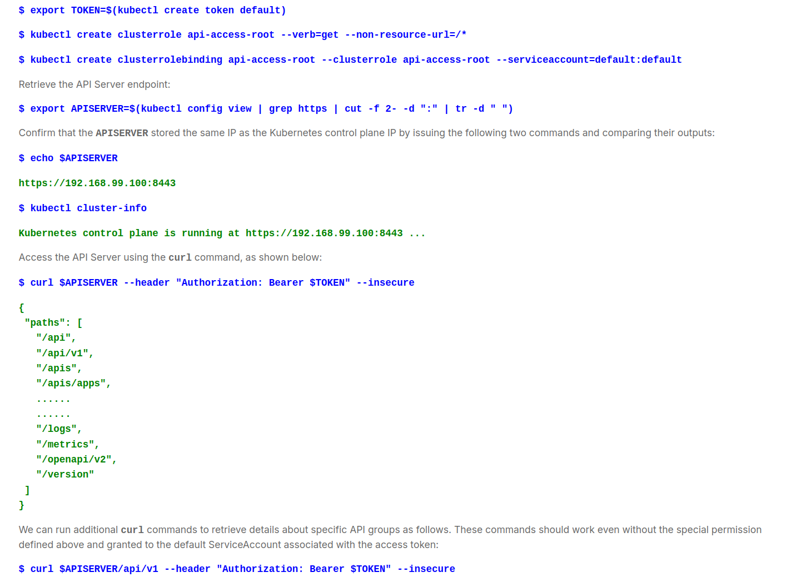
            <br/>

## Kubernetes building blocks
### Nodes
- Nodes are virtual identities assigned by Kubernetes to the systems part of the cluster - whether Virtual Machines, bare-metal, Containers, etc. These identities are unique to each system, and are used by the cluster for resources accounting and monitoring purposes, which helps with workload management throughout the cluster.
- Each node is managed with the help of two Kubernetes node agents - kubelet and kube-proxy, while it also hosts a container runtime.
- There are two distinct types of nodes - control plane and worker. 
    - A typical Kubernetes cluster includes at least one control plane node, but it may include multiple control plane nodes for the High Availability (HA) of the control plane. 
    - In addition, the cluster includes one or more worker nodes to provide resource redundancy in the cluster. 
    - There are cases when a single all-in-one cluster is bootstrapped as a single node on a single VM, bare-metal, or Container, when high availability and resource redundancy are not of importance.
    - Minikube allows us to bootstrap multi-node clusters with distinct, dedicated control plane nodes.
- The control plane nodes run the control plane agents, such as the API Server, Scheduler, Controller Managers, and etcd in addition to the kubelet and kube-proxy node agents, the container runtime, and add-ons for container networking, monitoring, logging, DNS, etc.
- Worker nodes run the kubelet and kube-proxy node agents, the container runtime, and add-ons for container networking, monitoring, logging, DNS, etc.
- Collectively, the control plane node(s) and the worker node(s) represent the Kubernetes cluster. A cluster’s nodes are systems distributed either on the same private network, across different networks, even across different cloud networks.

### Namespaces
- https://kubernetes.io/docs/concepts/overview/working-with-objects/namespaces/
- In Kubernetes, namespaces provide a mechanism for isolating groups of resources within a single cluster. 
- If multiple users and teams use the same Kubernetes cluster we can partition the cluster into virtual sub-clusters using Namespaces. 
- The names of the resources/objects created inside a Namespace are unique, but not across Namespaces in the cluster.
- kubectl get namespaces
```
NAME              STATUS       AGE
default           Active       11h contains the objects created by the Kubernetes system, mostly the control plane agents. 
kube-node-lease   Active       11h which holds node lease objects used for node heartbeat data
kube-public       Active       11h which is unsecured and readable by anyone, used for special purposes such as exposing public (non-sensitive) information about the cluster
kube-system       Active       11h  contains the objects created by the Kubernetes system, mostly the control plane agents. 

```

### Pods
- https://kubernetes.io/docs/concepts/workloads/pods/
- A Pod is the smallest Kubernetes workload object. 
- It is the unit of deployment in Kubernetes, which represents a single instance of the application. 
- A Pod is a logical collection of one or more containers, enclosing and isolating them to ensure that they:
- Are scheduled together on the same host with the Pod.
- Share the same network namespace, meaning that they share a single IP address originally assigned to the Pod.
- Have access to mount the same external storage (volumes) and other common dependencies.

<p align="center">
    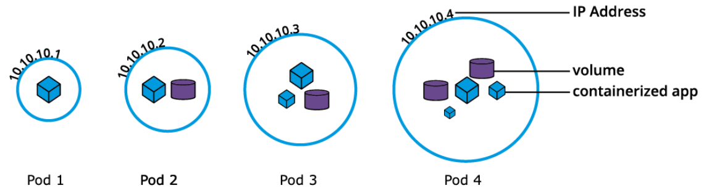
    <br/>

- Pods are ephemeral in nature, and they do not have the capability to self-heal themselves.

```
apiVersion: v1
kind: Pod
metadata:
  name: nginx-pod
  labels:
    run: nginx-pod
spec:
  containers:
  - name: nginx-pod
    image: nginx:1.22.1
    ports:
    - containerPort: 80
```

```
kubectl create -f def-pod.yaml
kubectl apply -f nginx-pod.yaml
kubectl get pods
kubectl get pods -o wide (more information)
kubectl get pod nginx-pod -o yaml
kubectl get pod nginx-pod -o json
kubectl describe pod nginx-pod
kubectl delete pod nginx-pod
```

### Labels
- https://kubernetes.io/docs/concepts/overview/working-with-objects/labels/
- Labels are key-value pairs attached to Kubernetes objects such as Pods, ReplicaSets, Nodes, Namespaces and Persistent Volumes. 
- Labels are used to organize and select a subset of objects, based on the requirements in place. 
- Many objects can have the same Label(s). Labels do not provide uniqueness to objects. 

<p align="center">
    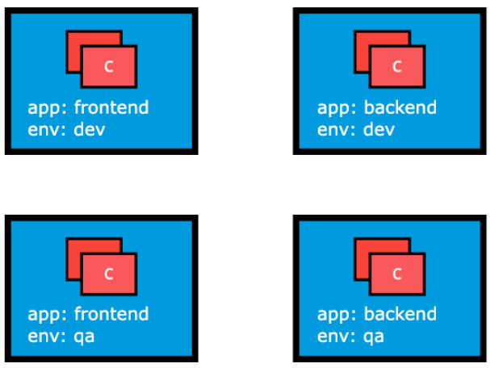
    <br/>
- In the image above, we have used two Label keys: app and env.

### Label Selectors
- Controllers, or operators, and Services, use label selectors to select a subset of objects. Kubernetes supports two types of Selectors:
    - Equality-Based Selectors
        - Equality-Based Selectors allow filtering of objects based on Label keys and values. Matching is achieved using the =, == (equals, used interchangeably), or != (not equals) operators. For example, with env==dev or env=dev we are selecting the objects where the env Label key is set to value dev.
    - Set-Based Selectors
    - Set-Based Selectors allow filtering of objects based on a set of values. We can use in, notin operators for Label values, and exist/does not exist operators for Label keys. For example, with env in (dev,qa) we are selecting objects where the env Label is set to either dev or qa with !app we select objects with no Label key app.

<p align="center">
    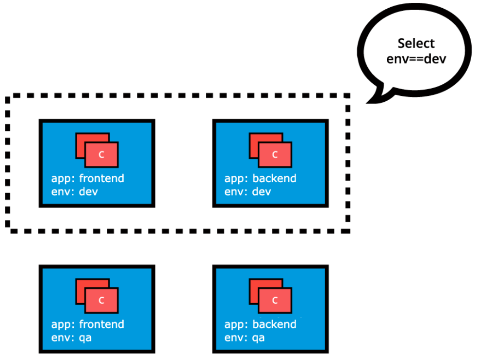
    <br/>
- In the image above, we have used two Label keys: app and env.

### ReplicationControllers
- Although no longer a recommended controller, a ReplicationController is a complex operator that ensures a specified number of replicas of a Pod are running at any given time the desired version of the application container, by constantly comparing the actual state with the desired state of the managed application. 
- If there are more Pods than the desired count, the replication controller randomly terminates the number of Pods exceeding the desired count, and.
- If there are fewer Pods than the desired count, then the replication controller requests additional Pods to be created until the actual count matches the desired count.

#### ReplicaSets
A ReplicaSet is, in part, the next-generation ReplicationController, as it implements the replication and self-healing aspects of the ReplicationController. ReplicaSets support both equality- and set-based Selectors, whereas ReplicationControllers only support equality-based Selectors.

<p align="center">
    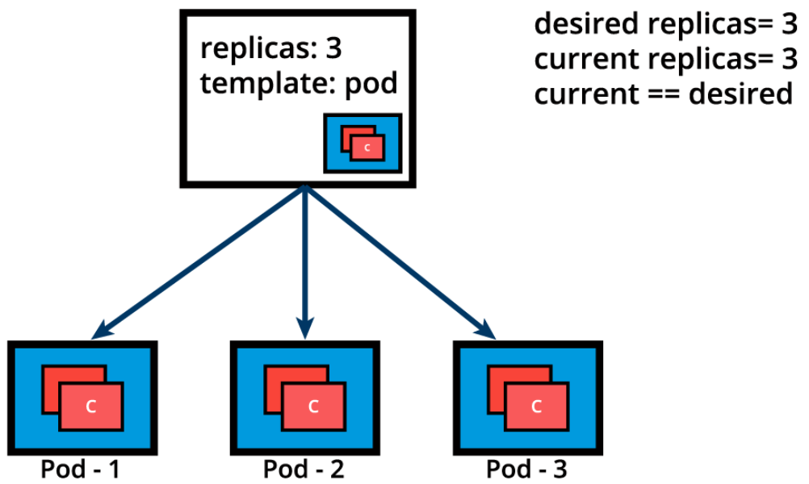
    <br/>

```
apiVersion: apps/v1
kind: ReplicaSet
metadata:
  name: frontend
  labels:
    app: guestbook
    tier: frontend
spec:
  replicas: 3
  selector:
    matchLabels:
      app: guestbook
  template:
    metadata:
      labels:
        app: guestbook
    spec:
      containers:
      - name: php-redis
        image: gcr.io/google_samples/gb-frontend:v3

commands:
$ kubectl create -f redis-rs.yaml

$ kubectl apply -f redis-rs.yaml
$ kubectl get replicasets
$ kubectl get rs
$ kubectl scale rs frontend --replicas=4
$ kubectl get rs frontend -o yaml
$ kubectl get rs frontend -o json
$ kubectl describe rs frontend
$ kubectl delete rs frontend
```

### Deployments
- https://kubernetes.io/docs/concepts/workloads/controllers/deployment/
- Deployment objects provide declarative updates to Pods and ReplicaSets. The DeploymentController is part of the control plane node's controller manager, and as a controller it also ensures that the current state always matches the desired state of our running containerized application.
- It allows for seamless application updates and rollbacks, known as the default RollingUpdate strategy, through rollouts and rollbacks, and it directly manages its ReplicaSets for application scaling. It also supports a disruptive, less popular update strategy, known as Recreate.


```
Example:


apiVersion: apps/v1
kind: Deployment
metadata:
  name: nginx-deployment
  labels:
    app: nginx-deployment
spec:
  replicas: 3
  selector:
    matchLabels:
      app: nginx-deployment
  template:
    metadata:
      labels:
        app: nginx-deployment
    spec:
      containers:
      - name: nginx
        image: nginx:1.20.2
        ports:
        - containerPort: 80
```
- The apiVersion field is the first required field, and it specifies the API endpoint on the API server which we want to connect to.
- The second required field is kind, specifying the object type - in our case it is Deployment, but it can be Pod, ReplicaSet, Namespace, Service, etc.
- The third required field metadata, holds the object's basic information, such as name, annotations, labels, namespaces, etc.
- The fourth required field spec marks the beginning of the block defining the desired state of the Deployment object. 


```
commands:
$ kubectl create -f def-deploy.yaml
```

In the following example, a new Deployment creates ReplicaSet A which then creates 3 Pods, with each Pod Template configured to run one nginx:1.20.2 container image. In this case, the ReplicaSet A is associated with nginx:1.20.2 representing a state of the Deployment. This particular state is recorded as Revision 1.

<p align="center">
    
    <br/>

In time, we need to push updates to the application managed by the Deployment object. Let's change the Pods' Template and update the container image from nginx:1.20.2 to nginx:1.21.5. The Deployment triggers a new ReplicaSet B for the new container image versioned 1.21.5 and this association represents a new recorded state of the Deployment, Revision 2. 

The seamless transition between the two ReplicaSets, from ReplicaSet A with three Pods versioned 1.20.2 to the new ReplicaSet B with three new Pods versioned 1.21.5, or from Revision 1 to Revision 2, is a Deployment rolling update.

A rolling update is triggered when we update specific properties of the Pod Template for a deployment. While planned changes such as updating the container image, container port, volumes, and mounts would trigger a new Revision, other operations that are dynamic in nature, like scaling or labeling the deployment, do not trigger a rolling update, thus do not change the Revision number.

Once the rolling update has completed, the Deployment will show both ReplicaSets A and B, where A is scaled to 0 (zero) Pods, and B is scaled to 3 Pods. This is how the Deployment records its prior state configuration settings, as Revisions. 

<p align="center">
    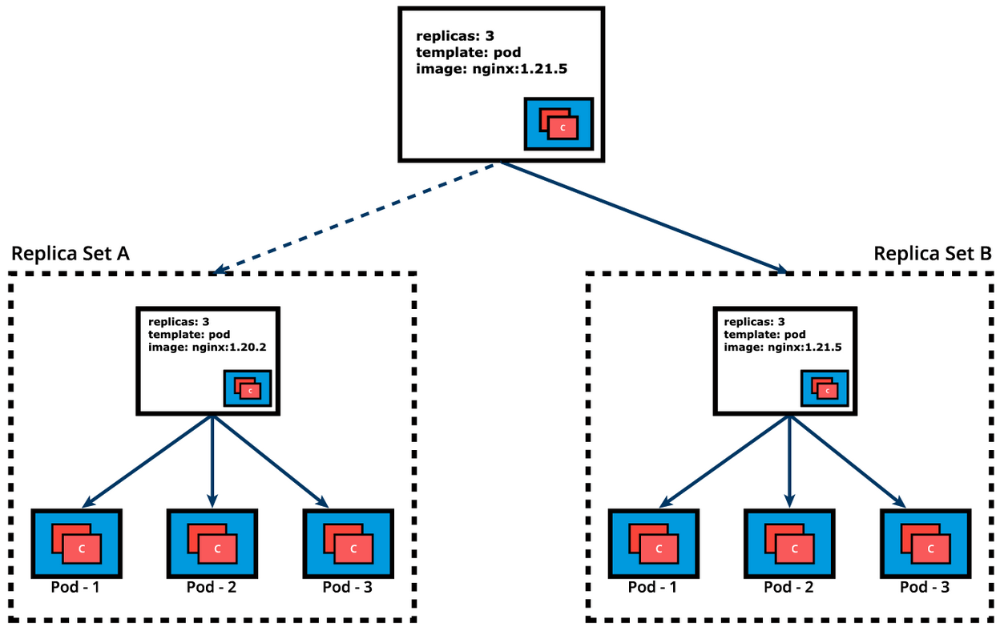
    <br/>

Once ReplicaSet B and its 3 Pods versioned 1.21.5 are ready, the Deployment starts actively managing them. However, the Deployment keeps its prior configuration states saved as Revisions which play a key factor in the rollback capability of the Deployment - returning to a prior known configuration state. In our example, if the performance of the new nginx:1.21.5 is not satisfactory, the Deployment can be rolled back to a prior Revision, in this case from Revision 2 back to Revision 1 running nginx:1.20.2 once again.


```
Example:


apiVersion: apps/v1
kind: Deployment
metadata:
  name: nginx-deployment
  labels:
    app: nginx-deployment
spec:
  replicas: 3
  selector:
    matchLabels:
      app: nginx-deployment
  template:
    metadata:
      labels:
        app: nginx-deployment
    spec:
      containers:
      - name: nginx
        image: nginx:1.20.2
        ports:
        - containerPort: 80

commands:

$ kubectl apply -f nginx-deploy.yaml --record
$ kubectl get deployments
$ kubectl get deploy -o wide
$ kubectl scale deploy nginx-deployment --replicas=4
$ kubectl get deploy nginx-deployment -o yaml
$ kubectl get deploy nginx-deployment -o json
$ kubectl describe deploy nginx-deployment
$ kubectl rollout status deploy nginx-deployment
$ kubectl rollout history deploy nginx-deployment
$ kubectl rollout history deploy nginx-deployment --revision=1
$ kubectl set image deploy nginx-deployment nginx=nginx:1.21.5 --record
$ kubectl rollout history deploy nginx-deployment --revision=2
$ kubectl rollout undo deploy nginx-deployment --to-revision=1
$ kubectl get all -l app=nginx -o wide
$ kubectl delete deploy nginx-deployment
$ kubectl get deploy,rs,po -l app=nginx
```

### DaemonSets
- https://kubernetes.io/docs/concepts/workloads/controllers/daemonset/
- DaemonSet operators are commonly used in cases when we need to collect monitoring data from all Nodes, or to run storage, networking, or proxy daemons on all Nodes, to ensure that we have a specific type of Pod running on all Nodes at all times. 
- A DaemonSet defines Pods that provide node-local facilities. These might be fundamental to the operation of your cluster, such as a networking helper tool, or be part of an add-on.
- Some typical uses of a DaemonSet are:
    - running a cluster storage daemon on every node
    - running a logs collection daemon on every node
    - running a node monitoring daemon on every node

```
apiVersion: apps/v1
kind: DaemonSet
metadata:
  name: fluentd-agent
  namespace: default
  labels:
    k8s-app: fluentd-agent
spec:
  selector:
    matchLabels:
      k8s-app: fluentd-agent
  template:
    metadata:
      labels:
        k8s-app: fluentd-agent
    spec:
      containers:
      - name: fluentd
        image: quay.io/fluentd_elasticsearch/fluentd:v4.5.2
```

The above definition manifest, if stored by a fluentd-ds.yaml file, is loaded into the cluster to run a set of identical Pod replicas, with their associated container image, matching in count the number of cluster nodes. While create is exemplified below, advanced Kubernetes practitioners may opt to use apply instead:

```
commands:
$ kubectl create -f fluentd-ds.yaml

Before advancing to more complex topics, become familiar with DaemonSet operations with additional commands such as:

$ kubectl apply -f fluentd-ds.yaml --record
$ kubectl get daemonsets
$ kubectl get ds -o wide
$ kubectl get ds fluentd-agent -o yaml
$ kubectl get ds fluentd-agent -o json
$ kubectl describe ds fluentd-agent
$ kubectl rollout status ds fluentd-agent
$ kubectl rollout history ds fluentd-agent
$ kubectl rollout history ds fluentd-agent --revision=1
$ kubectl set image ds fluentd-agent fluentd=quay.io/fluentd_elasticsearch/fluentd:v4.6.2 --record
$ kubectl rollout history ds fluentd-agent --revision=2
$ kubectl rollout undo ds fluentd-agent --to-revision=1
$ kubectl get all -l k8s-app=fluentd-agent -o wide
$ kubectl delete ds fluentd-agent
$ kubectl get ds,po -l k8s-app=fluentd-agent
```

### Services
- A containerized application deployed to a Kubernetes cluster may need to reach other such applications, or it may need to be accessible to other applications and possibly clients.
- This is problematic because the container does not expose its ports to the cluster's network, and it is not discoverable either. 
- The solution would be a simple port mapping, as offered by a typical container host. However, due to the complexity of the Kubernetes framework, such a simple port mapping is not that "simple". 
- The solution is much more sophisticated, with the involvement of the kube-proxy node agent, IP tables, routing rules, cluster DNS server, all collectively implementing a micro-load balancing mechanism that exposes a container's port to the cluster's network, even to the outside world if desired. 
- This mechanism is called a Service, and it is the recommended method to expose any containerized application to the Kubernetes network. 
- **Services** are objects used to abstract the communication between cluster internal microservices, or with the external world. 
- Regardless of the number of its replicas, by providing a common load balancing access point to a set of pods logically grouped and managed by a controller such as a Deployment, ReplicaSet, or DaemonSet. 