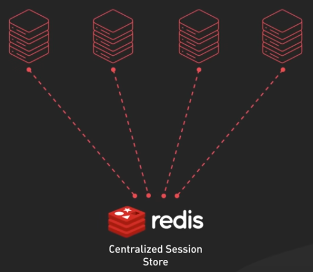
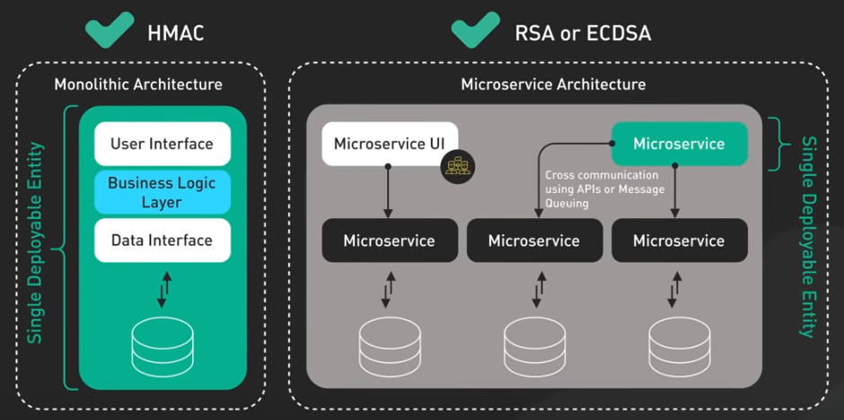

# Web Security

- JWT
- Basic Auth
- Token Auth
- OAuth
- OpenID
- SAML

<p align="center">
  
  <br/>
  <i>Source: ByteByteGo.com</a></i>
</p>


## Session Authentication
- Separate storage required forr storing session information.
- Invalid session is easy (When you need the ability to revoke sessions instantly)
- Scaling also involves the session store
- Keep sensitive data on the server, which can be a security advantage

<p align="center">
  
  <br/>
  <i>Source: ByteByteGo.com</a></i>
</p>


## JWT Authentication (short for JSON Web Token and pronounced “jot”)
JWT is an open standard used to create compact, self-contained tokens used for securely transmitting information between different applications or services. These tokens are typically used for authentication and authorization, as they can contain information that verifies the identity of a user, and their permissions.

### Structure of a JWT
1. Header: Is a JSON object and typically contains two properties: The type of token and the encryption algorithm.

```sh
{
  "alg": "HS256",
  "typ": "JWT"
}
```

2. Payload: Is another JSON object where all of  the transmitted data lives.
3. Signature: Is created by signing the  Base64Url encoded  header and payload with a secret key and algorithm specified by the developers.

All three of these parts are Base64Url encoded strings concatenated with periods ('.').

### Algorithms
- HMAC: Symmetric signing method, the secret key is used to sign and verify the token, simple and efficient,
but requires sharing the secret  key with any service that needs to verify the token. 
- RSA and ECDSA  are asymmetric signing methods, the private key is used  to sign the token and the public key to verify it.

<p align="center">
  
  <br/>
  <i>Source: ByteByteGo.com</a></i>
</p>

### Advantages of using JWTs
- When you need  a stateless architecture
- You store all the necessary data in the token itself.
- No storage needed
- Invalidation of a JWT is not easy
- Scaling client and server is easy


